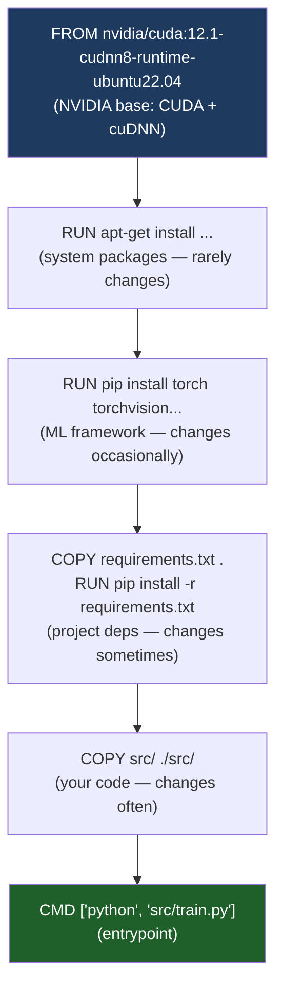

# 🐳 Docker for ML

> [!abstract] TL;DR
> Docker packages your ML code, dependencies, and runtime into a portable, reproducible container. The key ML-specific concerns are: choosing the right CUDA base image (must match your GPU driver version), layer caching for fast rebuilds when only code changes (put `pip install` before `COPY code`), passing `--gpus all` to expose GPUs to the container, and image size (CUDA base images start at 8–15GB; use multi-stage builds to shrink). Docker eliminates "works on my machine" for training and serving, and is the execution environment for every major cloud ML platform (SageMaker, Vertex AI, Azure ML).

## Intuition — Analogy First

Docker is a **shipping container for software** — the same analogy that gave it its name and logo.

Before shipping containers, cargo was loaded piece by piece onto ships — different shapes, sizes, requiring different handling. Standardised containers revolutionised shipping: regardless of whether the container holds electronics or frozen food, the crane, ship, and truck all interact with the standard steel box.

Docker does this for code: regardless of whether your ML code uses PyTorch 2.1 + CUDA 12.1 + scikit-learn 1.3, or TensorFlow 2.14 + JAX, the container is the standard interface. Your laptop, a colleague's workstation, AWS SageMaker, Google Vertex AI, and a Kubernetes cluster all know how to run "a container" — your specific dependencies are inside the box, invisible to the infrastructure.

For ML specifically: **CUDA version compatibility** is the primary reason Docker is non-negotiable. Getting CUDA 12.1, cuDNN 8.9, and PyTorch 2.1 to work together on a new machine is a multi-hour debugging exercise. With Docker, it's pre-solved in NVIDIA's published base images.

## How It Works

### Dockerfile Structure for ML

Key layers in order (most stable → most frequently changing, for optimal cache use):



**Cache invalidation rule**: Docker re-runs all layers after the first changed one. Put `pip install` BEFORE `COPY src/` so code changes don't trigger a full reinstall.

### CUDA Version Compatibility

NVIDIA publishes CUDA containers at `nvcr.io/nvidia/` and `nvidia/cuda` on Docker Hub:

```
nvidia/cuda:<cuda_version>-cudnn<cudnn_version>-<variant>-ubuntu22.04
```

Variants:
- `base`: CUDA runtime only (smallest; no cuDNN)
- `runtime`: CUDA + cuDNN runtime libs (for inference)
- `devel`: CUDA + cuDNN + headers/compilers (for building custom CUDA extensions)

**Compatibility matrix** (must match):
- GPU driver version → max CUDA version (driver 525 → CUDA 12.0+)
- CUDA version → PyTorch version (CUDA 12.1 → PyTorch 2.1+)
- cuDNN version → PyTorch version

Check: `nvidia-smi` shows driver version and max CUDA on the host. The container's CUDA must be ≤ host driver's max CUDA.

### GPU Access

Docker does not expose GPUs by default. Requires:
1. **NVIDIA Container Toolkit** installed on the host
2. `--gpus all` flag at `docker run` (or `--gpus '"device=0,1"'` for specific GPUs)
3. Docker Compose: `deploy.resources.reservations.devices`

### Multi-Stage Builds

Build dependencies (compilers, headers) are needed at build time but not runtime. Multi-stage builds keep the final image small:

## The Math

**Layer caching efficiency**: if your `requirements.txt` changes once per week but `src/` changes 10× per day:

$$\text{Time saved per day} = 9 \times t_\text{pip\_install}$$

For a typical ML stack (PyTorch + transformers + pandas): $t_\text{pip\_install} \approx 5\text{ min}$. Correct layer ordering saves 45 min/day.

**Image size comparison**:

| Base | Size |
|---|---|
| `nvidia/cuda:12.1-base-ubuntu22.04` | 220MB |
| `nvidia/cuda:12.1-cudnn8-runtime-ubuntu22.04` | 4.2GB |
| `nvidia/cuda:12.1-cudnn8-devel-ubuntu22.04` | 8.1GB |
| + PyTorch 2.1 + transformers | +4GB |
| Multi-stage: copy only needed libs | 2–3GB total |

## Code Demo

```dockerfile
# ══════════════════════════════════════════════════════
# Stage 1: Builder — installs everything, compiles extensions
# ══════════════════════════════════════════════════════
FROM nvidia/cuda:12.1.0-cudnn8-devel-ubuntu22.04 AS builder

# Prevent interactive prompts during apt-get
ENV DEBIAN_FRONTEND=noninteractive

# System dependencies
RUN apt-get update && apt-get install -y --no-install-recommends \
    python3.10 \
    python3-pip \
    python3.10-dev \
    git \
    build-essential \
    && rm -rf /var/lib/apt/lists/*

# Make python3.10 the default python
RUN update-alternatives --install /usr/bin/python python /usr/bin/python3.10 1 \
    && update-alternatives --install /usr/bin/pip pip /usr/bin/pip3 1

# Upgrade pip, install wheel
RUN pip install --upgrade pip wheel setuptools

# ── Install ML framework (most expensive step — cache it) ──────────
# Install PyTorch FIRST, before project requirements
# Pinning exact versions ensures reproducibility across rebuilds
RUN pip install --no-cache-dir \
    torch==2.1.2+cu121 \
    torchvision==0.16.2+cu121 \
    torchaudio==2.1.2+cu121 \
    --index-url https://download.pytorch.org/whl/cu121

# ── Project dependencies — separate layer from code ───────────────
WORKDIR /build
COPY requirements.txt .
RUN pip install --no-cache-dir -r requirements.txt

# ══════════════════════════════════════════════════════
# Stage 2: Runtime — only what's needed for inference/training
# ══════════════════════════════════════════════════════
FROM nvidia/cuda:12.1.0-cudnn8-runtime-ubuntu22.04 AS runtime

ENV DEBIAN_FRONTEND=noninteractive
ENV PYTHONUNBUFFERED=1       # flush stdout immediately
ENV PYTHONDONTWRITEBYTECODE=1  # no .pyc files

RUN apt-get update && apt-get install -y --no-install-recommends \
    python3.10 \
    python3-pip \
    libgomp1 \              # required by PyTorch OpenMP threading
    && rm -rf /var/lib/apt/lists/*

RUN update-alternatives --install /usr/bin/python python /usr/bin/python3.10 1

# Copy Python packages from builder (not the devel tools)
COPY --from=builder /usr/local/lib/python3.10/dist-packages /usr/local/lib/python3.10/dist-packages
COPY --from=builder /usr/local/bin /usr/local/bin

# ── Copy application code (most frequently changing — last!) ───────
WORKDIR /app
COPY src/ ./src/
COPY configs/ ./configs/

# Non-root user for security
RUN adduser --disabled-password --gecos '' mluser
USER mluser

ENTRYPOINT ["python", "src/train.py"]
CMD ["--config", "configs/default.yaml"]
```

```yaml
# docker-compose.yml — development environment
version: '3.8'

services:
  trainer:
    build:
      context: .
      dockerfile: Dockerfile
      target: runtime       # use only the runtime stage
    image: my-ml-trainer:latest

    # GPU access (requires NVIDIA Container Toolkit)
    deploy:
      resources:
        reservations:
          devices:
            - driver: nvidia
              count: all        # or count: 2 for specific number
              capabilities: [gpu]

    # Environment variables
    environment:
      - CUDA_VISIBLE_DEVICES=0,1
      - NCCL_DEBUG=WARN
      - WANDB_API_KEY=${WANDB_API_KEY}  # from host .env file

    # Mount local code for development (overrides COPY)
    volumes:
      - ./src:/app/src         # live code reload without rebuild
      - ./data:/app/data       # large dataset outside container
      - ./outputs:/app/outputs # persist model checkpoints

    shm_size: '16gb'           # shared memory for DataLoader workers

  jupyter:
    build:
      context: .
      dockerfile: Dockerfile
      target: builder           # use builder stage (has dev tools)
    ports:
      - "8888:8888"
    deploy:
      resources:
        reservations:
          devices:
            - driver: nvidia
              count: 1
              capabilities: [gpu]
    volumes:
      - ./notebooks:/app/notebooks
      - ./data:/app/data
    command: jupyter lab --ip=0.0.0.0 --port=8888 --no-browser --allow-root
```

```bash
#!/bin/bash
# Common Docker for ML commands

# ── Build ──────────────────────────────────────────────────────────
# Build with cache (fast after first build)
docker build -t my-ml-image:latest .

# Build specific stage only
docker build --target runtime -t my-ml-image:runtime .

# Build with build args (e.g., different CUDA version)
docker build --build-arg CUDA_VERSION=12.1.0 -t my-ml-image:cu121 .

# ── Run with GPU ──────────────────────────────────────────────────
# All GPUs
docker run --gpus all my-ml-image:latest

# Specific GPUs
docker run --gpus '"device=0,1"' my-ml-image:latest

# Interactive shell with GPU (for debugging)
docker run --gpus all -it --rm \
  -v $(pwd)/data:/app/data \
  -v $(pwd)/outputs:/app/outputs \
  --shm-size=16g \
  my-ml-image:latest bash

# ── Verify GPU access inside container ───────────────────────────
docker run --gpus all --rm nvidia/cuda:12.1.0-base-ubuntu22.04 nvidia-smi
docker run --gpus all --rm my-ml-image:latest python -c "import torch; print(torch.cuda.is_available())"

# ── Image management ──────────────────────────────────────────────
# Check layer sizes
docker history my-ml-image:latest

# Remove dangling images (from failed builds)
docker image prune

# Push to registry (ECR, GCR, Docker Hub)
docker tag my-ml-image:latest 123456789.dkr.ecr.us-east-1.amazonaws.com/my-ml:latest
docker push 123456789.dkr.ecr.us-east-1.amazonaws.com/my-ml:latest
```

## Real-World Example

**NVIDIA NGC (NVIDIA GPU Cloud)** — the canonical example of Docker enabling reproducible ML at scale.

NVIDIA publishes optimised Docker containers (`nvcr.io/nvidia/pytorch:24.02-py3`) that include:
- Exactly tested CUDA + cuDNN + NCCL combinations
- PyTorch compiled with CUDA 12.3 and CuDNN 9
- Apex (mixed precision utilities)
- Megatron-LM distributed training framework
- TensorRT for inference optimisation

Every major LLM training paper from NVIDIA, Microsoft, and academic labs uses these exact containers for reproducibility. The SageMaker and Vertex AI training job sections both accept an `image_uri` pointing to NVIDIA NGC containers — this is the standard production approach for frontier training.

**DoorDash** uses Docker for their ML prediction service:
- Training container: PyTorch + feature engineering stack. Training runs on SageMaker with the Docker image.
- Serving container: Python + TorchServe + model weights. Deployed to Kubernetes.
- The separation allows the serving image to be 2GB (no training deps) while the training image is 8GB.

## Trade-offs

| Approach | Benefit | Cost |
|---|---|---|
| Docker for training | Reproducibility across environments | Image build time; storage for large images |
| Multi-stage builds | Small runtime image (~2GB vs 8GB) | More complex Dockerfile |
| Pinned versions | Exact reproducibility | Manual version updates needed |
| Runtime vs Devel base | Smaller image | Cannot compile CUDA extensions in runtime |
| Volume mounts | Fast code iteration without rebuild | Container isolation weakened |
| Docker Compose | Easy multi-service dev setup | Not production-grade (use Kubernetes) |

## When to Use vs Avoid

**Always use Docker for:**
- Any ML training or serving that runs on cloud infrastructure (SageMaker, Vertex AI, Azure ML, Kubernetes)
- Sharing reproducible experiments with collaborators
- Any project with CUDA dependencies (eliminates driver version conflicts)

**Consider skipping Docker when:**
- Pure Python CPU-only prototype — conda or venv is sufficient
- Experiments that run exclusively on your own machine with a stable environment

## Common Pitfalls

1. **CUDA version mismatch**: `nvidia-smi` shows CUDA 11.8 on the host but you pull a CUDA 12.1 container → `CUDA error: no kernel image is available`. Check `nvidia-smi` → note "CUDA Version" (max supported) → choose container with CUDA ≤ that version.
2. **COPY before pip install**: if `COPY . .` comes before `RUN pip install -r requirements.txt`, every code change invalidates the pip cache. Always `COPY requirements.txt` first, `pip install`, then `COPY . .`.
3. **Forgetting `--shm-size`**: PyTorch DataLoader with `num_workers > 0` uses `/dev/shm` for inter-process communication. Default is 64MB — too small for large batches. Set `--shm-size 16g` or use `--ipc=host`.
4. **Running as root in containers**: containers run as root by default. In Kubernetes, this is often disallowed by PodSecurityPolicy. Always add a non-root user in the Dockerfile.
5. **Large model weights in the image**: never `COPY` model weights into the Docker image. Weights change frequently, invalidating all cache layers. Mount them as volumes or download at runtime from S3/GCS.

## Related Concepts

- [[_MOC_Infrastructure|↑ Section MOC]]

- [[Kubernetes_for_ML]] — orchestrates Docker containers at scale
- [[GPU_Architecture_Basics]] — the hardware Docker's CUDA images expose
- [[AWS_SageMaker]] — all SageMaker training runs in Docker containers
- [[GCP_Vertex_AI]] — same; Vertex custom training uses Docker images
- [[CUDA_Fundamentals]] — why CUDA version compatibility in Docker matters

## Review Questions

1. You're building an ML training Docker image. Your current Dockerfile has the layers in this order: `COPY . .`, `pip install -r requirements.txt`, `python train.py`. Identify the problem and rewrite the relevant section of the Dockerfile in the correct order with explanation.
2. Explain why `--shm-size 16g` is often necessary for PyTorch DataLoader but is not required for single-process data loading. What mechanism does PyTorch use that requires shared memory?
3. A team reports that their model trains correctly locally but gives random predictions when deployed in Docker. The GPU and code are identical. What three Docker-specific issues could cause this, and how would you diagnose each?

## Sources

- NVIDIA Container Toolkit documentation: https://docs.nvidia.com/datacenter/cloud-native/container-toolkit/
- NVIDIA NGC catalog: https://catalog.ngc.nvidia.com/containers
- Docker best practices for ML: https://docs.docker.com/develop/develop-images/dockerfile_best-practices/
- PyTorch Docker Hub: https://hub.docker.com/r/pytorch/pytorch
- Papasavva & Koliousis, "Reproducible ML with Docker" (2021)

#docker #containerisation #infrastructure #cuda #devops #mlops
