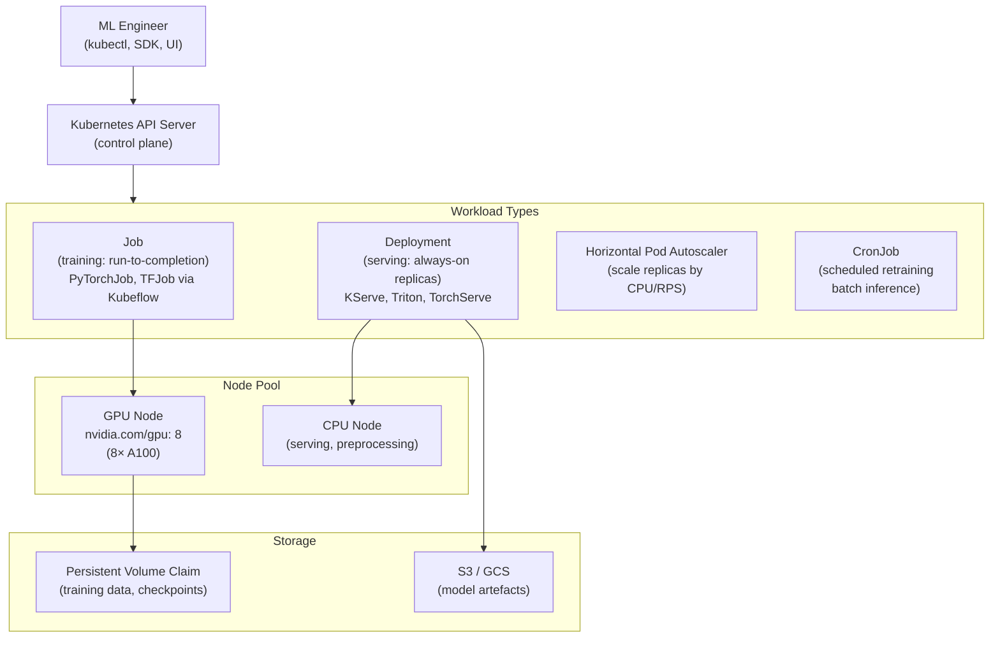

# ☸️ Kubernetes for ML

> [!abstract] TL;DR
> Kubernetes (K8s) is the de facto standard for running containerised ML workloads at scale. For ML: **Training** uses K8s Jobs (one-off batch compute); **Serving** uses Deployments with Horizontal Pod Autoscaler; **GPU scheduling** requires the NVIDIA device plugin, which exposes GPUs as schedulable resources (`nvidia.com/gpu: 1`). The Kubeflow project wraps Kubernetes primitives for ML workflows: KFP for pipelines, TFJob/PyTorchJob for distributed training, KServe for model serving. Kubernetes handles cluster-level scheduling, but you still need infrastructure like Istio (traffic management), Prometheus (metrics), and PVC/S3 (storage) to build a complete ML platform.

## Intuition — Analogy First

Kubernetes is an **automated dispatch centre for containerised work**.

Imagine a factory district with dozens of plants (nodes/machines). Each plant has specific equipment (GPUs, CPUs, memory). Orders come in for manufacturing jobs (ML training) and ongoing production lines (model serving).

Without K8s: a human dispatcher manually decides which order goes to which plant, manually tracks completion, manually handles plant breakdowns, manually scales up staffing when demand spikes.

With Kubernetes: the dispatch centre is automated. You submit a *job description* ("I need this ML training job, it requires 4 GPUs and 64GB RAM, it should restart if it fails"). K8s finds plants with the right equipment, schedules the job, monitors it, restarts it on failure, and releases the equipment when done. For serving: "run 3 replicas of this model server, always maintain at least 1 replica, scale up to 20 when request rate exceeds 100 RPS."

For ML, the critical specialisation: factories that have GPU workshop equipment need a special inventory system (NVIDIA device plugin) that tells the dispatcher which GPUs are available and assigns them exclusively to the right jobs.

## How It Works

### ML Workload Patterns on Kubernetes



### GPU Resource Scheduling

Kubernetes treats GPUs as **extended resources** (like CPU and memory). The NVIDIA Device Plugin DaemonSet must be installed on every GPU node to advertise GPU availability.

After installation:
```yaml
# Pod requesting 2 GPUs
resources:
  requests:
    nvidia.com/gpu: 2
  limits:
    nvidia.com/gpu: 2  # requests must equal limits for GPUs
```

Important GPU scheduling constraints:
- **No fractional GPU allocation**: you cannot request `nvidia.com/gpu: 0.5`. Use MIG (Multi-Instance GPU) on A100/H100 for partial GPU allocation.
- **Exclusive allocation**: a GPU assigned to a pod cannot be shared by another pod.
- **Time-slicing**: optional NVIDIA feature for development clusters; allows multiple pods to share one GPU (no memory isolation — not for production training).

### Kubernetes Object Types for ML

| Object | Description | ML Use Case |
|---|---|---|
| `Pod` | Smallest deployable unit (1+ containers) | Single training run |
| `Job` | Manages Pods to run to completion | Batch training, preprocessing |
| `Deployment` | Manages replica Pods, rolling updates | Model serving (always-on) |
| `CronJob` | Schedules Jobs on a cron expression | Nightly retraining |
| `DaemonSet` | Runs a Pod on every node | NVIDIA device plugin, node exporters |
| `PersistentVolumeClaim` | Requests durable storage | Training data, model checkpoints |
| `ConfigMap` | Non-sensitive config injection | Hyperparameters, model config |
| `Secret` | Sensitive config injection | API keys, credentials |
| `HorizontalPodAutoscaler` | Scale replicas based on metrics | Autoscaling serving endpoints |
| `Service` | Stable network endpoint for Pods | Load balancer for model server |

### Kubeflow ML Toolkit

Kubeflow is a collection of Kubernetes-native ML tools:

- **KFP (Kubeflow Pipelines)**: DAG pipelines for ML workflows (same as Vertex Pipelines)
- **PyTorchJob**: Kubernetes CRD that manages multi-node PyTorch distributed training (handles rank/world_size env vars)
- **TFJob**: same for TensorFlow
- **KServe**: model serving platform (replaces KFServing); supports TorchServe, Triton, MLflow, custom
- **Katib**: Kubernetes-native hyperparameter tuning (Bayesian, grid, random, ENAS)
- **Notebook Controller**: spawns JupyterLab pods with GPU access on demand

## The Math

**Pod scheduling feasibility**: a pod is schedulable if a node satisfies all resource requests:

$$\forall r \in \text{Resources}: \text{node.available}(r) \geq \text{pod.request}(r)$$

**HPA target calculation**: HPA scales replicas to maintain target metric:

$$\text{desired\_replicas} = \lceil \text{current\_replicas} \times (\text{current\_metric} / \text{target\_metric}) \rceil$$

For GPU serving pods with target `avg_requests_per_pod = 100`:
- Current: 3 replicas, avg 250 requests/pod
- Desired: $\lceil 3 \times (250/100) \rceil = 8$ replicas

**Resource utilisation for bin-packing**: Kubernetes scheduler places pods to maximise utilisation using a scoring function. For GPU nodes:

$$\text{score} = f(\text{CPU utilisation}, \text{memory utilisation}, \text{GPU utilisation})$$

Custom schedulers (e.g., volcano) optimise for ML-specific constraints like gang scheduling (all pods of a distributed job must start simultaneously).

## Code Demo

```yaml
# ── NVIDIA Device Plugin (install once per cluster) ───────────────
# kubectl apply -f https://raw.githubusercontent.com/NVIDIA/k8s-device-plugin/v0.14.5/nvidia-device-plugin.yml

---
# ── Job: single-GPU training run ────────────────────────────────
apiVersion: batch/v1
kind: Job
metadata:
  name: pytorch-training
  namespace: ml-jobs
spec:
  backoffLimit: 2          # retry up to 2 times on failure
  ttlSecondsAfterFinished: 3600  # auto-delete completed job after 1h
  template:
    spec:
      restartPolicy: OnFailure
      tolerations:
        - key: "nvidia.com/gpu"
          operator: "Exists"
          effect: "NoSchedule"   # allow scheduling on GPU-tainted nodes
      containers:
        - name: trainer
          image: 123456789.dkr.ecr.us-east-1.amazonaws.com/my-ml:latest
          command: ["python", "src/train.py"]
          args: ["--epochs=20", "--batch-size=64"]
          resources:
            requests:
              cpu: "8"
              memory: "64Gi"
              nvidia.com/gpu: "1"
            limits:
              cpu: "8"
              memory: "64Gi"
              nvidia.com/gpu: "1"     # GPU requests must equal limits
          env:
            - name: WANDB_API_KEY
              valueFrom:
                secretKeyRef:
                  name: wandb-secret
                  key: api-key
          volumeMounts:
            - name: training-data
              mountPath: /data
            - name: model-output
              mountPath: /output
            - name: dshm
              mountPath: /dev/shm     # shared memory for DataLoader
      volumes:
        - name: training-data
          persistentVolumeClaim:
            claimName: training-data-pvc
        - name: model-output
          persistentVolumeClaim:
            claimName: model-output-pvc
        - name: dshm
          emptyDir:
            medium: Memory
            sizeLimit: "16Gi"        # --shm-size equivalent
```

```yaml
# ── PyTorchJob: distributed training with Kubeflow ────────────────
# kubectl apply -f https://github.com/kubeflow/training-operator/releases/...
apiVersion: kubeflow.org/v1
kind: PyTorchJob
metadata:
  name: distributed-training
  namespace: ml-jobs
spec:
  pytorchReplicaSpecs:
    Master:                           # rank 0; typically 1 replica
      replicas: 1
      restartPolicy: OnFailure
      template:
        spec:
          containers:
            - name: pytorch
              image: my-ml-image:latest
              command: ["python", "train_ddp.py"]
              resources:
                limits:
                  nvidia.com/gpu: "8"   # 8 GPUs on master node
    Worker:                           # ranks 1..N
      replicas: 3                     # 3 worker nodes
      restartPolicy: OnFailure
      template:
        spec:
          containers:
            - name: pytorch
              image: my-ml-image:latest
              command: ["python", "train_ddp.py"]
              resources:
                limits:
                  nvidia.com/gpu: "8"
  # Kubeflow operator injects MASTER_ADDR, MASTER_PORT, RANK, WORLD_SIZE
  # Total: 4 nodes × 8 GPUs = 32 GPUs; torchrun picks up env vars automatically
```

```yaml
# ── Deployment: model serving with autoscaling ────────────────────
apiVersion: apps/v1
kind: Deployment
metadata:
  name: model-server
  namespace: ml-serving
spec:
  replicas: 2                 # start with 2 replicas
  selector:
    matchLabels:
      app: model-server
  template:
    metadata:
      labels:
        app: model-server
    spec:
      containers:
        - name: server
          image: my-ml-image:serving
          ports:
            - containerPort: 8080
          resources:
            requests:
              cpu: "2"
              memory: "8Gi"
              nvidia.com/gpu: "1"
            limits:
              cpu: "4"
              memory: "16Gi"
              nvidia.com/gpu: "1"
          readinessProbe:           # pod marked ready only when model loaded
            httpGet:
              path: /health
              port: 8080
            initialDelaySeconds: 60   # wait for model to load
            periodSeconds: 10
          livenessProbe:
            httpGet:
              path: /health
              port: 8080
            failureThreshold: 3
            periodSeconds: 30
---
apiVersion: v1
kind: Service
metadata:
  name: model-server-svc
  namespace: ml-serving
spec:
  selector:
    app: model-server
  ports:
    - port: 80
      targetPort: 8080
  type: LoadBalancer
---
# HPA: scale by custom metric (requests per second via Prometheus)
apiVersion: autoscaling/v2
kind: HorizontalPodAutoscaler
metadata:
  name: model-server-hpa
  namespace: ml-serving
spec:
  scaleTargetRef:
    apiVersion: apps/v1
    kind: Deployment
    name: model-server
  minReplicas: 1
  maxReplicas: 20
  metrics:
    - type: Resource
      resource:
        name: cpu
        target:
          type: Utilization
          averageUtilization: 70
    - type: Pods
      pods:
        metric:
          name: http_requests_per_second   # custom Prometheus metric
        target:
          type: AverageValue
          averageValue: "100"
```

```python
# ── KServe: production model serving on Kubernetes ────────────────
# pip install kserve
from kubernetes import client
from kserve import KServeClient, V1beta1InferenceService, V1beta1InferenceServiceSpec
from kserve import V1beta1PredictorSpec, V1beta1TorchServeSpec

ks_client = KServeClient()

# Define InferenceService (KServe CRD)
isvc = V1beta1InferenceService(
    api_version="serving.kserve.io/v1beta1",
    kind="InferenceService",
    metadata=client.V1ObjectMeta(
        name="my-model-server",
        namespace="ml-serving",
        annotations={"sidecar.istio.io/inject": "false"},  # if no Istio
    ),
    spec=V1beta1InferenceServiceSpec(
        predictor=V1beta1PredictorSpec(
            model=V1beta1ModelSpec(
                model_format=V1beta1ModelFormat(name="pytorch"),
                storage_uri="s3://my-bucket/models/my-model/v1.0/",
                resources=client.V1ResourceRequirements(
                    requests={"cpu": "1", "memory": "4Gi"},
                    limits={"cpu": "2", "memory": "8Gi", "nvidia.com/gpu": "1"},
                ),
            )
        )
    ),
)

ks_client.create(isvc)

# KServe handles: model download from S3, model loading,
# health checks, protocol negotiation (REST/gRPC), autoscaling with Knative
```

## Real-World Example

**Airbnb's ML Platform (Bighead)** and **Uber's Michelangelo** are the canonical industry examples of Kubernetes-native ML platforms.

**Airbnb**:
- Kubernetes cluster with mixed GPU (training) and CPU (serving) node pools
- All training jobs submitted as Kubernetes Jobs with GPU requests
- Serving via KServe on the same cluster — model deployments treated as regular K8s Deployments
- Centralized Model Registry (MLflow + PostgreSQL) deployed as a K8s StatefulSet
- Custom autoscaling: HPA on custom metric `avg_latency_p99 < 50ms` (via Prometheus Adapter)
- Benefit: one team manages the cluster infrastructure; ML engineers submit jobs via a simple API without knowing Kubernetes

**The result**: Airbnb's recommendation and pricing models (hundreds of ML services) all run on a single Kubernetes cluster. New model versions deploy in < 5 minutes (image pull + rollout) vs. hours with VM-based approaches. CPU utilisation increased from 40% (fixed VM allocation) to 75% (K8s bin-packing) — direct cost savings.

## Trade-offs

| Aspect | Kubernetes Benefit | Kubernetes Cost |
|---|---|---|
| Scheduling | Automatic bin-packing, GPU isolation | Learning curve; complex to configure correctly |
| GPU utilisation | No idle VMs; scale to zero | No fractional GPU (MIG required for partial) |
| Reliability | Pod restarts on failure; health checks | NCCL distributed jobs: partial failure kills all ranks |
| Portability | Same YAML runs on any cloud/on-prem | Vendor-specific features (AWS ALB, GCP NEG) break portability |
| Autoscaling | HPA scales serving latency automatically | Custom metrics require Prometheus + Prometheus Adapter |
| Storage | PVC abstracts underlying storage | Distributed file system performance varies by cloud |
| Security | RBAC, namespaces, network policies | Misconfiguration exposes cluster; requires K8s expertise |

## When to Use vs Avoid

**Use Kubernetes for ML when:**
- Running many concurrent training jobs with heterogeneous GPU requirements
- Serving multiple ML models with variable load (HPA is valuable)
- Team already has K8s infrastructure for other services
- Need on-premise or multi-cloud deployment

**Use managed ML platforms (SageMaker, Vertex AI) when:**
- Smaller team without dedicated infrastructure engineers
- Cloud-native and vendor lock-in is acceptable
- Want managed distributed training without writing PyTorchJob YAML

**Avoid vanilla Kubernetes when:**
- No Kubeflow or KServe — native K8s primitives (Jobs, Deployments) lack ML-specific features (distributed training env var injection, model serving protocols)
- Team has no Kubernetes experience — ramp-up time is 2–4 weeks minimum

## Common Pitfalls

1. **Gang scheduling failure**: distributed training jobs (PyTorchJob) need all pods to start simultaneously. If cluster resources are insufficient for all ranks, the job hangs indefinitely waiting for all pods to become ready. Use the Volcano batch scheduler for gang scheduling.
2. **Missing `requests` vs `limits` mismatch for GPUs**: GPU requests must equal limits — K8s enforces this. Setting only limits without requests causes the scheduler to ignore the pod's GPU requirement.
3. **Shared memory for DataLoader**: forgot `emptyDir: {medium: Memory}` volume? PyTorch DataLoader with `num_workers > 0` dies with `RuntimeError: DataLoader worker process exited unexpectedly`.
4. **NCCL fails in pod-to-pod communication**: NCCL needs direct pod IP connectivity. If network policies block inter-pod communication, distributed training fails with NCCL timeout. Ensure pods in the same job can communicate on all ports.
5. **Node taints and tolerations misconfigured**: GPU nodes are often tainted (`nvidia.com/gpu=present:NoSchedule`) to prevent CPU workloads from landing on expensive GPU nodes. Training pods must have matching tolerations or they're stuck in `Pending`.

## Related Concepts

- [[_MOC_Infrastructure|↑ Section MOC]]

- [[Docker_for_ML]] — the container format K8s runs
- [[Kubeflow]] — the ML-specific layer on top of Kubernetes
- [[AWS_SageMaker]] — managed alternative that abstracts K8s
- [[Distributed_Training_Overview]] — PyTorchJob runs distributed training on K8s
- [[GPU_Architecture_Basics]] — the hardware K8s schedules

## Review Questions

1. A PyTorchJob with 1 master + 3 workers (each requesting 8 GPUs) is stuck in `Pending` state. The cluster has 32 GPUs total, all currently idle. List three possible causes and the `kubectl` command to diagnose each.
2. Explain why GPU resource requests must equal limits in Kubernetes but CPU/memory requests can be lower than limits. What would happen if you could over-subscribe GPUs?
3. You're deploying a model server Deployment with HPA targeting `cpu_utilization: 70%`. The model is GPU-bound (100% GPU utilisation, 10% CPU utilisation at peak load). The HPA never scales out, causing latency degradation. How would you fix the autoscaling configuration?

## Sources

- NVIDIA GPU Operator and Device Plugin: https://docs.nvidia.com/datacenter/cloud-native/gpu-operator/
- Kubeflow documentation: https://www.kubeflow.org/docs/
- KServe documentation: https://kserve.github.io/website/
- Kubernetes official documentation: https://kubernetes.io/docs/
- Volcano scheduler for ML: https://volcano.sh/en/docs/

#kubernetes #k8s #containerisation #infrastructure #gpu-scheduling #kubeflow #mlops
