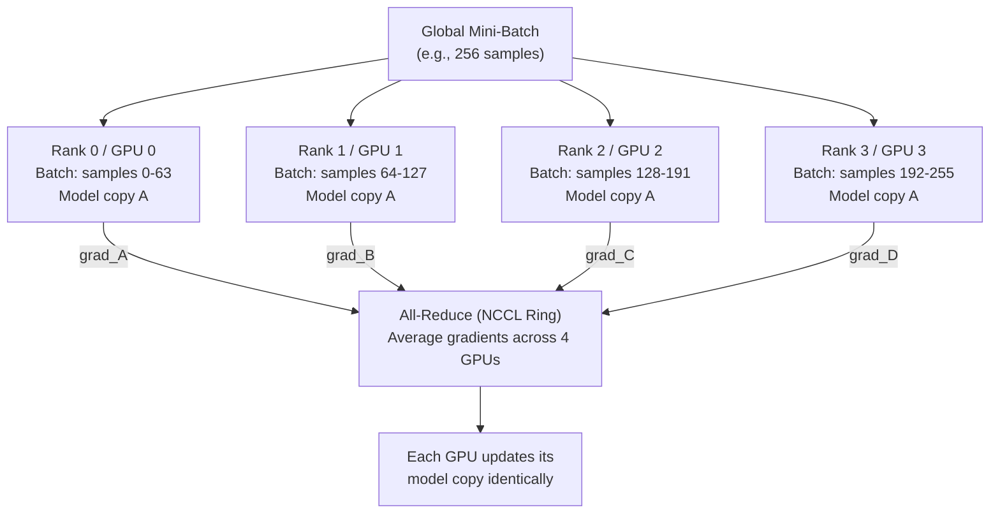

# 🔀 Data Parallelism

> [!abstract] TL;DR
> Data parallelism is the most common form of distributed training: **replicate the model on every GPU**, split the mini-batch across GPUs, run independent forward/backward passes, then synchronise gradients with an all-reduce. PyTorch DDP (DistributedDataParallel) is the correct implementation — it overlaps the all-reduce with the backward pass for near-zero overhead. PyTorch FSDP (Fully Sharded Data Parallel) extends DDP by sharding model parameters, gradients, and optimiser states, enabling training of models that don't fit on a single GPU. DataParallel (DP) is deprecated — never use it.

## Intuition — Analogy First

Imagine a **research team writing independent literature reviews on the same topic**.

Each researcher (GPU) has a copy of the shared research plan (model weights). Each is assigned a different pile of papers (mini-batch). They read, analyse, and independently conclude "here's what I'd change about the research plan" (compute gradients).

At the end of the day, the team meets, averages all their suggested edits, and updates the shared plan identically for everyone (all-reduce + parameter update).

Tomorrow, everyone starts from the exact same updated plan. The insight: N researchers working in parallel is like one researcher reading N times as many papers per day — **perfect linear scaling in theory**. In practice, the meeting overhead (all-reduce communication) and stragglers (imbalanced data) create efficiency loss.

## How It Works

### DDP: DistributedDataParallel

DDP is PyTorch's production data parallelism solution:

1. **Initialise**: each process launches with a unique rank (0..N-1), calls `dist.init_process_group(backend="nccl")`.
2. **Model replication**: each rank holds an identical copy of the model on its GPU.
3. **Data sharding**: `DistributedSampler` ensures each rank sees a non-overlapping subset of the dataset.
4. **Forward pass**: fully independent per rank.
5. **Backward + all-reduce overlap**: as soon as a gradient bucket (group of parameter gradients) is ready, DDP triggers an async all-reduce in the background while continuing the backward pass. When backward completes, all all-reduces are done.
6. **Optimizer step**: each rank runs the optimiser independently — results are identical because they started from identical gradients.



### DataParallel vs DDP vs FSDP

| Feature | DataParallel (DP) | DDP | FSDP |
|---|---|---|---|
| Parallelism | Single-process, multi-thread | Multi-process, 1 per GPU | Multi-process, 1 per GPU |
| Communication | GIL-limited, sequential | NCCL, overlapped with backward | NCCL, all-gather + reduce-scatter |
| Memory | Full model on every GPU | Full model on every GPU | Sharded model + grads + opt states |
| GIL contention | Yes (Python threads) | No | No |
| Unbalanced GPU use | GPU 0 collects all outputs | Symmetric | Symmetric |
| Status | **Deprecated** | **Recommended for same-size models** | **Recommended for large models** |

### FSDP: Fully Sharded Data Parallel

FSDP shards everything across ranks — weights, gradients, and optimiser states:

- **Before each layer's forward**: all-gather to reconstruct the full weight matrix.
- **After each layer's forward**: discard the weight; keep only the shard.
- **After backward**: reduce-scatter gradients; each rank accumulates only its own shard.
- **Optimizer step**: each rank updates only its weight shard.

Memory per GPU: $(W + G + O) / N$ instead of $(W + G + O)$ — proportional reduction with rank count.

## The Math

**Communication volume** for ring all-reduce with $N$ GPUs and $P$ parameters:

$$\text{Bytes per GPU} = 2 \cdot \frac{N-1}{N} \cdot P \cdot \text{dtype\_size}$$

For large $N$, this approaches $2P \cdot \text{dtype\_size}$ — doubling the parameter size.

**Effective batch size** scales linearly with the number of GPUs:

$$B_\text{effective} = B_\text{local} \times N$$

**Learning rate scaling rule** (linear scaling heuristic — Goyal et al., 2017):

$$\eta_\text{effective} = \eta_\text{base} \times \frac{B_\text{effective}}{B_\text{reference}}$$

with a linear warmup from $\eta_\text{base}$ to $\eta_\text{effective}$ over the first 5 epochs to avoid early instability.

**FSDP memory per rank** (ZeRO-3 equivalent):

$$M_\text{per\_GPU} = \frac{M_\text{weights} + M_\text{gradients} + M_\text{optimizer}}{N} + M_\text{activations}$$

## Code Demo

```python
import os
import torch
import torch.nn as nn
import torch.distributed as dist
from torch.nn.parallel import DistributedDataParallel as DDP
from torch.distributed.fsdp import FullyShardedDataParallel as FSDP
from torch.utils.data import DataLoader, TensorDataset
from torch.utils.data.distributed import DistributedSampler

# ── DDP training setup (called once per process) ──────────────────
def ddp_setup(rank: int, world_size: int):
    os.environ["MASTER_ADDR"] = os.environ.get("MASTER_ADDR", "localhost")
    os.environ["MASTER_PORT"] = os.environ.get("MASTER_PORT", "12355")
    dist.init_process_group(backend="nccl", rank=rank, world_size=world_size)
    torch.cuda.set_device(rank)

def ddp_cleanup():
    dist.destroy_process_group()

# ── Full DDP training loop ────────────────────────────────────────
def train_ddp(rank: int, world_size: int, num_epochs: int = 3):
    ddp_setup(rank, world_size)
    device = torch.device(f"cuda:{rank}")

    # Model: wrap with DDP
    model = nn.Sequential(
        nn.Linear(256, 512),
        nn.ReLU(),
        nn.Linear(512, 10)
    ).to(device)
    model = DDP(model, device_ids=[rank], find_unused_parameters=False)

    # Dataset: DistributedSampler ensures non-overlapping shards
    dataset = TensorDataset(
        torch.randn(1000, 256),
        torch.randint(0, 10, (1000,))
    )
    sampler = DistributedSampler(dataset, num_replicas=world_size, rank=rank, shuffle=True)
    loader = DataLoader(dataset, batch_size=32, sampler=sampler, pin_memory=True, num_workers=4)

    optimizer = torch.optim.AdamW(model.parameters(), lr=1e-3 * world_size)  # linear LR scaling
    criterion = nn.CrossEntropyLoss()

    for epoch in range(num_epochs):
        sampler.set_epoch(epoch)  # CRITICAL: ensures different shuffle each epoch
        model.train()

        for x, y in loader:
            x, y = x.to(device, non_blocking=True), y.to(device, non_blocking=True)
            optimizer.zero_grad()
            loss = criterion(model(x), y)
            loss.backward()   # triggers async all-reduce in background
            optimizer.step()

        if rank == 0:
            print(f"Epoch {epoch}: loss={loss.item():.4f}")

    # Save checkpoint from rank 0 only
    if rank == 0:
        torch.save(model.module.state_dict(), "checkpoint.pt")  # .module to unwrap DDP

    ddp_cleanup()

# ── Gradient accumulation with DDP (avoid unnecessary syncs) ─────
def train_with_accumulation(model, loader, optimizer, accum_steps=4):
    for step, (x, y) in enumerate(loader):
        # Only sync gradients on the last accumulation step
        if (step + 1) % accum_steps != 0:
            with model.no_sync():   # disables all-reduce for this step
                loss = compute_loss(model, x, y)
                loss.backward()
        else:
            loss = compute_loss(model, x, y)
            loss.backward()         # triggers all-reduce
            optimizer.step()
            optimizer.zero_grad()

# ── FSDP setup for large models ───────────────────────────────────
from torch.distributed.fsdp import (
    FullyShardedDataParallel as FSDP,
    ShardingStrategy,
    MixedPrecision,
)
import torch

def train_fsdp(rank: int, world_size: int):
    ddp_setup(rank, world_size)
    device = torch.device(f"cuda:{rank}")

    model = nn.Sequential(
        nn.Linear(4096, 4096),
        nn.ReLU(),
        nn.Linear(4096, 4096),
    )

    # BF16 mixed precision policy
    bf16_policy = MixedPrecision(
        param_dtype=torch.bfloat16,
        reduce_dtype=torch.bfloat16,
        buffer_dtype=torch.bfloat16,
    )

    model = FSDP(
        model,
        sharding_strategy=ShardingStrategy.FULL_SHARD,  # ZeRO-3 equivalent
        mixed_precision=bf16_policy,
        device_id=rank,
    )
    # Memory per rank is now ~1/world_size of the full model+grad+opt

    ddp_cleanup()

# ── Launch with torchrun ──────────────────────────────────────────
# torchrun --nproc_per_node=4 train.py
# Environment variables set automatically: RANK, LOCAL_RANK, WORLD_SIZE
```

## Real-World Example

**BERT pre-training** (Devlin et al., 2018 — Google) is the canonical DDP success story.

- **Setup**: 64 TPU v3 chips (equivalent: ~16 A100 GPUs in DDP).
- **Local batch size**: 512 sequences per device.
- **Effective global batch size**: 256 × 64 = 16,384 sequences.
- **Learning rate scaling**: base LR 1e-4 scaled by $\sqrt{64}$ ≈ 8e-4 with warmup over first 10,000 steps.
- **Result**: training time dropped from weeks (single GPU) to ~4 days on the cluster.
- **Modern equivalent**: Hugging Face's `accelerate` library wraps DDP/FSDP with a unified API, allowing BERT fine-tuning to scale from 1 to N GPUs with a single `--multi_gpu` flag.

**Meta's LLaMA-2 70B** uses FSDP rather than DDP — 70B parameters × 2 bytes (BF16) = 140GB, requiring sharding across multiple A100-80GB GPUs. Meta trained LLaMA-2 on 2,000 A100-80GBs with FSDP + model parallelism.

## Trade-offs

| Aspect | DDP | FSDP |
|---|---|---|
| Memory per GPU | Full model × (weights + grads + opt) | (weights + grads + opt) / N |
| Communication | All-reduce (2× params) | All-gather + reduce-scatter (2× params) |
| Communication timing | Overlapped with backward | Dependent on forward/backward boundaries |
| Code complexity | Low (drop-in replacement) | Moderate (wrapping policy, activation checkpointing) |
| Checkpoint size | Rank-0 full model | Sharded by default; need special save logic |
| Debugging | Easier | More complex (sharded state dict) |

## When to Use vs Avoid

**Use DDP when:**
- Model fits comfortably on one GPU (with room for gradients and optimiser states — 3–4× model size)
- Maximising training throughput with minimal code changes
- The team is new to distributed training

**Use FSDP when:**
- Model fits on GPU for inference but not for training (optimiser states are 8× model size for Adam)
- Training models in the 7B–100B range on a single node

**Use DeepSpeed ZeRO when:**
- Need maximum memory efficiency (ZeRO-3 with NVMe offload)
- Training > 100B parameter models

**Avoid DataParallel (DP) always:** it is single-process multi-thread, causes GIL contention, unbalanced GPU usage (GPU 0 is overloaded), and is documented as deprecated.

## Common Pitfalls

1. **Forgetting `sampler.set_epoch(epoch)`**: without this, every epoch uses the same shuffle — hurts convergence quality.
2. **Using DataParallel instead of DDP**: DP is slower, unbalanced, and deprecated. DDP requires multi-process but is strictly better.
3. **Saving checkpoint from all ranks**: only rank 0 should save, and should wait for rank 0 with `dist.barrier()` after all ranks complete.
4. **Not scaling learning rate**: doubling GPUs halves the gradient variance; scale LR linearly and use warmup.
5. **`find_unused_parameters=True` overhead**: DDP traverses the module graph to find parameters with no gradient. Only enable if needed (e.g., conditional computation); it adds latency.
6. **FSDP + custom activation checkpointing**: re-computation triggers unexpected all-gathers; use FSDP's built-in activation checkpointing (`checkpoint_wrapper`) for correctness.

## Related Concepts

- [[_MOC_Infrastructure|↑ Section MOC]]

- [[Distributed_Training_Overview]] — the broader parallelism landscape
- [[Model_Parallelism]] — for models that don't fit on one GPU
- [[DeepSpeed_ZeRO]] — alternative memory-efficient data parallelism
- [[Mixed_Precision_Training]] — used alongside DDP/FSDP for performance
- [[Optimizers]] — Adam's 3× memory overhead is why FSDP matters

## Review Questions

1. A model has 7B parameters in BF16. Adam optimiser stores momentum and variance in FP32. Calculate the total GPU memory needed to train without FSDP (on a single GPU). How many A100-80GB GPUs with FSDP would allow this?
2. Explain why `sampler.set_epoch(epoch)` is critical for DDP training correctness, not just performance.
3. Compare the communication patterns of DDP and FSDP. Both transfer roughly 2× parameter bytes per step — why does FSDP save memory if the communication volume is similar?

## Sources

- PyTorch DDP tutorial: https://pytorch.org/tutorials/intermediate/ddp_tutorial.html
- PyTorch FSDP tutorial: https://pytorch.org/tutorials/intermediate/FSDP_tutorial.html
- Goyal et al., "Accurate, Large Minibatch SGD" (2017) — linear LR scaling rule
- Zhao et al., "PyTorch FSDP: Experiences on Scaling Fully Sharded Data Parallel" (2023)
- Rajbhandari et al., "ZeRO: Memory Optimizations Toward Training Trillion Parameter Models" (2020)

#data-parallelism #ddp #fsdp #distributed-training #infrastructure #pytorch
