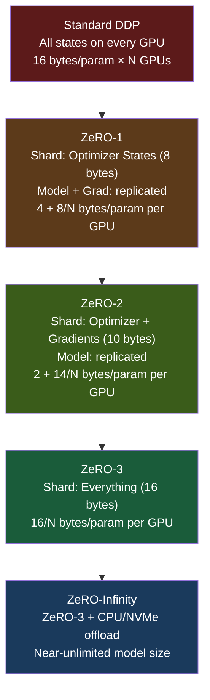

# 🧊 DeepSpeed ZeRO

> [!abstract] TL;DR
> ZeRO (Zero Redundancy Optimizer) is a memory optimisation strategy that eliminates the redundancy in standard data parallelism. In vanilla DDP, every GPU stores the full model + gradients + optimiser states — ZeRO progressively shards these across ranks. ZeRO-1 shards only optimiser states (8× reduction in opt memory), ZeRO-2 adds gradient sharding, ZeRO-3 shards model parameters too. ZeRO-Infinity extends to CPU/NVMe offload. For Adam on a 7B model, ZeRO-3 on 8 GPUs reduces per-GPU memory from ~112GB to ~14GB. DeepSpeed integrates ZeRO with pipeline parallelism, FP16/BF16 mixed precision, and gradient checkpointing.

## Intuition — Analogy First

Imagine **8 tenants (GPUs) in an apartment building** all storing identical copies of a 100GB library.

That's standard DDP: each tenant has the complete library (model + gradients + optimiser states) in their apartment. 800GB total storage for 100GB of unique content — **8× redundancy**.

ZeRO stages eliminate redundancy progressively:

- **ZeRO-1** (Optimiser state sharding): the most expensive books (optimiser states — 75% of total) are split evenly. Tenant 1 keeps books A–M, Tenant 2 keeps N–Z. Before the weekly book study (optimiser step), they share their books via temporary loans (all-gather). Total: 100GB + 100/8 × 3 = ~137GB instead of 800GB.
- **ZeRO-2** (+ Gradient sharding): the notebooks where they take study notes (gradients) are also split. Each tenant keeps notes only for their books. Reduces further.
- **ZeRO-3** (+ Parameter sharding): even the actual books (model parameters) are split. Each tenant stores only 1/8th of the library. They borrow from each other chapter-by-chapter (all-gather) as needed during study sessions.
- **ZeRO-Infinity**: the least-used books go in the building's basement storage (CPU RAM) or the city archives (NVMe SSD).

## How It Works

### Memory Breakdown for a Language Model

For a model with $\Psi$ parameters and Adam optimiser:

| Component | Bytes per param | Notes |
|---|---|---|
| FP16/BF16 model weights | 2 | Forward/backward compute |
| Gradients | 2 | Same dtype as weights |
| FP32 master weights | 4 | Precision maintained for stability |
| Adam momentum (m) | 4 | FP32, first moment |
| Adam variance (v) | 4 | FP32, second moment |
| **Total** | **16** | 16 bytes × $\Psi$ params |

For a 7B model: $7 \times 10^9 \times 16 = 112$ GB. Exceeds a single H100 80GB.

### ZeRO Stages



### Communication Patterns

**ZeRO-1**: Optimiser step requires all-gather of full parameters from shards. Communication: 1 all-gather per step (cheap — only at update, not backward).

**ZeRO-2**: Gradient backward: reduce-scatter instead of all-reduce (each rank receives its own shard of gradients). Memory: $\frac{2\Psi}{N}$ for gradients. Communication: same volume as DDP all-reduce.

**ZeRO-3**: Every forward/backward operation on a layer must all-gather that layer's parameters, use them, then discard the non-owned shards. Communication per layer: 2 all-gathers (fwd + bwd) + 1 reduce-scatter (grad). More communication than ZeRO-2 but enables truly enormous models.

### ZeRO vs Tensor/Pipeline Parallelism

| Approach | Memory Reduction | Changes Forward/Backward? | Communication Pattern |
|---|---|---|---|
| ZeRO-1 | ~4× (optimiser states only) | No | Minimal (all-gather at update) |
| ZeRO-2 | ~7× | No | Same as DDP |
| ZeRO-3 | ~8× (all components) | Yes (all-gather per layer) | 1.5× DDP |
| Tensor Parallelism | ~TP degree (parameters only) | Yes (column/row split) | All-reduce per layer (synchronous) |

ZeRO and TP are complementary: ZeRO shards **across data-parallel ranks** (doesn't increase per-layer compute overlap), TP shards **within a single forward pass** (all GPUs participate simultaneously).

## The Math

**Per-GPU memory** with ZeRO stage and $N$ GPUs:

$$M_\text{ZeRO-1} = 2\Psi + 2\Psi + \frac{12\Psi}{N} \text{ bytes}$$

$$M_\text{ZeRO-2} = 2\Psi + \frac{14\Psi}{N} \text{ bytes}$$

$$M_\text{ZeRO-3} = \frac{16\Psi}{N} \text{ bytes}$$

For a **13B model** ($\Psi = 13 \times 10^9$) on **N = 16 GPUs**:

- DDP: $16 \times 13\text{B} = 208\text{GB}$ — impossible on single GPU
- ZeRO-1: $2\times13 + 2\times13 + 12\times13/16 = 61.75\text{GB}$ — fits in 80GB
- ZeRO-2: $2\times13 + 14\times13/16 = 37.4\text{GB}$ — comfortable
- ZeRO-3: $16\times13/16 = 13\text{GB}$ — room for large batch sizes

**Communication overhead ratio** (ZeRO-3 vs DDP):

$$\frac{\text{ZeRO-3 communication}}{\text{DDP communication}} = \frac{3 \times 2\Psi}{2\Psi} = 1.5\times$$

ZeRO-3 communicates 1.5× more than DDP — but DDP requires 8× more memory for optimiser states.

## Code Demo

```python
# ── DeepSpeed config JSON ──────────────────────────────────────────
# ds_config_zero3.json
import json

zero3_config = {
    "train_batch_size": 256,
    "train_micro_batch_size_per_gpu": 4,
    "gradient_accumulation_steps": 8,

    "bf16": {
        "enabled": True
    },

    "zero_optimization": {
        "stage": 3,                          # ZeRO-3: shard everything
        "overlap_comm": True,                # overlap grad comms with backward
        "contiguous_gradients": True,        # reduce memory fragmentation
        "sub_group_size": 1e9,               # parameter sub-groups for all-gather
        "reduce_bucket_size": "auto",
        "stage3_prefetch_bucket_size": "auto",
        "stage3_param_persistence_threshold": "auto",
        "stage3_max_live_parameters": 1e9,
        "stage3_max_reuse_distance": 1e9,

        # CPU offload (ZeRO-Infinity)
        "offload_optimizer": {
            "device": "cpu",               # offload optimiser states to CPU
            "pin_memory": True             # pin for fast GPU→CPU transfer
        },
        "offload_param": {
            "device": "cpu",              # offload parameters too (for very large models)
            "pin_memory": True
        }
    },

    "gradient_clipping": 1.0,
    "steps_per_print": 100,
    "wall_clock_breakdown": False
}

with open("ds_config_zero3.json", "w") as f:
    json.dump(zero3_config, f, indent=2)

# ── PyTorch + DeepSpeed training loop ────────────────────────────
import torch
import torch.nn as nn
import deepspeed

class LargeModel(nn.Module):
    def __init__(self, hidden_dim=4096, num_layers=32):
        super().__init__()
        self.layers = nn.ModuleList([
            nn.Sequential(
                nn.Linear(hidden_dim, hidden_dim * 4),
                nn.GELU(),
                nn.Linear(hidden_dim * 4, hidden_dim),
            )
            for _ in range(num_layers)
        ])
        self.final = nn.Linear(hidden_dim, 1000)

    def forward(self, x):
        for layer in self.layers:
            x = layer(x) + x   # residual
        return self.final(x)

model = LargeModel()
optimizer = torch.optim.AdamW(model.parameters(), lr=1e-4)

# Initialize DeepSpeed (replaces model and optimizer)
model_engine, optimizer, _, _ = deepspeed.initialize(
    model=model,
    optimizer=optimizer,
    config="ds_config_zero3.json",
)

# Training loop (mostly same as PyTorch)
dataset = torch.utils.data.TensorDataset(
    torch.randn(1000, 4096),
    torch.randint(0, 1000, (1000,))
)
loader = torch.utils.data.DataLoader(dataset, batch_size=4)
criterion = nn.CrossEntropyLoss()

for x, y in loader:
    x = x.to(model_engine.local_rank)
    y = y.to(model_engine.local_rank)

    loss = criterion(model_engine(x), y)
    model_engine.backward(loss)   # handles gradient scaling, ZeRO comms
    model_engine.step()           # optimizer step + ZeRO parameter all-gather

# ── Saving ZeRO-3 checkpoints ─────────────────────────────────────
# ZeRO-3 shards parameters — saving requires all-gather first
model_engine.save_checkpoint("./ckpt", tag="step_1000")

# Load and consolidate shards into a single checkpoint:
# deepspeed.utils.zero_to_fp32.get_fp32_state_dict_from_zero_checkpoint("./ckpt")

# ── Hugging Face Accelerate + ZeRO (simpler interface) ────────────
# accelerate_config.yaml:
#   distributed_type: DEEPSPEED
#   deepspeed_config:
#     zero_stage: 3
#     bf16: true
# Then: accelerate launch train.py
```

## Real-World Example

**GPT-NeoX-20B** (EleutherAI, 2022) — the first publicly released 20B parameter LLM, trained using DeepSpeed ZeRO-3.

- **Hardware**: 96 × A100 40GB GPUs on 12 nodes.
- **Strategy**: ZeRO-3 (no TP or PP — simplified setup for the open-source team).
- **Memory per GPU with ZeRO-3**: $16 \times 20\text{B} / 96 = 3.3\text{GB}$ for parameters alone. Activations + buffers use remaining VRAM.
- **Without ZeRO-3**: $16 \times 20\text{B} = 320\text{GB}$ — 8 A100-40GBs per model copy, impractical.
- **Training throughput**: ~107 TFLOP/s per GPU (vs 312 peak for A100 BF16) — 34% MFU.

**Hugging Face Accelerate** abstracts ZeRO behind a unified API, making it accessible to practitioners who don't want to write DeepSpeed JSON configs manually. `accelerate launch --config_file accelerate_config.yaml train.py` handles ZeRO-3 setup automatically.

## Trade-offs

| ZeRO Stage | Memory Saving | Communication Overhead | Best For |
|---|---|---|---|
| 1 | 4× optimizer | Minimal | Models that fit with opt states removed |
| 2 | 7× (+ gradients) | Same as DDP | Most fine-tuning scenarios |
| 3 | 8× (all) | 1.5× DDP | Very large models, limited GPU count |
| Infinity (CPU offload) | Near-unlimited | Slow (PCIe bottleneck) | Models too large for GPU RAM alone |

**ZeRO-3 vs Tensor Parallelism**:
- ZeRO-3 is simpler to set up (no model architecture changes)
- TP has lower communication overhead for tight NVLink networks
- ZeRO-3 is preferred for fine-tuning; TP for pre-training

## When to Use vs Avoid

**Use ZeRO-1/2 when:**
- Model fits on one GPU for inference but not training (optimiser state memory)
- Minimal changes to training code are desired
- Using HuggingFace Trainer or Accelerate

**Use ZeRO-3 when:**
- Model requires multiple GPUs just to hold parameters
- Limited GPU count (prefer ZeRO-3 to adding more GPUs)
- Fine-tuning very large models (70B+) on commodity clusters

**Avoid ZeRO-3 when:**
- Pre-training at scale with many GPUs and NVLink — TP + PP has lower communication overhead
- Very small models — overhead not worth it
- CPU offload (ZeRO-Infinity) — only when GPU memory is truly exhausted; it is very slow

## Common Pitfalls

1. **ZeRO-3 checkpoint saving**: parameters are sharded across ranks. Calling `torch.save(model.state_dict())` saves only the rank's shard. Use `deepspeed.utils.zero_to_fp32.get_fp32_state_dict_from_zero_checkpoint()` to consolidate.
2. **Forgetting to use `model_engine.backward(loss)`**: standard `loss.backward()` bypasses DeepSpeed's gradient management and mixed precision scaler — always use the DeepSpeed API.
3. **CPU offload on fast GPUs**: ZeRO-Infinity with CPU offload is bottlenecked by PCIe bandwidth (~64 GB/s vs 900 GB/s NVLink). Only use when GPU memory is genuinely insufficient.
4. **`sub_group_size` too small**: ZeRO-3 processes parameter sub-groups for all-gather. Too small → many small communications; too large → high peak memory. Use "auto" or tune empirically.
5. **Mixing ZeRO-3 with `torch.compile()`**: as of 2024, ZeRO-3 and `torch.compile()` have incompatibilities. Test carefully; `torch.compile()` may not accelerate ZeRO-3 wrapped models.

## Related Concepts

- [[_MOC_Infrastructure|↑ Section MOC]]

- [[Data_Parallelism]] — ZeRO is a memory-efficient extension of DDP
- [[Mixed_Precision_Training]] — always used alongside ZeRO for training LLMs
- [[Pipeline_Parallelism]] — complementary to ZeRO for very large models
- [[Tensor_Parallelism]] — alternative to ZeRO for intra-layer memory reduction
- [[Quantization]] — reduces memory footprint at inference, not training

## Review Questions

1. A 13B parameter model uses AdamW. Calculate the total memory required per GPU for: (a) Standard DDP, (b) ZeRO-2 on 8 GPUs, (c) ZeRO-3 on 8 GPUs. Assume BF16 model + FP32 optimiser states.
2. ZeRO-3 communicates 1.5× more data than standard DDP all-reduce. If ZeRO-3 uses the same bandwidth and takes 1.5× the communication time, why is it still preferred over DDP when training large models?
3. Explain the difference between ZeRO-3 and tensor parallelism for memory reduction. Which would you choose for fine-tuning a 70B model on 8 GPUs, and why?

## Sources

- Rajbhandari et al., "ZeRO: Memory Optimizations Toward Training Trillion Parameter Models" (SC20)
- Rajbhandari et al., "ZeRO-Infinity: Breaking the GPU Memory Wall for Extreme Scale Deep Learning" (SC21)
- DeepSpeed documentation: https://www.deepspeed.ai/tutorials/zero/
- Smith et al., "Using DeepSpeed and Megatron to Train Megatron-Turing NLG 530B" (2022)
- Black et al., "GPT-NeoX-20B: An Open-Source Autoregressive Language Model" (2022)

#deepspeed #zero #distributed-training #infrastructure #memory-optimisation #zero3
