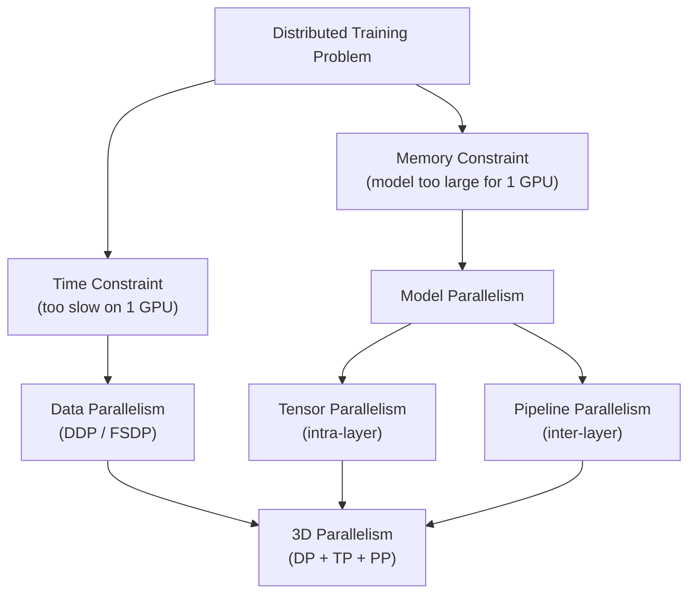

# 🌐 Distributed Training Overview

> [!abstract] TL;DR
> Distributed training solves two problems: the model is too large to fit on one GPU (memory constraint), or training on one GPU is too slow (time constraint). Solutions fall along two axes: **data parallelism** (replicate model, split data) and **model parallelism** (split model across devices). Real large-scale training (GPT-3, LLaMA) combines all three parallelism strategies: data parallel + tensor parallel + pipeline parallel (3D parallelism). The primary overhead is communication — all-reduce for gradients, point-to-point for activations — making NVLink bandwidth a key scaling constraint.

## Intuition — Analogy First

Building a skyscraper with multiple construction crews:

**Data parallelism** = multiple crews each **build separate identical houses** from the same blueprint. Every week (gradient sync), they compare notes and average their findings to update the shared blueprint.

**Model parallelism** = one enormous skyscraper is split across **multiple floors, each crew handling different floors**. The output of floor 3 must be handed to floor 4 before that crew can start.

**Why you need both**: a house might be too large for one crew to finish in the deadline (time → data parallelism) *and* the blueprint itself might be too large to fit in one crew's toolbox (memory → model parallelism). Real frontier models require both simultaneously.

The fundamental tension: **more parallelism = more communication overhead**. A crew that must constantly synchronise with others loses efficiency. The art of distributed training is maximising useful compute while minimising synchronisation.

## How It Works

### The Two Axes of Parallelism



### Collective Communication Operations

All distributed training relies on collective operations executed by **NCCL** (NVIDIA Collective Communications Library):

| Operation | Description | Used for |
|---|---|---|
| **All-Reduce** | Each rank contributes a tensor; all ranks receive the sum/mean | DDP gradient sync |
| **All-Gather** | Each rank has a shard; all ranks receive the full tensor | FSDP parameter un-sharding |
| **Reduce-Scatter** | Reverse of all-gather; each rank receives one shard of the reduced result | FSDP gradient sharding |
| **Broadcast** | One rank sends a tensor to all others | Synchronising initial weights |
| **Point-to-Point** | Send/recv between two specific ranks | Pipeline parallelism activation transfer |

### Synchronous vs Asynchronous Training

**Synchronous** (standard): all workers compute gradients, barrier sync, all-reduce, everyone updates with the same gradient. Pros: exact SGD semantics. Cons: the slowest worker (straggler) determines iteration time.

**Asynchronous** (parameter server model): workers push gradients independently to a central server; server updates weights immediately. Pros: no straggler problem. Cons: stale gradients (worker may be many steps behind), can harm convergence. Rarely used for LLMs.

### Communication Backends

| Backend | Hardware | Bandwidth | Use case |
|---|---|---|---|
| **NCCL** | NVIDIA GPU | NVLink 900 GB/s, InfiniBand 200–800 GB/s | Standard for GPU clusters |
| **Gloo** | CPU/GPU | PCIe ~64 GB/s | Fallback for debugging |
| **MPI** | CPU | Network dependent | HPC clusters |

NVLink (within node) is ~10× faster than InfiniBand (between nodes). This is why tensor parallelism is placed within a node and data parallelism spans nodes.

## The Math

**All-Reduce communication volume** for ring all-reduce with $N$ GPUs and parameter count $P$:

$$\text{Data transferred per GPU} = 2 \cdot \frac{N-1}{N} \cdot P \cdot \text{bytes\_per\_param}$$

For $N \gg 1$: approaches $2P$ bytes — nearly independent of $N$! Ring all-reduce scales well.

**Scaling efficiency** with communication overhead $t_{comm}$ and compute time $t_{comp}$:

$$\text{Efficiency} = \frac{t_{comp}}{t_{comp} + t_{comm}}$$

**Critical ratio**: if compute/communication > 1, scaling is efficient. Modern GPUs improve this via gradient compression, overlapping backward pass with all-reduce (DDP does this automatically).

## Code Demo

```python
import torch
import torch.distributed as dist
import os

# ── Initialise process group ───────────────────────────────────────
# This is called once at the start of each rank's process
def setup(rank: int, world_size: int):
    os.environ["MASTER_ADDR"] = "localhost"
    os.environ["MASTER_PORT"] = "12355"

    dist.init_process_group(
        backend="nccl",        # use NCCL for GPU-to-GPU communication
        rank=rank,             # this process's global rank (0-indexed)
        world_size=world_size, # total number of processes
    )
    torch.cuda.set_device(rank)  # each process uses its own GPU
    print(f"[Rank {rank}] Initialised. World size: {world_size}")

def cleanup():
    dist.destroy_process_group()

# ── Collective operations demo ────────────────────────────────────
def demo_collectives(rank: int, world_size: int):
    setup(rank, world_size)
    device = torch.device(f"cuda:{rank}")

    # All-Reduce: sum a tensor across all ranks
    t = torch.tensor([rank + 1.0], device=device)
    dist.all_reduce(t, op=dist.ReduceOp.SUM)
    print(f"[Rank {rank}] After all-reduce sum: {t.item()}")  # each rank sees total

    # All-Gather: collect shards from all ranks
    local_shard = torch.tensor([rank * 10.0], device=device)
    gathered = [torch.zeros(1, device=device) for _ in range(world_size)]
    dist.all_gather(gathered, local_shard)
    if rank == 0:
        print(f"All-gathered: {[g.item() for g in gathered]}")

    cleanup()

# ── Launch with torchrun (replaces torch.distributed.launch) ─────
# torchrun --nproc_per_node=4 train.py
# Each process gets: LOCAL_RANK, RANK, WORLD_SIZE env vars

# ── Check communication backend info ──────────────────────────────
if dist.is_available():
    print(f"NCCL available: {dist.is_nccl_available()}")
    print(f"Gloo available: {dist.is_gloo_available()}")

# ── Gradient synchronisation timing ──────────────────────────────
# DDP overlaps all-reduce with backward pass automatically
# To measure communication overhead:
import contextlib

@contextlib.contextmanager
def disable_grad_sync(model):
    """Context manager to temporarily disable DDP gradient sync."""
    if hasattr(model, 'no_sync'):
        with model.no_sync():
            yield
    else:
        yield

# Use model.no_sync() for gradient accumulation with DDP
# (avoids all-reduce on every micro-step)
```

## Real-World Example

**GPT-3 (175B parameters)** — Brown et al., OpenAI, 2020. The first demonstration that 3D parallelism is required at frontier scale:

- **Hardware**: 1,024 A100 80GB GPUs across 128 nodes, 8 GPUs per node.
- **Data parallelism**: across all 1,024 GPUs — gradient all-reduce happens after each step.
- **Tensor parallelism**: within each node (8 GPUs, 8× NVLink bandwidth for tight sync).
- **Pipeline parallelism**: across nodes — each node handles a shard of layers.
- **Why not data parallelism alone?** 175B params × 4 bytes (FP32) = 700GB, far exceeding 80GB VRAM.
- **Why not model parallelism alone?** Without data parallelism, batch size is limited; gradient noise is high; convergence is unstable.
- **Training time**: ~34 days on the full cluster, would take 355 years on a single GPU.

The Megatron-LM framework from NVIDIA implements this exact 3D parallelism strategy and is the basis for most frontier LLM training today.

## Trade-offs

| Strategy | Memory Savings | Communication Cost | Code Complexity | Best For |
|---|---|---|---|---|
| Data Parallelism (DDP) | None | Low (all-reduce gradients) | Low | Models that fit on 1 GPU |
| FSDP | 4–8× | Moderate (all-gather + reduce-scatter) | Moderate | Models up to ~100B |
| Tensor Parallelism | Proportional to TP degree | Very high (synchronous all-reduce per layer) | High | Large layers, intra-node |
| Pipeline Parallelism | Proportional to PP degree | Low (point-to-point activations) | High | Very deep models, inter-node |
| Expert Parallelism (MoE) | High | High (all-to-all routing) | Very High | Sparse models |

## When to Use vs Avoid

**Single GPU:** Always start here; add complexity only when forced.

**Multi-GPU (fits on 1 GPU):** DDP. Zero communication overhead for gradients; near-linear scaling. Add FSDP if gradient/optimiser state memory is the bottleneck.

**Model too large for 1 GPU:** Add tensor parallelism within nodes first (NVLink is fast). Add pipeline parallelism if TP isn't enough.

**Thousands of GPUs:** Full 3D parallelism (data × tensor × pipeline). Requires distributed training framework (Megatron-LM, DeepSpeed).

**Avoid distributed when:**
- Model fits on one GPU and training time is acceptable — distributed adds bugs.
- Team lacks expertise in debugging NCCL hangs, rank failures, checkpoint recovery.

## Common Pitfalls

1. **NCCL timeout hangs**: one rank crashes silently, others wait indefinitely. Set `NCCL_TIMEOUT` and use `dist.monitored_barrier()`.
2. **Uneven batch sizes**: if batch sizes differ across ranks (last batch), all-reduce produces incorrect gradient averages. Use `drop_last=True` in DistributedSampler.
3. **Forgetting to seed differently per rank**: `torch.manual_seed(42 + rank)` — otherwise all workers generate identical data augmentation and training is equivalent to 1 GPU.
4. **Checkpoint saving from all ranks**: only rank 0 should save checkpoints; other ranks should wait at a barrier before continuing.
5. **Python objects not collective-safe**: only tensors can be all-reduced. Use `dist.broadcast_object_list()` for Python scalars/strings.

## Related Concepts

- [[_MOC_Infrastructure|↑ Section MOC]]

- [[Data_Parallelism]] — replicate model, split data
- [[Model_Parallelism]] — split model across devices
- [[Pipeline_Parallelism]] — stage-by-stage layer splits
- [[Tensor_Parallelism]] — intra-layer matrix splits
- [[DeepSpeed_ZeRO]] — memory-efficient data parallelism
- [[GPU_Architecture_Basics]] — the hardware these strategies run on

## Review Questions

1. GPT-3 has 175B parameters in BF16 (2 bytes/param). Calculate the minimum number of 80GB GPUs needed to store just the model weights. Why does the actual training require many more than this minimum?
2. Explain why tensor parallelism is placed within a single node (8 GPUs) while pipeline parallelism spans nodes. What hardware property drives this placement decision?
3. A distributed training job with DDP on 8 GPUs shows only 6× speedup (not 8×). Name three potential causes and one diagnostic step for each.

## Sources

- Shoeybi et al., "Megatron-LM: Training Multi-Billion Parameter Language Models Using Model Parallelism" (2019)
- Narayanan et al., "Efficient Large-Scale Language Model Training on GPU Clusters" (SC21)
- PyTorch Distributed Training docs: https://pytorch.org/tutorials/intermediate/dist_tuto.html
- NCCL documentation: https://docs.nvidia.com/deeplearning/nccl/
- Brown et al., "Language Models are Few-Shot Learners" (GPT-3, NeurIPS 2020)

#distributed-training #parallelism #infrastructure #nccl #scalability #multi-gpu
