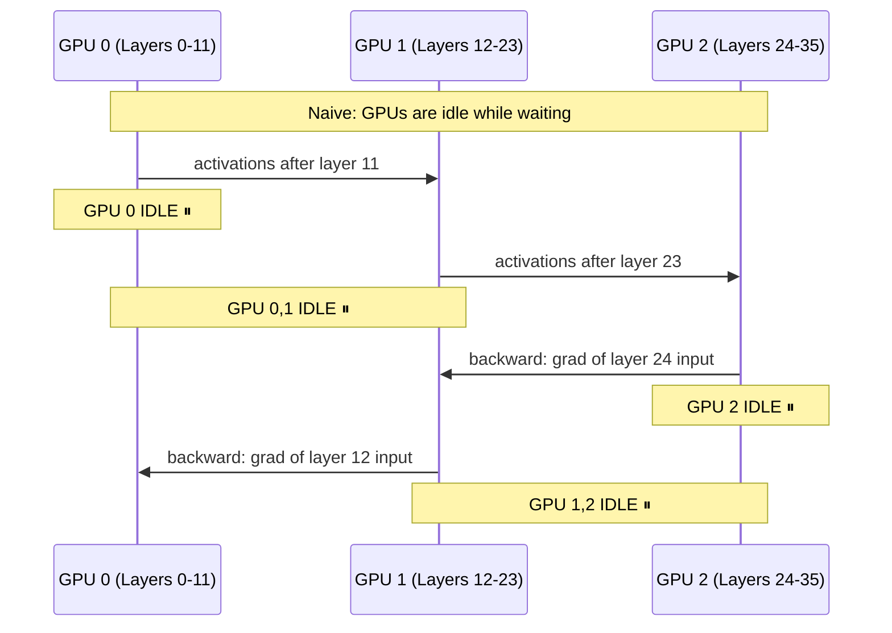

# 🏗️ Model Parallelism

> [!abstract] TL;DR
> Model parallelism splits the **model itself** across multiple GPUs when it's too large to fit on one device. The naive approach (assign consecutive layers to consecutive GPUs) suffers severe GPU underutilisation — only one GPU is active at any moment. **Pipeline parallelism** solves this by overlapping computation with micro-batches. **Tensor parallelism** (Megatron-LM style) solves it by splitting individual matrix multiplications. Mixture-of-Experts (MoE) is a third approach that enables vast parameter counts by routing tokens to only a few expert layers per forward pass. Real LLM training combines tensor + pipeline + data parallelism simultaneously.

## Intuition — Analogy First

Think of a long **factory assembly line split across multiple factory floors**.

In naive model parallelism: Floor 1 does chassis assembly, passes to Floor 2 for engine, passes to Floor 3 for interior, passes to Floor 4 for painting. Only one floor is busy at a time — the others wait for the piece to arrive. A 4-floor factory runs at 25% utilisation. This is the **naive sequential approach**.

**Pipeline parallelism** fixes this: while Floor 4 is painting car #1, Floor 3 is installing the interior of car #2, Floor 2 is installing the engine of car #3, Floor 1 is building the chassis of car #4. Four cars in production simultaneously — near 100% utilisation (except for startup and teardown — the "pipeline bubble").

**Tensor parallelism** is different: instead of different floors handling different stages, multiple workers on the *same stage* simultaneously work on different parts of the same car (e.g., three workers installing the engine in parallel by dividing the engine's subcomponents among them).

## How It Works

### Naive Model Parallelism

The simplest approach: split the model's layers across GPUs sequentially.

```
GPU 0: layers 0-11     (first half)
GPU 1: layers 12-23    (second half)
```

**Forward pass**: GPU 0 computes activations for layers 0-11 → sends activation tensor to GPU 1 → GPU 1 computes layers 12-23.

**Problem**: GPU 0 is idle while GPU 1 runs, and vice versa. For a 4-way split: 75% idle time. This is called the **pipeline bubble**.



### Tensor Parallelism (Megatron-LM Style)

Instead of splitting between layers, split **within** a layer's matrix multiply:

For a linear layer $Y = XW$ with $X \in \mathbb{R}^{b \times d}$, $W \in \mathbb{R}^{d \times h}$:

- **Column-parallel**: split $W$ column-wise: $W = [W_1 | W_2]$. GPU 1 computes $XW_1$, GPU 2 computes $XW_2$. Concatenate results: $Y = [XW_1 \| XW_2]$.
- **Row-parallel**: split $W$ row-wise and $X$ column-wise: GPU 1 computes $X_1 W_1$, GPU 2 computes $X_2 W_2$. All-reduce sum: $Y = X_1 W_1 + X_2 W_2$.

By alternating column-parallel and row-parallel layers, only **one all-reduce per transformer block** is needed instead of per-matmul.

### MoE: Mixture of Experts

A third form of model parallelism: instead of always activating all parameters, a gating network routes each token to a subset (top-K) of $E$ expert FFN layers:

- Each expert lives on a different GPU (expert parallelism).
- Only K/E fraction of parameters is activated per token → dense parameter count without dense FLOPs.
- Communication: **all-to-all** routing (tokens → expert GPUs → results back).

GPT-4 (reportedly), Mixtral 8×7B, and Switch Transformer are MoE models.

## The Math

**Naive model parallel communication volume** per forward+backward step, for activation tensor of size $A$ bytes between each GPU boundary:

$$\text{Bytes transferred} = 2A \times (P-1)$$

where $P$ = number of pipeline stages. For a 1024-token sequence, 4096 hidden dim, BF16: $A = 1024 \times 4096 \times 2 = 8.4\text{MB}$ per boundary. Very small — P2P transfers are cheap.

**Tensor parallel all-reduce volume** per transformer block (with TP degree $t$):

$$\text{Bytes} = 2 \times \frac{t-1}{t} \times h^2 \times 2 \approx 2 \times h^2 \times 2 \text{ bytes}$$

For $h = 8192$ (LLaMA-70B): ~268MB per transformer block per all-reduce → requires NVLink bandwidth (900 GB/s) to avoid being the bottleneck.

**GPU utilisation in naive MP** with $P$ pipeline stages:

$$\text{Utilisation} = \frac{1}{P} \quad \text{(forward)} + \frac{1}{P} \quad \text{(backward)} = \frac{2}{P \cdot 2} = \frac{1}{P}$$

For $P = 4$: 25% utilisation. Pipeline parallelism with micro-batches improves this to $\frac{m}{m+P-1}$ where $m$ = micro-batches.

## Code Demo

```python
import torch
import torch.nn as nn

# ── Naive two-GPU model split (illustrative) ─────────────────────
class NaiveTwoGPUModel(nn.Module):
    def __init__(self):
        super().__init__()
        self.gpu0_layers = nn.Sequential(
            nn.Linear(1024, 2048), nn.ReLU(),
            nn.Linear(2048, 2048), nn.ReLU(),
        ).to("cuda:0")

        self.gpu1_layers = nn.Sequential(
            nn.Linear(2048, 2048), nn.ReLU(),
            nn.Linear(2048, 512),
        ).to("cuda:1")

    def forward(self, x: torch.Tensor) -> torch.Tensor:
        x = x.to("cuda:0")
        x = self.gpu0_layers(x)         # compute on GPU 0
        x = x.to("cuda:1")             # TRANSFER: GPU 0 → GPU 1 (PCIe/NVLink)
        x = self.gpu1_layers(x)         # compute on GPU 1
        return x

# Problem: GPU 0 is idle during GPU 1's compute and vice versa

# ── Column-parallel linear (Tensor Parallelism concept) ──────────
class ColumnParallelLinear(nn.Module):
    """
    Splits weight matrix column-wise across 2 GPUs.
    GPU 0: W[:, :half]   GPU 1: W[:, half:]
    Output is concatenated across GPUs.
    """
    def __init__(self, in_features: int, out_features: int):
        super().__init__()
        assert out_features % 2 == 0
        half = out_features // 2
        # Each GPU stores half the output columns
        self.linear_0 = nn.Linear(in_features, half, bias=False).to("cuda:0")
        self.linear_1 = nn.Linear(in_features, half, bias=False).to("cuda:1")

    def forward(self, x: torch.Tensor) -> torch.Tensor:
        # Both GPUs receive the full input (broadcast)
        x0 = x.to("cuda:0")
        x1 = x.to("cuda:1")

        y0 = self.linear_0(x0)   # (batch, half) on GPU 0
        y1 = self.linear_1(x1)   # (batch, half) on GPU 1

        # Concatenate (in practice: all-gather via NCCL)
        return torch.cat([y0.to("cuda:0"), y1.to("cuda:0")], dim=-1)

# ── Row-parallel linear (reduction at end) ────────────────────────
class RowParallelLinear(nn.Module):
    """
    Splits weight matrix row-wise. Each GPU computes a partial sum.
    All-reduce (sum) to get full output.
    """
    def __init__(self, in_features: int, out_features: int):
        super().__init__()
        half_in = in_features // 2
        self.linear_0 = nn.Linear(half_in, out_features, bias=False).to("cuda:0")
        self.linear_1 = nn.Linear(half_in, out_features, bias=False).to("cuda:1")

    def forward(self, x: torch.Tensor) -> torch.Tensor:
        # x is already split column-wise from column-parallel previous layer
        x0, x1 = x.chunk(2, dim=-1)
        x0 = x0.to("cuda:0")
        x1 = x1.to("cuda:1")

        partial_0 = self.linear_0(x0)   # partial sum, GPU 0
        partial_1 = self.linear_1(x1)   # partial sum, GPU 1

        # All-reduce: sum partial results (in practice via NCCL all-reduce)
        result = partial_0 + partial_1.to("cuda:0")
        return result

# ── Megatron-LM: use directly for production ──────────────────────
# pip install megatron-core
# from megatron.core.tensor_parallel import ColumnParallelLinear, RowParallelLinear
# These handle NCCL communication, sequence parallelism, gradient accumulation

# ── Memory comparison ─────────────────────────────────────────────
def show_memory_split():
    model_size_gb = 140  # LLaMA-70B in BF16
    num_gpus = 8

    print(f"Without model parallelism: {model_size_gb}GB on 1 GPU")
    print(f"With 8-way tensor parallelism: {model_size_gb / num_gpus:.1f}GB per GPU")
    print(f"With 8-way pipeline parallelism: ~{model_size_gb / num_gpus:.1f}GB per GPU")

show_memory_split()
```

## Real-World Example

**LLaMA-3 70B** (Meta, 2024) requires model parallelism for training and even for inference.

- **Architecture**: 80 transformer layers, hidden dim 8192, 64 attention heads.
- **Weight size**: ~140GB in BF16.
- **Training configuration**: 8-way tensor parallelism within a node (8 × H100 80GB) + 4-way pipeline parallelism across nodes + data parallelism across all node groups.
- **Inference**: served with 8-way tensor parallelism on 8 × H100 for batch latency reasons; can also be served on 4 × A100 80GB with 2-way pipeline parallelism.
- **Why tensor over pipeline for inference?** Pipeline adds latency (tokens must cross pipeline boundaries); tensor parallelism keeps all GPUs active simultaneously for each token.

**Mixtral 8×7B** (Mistral AI, 2024) uses expert parallelism — 8 FFN experts, each ~7B params. Only 2 are active per token. 8 GPUs each host 1 expert. The all-to-all routing overhead is the main bottleneck.

## Trade-offs

| Strategy | Memory Savings | Computation Overhead | Communication Pattern | Ideal For |
|---|---|---|---|---|
| Naive layer split | Proportional to split | None | P2P activations | Proof of concept only |
| Tensor parallelism | Proportional to TP degree | All-reduce per layer | Synchronous, NVLink | Large layers, intra-node |
| Pipeline parallelism | Proportional to PP degree | Pipeline bubble | P2P async activations | Inter-node, deep models |
| MoE expert parallelism | Active params / GPU | All-to-all routing | All-to-all | Sparse models |

## When to Use vs Avoid

**Use model parallelism when:**
- Model does not fit on a single GPU even at inference time
- Memory bottleneck is weights (not activations — use activation checkpointing for that)
- You have NVLink (intra-node) or fast InfiniBand (inter-node)

**Prefer data parallelism when:**
- Model fits on one GPU — data parallelism is simpler and has lower overhead
- You want near-linear scaling without complex framework dependencies

**Avoid naive layer split:** it's only useful for development; use pipeline parallelism instead.

## Common Pitfalls

1. **Forgetting to synchronise random seeds across tensor-parallel ranks**: split layers share input but compute independently — RNG state must be controlled to ensure reproducibility.
2. **Tensor parallel + dropout**: dropout must be identical across TP ranks for correct gradients. Use `torch.nn.parallel` primitives that handle this.
3. **Gradient accumulation with pipeline parallelism**: the pipeline schedule must process micro-batches in a specific 1F1B order; naively accumulating gradients outside the schedule breaks the memory savings.
4. **Activation memory with naive model split**: activations from GPU 0's layers (needed for backward) must be stored until backward — they don't fit in VRAM for large models. Use activation checkpointing.
5. **Ignoring NVLink topology**: placing tensor-parallel ranks on different nodes (connected via InfiniBand instead of NVLink) causes 10× communication overhead; always use NVLink for TP.

## Related Concepts

- [[_MOC_Infrastructure|↑ Section MOC]]

- [[Distributed_Training_Overview]] — the overall framework for choosing parallelism strategies
- [[Pipeline_Parallelism]] — the production approach to inter-layer splits
- [[Tensor_Parallelism]] — intra-layer parallelism for individual operations
- [[DeepSpeed_ZeRO]] — memory efficiency via sharding rather than partitioning
- [[Data_Parallelism]] — the complementary strategy for throughput scaling

## Review Questions

1. A 48-layer model is split naively across 4 GPUs (12 layers each). Calculate GPU utilisation during the forward pass. How many micro-batches are needed in a pipeline parallel schedule to achieve >90% utilisation?
2. Explain the difference between column-parallel and row-parallel linear layers in Megatron-LM tensor parallelism. Why are they alternated, and what is the communication requirement between them?
3. Why is tensor parallelism preferred over pipeline parallelism for LLM *inference* but both are used for *training*? What property of inference makes pipeline latency more problematic?

## Sources

- Shoeybi et al., "Megatron-LM: Training Multi-Billion Parameter Language Models Using Model Parallelism" (2019)
- Narayanan et al., "Efficient Large-Scale Language Model Training on GPU Clusters Using Megatron-LM" (SC21)
- Lepikhin et al., "GShard: Scaling Giant Models with Conditional Computation and Automatic Sharding" (2021)
- Shazeer et al., "Outrageously Large Neural Networks: The Sparsely-Gated Mixture-of-Experts Layer" (2017)

#model-parallelism #distributed-training #infrastructure #tensor-parallelism #pipeline
