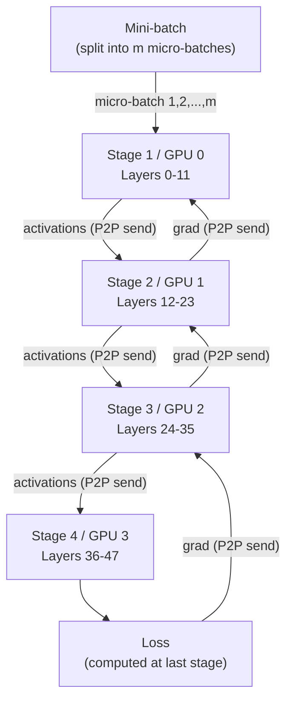

# 🏭 Pipeline Parallelism

> [!abstract] TL;DR
> Pipeline parallelism splits a deep model's **layers into sequential stages** across GPUs, with each GPU responsible for one stage. The core challenge is the **pipeline bubble** — GPUs idle during startup and teardown. The solution is **micro-batches**: split each mini-batch into smaller pieces and keep all stages busy simultaneously. The 1F1B (One Forward One Backward) schedule from PipeDream-Flush dramatically reduces memory vs GPipe's "all-forward then all-backward" approach. Pipeline parallelism is the standard inter-node parallelism for frontier LLM training (Megatron-LM, DeepSpeed).

## Intuition — Analogy First

Picture a **car manufacturing assembly line** — the canonical pipeline example.

Each **station** (GPU stage) specialises in one part of the build:
- Station 1: Chassis assembly
- Station 2: Engine installation
- Station 3: Interior fitting
- Station 4: Paint and quality check

If you're building just one car, stations 2–4 sit idle while station 1 works. That's naive model parallelism (one GPU busy at a time).

**Micro-batches fix this**: while station 4 is painting **car #1**, station 3 is fitting the interior of **car #2**, station 2 is installing the engine of **car #3**, and station 1 is assembling the chassis of **car #4**. Four cars simultaneously in production — near 100% utilisation.

The remaining inefficiency is the **pipeline bubble**: at the start, you must wait for car #1 to reach station 4 before the pipeline is full; at the end, after the last car is sent to station 2, station 1 has nothing to do. This bubble fraction shrinks as you process more cars (mini-batches are larger relative to stages).

## How It Works

### Pipeline Stages



### GPipe vs PipeDream-Flush (1F1B)

**GPipe** (Google, 2018):
- All $m$ micro-batches complete forward pass first.
- Then all $m$ micro-batches complete backward pass.
- Memory: $O(p + m)$ — must store activations for ALL micro-batches until backward starts.
- Bubble fraction: $(p-1)/(m+p-1)$

**1F1B (One Forward One Backward)** — PipeDream-Flush, Megatron-LM default:
- After the pipeline fills (warmup phase: $p-1$ micro-batches), alternate 1 forward + 1 backward.
- Memory: $O(p)$ — only keeps activations for $p$ micro-batches (the warmup) instead of $m$.
- Same bubble fraction as GPipe.
- Standard for all production LLM training.

**Schedule diagram** for 4 stages, 8 micro-batches:

```
Stage 0: F0 F1 F2 F3 | B3 F4 B4 F5 B5 F6 B6 F7 B7 | B0 B1 B2
Stage 1:    F0 F1 F2 | F3 B3 F4 B4 F5 B5 F6 B6 F7 | B7 B0 B1 B2
Stage 2:       F0 F1 | F2 F3 B3 F4 B4 F5 B5 F6 B6 | B6 B7 B0 B1 B2
Stage 3:          F0 | F1 F2 F3 B3 F4 B4 F5 B5 F6 | B5 B6 B7 B0 B1 B2
(F=Forward, B=Backward, |=steady state boundaries)
```

The gap at start and end is the bubble.

### Virtual Pipeline Stages (Interleaved)

Megatron-LM extension: instead of consecutive layers in a stage, assign **interleaved chunks** to each GPU:

```
GPU 0: layers 0-3, 16-19   (not consecutive)
GPU 1: layers 4-7, 20-23
GPU 2: layers 8-11, 24-27
GPU 3: layers 12-15, 28-31
```

This reduces bubble fraction by the virtual stage factor $v$ but doubles inter-stage communication. For large models, the memory and compute savings outweigh the communication overhead.

## The Math

**Pipeline bubble fraction** — fraction of total compute time wasted in the bubble:

$$\text{Bubble fraction} = \frac{p - 1}{m + p - 1}$$

where $p$ = number of pipeline stages, $m$ = number of micro-batches.

**To achieve ≤ 5% bubble**: need $m \geq 19(p-1)$. For 8 stages: $m \geq 133$ micro-batches.

**For interleaved schedule** with $v$ virtual stages per GPU:

$$\text{Bubble fraction (interleaved)} = \frac{1}{v} \cdot \frac{p - 1}{m + p - 1}$$

**Memory savings of 1F1B vs GPipe**: 1F1B needs activations for $p$ micro-batches (warmup); GPipe needs $m$. For $m \gg p$:

$$\text{Memory ratio} = \frac{p}{m}$$

With $p = 8$ stages and $m = 128$ micro-batches: 1F1B uses 16× less activation memory.

## Code Demo

```python
import torch
import torch.nn as nn
from torch.distributed.pipeline.sync import Pipe

# ── PyTorch Pipe: built-in pipeline parallelism ───────────────────
# Requires RPC (Remote Procedure Call) backend
import torch.distributed.rpc as rpc

def setup_rpc(rank, world_size):
    rpc.init_rpc(
        f"worker{rank}",
        rank=rank,
        world_size=world_size,
    )

# ── Define a pipelined model ──────────────────────────────────────
# Pipe requires nn.Sequential; each partition is placed on a device
def build_pipeline_model(num_gpus: int = 4):
    model = nn.Sequential(
        # Stage 0 (GPU 0): layers 0-5
        nn.Linear(1024, 2048), nn.ReLU(),
        nn.Linear(2048, 2048), nn.ReLU(),
        nn.Linear(2048, 2048), nn.ReLU(),
        # Stage 1 (GPU 1): layers 6-11
        nn.Linear(2048, 2048), nn.ReLU(),
        nn.Linear(2048, 2048), nn.ReLU(),
        nn.Linear(2048, 2048), nn.ReLU(),
        # Stage 2 (GPU 2): layers 12-17
        nn.Linear(2048, 2048), nn.ReLU(),
        nn.Linear(2048, 2048), nn.ReLU(),
        nn.Linear(2048, 2048), nn.ReLU(),
        # Stage 3 (GPU 3): layers 18-20
        nn.Linear(2048, 1024), nn.ReLU(),
        nn.Linear(1024, 256),
    )

    # Wrap with Pipe; chunks=micro-batches
    model = Pipe(model, chunks=8)  # 8 micro-batches
    return model

# ── Micro-batch scheduling with manual pipeline ───────────────────
class ManualPipelineStage(nn.Module):
    """Simplified 1F1B-style pipeline stage."""
    def __init__(self, layers, stage_id: int, num_stages: int):
        super().__init__()
        self.layers = layers
        self.stage_id = stage_id
        self.num_stages = num_stages
        self.device = torch.device(f"cuda:{stage_id}")
        self.layers = self.layers.to(self.device)

        # Queue for activations (from previous stage) and gradients
        self.input_queue = []

    def forward(self, x: torch.Tensor) -> torch.Tensor:
        return self.layers(x.to(self.device))

# ── Megatron-style pipeline schedule (conceptual) ─────────────────
def megatron_1f1b_schedule(pipeline_stages, micro_batches):
    """
    1F1B schedule:
    1. Warmup: forward pass for the first (num_stages) micro-batches
    2. Steady state: alternate 1 forward + 1 backward
    3. Cooldown: remaining backward passes
    """
    num_stages = len(pipeline_stages)
    m = micro_batches
    forward_activations = {}  # store for backward pass

    # Warmup: fill the pipeline
    for mb_id in range(num_stages - 1):
        act = run_forward(pipeline_stages, mb_id)
        forward_activations[mb_id] = act

    # Steady state: 1F1B
    for mb_id in range(num_stages - 1, m):
        act = run_forward(pipeline_stages, mb_id)
        forward_activations[mb_id] = act
        # Immediately trigger backward for the oldest held activation
        run_backward(pipeline_stages, mb_id - (num_stages - 1), forward_activations)

    # Cooldown: remaining backwards
    for mb_id in range(m - (num_stages - 1), m):
        run_backward(pipeline_stages, mb_id, forward_activations)

# ── Bubble fraction calculation ───────────────────────────────────
def pipeline_efficiency(num_stages: int, micro_batches: int) -> float:
    bubble = (num_stages - 1) / (micro_batches + num_stages - 1)
    efficiency = 1.0 - bubble
    print(f"Stages: {num_stages}, Micro-batches: {micro_batches}")
    print(f"Bubble fraction: {bubble:.2%}, Efficiency: {efficiency:.2%}")
    return efficiency

pipeline_efficiency(4, 8)    # → ~63% efficiency
pipeline_efficiency(4, 32)   # → ~89% efficiency
pipeline_efficiency(8, 128)  # → ~95% efficiency
```

## Real-World Example

**Megatron-LM training of GPT-3 175B** (NVIDIA, SC'21) is the seminal example of production pipeline parallelism.

- **Configuration**: 8 pipeline stages × 8 tensor parallel × 64 data parallel = 4,096 A100 GPUs.
- **Micro-batches**: 128 per global batch.
- **Bubble fraction**: $(8-1)/(128+8-1) = 5.1\%$ — acceptable efficiency.
- **1F1B schedule**: each pipeline stage holds activations for only 8 micro-batches (warmup size = num_stages) rather than 128 — 16× memory savings vs GPipe.
- **Interleaved schedule**: by assigning virtual stages, the bubble fraction drops to ~1.3%, at the cost of 2× communication.
- **Result**: demonstrated 502 petaFLOP/s sustained on 3,072 A100s — 52% MFU (Model FLOP Utilisation).

## Trade-offs

| Approach | Bubble Fraction | Memory (activations) | Communication | Complexity |
|---|---|---|---|---|
| Naive (no micro-batches) | $(p-1)/p$ | O(1) per stage | P2P | Low |
| GPipe | $(p-1)/(m+p-1)$ | O(m) per stage | P2P | Moderate |
| 1F1B | $(p-1)/(m+p-1)$ | O(p) per stage | P2P | Moderate |
| Interleaved 1F1B | $(p-1)/(vm+p-1)$ | O(p) per stage | $v$× P2P | High |

## When to Use vs Avoid

**Use pipeline parallelism when:**
- Model is too large for tensor parallelism alone (requires many nodes)
- Network between nodes is InfiniBand (high latency; P2P transfers are more tolerant than synchronous all-reduce)
- Model has many layers of similar compute cost (balanced stages are critical)

**Avoid pipeline parallelism when:**
- Single node with NVLink — tensor parallelism is preferable (no bubble, synchronous)
- Model layers are highly unequal in size — load imbalance causes some stages to stall
- Low-latency inference — pipeline adds per-token latency proportional to number of stages

## Common Pitfalls

1. **Unbalanced pipeline stages**: if GPU 2 is 50% slower than others, all GPUs wait for it every pass. Profile layer FLOPs and balance carefully.
2. **Too few micro-batches**: with $p = 8$ stages and $m = 8$ micro-batches, bubble fraction = 47%. Use $m \geq 4p$ as a minimum.
3. **Gradient accumulation interoperability**: combining DDP gradient accumulation (`model.no_sync()`) with pipeline micro-batches requires careful ordering — they are separate mechanisms.
4. **Checkpoint recovery from pipeline failure**: if one rank crashes mid-pipeline, in-flight activations are lost. Use checkpointing at stage boundaries.
5. **Forgetting `torch.cuda.synchronize()` at stage boundaries**: async P2P transfers can race against subsequent computations if not properly synchronised.

## Related Concepts

- [[_MOC_Infrastructure|↑ Section MOC]]

- [[Model_Parallelism]] — the broader context for pipeline as one strategy
- [[Tensor_Parallelism]] — the complementary intra-layer strategy
- [[Distributed_Training_Overview]] — how all three parallelisms combine
- [[DeepSpeed_ZeRO]] — shards memory; often used with pipeline parallelism
- [[Mixed_Precision_Training]] — reduces activation memory at each stage

## Review Questions

1. A model with 32 pipeline stages uses 64 micro-batches. Calculate the pipeline bubble fraction. How many micro-batches would be needed to halve the bubble fraction?
2. Explain why 1F1B uses O(p) activation memory while GPipe uses O(m). Walk through the first 5 steps of a 3-stage, 6-micro-batch 1F1B schedule.
3. You are choosing between tensor parallelism and pipeline parallelism for connecting 16 GPUs across 2 nodes (8 per node, NVLink within node, 200GB/s InfiniBand between nodes). Describe the optimal placement and the reasoning behind it.

## Sources

- Huang et al., "GPipe: Efficient Training of Giant Neural Networks using Pipeline Parallelism" (NeurIPS 2019)
- Narayanan et al., "PipeDream: Generalized Pipeline Parallelism for DNN Training" (SOSP 2019)
- Narayanan et al., "Efficient Large-Scale Language Model Training on GPU Clusters Using Megatron-LM" (SC21)
- PyTorch Pipe documentation: https://pytorch.org/docs/stable/pipeline.html

#pipeline-parallelism #distributed-training #infrastructure #megatron #gpipe #1f1b
