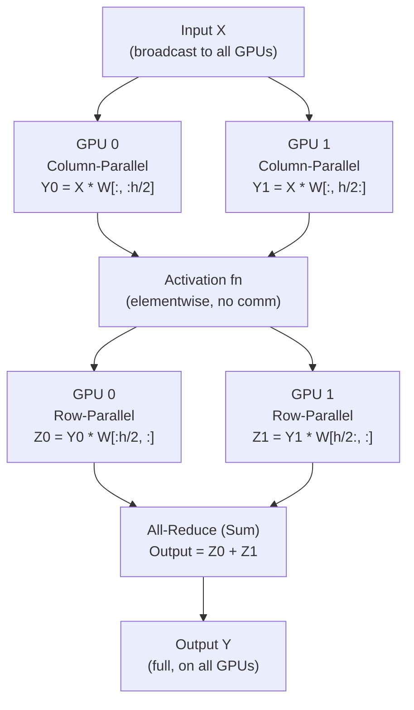

# ✂️ Tensor Parallelism

> [!abstract] TL;DR
> Tensor parallelism (TP) splits **individual operations** — specifically large matrix multiplications — across multiple GPUs simultaneously. Unlike pipeline parallelism (which splits layers sequentially), all TP GPUs work in parallel on the *same layer*. Invented by Megatron-LM (Shoeybi et al., 2019), the key insight is that a transformer's MLP and attention blocks can be split into column-parallel and row-parallel linear layers with only **one all-reduce per transformer block** rather than per-operation. TP requires tight synchronisation (every all-reduce must complete before the next operation) and is therefore constrained to devices connected by NVLink (within a node).

## Intuition — Analogy First

Imagine splitting a massive **spreadsheet calculation across multiple calculators simultaneously**.

You need to multiply a giant matrix A (100,000 rows × 100,000 columns) by matrix B. One calculator would take an hour. Instead, you give Calculator 1 the first 25,000 columns of A and Calculator 2 the next 25,000, etc. Each calculator processes its slice simultaneously. Then you combine (concatenate or sum) the partial results.

The catch: every calculator needs to see the full input matrix A to do its part. And at the end, all calculators must exchange their partial results before anyone can start the next step. This synchronisation — the "combine results" step — is the all-reduce, and it requires a very fast connection between calculators (NVLink).

A slow connection (InfiniBand between nodes) would mean each calculator waits more time passing notes than actually computing. That's why tensor parallelism lives *within* a single node.

## How It Works

### Column-Parallel and Row-Parallel Linear Layers

The core of transformer blocks is: two linear projections in the MLP, and the Q/K/V + output projections in attention. Megatron-LM splits these using two complementary strategies:

**Column-parallel linear** (split weight columns):
- Weight $W \in \mathbb{R}^{d \times h}$ split column-wise: $W = [W_1 | W_2]$ where $W_i \in \mathbb{R}^{d \times h/2}$
- Each GPU receives full input $X$ (via broadcast at start or identity op)
- GPU $i$ computes $Y_i = X W_i \in \mathbb{R}^{b \times h/2}$
- No communication needed within this layer; outputs are split

**Row-parallel linear** (split weight rows):
- Input $X$ is already split column-wise from previous column-parallel layer: $X = [X_1 | X_2]$
- Weight $W \in \mathbb{R}^{h \times d}$ split row-wise: $W^T = [W_1^T; W_2^T]$ where $W_i \in \mathbb{R}^{h/2 \times d}$
- Each GPU computes partial sum: $Z_i = X_i W_i \in \mathbb{R}^{b \times d}$
- **All-reduce** (sum): $Y = Z_1 + Z_2$ — only here does communication happen



### Attention Head Parallelism

For multi-head attention, TP splits heads across GPUs naturally:

- $Q, K, V$ projections: column-parallel (each GPU computes a subset of heads)
- Attention computation: fully local per GPU (no communication — heads are independent)
- Output projection: row-parallel (all-reduce to combine)

For $H$ heads split across $t$ GPUs: each GPU handles $H/t$ heads. Communication: 1 all-reduce per attention layer.

### Sequence Parallelism (Megatron Extension)

For non-tensor-parallel parts (LayerNorm, Dropout): partition the **sequence dimension** across TP ranks instead. Requires all-gather before column-parallel and reduce-scatter after row-parallel — replaces all-reduce with two smaller operations, slightly reducing peak communication bandwidth.

## The Math

**Column-parallel split**:

$$Y = XW = X[W_1 \| W_2] = [XW_1 \| XW_2]$$

Each GPU $i$ computes $Y_i = XW_i$. No communication.

**Row-parallel split**:

$$Y = XW = [X_1 \| X_2] \begin{bmatrix} W_1 \\ W_2 \end{bmatrix} = X_1 W_1 + X_2 W_2$$

Each GPU $i$ computes $Z_i = X_i W_i$. All-reduce sum: $Y = \sum_i Z_i$.

**Communication volume per transformer block** (forward + backward):

$$\text{Bytes} = 4 \times \frac{t-1}{t} \times s \times h \times 2 \approx 4 \times s \times h \times 2$$

where $t$ = TP degree, $s$ = sequence length, $h$ = hidden dim, factor 4 = (2 all-reduces × 2 for fwd+bwd). For $s=4096$, $h=8192$: $\approx 537\text{MB}$ per transformer layer per step.

**Memory reduction with TP degree $t$**:

$$M_\text{per GPU} = \frac{M_\text{weights} + M_\text{activations}}{t}$$

(approximately, activations scale with sequence length not TP degree if sequence parallelism is used)

## Code Demo

```python
import torch
import torch.nn as nn
import torch.distributed as dist

# ── Illustrative Column-Parallel Linear (2-GPU version) ──────────
class ColumnParallelLinear(nn.Module):
    """
    Weight W is split column-wise across `world_size` GPUs.
    Input X is replicated. Output is split.
    """
    def __init__(self, in_features: int, out_features: int, world_size: int, rank: int):
        super().__init__()
        assert out_features % world_size == 0
        self.out_per_rank = out_features // world_size
        self.rank = rank
        # Each rank only stores its slice of the weight
        self.weight = nn.Parameter(torch.empty(self.out_per_rank, in_features))
        nn.init.kaiming_uniform_(self.weight)

    def forward(self, x: torch.Tensor) -> torch.Tensor:
        # Input x is identical across all ranks (no communication needed)
        # Each rank computes its column slice
        return torch.nn.functional.linear(x, self.weight)
        # Output shape: (batch, out_per_rank) — already split

class RowParallelLinear(nn.Module):
    """
    Weight W is split row-wise. Input is split. Output needs all-reduce.
    """
    def __init__(self, in_features: int, out_features: int, world_size: int):
        super().__init__()
        assert in_features % world_size == 0
        self.in_per_rank = in_features // world_size
        # Each rank stores its slice of the weight rows
        self.weight = nn.Parameter(torch.empty(out_features, self.in_per_rank))
        nn.init.kaiming_uniform_(self.weight)

    def forward(self, x_split: torch.Tensor) -> torch.Tensor:
        # x_split is already the rank's input slice (from ColumnParallel output)
        partial_sum = torch.nn.functional.linear(x_split, self.weight)
        # All-reduce: sum partial results across all TP ranks
        dist.all_reduce(partial_sum, op=dist.ReduceOp.SUM)
        return partial_sum  # now full output, identical on all ranks

# ── Megatron-style MLP block ─────────────────────────────────────
class TensorParallelMLP(nn.Module):
    """
    Full Megatron-LM style tensor-parallel MLP.
    One all-reduce per forward pass.
    """
    def __init__(self, hidden_dim: int, ffn_dim: int, world_size: int, rank: int):
        super().__init__()
        self.col_linear = ColumnParallelLinear(hidden_dim, ffn_dim, world_size, rank)
        self.act = nn.GELU()
        self.row_linear = RowParallelLinear(ffn_dim, hidden_dim, world_size)

    def forward(self, x: torch.Tensor) -> torch.Tensor:
        # Column-parallel: no comm, output is split
        y = self.col_linear(x)
        y = self.act(y)
        # Row-parallel: 1 all-reduce at the end
        out = self.row_linear(y)
        return out

# ── Using Megatron-Core in practice ──────────────────────────────
# Install: pip install megatron-core
# from megatron.core import tensor_parallel
# from megatron.core.tensor_parallel import ColumnParallelLinear, RowParallelLinear
#
# These handle:
# - Sequence parallelism (partition sequence dim)
# - Gradient accumulation
# - Async all-reduce (overlap with compute)
# - FP8 / BF16 support

# ── Memory and efficiency analysis ───────────────────────────────
def tensor_parallel_analysis(hidden_dim: int, ffn_dim: int, seq_len: int, tp_degree: int):
    bytes_per_param = 2  # BF16

    # Weight memory per GPU
    mlp_weights = 2 * hidden_dim * ffn_dim * bytes_per_param  # 2 linear layers
    mlp_per_gpu = mlp_weights / tp_degree
    print(f"MLP weights full: {mlp_weights/1e9:.2f}GB, per GPU (TP={tp_degree}): {mlp_per_gpu/1e9:.3f}GB")

    # Communication per forward (1 all-reduce)
    all_reduce_bytes = 2 * (tp_degree - 1) / tp_degree * seq_len * hidden_dim * bytes_per_param
    print(f"All-reduce per layer: {all_reduce_bytes/1e6:.1f}MB")
    print(f"At NVLink 900GB/s: {all_reduce_bytes/900e9*1000:.3f}ms")

tensor_parallel_analysis(8192, 28672, 4096, tp_degree=8)
# LLaMA-3 70B FFN dims; 8-GPU TP within a node
```

## Real-World Example

**All frontier LLMs** use tensor parallelism for training and inference at scale:

- **GPT-3 175B** (OpenAI, 2020): 8-way TP across 8 A100s per node, 8 V100 NVLink per node previously. First production use of Megatron-LM TP.
- **PaLM 540B** (Google, 2022): 12-way TP on TPU v4 pods (TPUs use a similar mesh parallelism concept).
- **LLaMA-3 70B** (Meta, 2024): 8-way TP within each H100 node. At 8192 hidden dim and BF16, each MLP weight is 428MB; each GPU holds 53.5MB. Communication: ~134MB per MLP layer per forward pass. At NVLink 900 GB/s: ~0.15ms per layer — negligible.

**Serving LLaMA-3 70B** requires 8× H100 GPUs even for inference. With 8-way TP, prefill (prompt processing) is compute-bound and scales nearly linearly. Decode (token generation) is memory-bandwidth-bound and has sublinear TP scaling — at decode, the bottleneck is loading weights from HBM, not compute, so adding more GPUs helps less.

## Trade-offs

| Aspect | Advantage | Disadvantage |
|---|---|---|
| Compute efficiency | All GPUs active simultaneously (no bubble) | Only 1 all-reduce latency overhead per block |
| Memory reduction | Weight memory / TP degree | Must reconstruct full output before next layer |
| Communication | Minimal (1 all-reduce per block) | Must complete before next op — synchronous! |
| Hardware requirement | NVLink (within node) | Cannot span slow inter-node networks |
| Scaling | Excellent up to TP=8 (within node) | Diminishing returns beyond 1 node |
| Code complexity | Moderate (Megatron handles it) | Custom ops require careful split/gather logic |

## When to Use vs Avoid

**Use tensor parallelism when:**
- Model layers (especially FFN with large $d_{ff}$) are too wide for one GPU
- Multiple GPUs are connected via NVLink (within a node, 8 GPUs typically)
- You need low-latency inference (no pipeline bubble)

**Combine with pipeline parallelism when:**
- Model exceeds a single node's capacity
- Standard: 8-way TP per node, N-way pipeline across nodes

**Avoid tensor parallelism when:**
- GPUs connected via PCIe or slow InfiniBand (communication overhead dominates)
- Model fits comfortably on one GPU (simpler DDP is sufficient)
- Beyond TP=8 within a node (communication doesn't scale)

## Common Pitfalls

1. **Placing TP ranks across nodes**: TP's synchronous all-reduce at every layer creates a tight latency dependency. InfiniBand at 200GB/s vs NVLink at 900GB/s → 4.5× slower — often becomes the bottleneck.
2. **Forgetting dropout seed synchronisation**: after an all-reduce, all ranks have identical outputs. If they then apply dropout with different seeds, the results diverge. Use a TP-group-synchronised RNG.
3. **Incorrect bias handling**: in column-parallel linear, bias is only added on one GPU (or averaged) — adding it on all GPUs doubles the bias contribution. Megatron handles this correctly; custom implementations often get it wrong.
4. **Numerical differences vs non-TP baseline**: row-parallel all-reduce with floating-point associativity can produce slightly different results vs a non-parallelised baseline. Use this as a feature (expected) not a bug, but document the tolerance.
5. **TP + activation checkpointing interaction**: recomputing activations during backward in a TP setup requires re-running the all-reduces. This doubles communication for checkpointed layers — budget carefully.

## Related Concepts

- [[_MOC_Infrastructure|↑ Section MOC]]

- [[Model_Parallelism]] — the broader context; tensor parallelism is one flavour
- [[Pipeline_Parallelism]] — the complementary inter-layer strategy
- [[Distributed_Training_Overview]] — how TP + PP + DP combine
- [[Flash_Attention]] — attention computation that TP works alongside
- [[GPU_Architecture_Basics]] — NVLink bandwidth that makes TP feasible

## Review Questions

1. Explain why tensor parallelism cannot efficiently span multiple nodes connected by InfiniBand, while pipeline parallelism can. What property of each strategy's communication pattern determines this constraint?
2. In a column-parallel linear layer followed by a row-parallel linear layer, how many all-reduces are required in the forward pass? In the backward pass? Describe what is communicated in each.
3. LLaMA-3 70B has hidden dim $h = 8192$ and FFN dim $d_{ff} = 28672$. With 8-way tensor parallelism, calculate the weight memory per GPU for the FFN layers (assuming BF16). How many layers can fit in 80GB VRAM (leave 20GB for activations)?

## Sources

- Shoeybi et al., "Megatron-LM: Training Multi-Billion Parameter Language Models Using Model Parallelism" (2019)
- Narayanan et al., "Sequence Parallelism: Long Sequence Training from System Perspective" (2022)
- Korthikanti et al., "Reducing Activation Recomputation in Large Transformer Models" (2022)
- Megatron-Core documentation: https://github.com/NVIDIA/Megatron-LM

#tensor-parallelism #distributed-training #infrastructure #megatron #column-parallel #row-parallel
