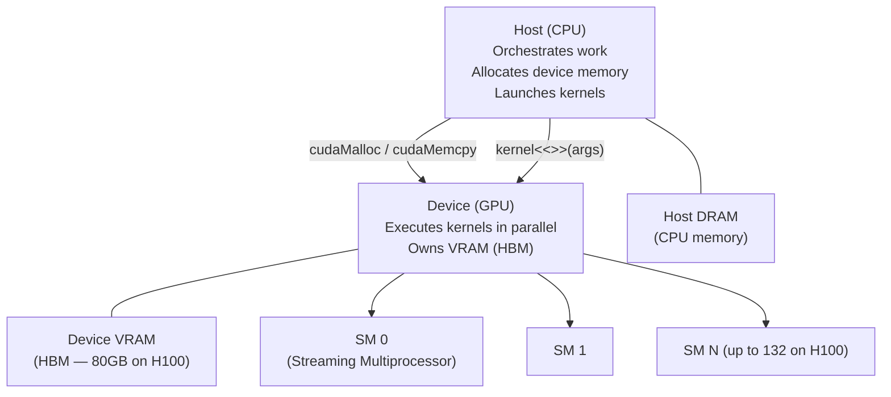

# ⚡ CUDA Fundamentals

> [!abstract] TL;DR
> CUDA is NVIDIA's parallel programming model that exposes GPU hardware to software. Code runs on the **host** (CPU) and dispatches **kernels** to the **device** (GPU), where threads are organised into a three-level hierarchy: thread → block → grid. Threads in the same block share fast on-chip memory and can synchronise; threads in different blocks cannot. The fundamental execution unit is a **warp** (32 threads) that executes in lockstep. ML frameworks hide CUDA, but understanding it explains why FlashAttention is 3× faster than naive attention, why small batch sizes underutilise GPUs, and how to diagnose performance bottlenecks.

## Intuition — Analogy First

Imagine commanding an army of synchronised soldiers.

- **Threads** are individual soldiers — each executes the same instruction (kernel) but on different data.
- **Blocks** are **platoons** — up to 1024 soldiers that share a communication radio (shared memory) and can coordinate with each other (`__syncthreads()`).
- **Grids** are **divisions** — many platoons deployed together, each platoon independent.
- **Warps** (32 threads) are **squads** — the atomic unit that moves together in lockstep. If half the squad needs to go left and half right, everyone waits — this is **warp divergence**.

Your job as a CUDA programmer is to:
1. Decompose the problem so every soldier has useful work.
2. Stage supplies (data) in the shared radio cache (shared memory) before the operation begins.
3. Avoid having squads split at conditional branches.

ML frameworks (PyTorch, JAX) handle this for standard operations, but hand-written kernels (FlashAttention, custom activations) can exploit these details for 5–10× speedups.

## How It Works

### Host/Device Execution Model



### Thread / Block / Grid Hierarchy

A kernel launch specifies how many blocks and threads to use:

```
kernel<<<grid_dim, block_dim>>>(args)
```

- **`block_dim`**: threads per block (up to 1024). Threads in a block share shared memory and can sync.
- **`grid_dim`**: number of blocks. Can be 1D, 2D, or 3D for natural indexing into matrices/volumes.
- Each thread computes its global index: `int idx = blockIdx.x * blockDim.x + threadIdx.x`

**Why blocks?** Shared memory is on-chip per-SM — all threads in a block run on the same SM and access the same pool. Blocks across different SMs have no shared memory.

### Warp Execution and Divergence

- A **warp** = 32 consecutive threads that execute the same instruction simultaneously (SIMD).
- **Warp divergence**: if threads in a warp follow different branches (`if/else`), the GPU serialises both branches, with inactive threads masked out. Divergence halves throughput in the worst case.
- **Warp latency hiding**: when a warp stalls waiting for memory, the SM instantly switches to a ready warp — this is the GPU's primary mechanism for hiding memory latency (not caching).

### Memory Types

| Memory | Scope | Speed | Lifetime | Explicit Control |
|---|---|---|---|---|
| Registers | Per thread | Fastest (~0 cycles) | Kernel | No (compiler assigns) |
| Shared memory | Per block | ~33 TB/s (H100) | Kernel | Yes (`__shared__`) |
| L1/L2 cache | Per SM / global | ~12 TB/s | Automatic | Hints only |
| Global (HBM) | All threads | 3.35 TB/s | Application | Yes (`cudaMalloc`) |
| Constant | All threads (read-only) | Cached | Kernel launch | Yes |

**The golden rule**: move data from global memory to shared memory once, do many operations, write back once. This is exactly what FlashAttention does for the Q/K/V matrices.

### Occupancy

Occupancy = active warps / maximum warps per SM. Higher occupancy → better latency hiding.

Limited by:
1. **Registers per thread** (each SM has 256KB register file)
2. **Shared memory per block** (each SM has 228KB on H100)
3. **Block size** (too small = not enough warps; too large = register pressure)

## The Math

**Global memory index for a 2D matrix** of shape (M, N):

$$\text{row} = \text{blockIdx.y} \times \text{blockDim.y} + \text{threadIdx.y}$$
$$\text{col} = \text{blockIdx.x} \times \text{blockDim.x} + \text{threadIdx.x}$$
$$\text{linear\_idx} = \text{row} \times N + \text{col}$$

**Occupancy formula**:

$$\text{Occupancy} = \frac{\text{warps\_per\_block} \times \text{blocks\_per\_SM}}{\text{max\_warps\_per\_SM}}$$

where $\text{blocks\_per\_SM} = \min\!\left(\frac{\text{shared\_mem\_per\_SM}}{\text{shared\_mem\_per\_block}},\; \frac{\text{regs\_per\_SM}}{\text{regs\_per\_thread} \times \text{threads\_per\_block}}\right)$

**Memory bandwidth utilisation** for a coalesced access:

$$\text{BW}_\text{effective} = \frac{\text{bytes accessed (no duplication)}}{\text{kernel wall time}}$$

Coalesced = consecutive threads access consecutive memory addresses → single cache line fetch. Non-coalesced = N separate fetches = N× slower.

## Code Demo

```python
# ── CuPy: Python with CUDA-level custom kernels ───────────────────
import cupy as cp
import numpy as np

# Write a CUDA kernel in Python with CuPy's RawKernel
# Simple elementwise ReLU — for illustration
relu_kernel = cp.RawKernel(r'''
extern "C" __global__
void relu(const float* input, float* output, int n) {
    int idx = blockIdx.x * blockDim.x + threadIdx.x;
    if (idx < n) {
        output[idx] = input[idx] > 0.0f ? input[idx] : 0.0f;
    }
}
''', 'relu')

n = 1_000_000
x_gpu = cp.random.randn(n, dtype=cp.float32)
y_gpu = cp.zeros(n, dtype=cp.float32)

threads_per_block = 256
blocks = (n + threads_per_block - 1) // threads_per_block

relu_kernel((blocks,), (threads_per_block,), (x_gpu, y_gpu, n))
cp.cuda.stream.get_current_stream().synchronize()

print(f"Max diff vs cp.maximum: {cp.abs(y_gpu - cp.maximum(x_gpu, 0)).max()}")

# ── Numba: JIT-compiled CUDA kernels in pure Python ───────────────
from numba import cuda
import numpy as np

@cuda.jit
def vector_add_kernel(a, b, c):
    idx = cuda.grid(1)          # shorthand for blockIdx.x * blockDim.x + threadIdx.x
    if idx < a.size:
        c[idx] = a[idx] + b[idx]

N = 1_000_000
a = np.random.randn(N).astype(np.float32)
b = np.random.randn(N).astype(np.float32)
c = np.zeros(N, dtype=np.float32)

d_a = cuda.to_device(a)   # host → device copy
d_b = cuda.to_device(b)
d_c = cuda.device_array(N, dtype=np.float32)

TPB = 256
BPG = (N + TPB - 1) // TPB
vector_add_kernel[BPG, TPB](d_a, d_b, d_c)  # launch kernel

result = d_c.copy_to_host()                   # device → host copy
print(f"Max diff vs numpy: {np.abs(result - (a + b)).max()}")

# ── Tiled matrix multiply using shared memory (Numba) ─────────────
TILE = 16

@cuda.jit
def tiled_matmul(A, B, C):
    tile_A = cuda.shared.array(shape=(TILE, TILE), dtype=np.float32)
    tile_B = cuda.shared.array(shape=(TILE, TILE), dtype=np.float32)

    row, col = cuda.grid(2)
    tx, ty = cuda.threadIdx.x, cuda.threadIdx.y
    acc = np.float32(0.0)

    for tile_idx in range((A.shape[1] + TILE - 1) // TILE):
        # Load tile into shared memory
        if row < A.shape[0] and tile_idx * TILE + ty < A.shape[1]:
            tile_A[tx, ty] = A[row, tile_idx * TILE + ty]
        else:
            tile_A[tx, ty] = 0.0
        if col < B.shape[1] and tile_idx * TILE + tx < B.shape[0]:
            tile_B[tx, ty] = B[tile_idx * TILE + tx, col]
        else:
            tile_B[tx, ty] = 0.0

        cuda.syncthreads()   # wait for all threads to finish loading

        for k in range(TILE):
            acc += tile_A[tx, k] * tile_B[k, ty]

        cuda.syncthreads()   # wait before loading next tile

    if row < C.shape[0] and col < C.shape[1]:
        C[row, col] = acc

# ── Memory transfer patterns: avoid in hot path ──────────────────
import torch

device = torch.device("cuda")
x = torch.randn(1000, device=device)

# BAD: forces CPU-GPU sync, ~100µs penalty each call
loss_value = x.sum().item()   # do NOT do this in a training loop

# GOOD: keep on GPU, only transfer at the end
loss_tensor = x.sum()         # stays on GPU until .item()
```

## Real-World Example

**FlashAttention** (Dao et al., 2022) is the canonical example of CUDA expertise producing dramatic gains over the "obvious" implementation.

Standard attention: $O = \text{softmax}(QK^T / \sqrt{d})V$

Naive implementation: materialises the full $N \times N$ attention matrix in HBM — $O(N^2)$ memory, $O(N^2)$ HBM reads/writes. For N=4096, d=128, FP16: ~4GB per attention layer per forward pass.

FlashAttention insight: split Q, K, V into tiles that fit in SRAM (shared memory), compute softmax incrementally using the online softmax trick, never materialise the full N×N matrix in HBM.

- **Result**: 3× faster than PyTorch standard attention, 5–20× less memory, exact (not approximate).
- **Why possible**: the arithmetic intensity of attention is high enough to be compute-bound in shared memory, but memory-bound when materialising to HBM. The CUDA kernel exploits this by never leaving SRAM.

This is why understanding CUDA matters — PyTorch's `F.scaled_dot_product_attention()` calls FlashAttention under the hood, and you need CUDA knowledge to understand why `torch.backends.cuda.enable_flash_sdp(True)` matters.

## Trade-offs

| Dimension | Benefit | Cost |
|---|---|---|
| Custom kernels | 5–20× speedup for specific ops | Weeks of development; hard to debug |
| Shared memory tiling | Hides HBM latency | Limited size (228KB/SM on H100) |
| Large block sizes | High occupancy, better warp utilisation | Register pressure, reduced blocks |
| Coalesced access | Full memory bus utilisation | Requires restructuring data layout |
| Warp divergence avoidance | 2× throughput | Algorithmic changes needed |
| CUDA 12 features (e.g. TMA) | Higher bandwidth | Not exposed by frameworks |

## When to Use vs Avoid

**Learn/apply CUDA when:**
- Profiling reveals a framework op is a bottleneck and no optimised library version exists
- Implementing a novel operation (custom attention variant, sparse op) for a paper
- Deploying at scale where each µs of latency translates to server costs
- Debugging OOM or performance regressions in distributed training

**Use PyTorch/JAX primitives when:**
- Standard ops (GEMM, conv, attention) already have cuDNN/cuBLAS backing
- Prototyping — get correctness first, then optimise
- The bottleneck is data loading, not compute

## Common Pitfalls

1. **Forgetting `cuda.syncthreads()`** in shared memory kernels: reading a tile before all threads have finished writing it causes race conditions — often non-deterministic, very hard to debug.
2. **Non-coalesced global memory access**: if thread 0 reads index 0, thread 1 reads index 128, etc. (strided), each thread triggers a separate cache line fetch. Transpose your data layout or use shared memory as a staging buffer.
3. **Launching kernels with too few threads**: `<<<1, 32>>>` uses one SM with one warp; 131 other SMs sit idle. Scale grid dimensions to match the problem size.
4. **Implicit host–device synchronisation**: `cudaMemcpy` is synchronous by default. Use async variants (`cudaMemcpyAsync` with streams) for overlapping compute and transfer.
5. **Register spilling**: using too many local variables in a kernel overflows to slow local memory (in HBM, not registers). Check with `--ptxas-options=-v` in the compiler.

## Related Concepts

- [[_MOC_Infrastructure|↑ Section MOC]]

- [[GPU_Architecture_Basics]] — the hardware these kernels run on
- [[Flash_Attention]] — the most influential custom CUDA kernel in ML
- [[cuDNN]] — NVIDIA's library of pre-optimised CUDA primitives
- [[Mixed_Precision_Training]] — how FP16/BF16 kernels differ
- [[Distributed_Training_Overview]] — NCCL uses CUDA streams for collective ops

## Review Questions

1. A kernel is launched with `<<<256, 128>>>`. How many warps are active per block? What is the total number of threads? If each SM can run 2 blocks simultaneously, how many SMs are needed to run the full grid concurrently?
2. Explain why tiled matrix multiplication using shared memory is faster than a naive implementation. What specific hardware property does it exploit, and what synchronisation is required?
3. You profile a kernel and find it achieves only 20% of peak memory bandwidth. List three potential causes and how you would diagnose each using Nsight Compute.

## Sources

- NVIDIA CUDA C Programming Guide: https://docs.nvidia.com/cuda/cuda-c-programming-guide/
- Dao et al., "FlashAttention: Fast and Memory-Efficient Exact Attention with IO-Awareness" (NeurIPS 2022)
- CuPy documentation: https://docs.cupy.dev
- Numba CUDA documentation: https://numba.readthedocs.io/en/stable/cuda/
- Kirk & Hwu, "Programming Massively Parallel Processors" (4th ed., 2022)

#cuda #gpu #parallel-computing #infrastructure #kernels #shared-memory
