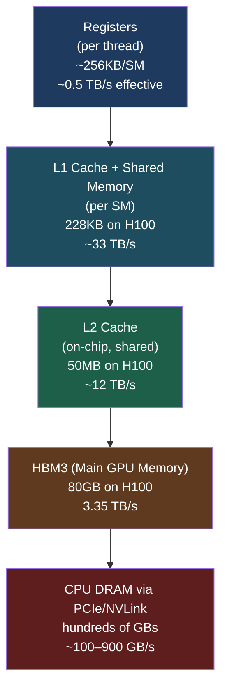

# 🖥️ GPU Architecture Basics

> [!abstract] TL;DR
> A GPU trades a few powerful CPU cores for thousands of simpler cores optimised for throughput. ML workloads are dominated by matrix multiplications — massively parallel, regular memory access — making them a natural fit. The critical bottleneck is almost always **memory bandwidth** (how fast data moves to compute units), not raw FLOP count. Understanding the memory hierarchy (registers → L1/L2 cache → HBM) and the role of Tensor Cores is essential for squeezing peak performance out of modern accelerators like the H100.

## Intuition — Analogy First

Think of a **CPU as a team of genius professors** and a **GPU as thousands of diligent students**.

A professor can tackle any complex problem independently — branch prediction, out-of-order execution, deep caches — but you only have 8 of them. When you need one very difficult answer, call a professor.

Students are simpler individually, but you have 10,000 of them. Hand each student a small part of a matrix multiplication and they finish the whole thing in parallel. Neural network training is exactly this: the same arithmetic operation applied across millions of values simultaneously. The students win every time.

The catch: students need their worksheets (data) delivered promptly. If the delivery van (memory bus) is slow, the students sit idle. This is why **memory bandwidth is the primary bottleneck**, not compute.

## How It Works

### CPU vs GPU Core Philosophy

| Dimension | CPU | GPU |
|---|---|---|
| Core count | 8–128 | 1,000–18,000+ |
| Core design | Complex (OOO, branch pred, deep cache) | Simple (in-order, wide SIMD) |
| Optimised for | Latency (fast single-thread) | Throughput (parallel SIMD) |
| Cache per core | Large (L1: 32–64KB, L3: MBs) | Small (L1: ~32KB shared) |
| Use case | Sequential logic, OS, control flow | Matrix ops, signal processing |

### Streaming Multiprocessor (SM)

The SM is the fundamental compute unit of an NVIDIA GPU. An H100 has 132 SMs. Each SM contains:

- **CUDA cores** — FP32 scalar ALUs (128 per SM on H100)
- **Tensor Cores** — dedicated matrix multiply-accumulate (MMA) units; operate on 4×4 tiles in FP16/BF16/INT8
- **Shared memory** — fast on-chip SRAM (228KB per SM on H100), programmer-controlled scratchpad
- **Register file** — fastest storage, 256KB per SM; each thread gets its own registers
- **Warp scheduler** — issues instructions to groups of 32 threads (a warp) simultaneously

### Memory Hierarchy



**Key insight**: bandwidth drops by ~10× at each level. Algorithms that reuse data in shared memory (e.g., tiled matrix multiplication, FlashAttention) dramatically outperform naive implementations that touch HBM on every access.

### Tensor Cores

Tensor Cores perform a fused D = A × B + C operation on small tiles (4×4 or 8×8 depending on generation) in a **single clock cycle**. This is roughly 8–16× faster than CUDA cores for matrix ops in FP16/BF16.

| Generation | GPU | Key Tensor Core Feature |
|---|---|---|
| Volta (V1) | V100 | FP16 MMA (first generation) |
| Ampere (V3) | A100 | BF16, TF32, INT8, sparsity (2:4) |
| Hopper (V4) | H100 | FP8, Transformer Engine (auto precision), 4th gen |

### H100 vs A100 Comparison

| Spec | A100 80GB | H100 80GB SXM |
|---|---|---|
| SMs | 108 | 132 |
| CUDA cores | 6,912 | 16,896 |
| BF16 TFLOPS | 312 | 989 |
| FP8 TFLOPS | — | 1,979 |
| HBM bandwidth | 2.0 TB/s (HBM2e) | 3.35 TB/s (HBM3) |
| NVLink bandwidth | 600 GB/s | 900 GB/s |
| TDP | 400W | 700W |

## The Math

**Roofline model** — determines whether a kernel is compute-bound or memory-bound:

$$\text{Attainable Performance} = \min\left(\text{Peak FLOPS},\; \text{Bandwidth} \times \text{Arithmetic Intensity}\right)$$

$$\text{Arithmetic Intensity} = \frac{\text{FLOPs}}{\text{Bytes accessed}}$$

For a naive GEMM (matrix multiply): AI = $\frac{2MNK}{2(MN + NK + MK) \times \text{bytes\_per\_element}}$. For large square matrices in FP16, AI ≈ N/2 — high intensity, compute-bound. For elementwise ops, AI ≈ 1 — memory-bound.

**Occupancy** — fraction of maximum concurrent warps:

$$\text{Occupancy} = \frac{\text{Active Warps per SM}}{\text{Max Warps per SM}}$$

Low occupancy = memory latency not hidden = underutilised GPU.

## Code Demo

```python
import torch

# ── Basic GPU checks ──────────────────────────────────────────────
print(f"CUDA available: {torch.cuda.is_available()}")
print(f"GPU count: {torch.cuda.device_count()}")
print(f"GPU name: {torch.cuda.get_device_name(0)}")

props = torch.cuda.get_device_properties(0)
print(f"Total memory: {props.total_memory / 1e9:.1f} GB")
print(f"SMs: {props.multi_processor_count}")
print(f"Max threads per SM: {props.max_threads_per_multi_processor}")

# ── Memory management ─────────────────────────────────────────────
device = torch.device("cuda")

# Allocate on GPU directly (no CPU→GPU copy)
x = torch.randn(4096, 4096, device=device, dtype=torch.float16)

print(f"Allocated: {torch.cuda.memory_allocated() / 1e9:.2f} GB")
print(f"Reserved:  {torch.cuda.memory_reserved() / 1e9:.2f} GB")

# ── Bandwidth benchmark (elementwise vs GEMM) ─────────────────────
import time

def time_op(fn, n=20):
    torch.cuda.synchronize()
    start = time.perf_counter()
    for _ in range(n):
        fn()
    torch.cuda.synchronize()
    return (time.perf_counter() - start) / n

a = torch.randn(8192, 8192, device=device, dtype=torch.float16)
b = torch.randn(8192, 8192, device=device, dtype=torch.float16)

# GEMM — compute-bound (Tensor Cores)
gemm_time = time_op(lambda: torch.matmul(a, b))
flops = 2 * 8192**3
print(f"GEMM TFLOPS: {flops / gemm_time / 1e12:.1f}")

# Elementwise — memory-bound
ew_time = time_op(lambda: a + b)
bytes_moved = 3 * a.nelement() * 2  # 2 reads, 1 write, 2 bytes each
print(f"Elementwise bandwidth: {bytes_moved / ew_time / 1e12:.2f} TB/s")

# ── Cache the allocator to avoid fragmentation ────────────────────
torch.cuda.empty_cache()  # returns unused cached memory to CUDA pool
```

## Real-World Example

**NVIDIA H100 80GB SXM5** — the workhorse of frontier LLM training (2023–2025).

- **3.35 TB/s HBM3 bandwidth**: a single H100 can stream the entire 70B LLaMA weight matrix (~140GB in BF16) through its compute units in ~42ms — faster than a PCIe gen4 x16 slot can transfer 1GB.
- **Transformer Engine**: the H100's dedicated hardware automatically selects FP8 vs BF16 precision per layer with a learned scaling factor, doubling throughput vs A100 without manual precision tuning.
- **NVLink 4.0 (900 GB/s bidirectional)**: 8 H100s connected via NVSwitch achieve near-linear scaling up to 8 GPUs for transformer training — the all-reduce bottleneck only becomes critical at rack scale.
- **Practical implication**: training LLaMA-3 70B on 8× H100s in BF16 achieves ~400 TFLOPS/GPU sustained (vs 989 peak) — MFU of ~40%, limited by memory bandwidth during attention computation (solved by FlashAttention-3).

## Trade-offs

| Consideration | GPU Advantage | GPU Limitation |
|---|---|---|
| Throughput | 10–100× faster than CPU for matrix ops | Poor at sequential logic, branching |
| Memory capacity | HBM: 40–80GB per GPU (H100/A100) | CPU DRAM is cheaper per GB |
| Memory bandwidth | 3.35 TB/s (H100) vs 100 GB/s (CPU) | VRAM capacity is fixed |
| Power efficiency | Good FLOPS/watt for parallel workloads | 400–700W per card |
| Cost | Amortised over large training runs | $30k+ per H100 |
| Flexibility | Tensor Core acceleration for FP8–FP32 | Specialised; poor for control flow |
| Development | High-level via PyTorch/JAX | Custom kernels require CUDA expertise |

## When to Use vs Avoid

**Use GPUs when:**
- Operations are large matrix multiplications or convolutions
- Batch size allows adequate parallelism (≥ 32 samples or equivalent)
- The same operation is applied uniformly across many data points
- Training any model with >1M parameters

**Avoid or reconsider when:**
- Inference serving with batch size = 1 and tight latency constraints (consider CPU or specialised accelerators)
- Heavy conditional logic or irregular memory access patterns
- Data preprocessing pipelines (CPU + multiprocessing is typically faster per dollar)
- Total model size exceeds available VRAM and offloading is not viable

## Common Pitfalls

1. **Confusing FLOPS with bandwidth**: quoting peak TFLOPS without checking arithmetic intensity; most LLM inference is memory-bandwidth-bound, not compute-bound.
2. **Host–device copies in the critical path**: calling `.item()`, `.numpy()`, or `.cpu()` inside a training loop forces synchronisation and PCIe transfer — a ~100µs penalty per call.
3. **Memory fragmentation**: allocating/freeing tensors in a loop without `torch.cuda.empty_cache()` can cause OOM even when total usage is below capacity.
4. **Assuming FP32 is always safer**: BF16 has the same dynamic range as FP32 (8 exponent bits) and is the correct default for modern training; FP16 requires loss scaling.
5. **Ignoring occupancy**: small kernel launches (few threads) leave most SMs idle; batch your operations or use larger tiles.
6. **Not pinning CPU memory**: `pin_memory=True` in DataLoader enables async GPU transfers, often giving 20–30% higher throughput for I/O-bound training.

## Related Concepts

- [[_MOC_Infrastructure|↑ Section MOC]]

- [[CUDA_Fundamentals]] — the programming model that runs on these cores
- [[Distributed_Training_Overview]] — connecting multiple GPUs
- [[Mixed_Precision_Training]] — using FP16/BF16 to exploit Tensor Cores
- [[Flash_Attention]] — kernel that maximises use of on-chip shared memory
- [[DeepSpeed_ZeRO]] — memory management across multiple GPUs

## Review Questions

1. A matrix multiplication kernel achieves 800 TFLOPS on an H100 (peak 989 TFLOPS BF16). Is it compute-bound or memory-bound? Calculate the arithmetic intensity needed to be compute-bound on H100 given 3.35 TB/s bandwidth.
2. Explain why calling `.item()` inside a PyTorch training loop is harmful for GPU throughput. What synchronisation mechanism does it trigger?
3. A researcher reports that switching from FP32 to FP16 gave no speedup on a V100. What is the most likely reason? How does BF16 differ from FP16 in terms of numerical range?

## Sources

- NVIDIA H100 Tensor Core GPU Architecture Whitepaper (2022)
- NVIDIA A100 vs H100 Performance Comparison (GTC 2023)
- Williams et al., "Roofline: An Insightful Visual Performance Model" (2009)
- PyTorch CUDA semantics documentation: https://pytorch.org/docs/stable/notes/cuda.html
- Dao et al., "FlashAttention-2" (2023)

#gpu #hardware #infrastructure #cuda #memory-bandwidth #tensor-cores
