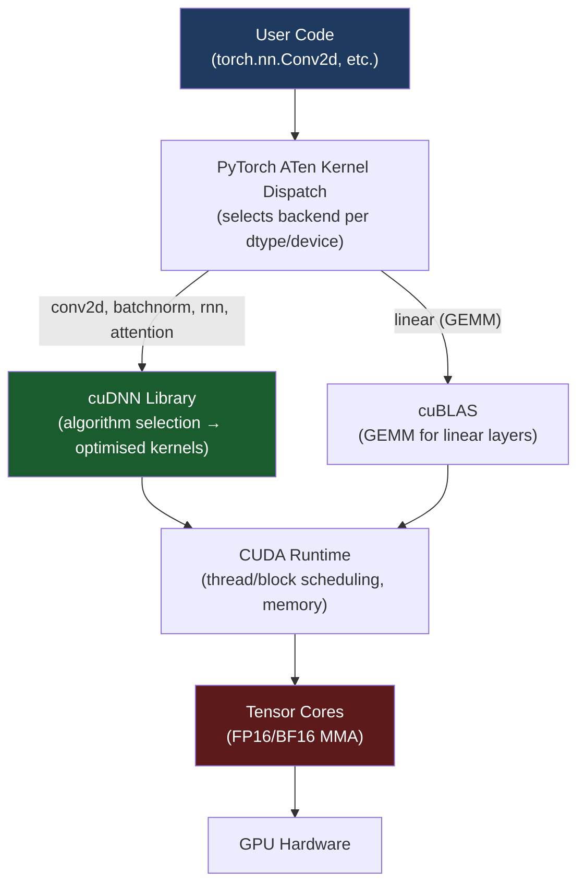

# 🔧 cuDNN

> [!abstract] TL;DR
> cuDNN (CUDA Deep Neural Network library) is NVIDIA's closed-source library of GPU-accelerated primitives for neural networks: convolutions, pooling, batch norm, RNNs, attention. PyTorch, TensorFlow, and MXNet all call cuDNN under the hood. Its superpower is **auto-algorithm selection** — at runtime it benchmarks multiple algorithm variants and picks the fastest for your specific input shape and GPU. Enabling `torch.backends.cudnn.benchmark = True` exposes this selection and can give 20–30% speedup for fixed-size inputs. The cost is non-determinism and a warmup overhead at startup.

## Intuition — Analogy First

Think of cuDNN as a **professional power-tool manufacturer** for neural network operations.

You (the ML engineer) are a contractor building houses (training models). You *could* build your own drill from scratch using raw hardware (writing CUDA kernels directly). But NVIDIA's tools shop (cuDNN) has spent years crafting highly optimised power tools — drills, saws, nail guns — each with multiple interchangeable heads for different jobs.

The clever part: when you pick up the drill (call `torch.nn.Conv2d`), cuDNN silently tries all its drill heads on a sample piece of wood (benchmarks algorithm variants on your actual input shapes and GPU) and auto-selects the fastest one. You never see this — PyTorch just runs faster.

The limitation: if your wood pieces (input shapes) keep changing size, cuDNN has to keep re-selecting — the overhead of benchmarking eclipses the benefit. For fixed shapes (most training jobs), always enable benchmark mode.

## How It Works

### Architecture: PyTorch → cuDNN → CUDA → GPU



### Key Primitives

| Operation | cuDNN API | Notes |
|---|---|---|
| Convolution (forward) | `cudnnConvolutionForward` | Many algorithms: GEMM, Winograd, FFT, implicit GEMM |
| Convolution (backward weights) | `cudnnConvolutionBackwardFilter` | Separate from backward data |
| Batch Normalisation | `cudnnBatchNormalizationForward` | Fused BN+activation in recent versions |
| Pooling | `cudnnPoolingForward` | Max, avg, global |
| Softmax | `cudnnSoftmaxForward` | Log-softmax variant |
| RNN/LSTM/GRU | `cudnnRNNForward` | Fused multi-layer; packed sequences |
| Attention (fused) | `cudnnFusedOps` | Flash-attention-style fused ops |
| Activation functions | `cudnnActivationForward` | ReLU, sigmoid, tanh |

### Algorithm Selection Process

For convolutions, cuDNN implements multiple algorithms:

1. **IMPLICIT_GEMM** — fastest for small filters; converts conv to matrix multiply via im2col implicitly
2. **WINOGRAD** — fastest for 3×3 convolutions (reduces multiplications)
3. **FFT_TILING** — fastest for large input feature maps
4. **DIRECT** — simple but rarely optimal

When `benchmark = True`, cuDNN runs all available algorithms for your input shape/dtype/GPU on the first call, caches the winner, and uses it for all subsequent identical calls.

### Workspace Memory

Many cuDNN algorithms require a temporary workspace buffer (allocated in GPU VRAM). The workspace size depends on algorithm, batch size, and input shape. PyTorch manages this automatically via the CUDACachingAllocator.

### Determinism and Reproducibility

cuDNN's fastest algorithms use non-deterministic floating-point reductions (different atomic add orderings across runs). To get bit-exact reproducibility:

```python
torch.backends.cudnn.deterministic = True  # forces deterministic algorithms
torch.backends.cudnn.benchmark = False     # disable algorithm search
```

**Cost**: 10–20% slower. Only use for debugging or regulated deployments.

## The Math

**Convolution via GEMM** (the dominant approach): reshape input tensor to a matrix via im2col, then call cuBLAS GEMM.

For a convolution with input $(N, C_{in}, H, W)$, kernel $(C_{out}, C_{in}, k_h, k_w)$:

$$\text{im2col output}: (N \cdot H_{out} \cdot W_{out}) \times (C_{in} \cdot k_h \cdot k_w)$$

$$\text{weight matrix}: C_{out} \times (C_{in} \cdot k_h \cdot k_w)$$

$$\text{output} = \text{weight} \times \text{im2col}^\top \quad \in \mathbb{R}^{C_{out} \times (N \cdot H_{out} \cdot W_{out})}$$

**Winograd convolution** (for 3×3): transforms the problem to reduce multiplications from $9$ to $4$ per output element at the cost of more additions:

$$\text{Winograd }F(2 \times 2, 3 \times 3)\text{: } 4 \text{ mults vs } 9 \text{ in direct conv}$$

This is ~2.25× fewer multiplications, which matters when compute is the bottleneck (large channel counts).

## Code Demo

```python
import torch
import torch.nn as nn
import time

# ── Enable benchmark mode for max performance ─────────────────────
# Best practice: set at script start, before any conv operations
torch.backends.cudnn.benchmark = True   # finds fastest algorithm per shape
torch.backends.cudnn.deterministic = False  # required for benchmark=True

device = torch.device("cuda")

# ── Check cuDNN version ───────────────────────────────────────────
print(f"cuDNN version: {torch.backends.cudnn.version()}")  # e.g., 8906
print(f"cuDNN enabled: {torch.backends.cudnn.enabled}")

# ── Standard conv2d — cuDNN is called automatically ──────────────
model = nn.Sequential(
    nn.Conv2d(3, 64, kernel_size=3, padding=1),
    nn.BatchNorm2d(64),
    nn.ReLU(inplace=True),
    nn.Conv2d(64, 128, kernel_size=3, padding=1),
).to(device)

x = torch.randn(32, 3, 224, 224, device=device)

# Warmup — algorithm selection happens here (benchmark=True)
with torch.no_grad():
    for _ in range(3):
        _ = model(x)
torch.cuda.synchronize()

# Benchmark
start = time.perf_counter()
with torch.no_grad():
    for _ in range(50):
        out = model(x)
torch.cuda.synchronize()
elapsed = (time.perf_counter() - start) / 50
print(f"Forward pass (batch=32, 224x224): {elapsed*1000:.2f}ms")

# ── Deterministic mode for debugging ─────────────────────────────
torch.backends.cudnn.deterministic = True
torch.backends.cudnn.benchmark = False

torch.manual_seed(42)
x_det = torch.randn(4, 3, 64, 64, device=device)
conv = nn.Conv2d(3, 16, 3, padding=1).to(device)

out1 = conv(x_det)
out2 = conv(x_det)
print(f"Deterministic outputs identical: {torch.allclose(out1, out2)}")  # True

# ── When to use benchmark=True vs deterministic=True ─────────────
# Training with fixed input shapes:     benchmark=True  (20-30% faster)
# Debugging NaN/inf issues:             deterministic=True
# Reproducibility requirement:          deterministic=True
# Variable input shapes (NLP, RL):      benchmark=False (avoids re-search overhead)

# ── Memory-format for conv performance (channels_last) ────────────
# cuDNN conv is often faster with NHWC (channels-last) layout on Tensor Cores
x_nhwc = x.to(memory_format=torch.channels_last)
model_nhwc = model.to(memory_format=torch.channels_last)

start = time.perf_counter()
with torch.no_grad():
    for _ in range(50):
        out = model_nhwc(x_nhwc)
torch.cuda.synchronize()
elapsed_nhwc = (time.perf_counter() - start) / 50
print(f"Channels-last forward: {elapsed_nhwc*1000:.2f}ms")
```

## Real-World Example

**PyTorch `nn.Conv2d` on an A100** — enabling `benchmark=True` is one of the highest-ROI single-line optimisations.

At **Waymo's perception pipeline**, convolutional models process LiDAR point clouds and camera images for autonomous driving. A typical convolutional backbone (ResNet-50, EfficientDet) with fixed 512×512 input across the entire training run:

- Without `benchmark=True`: cuDNN defaults to the IMPLICIT_GEMM algorithm.
- With `benchmark=True`: cuDNN discovers that WINOGRAD is 28% faster for the 3×3 conv layers on their A100s.
- Net result: 28% faster training throughput for zero code changes beyond one flag.

Separately, PyTorch 2.0's `torch.compile()` leverages cuDNN's fused operations to merge BatchNorm + Conv + ReLU into a single kernel, eliminating intermediate VRAM reads/writes — another 10–15% on top.

## Trade-offs

| Feature | Benefit | Cost |
|---|---|---|
| `benchmark=True` | 20–30% speedup for fixed shapes | Warmup overhead; non-deterministic |
| `deterministic=True` | Reproducible bit-exact results | 10–20% slower |
| channels_last memory format | Better cuDNN conv performance | Requires explicit `.to(memory_format=...)` |
| Workspace memory | Enables fastest algorithms | Uses additional VRAM |
| cuDNN version pinning | Reproducibility across runs | Constraints on CUDA/PyTorch versions |
| Fused BatchNorm+Conv | Fewer kernel launches, less memory | Only available for specific patterns |

## When to Use vs Avoid

**Enable `benchmark=True` when:**
- Input shapes are fixed across training (most vision models)
- You are benchmarking throughput
- You need maximum GPU utilisation

**Use `deterministic=True` when:**
- Debugging non-deterministic loss curves
- Regulatory requirement for reproducibility (medical, financial ML)
- Numerical correctness testing

**Disable cuDNN when:**
- Working with dynamic input shapes (NLP with variable sequence length): each new shape triggers re-benchmarking, causing warmup pauses. Use `benchmark=False`.

## Common Pitfalls

1. **Setting `benchmark=True` with variable input shapes**: every new shape triggers a new algorithm search (~100ms each). For variable-length NLP inputs, this causes random pauses during training. Use `benchmark=False`.
2. **Version incompatibility**: cuDNN version must match CUDA version and PyTorch build. Mismatches cause `RuntimeError: cuDNN error`. Always use the exact PyTorch+CUDA+cuDNN combination from the official compatibility matrix.
3. **Forgetting channels_last for conv-heavy models**: PyTorch defaults to NCHW layout, but cuDNN convolutions on Tensor Cores are typically faster with NHWC. ResNet-style models can be 20% faster with `.to(memory_format=torch.channels_last)`.
4. **Treating `deterministic=True` as a debugging silver bullet**: it makes outputs reproducible across CUDA calls, but Python non-determinism (dict ordering, NCCL collectives) can still cause variation.
5. **Assuming newer cuDNN is always faster**: version upgrades can change algorithm selections; benchmark regressions are real. Pin cuDNN version in production Docker images.

## Related Concepts

- [[_MOC_Infrastructure|↑ Section MOC]]

- [[CUDA_Fundamentals]] — the layer cuDNN sits above
- [[GPU_Architecture_Basics]] — the Tensor Cores cuDNN targets
- [[CNN_Fundamentals]] — the convolution operations cuDNN accelerates
- [[Mixed_Precision_Training]] — cuDNN selects FP16/BF16 algorithms when dtype matches
- [[Flash_Attention]] — a cuDNN-inspired custom attention kernel

## Review Questions

1. A training job takes 10 hours and uses `torch.nn.Conv2d` with a fixed 224×224 input. What is the single-line change that is most likely to reduce training time, and what is the mechanism by which it helps?
2. Explain why `torch.backends.cudnn.benchmark = True` and `torch.backends.cudnn.deterministic = True` cannot both be `True` simultaneously. What trade-off does each flag represent?
3. You notice your NLP training job with variable-length sequences is pausing for ~100ms at random intervals. You have `benchmark=True`. What is the cause and how do you fix it?

## Sources

- NVIDIA cuDNN Developer Guide: https://docs.nvidia.com/deeplearning/cudnn/developer-guide/
- PyTorch Reproducibility docs: https://pytorch.org/docs/stable/notes/randomness.html
- PyTorch performance tuning guide: https://pytorch.org/tutorials/recipes/recipes/tuning_guide.html
- Lavin & Gray, "Fast Algorithms for Convolutional Neural Networks" (CVPR 2016) — Winograd
- NVIDIA cuDNN API documentation: https://docs.nvidia.com/deeplearning/cudnn/api/

#cudnn #gpu #cuda #infrastructure #convolution #performance #determinism
