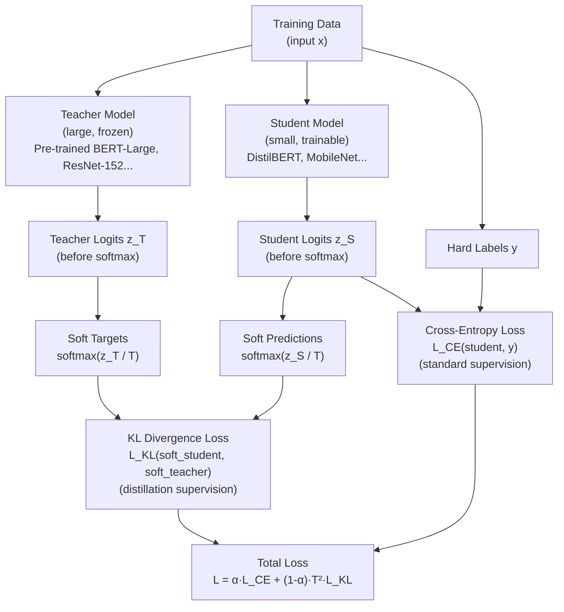

# 🎓 Knowledge Distillation

> [!abstract] TL;DR
> Knowledge distillation (Hinton et al., 2015) trains a small **student** model to mimic a large **teacher** model's output distribution, not just the hard class labels. The key insight is that the teacher's **soft predictions** (logits before argmax) carry far more information than one-hot labels — they encode relationships between classes (e.g., "this image is 60% cat, 30% tiger, 10% lion"). A temperature parameter $T$ sharpens or flattens these distributions. Beyond logit matching, **intermediate feature distillation** transfers internal representations. DistilBERT is 40% smaller than BERT but retains 97% of its performance — the canonical KD success story.

## Intuition — Analogy First

Think of a **PhD professor** (the teacher) mentoring a talented **undergraduate** (the student).

The professor could simply hand over the exam answer sheet (one-hot labels: "question 1: answer C"). That's a hard label — minimal information, the student just memorises answers.

Better: the professor explains *why* C is correct: "C is the best answer, but B is also partially right because of this nuance, and D is wrong for this specific reason." This is the soft label — the teacher's distribution over answers carries rich reasoning.

The undergraduate (small model) can't replicate everything the professor knows — they have fewer neurons, fewer parameters. But they inherit the *structure of the reasoning*: which concepts are similar, which answers are ambiguous, how to navigate uncertainty. That knowledge transfers at training time, even though the student is deployed independently.

**Temperature** in KD controls how informative the soft labels are: high temperature (T=5) spreads out the probabilities ("everything is somewhat plausible") — more informative for learning relationships. Low temperature (T=1) is nearly one-hot — back to hard labels.

## How It Works

### Teacher-Student Framework



### Distillation Variants

| Variant | What is transferred | Notes |
|---|---|---|
| **Response-based KD** | Final output logits (soft targets) | Original Hinton KD; simplest |
| **Feature-based KD** | Intermediate layer activations | FitNets, BERT feature distillation |
| **Relation-based KD** | Relationships between samples (gram matrices) | Good for metric learning |
| **Task-agnostic KD** | Pre-trained representations (before fine-tuning) | DistilBERT: distill during pre-training |
| **Task-specific KD** | After fine-tuning the teacher on a task | TinyBERT task distillation step |
| **Online KD** | Teacher and student train simultaneously | Mutual learning; no pre-trained teacher needed |

### Feature Distillation (Intermediate Layers)

Response-based KD only transfers the final outputs. Feature distillation also aligns intermediate representations:

$$L_\text{feat} = \sum_{l} \frac{1}{|F_l|} \|r(f^S_l) - f^T_{g(l)}\|_2^2$$

where $f^S_l$ = student layer $l$ activations, $f^T_{g(l)}$ = teacher layer mapped by $g(l)$ (since student has fewer layers), $r(\cdot)$ = projection network (learnable, to match dimensions).

FitNets and TinyBERT use feature distillation and consistently outperform response-based KD alone.

## The Math

**Standard KD loss** (Hinton et al., 2015):

$$L_\text{KD} = \alpha \cdot L_\text{CE}(z^S, y) + (1 - \alpha) \cdot T^2 \cdot L_\text{KL}\!\left(\sigma\!\left(\frac{z^S}{T}\right) \!\Bigg\|\! \sigma\!\left(\frac{z^T}{T}\right)\right)$$

where:
- $z^S, z^T$ = student/teacher logits
- $y$ = one-hot hard labels
- $T$ = temperature ($T > 1$ softens; $T = 1$ is standard softmax)
- $\alpha$ = balancing weight between hard and soft targets (typical: 0.1 to 0.5)
- $T^2$ scaling factor: ensures gradients from soft targets have comparable magnitude to hard-label gradients as $T$ varies

**KL Divergence for soft targets**:

$$L_\text{KL}(p_S \| p_T) = \sum_c p_T(c) \log \frac{p_T(c)}{p_S(c)}$$

**Why soft labels carry more information**: one-hot label entropy = 0 bits (certain). Soft label at T=4 for a well-calibrated teacher: $H(p_T) = -\sum_c p_T(c) \log p_T(c) > 0$ bits. This extra entropy encodes inter-class relationships — invaluable structure for the student.

**Temperature effect on softmax**:

$$p_i = \frac{\exp(z_i/T)}{\sum_j \exp(z_j/T)}$$

As $T \to \infty$: uniform distribution. As $T \to 0$: one-hot (argmax). $T = 4$ is typical; $T = 20$ is used in some self-distillation setups.

## Code Demo

```python
import torch
import torch.nn as nn
import torch.nn.functional as F

# ── Teacher and Student architectures ────────────────────────────
class Teacher(nn.Module):
    def __init__(self, input_dim=784, num_classes=10):
        super().__init__()
        self.net = nn.Sequential(
            nn.Linear(input_dim, 1200), nn.ReLU(), nn.Dropout(0.5),
            nn.Linear(1200, 1200), nn.ReLU(), nn.Dropout(0.5),
            nn.Linear(1200, num_classes),
        )
    def forward(self, x): return self.net(x)

class Student(nn.Module):
    def __init__(self, input_dim=784, num_classes=10):
        super().__init__()
        self.net = nn.Sequential(
            nn.Linear(input_dim, 400), nn.ReLU(),
            nn.Linear(400, num_classes),
        )
    def forward(self, x): return self.net(x)

# ── Knowledge Distillation Loss ────────────────────────────────────
class KnowledgeDistillationLoss(nn.Module):
    def __init__(self, temperature: float = 4.0, alpha: float = 0.3):
        """
        temperature: controls softness of soft targets (higher = softer)
        alpha: weight for hard-label CE loss (1-alpha for soft KL loss)
        """
        super().__init__()
        self.T = temperature
        self.alpha = alpha

    def forward(self, student_logits, teacher_logits, labels):
        # Hard label loss (cross-entropy with ground truth)
        ce_loss = F.cross_entropy(student_logits, labels)

        # Soft target loss (KL divergence between soft distributions)
        # Divide by T^2 to normalise gradients; multiply T^2 in the formula
        soft_student = F.log_softmax(student_logits / self.T, dim=-1)
        soft_teacher = F.softmax(teacher_logits / self.T, dim=-1)
        kl_loss = F.kl_div(soft_student, soft_teacher, reduction='batchmean')

        # Total loss: scale KL by T^2 to balance gradient magnitudes
        total_loss = self.alpha * ce_loss + (1 - self.alpha) * (self.T ** 2) * kl_loss
        return total_loss, ce_loss.item(), kl_loss.item()

# ── Training loop ─────────────────────────────────────────────────
def train_with_distillation(teacher, student, dataloader, epochs=10):
    teacher.eval()  # teacher is frozen — only used for inference
    student.train()

    optimizer = torch.optim.Adam(student.parameters(), lr=1e-3)
    kd_criterion = KnowledgeDistillationLoss(temperature=4.0, alpha=0.3)

    for epoch in range(epochs):
        total_loss = 0
        for x, y in dataloader:
            # Generate teacher soft labels (no gradient needed)
            with torch.no_grad():
                teacher_logits = teacher(x)

            # Student forward
            student_logits = student(x)

            # Distillation loss
            loss, ce, kl = kd_criterion(student_logits, teacher_logits, y)

            optimizer.zero_grad()
            loss.backward()
            optimizer.step()
            total_loss += loss.item()

        print(f"Epoch {epoch+1}: loss={total_loss/len(dataloader):.4f} | CE={ce:.4f} | KL={kl:.4f}")

# ── Feature-level distillation ────────────────────────────────────
class FeatureDistillationLoss(nn.Module):
    def __init__(self, student_dim: int, teacher_dim: int):
        super().__init__()
        # Projection to align student and teacher feature dimensions
        self.projection = nn.Linear(student_dim, teacher_dim)

    def forward(self, student_feat, teacher_feat):
        projected = self.projection(student_feat)
        return F.mse_loss(projected, teacher_feat.detach())

# ── Self-distillation (teacher = student, previous checkpoint) ────
def self_distillation(model, prev_checkpoint_path, dataloader, temperature=10.0):
    """
    Distill from a model's own earlier or ensemble checkpoint.
    Useful for improving calibration without a separate teacher.
    """
    # Load previous checkpoint as "teacher"
    teacher_model = type(model)()
    teacher_model.load_state_dict(torch.load(prev_checkpoint_path))
    teacher_model.eval()

    # Use model as student, distill from previous version
    train_with_distillation(teacher_model, model, dataloader)

# ── HuggingFace DistilBERT-style distillation (simplified) ────────
# The actual DistilBERT distillation used 3 losses:
# 1. Cosine embedding loss between teacher/student hidden states
# 2. MLM loss with hard labels
# 3. KL divergence loss on MLM logits with teacher soft targets
# Temperature=2, alpha=0.5 in the original paper
```

## Real-World Example

**DistilBERT** (Sanh et al., Hugging Face, 2019) — the most widely deployed knowledge distillation product in NLP.

- **Teacher**: BERT-Base (12 layers, 110M parameters).
- **Student**: DistilBERT (6 layers, 66M parameters) — half the layers, same hidden dim.
- **Distillation**: task-agnostic distillation during pre-training on the full Wikipedia + BookCorpus corpus. Three losses: cosine similarity between hidden states, MLM with hard labels, and soft MLM label KL divergence from BERT-Base at T=2.
- **Results**: 40% fewer parameters, 60% faster inference, retains 97% of BERT-Base accuracy on GLUE benchmark.
- **Deployment impact**: Hugging Face reports DistilBERT is downloaded millions of times per month — it enables BERT-quality NLP on edge devices, lower-end servers, and real-time applications where BERT's 110ms latency is too slow.

**MobileNet** (Google, 2017): standard ResNet-50 achieves 76.1% ImageNet top-1. MobileNet-v2 (3.4M params, 4× smaller) trained with distillation from ResNet-50 achieves 72.3% — much closer to teacher performance than training MobileNet from scratch (71.8%).

## Trade-offs

| Aspect | Benefit | Cost |
|---|---|---|
| Student accuracy | Near-teacher (97%+ at 2× compression) | Never exactly matches teacher |
| Training cost | Student trains faster per epoch | Requires teacher forward pass in training loop |
| Teacher dependency | Rich soft labels improve generalisation | Teacher must be pre-trained; adds pipeline step |
| Architecture flexibility | Student can be any architecture | Mismatch in layer count/type complicates feature KD |
| Deployment | Student is independent — no teacher at inference | Teacher overhead only during training |
| Temperature tuning | Significant accuracy impact | Hyperparameter requiring search |

## When to Use vs Avoid

**Use knowledge distillation when:**
- A large model is available and you need a smaller, faster version
- Standard model compression (pruning, quantization) alone is insufficient
- Unlabeled data is plentiful — student can train on soft labels without ground truth
- The student architecture differs from the teacher (can't do LoRA-style transfer)

**Use task-agnostic KD when:**
- Building a general-purpose compressed model (like DistilBERT for any task)
- Teacher's pre-training is expensive and you want to share the benefit across tasks

**Use task-specific KD when:**
- Single deployment task is known; fine-tune teacher first, distill into student

**Avoid when:**
- Teacher and student accuracy targets are similar — just train the student directly
- Teacher is very poor quality — there's no useful "dark knowledge" to transfer
- No training data available for calibration (PTQ is better in that case)

## Common Pitfalls

1. **Forgetting to freeze the teacher**: the teacher must be in `.eval()` mode with `torch.no_grad()` wrapping its forward pass. A trainable teacher corrupts the soft labels and wastes memory.
2. **Not scaling KL loss by T²**: without the $T^2$ factor, the gradient from soft-label loss is $T^2$ times smaller than intended. This makes the soft label term effectively negligible. Always include $T^2$.
3. **Mismatched layer indices for feature distillation**: a 12-layer teacher and 6-layer student need a mapping function $g(l)$ — don't blindly match layer 1 → layer 1.
4. **Temperature too high**: at T=20, soft labels are nearly uniform — very little useful information. T=3–7 is typically optimal; use validation performance to tune.
5. **Ignoring the capacity gap**: if the student is too small relative to the teacher (e.g., distilling BERT-Large into a 2-layer model), the student cannot absorb the knowledge regardless of distillation approach. Start with a student that is at most 2–4× smaller than the teacher.

## Related Concepts

- [[_MOC_Infrastructure|↑ Section MOC]]

- [[Pruning]] — complementary technique; prune then distill, or distill then prune
- [[Quantization]] — third major compression technique; can stack all three
- [[BERT]] — the canonical knowledge distillation target in NLP
- [[Transfer_Learning]] — distillation is a form of knowledge transfer

## Review Questions

1. A KD loss uses T=4, α=0.3. After switching to T=1 (no temperature scaling), you observe that the student's accuracy drops by 2%. Explain mechanistically why temperature matters, referencing the information content of the soft targets.
2. DistilBERT achieves 97% of BERT's GLUE score with 40% fewer parameters. A colleague suggests simply training a 6-layer BERT from scratch. Why would distillation outperform this baseline?
3. You're distilling a 70B LLM into a 7B student. Would you use task-agnostic or task-specific distillation? What data would you use? Describe the feature distillation challenges given the architectural differences.

## Sources

- Hinton et al., "Distilling the Knowledge in a Neural Network" (NIPS Workshop 2015)
- Sanh et al., "DistilBERT, a Distilled Version of BERT" (2019)
- Jiao et al., "TinyBERT: Distilling BERT for Natural Language Understanding" (EMNLP 2020)
- Romero et al., "FitNets: Hints for Thin Deep Nets" (ICLR 2015) — feature distillation
- Gou et al., "Knowledge Distillation: A Survey" (2021)

#knowledge-distillation #compression #teacher-student #distilbert #infrastructure #optimisation
