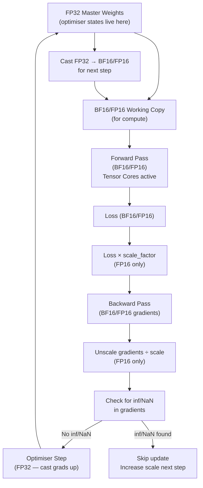

# 🔢 Mixed Precision Training

> [!abstract] TL;DR
> Mixed precision training uses lower-precision floating-point (FP16 or BF16) for forward/backward passes and higher-precision (FP32) for the optimiser update. This gives 2× memory reduction and 2–8× speedup via Tensor Cores, with minimal accuracy loss. FP16 requires **loss scaling** to prevent gradient underflow; BF16 does not (it has the same dynamic range as FP32) and is the standard for modern LLM training. PyTorch `torch.cuda.amp` automates this with two components: `autocast` (selects precision per operation) and `GradScaler` (handles loss scaling for FP16).

## Intuition — Analogy First

Think of mixed precision as using a **draft copy and a master copy** for different tasks.

When an architect drafts initial sketches, they use a lightweight pencil sketch (FP16/BF16) — fast, compact, good enough for iterating. But when they finalise measurements and structural calculations (optimiser state updates), they switch to precise CAD drawings (FP32) — every millimetre matters.

The workflow: sketch quickly → check against exact master copy → update master copy → use updated master copy for next sketch.

In training: forward/backward in low precision (fast, memory-efficient) → gradient update in FP32 master weights (numerically stable) → copy updated FP32 weights back to FP16/BF16 for the next forward pass.

**BF16 insight**: brain float 16 was designed by Google Brain to have the same exponent range as FP32 — same dynamic range, less precision. For neural networks where values can span many orders of magnitude, dynamic range matters more than precision. BF16 eliminates the need for loss scaling.

## How It Works

### Number Format Comparison

| Format | Total bits | Sign | Exponent | Mantissa | Dynamic range | Precision |
|---|---|---|---|---|---|---|
| FP32 | 32 | 1 | 8 | 23 | ±3.4×10³⁸ | ~7 decimal digits |
| FP16 | 16 | 1 | 5 | 10 | ±65,504 | ~3 decimal digits |
| BF16 | 16 | 1 | 8 | 7 | ±3.4×10³⁸ | ~2 decimal digits |
| TF32 | 19 | 1 | 8 | 10 | FP32 range | ~3 decimal digits |

**FP16 problem**: exponent range is ±65,504. Small gradients (e.g., 1e-5) underflow to zero. Large activations (> 65,504) overflow to inf/NaN. Loss scaling is required.

**BF16 solution**: same exponent as FP32 → same dynamic range → no underflow/overflow in normal training. Less precision (7 mantissa bits) is fine for gradient noise.

### Mixed Precision Training Loop



### Loss Scaling (FP16 only)

Gradients in FP16 often underflow to zero because they are small. Solution: multiply the loss by a large constant before backward, then divide gradients by the same constant before the optimiser step. This shifts gradients into the representable FP16 range.

**Dynamic loss scaling**: start with scale = 2¹⁶. If a batch produces inf/NaN gradients (overflow), halve the scale and skip the update. If `growth_interval` consecutive steps produce no overflow, double the scale. This auto-tunes over training.

**BF16 does not need loss scaling** — the full FP32 dynamic range eliminates underflow.

## The Math

**FP16 quantisation error**: for a value $x$, the representable value is:

$$\hat{x} = \text{round}(x / 2^e) \times 2^e$$

where $e$ is the biased exponent. For small gradients near the FP16 subnormal range ($< 6 \times 10^{-5}$): $\hat{x} = 0$ (underflow). Loss scaling multiplies all gradients by $S$ before backward:

$$\hat{g}_\text{scaled} = \text{round}(g \cdot S) \neq 0 \quad \text{for appropriate } S$$

After backward, divide: $g_\text{unscaled} = \hat{g}_\text{scaled} / S$.

**Memory reduction**: switching from FP32 to BF16 for forward/backward pass:

$$\Delta M = (M_\text{activations} + M_\text{gradients}) \times (1 - 16/32) = 50\%$$

Additional: keeping FP32 master weights adds back 50% of weight memory, so net savings depend on activation memory (dominant for large batch sizes):

$$M_\text{total, BF16} = M_\text{weights} \times (2 + 4)/\text{byte} = 6/\text{byte} \quad \text{(vs 16 for FP32 + Adam)}$$

## Code Demo

```python
import torch
import torch.nn as nn
from torch.cuda.amp import autocast, GradScaler

device = torch.device("cuda")
model = nn.Sequential(
    nn.Linear(1024, 4096), nn.GELU(),
    nn.Linear(4096, 4096), nn.GELU(),
    nn.Linear(4096, 256)
).to(device)

# ── BF16 training (modern GPUs: A100, H100) ─────────────────────
# BF16: no loss scaler needed
optimizer_bf16 = torch.optim.AdamW(model.parameters(), lr=1e-4)

for step in range(10):
    x = torch.randn(32, 1024, device=device)
    y = torch.randint(0, 256, (32,), device=device)

    optimizer_bf16.zero_grad()

    with autocast(device_type="cuda", dtype=torch.bfloat16):
        out = model(x)   # runs in BF16 — activations are BF16
        loss = nn.CrossEntropyLoss()(out, y)  # loss in BF16

    loss.backward()          # gradients computed in BF16
    torch.nn.utils.clip_grad_norm_(model.parameters(), 1.0)
    optimizer_bf16.step()    # updates in FP32 (PyTorch handles internally)

    if step % 5 == 0:
        print(f"Step {step}: loss={loss.item():.4f}")

# ── FP16 training (older GPUs: V100, T4) ───────────────────────
# FP16: requires GradScaler for loss scaling
optimizer_fp16 = torch.optim.AdamW(model.parameters(), lr=1e-4)
scaler = GradScaler()  # initialises with scale=65536, adjusts dynamically

for step in range(10):
    x = torch.randn(32, 1024, device=device)
    y = torch.randint(0, 256, (32,), device=device)

    optimizer_fp16.zero_grad()

    with autocast(device_type="cuda", dtype=torch.float16):
        out = model(x)
        loss = nn.CrossEntropyLoss()(out, y)

    scaler.scale(loss).backward()          # loss * scale, compute grads
    scaler.unscale_(optimizer_fp16)        # grad / scale before clipping
    torch.nn.utils.clip_grad_norm_(model.parameters(), 1.0)
    scaler.step(optimizer_fp16)            # skips step if any grad is inf/NaN
    scaler.update()                        # adjust scale factor

    print(f"Step {step}: scale={scaler.get_scale():.0f}")

# ── Check which ops run in reduced precision ─────────────────────
# autocast selects precision per op:
# FP16/BF16: matmul, conv, linear (Tensor Core eligible)
# FP32: log, exp, softmax, layer norm (numerically sensitive)
with autocast(device_type="cuda", dtype=torch.bfloat16):
    x = torch.randn(4, 8, device=device)
    y = x @ x.T   # matmul → BF16 (Tensor Cores)
    z = x.softmax(-1)  # softmax → FP32 (precision-sensitive)
    print(f"matmul dtype: {y.dtype}")   # bfloat16
    print(f"softmax dtype: {z.dtype}") # float32

# ── Training performance comparison ──────────────────────────────
import time

def benchmark(dtype, n_steps=100):
    model_bench = nn.Linear(4096, 4096).to(device)
    x = torch.randn(128, 4096, device=device)
    torch.cuda.synchronize()
    start = time.perf_counter()
    for _ in range(n_steps):
        with autocast(device_type="cuda", dtype=dtype):
            y = model_bench(x)
    torch.cuda.synchronize()
    return (time.perf_counter() - start) / n_steps * 1000

print(f"FP32:  {benchmark(torch.float32):.2f}ms")
print(f"BF16:  {benchmark(torch.bfloat16):.2f}ms")  # typically 2-4x faster
print(f"FP16:  {benchmark(torch.float16):.2f}ms")
```

## Real-World Example

**GPT-4 and LLaMA-3** (and virtually every frontier LLM since 2022) train exclusively in BF16.

Before BF16 was widely available (Ampere GPUs, 2020), FP16 with loss scaling was standard and required careful tuning — loss scale too high → inf/NaN; too low → gradient underflow, slow convergence. Teams at Google Brain invented BF16 specifically to eliminate this fragility.

**Performance numbers on H100**:
- FP32 GEMM: 60 TFLOPS
- TF32 (Tensor Core, ~FP32 range): 990 TFLOPS
- BF16 (Tensor Core): 990 TFLOPS
- FP8 (Transformer Engine): 1,979 TFLOPS

Switching from FP32 to BF16 for a typical transformer training run gives: ~3× faster matrix multiply, ~2× memory reduction, enabling double the batch size or 2× longer sequences.

**Practical example**: training LLaMA-2 7B in BF16 on 8× A100 80GB:
- Memory for weights: 7B × 2 bytes = 14GB per GPU
- Memory for FP32 optimiser states: 7B × 12 bytes / 8 GPUs (with FSDP ZeRO-2) = 10.5GB per GPU
- Activations (batch=4, seq=4096): ~12GB per GPU
- Total: ~37GB per GPU — fits in 80GB with room for batch scaling

## Trade-offs

| Precision | Speed | Memory | Stability | Use Case |
|---|---|---|---|---|
| FP32 | Baseline | Baseline | Most stable | Debugging, old hardware |
| TF32 | ~3× (Tensor Core) | Same as FP32 | Same as FP32 | A100+ default for matmul |
| BF16 | ~3× | 2× reduction | Same range as FP32 | **Modern LLM training standard** |
| FP16 | ~3× | 2× reduction | Needs loss scaling | Older GPUs (V100, T4) |
| FP8 | ~6× | 4× reduction | Requires careful scaling | H100 training, inference |
| INT8 | ~4× (inference) | 4× reduction | Accuracy loss | Inference only |

## When to Use vs Avoid

**Use BF16 for:**
- Training any model on A100, H100, or newer (Ampere+)
- Default choice for all LLM training post-2021

**Use FP16 + GradScaler for:**
- Training on V100, T4, GTX/RTX 20xx (no BF16 support)
- When BF16 is unavailable (e.g., some edge accelerators)

**Keep FP32 for:**
- Numerically sensitive operations (log, exp, normalisation) — autocast handles this automatically
- The optimiser step (always FP32 — handled by PyTorch internally)
- Debugging convergence issues — rule out precision as a factor first

**Avoid FP16 on Ampere+:** use BF16 instead — same speed, no loss scaling needed.

## Common Pitfalls

1. **Forgetting `scaler.unscale_()` before gradient clipping with FP16**: clipping on scaled gradients clips to the wrong value. Always unscale before `torch.nn.utils.clip_grad_norm_()`.
2. **Using autocast outside the training step**: applying `autocast` to model loading or data preprocessing has no effect on Tensor Core performance and may cause unexpected precision mismatches.
3. **`autocast` + custom loss functions**: custom operations that are precision-sensitive (e.g., numerical stability tricks) may not be registered with autocast. Use `@torch.amp.custom_fwd(cast_inputs=torch.float32)` decorator.
4. **Assuming BF16 = FP32**: BF16 has only 7 mantissa bits (~2 decimal digits). For research experiments requiring high numerical precision (certain scientific ML), BF16 may be insufficient.
5. **Not testing with both FP32 and BF16**: a bug in a custom op may only manifest in BF16 due to precision differences. Always validate accuracy against FP32 before switching precision permanently.

## Related Concepts

- [[_MOC_Infrastructure|↑ Section MOC]]

- [[GPU_Architecture_Basics]] — Tensor Cores that make BF16/FP16 fast
- [[Quantization]] — further precision reduction for inference
- [[DeepSpeed_ZeRO]] — memory optimisation that pairs with mixed precision
- [[Optimizers]] — why FP32 master weights matter for Adam stability
- [[Distributed_Training_Overview]] — BF16 reduces communication volume in all-reduce

## Review Questions

1. A model is training with FP16 and the GradScaler shows the loss scale fluctuating between 128 and 256 (very low). What does this indicate about gradient magnitudes? What could you adjust to stabilise training?
2. Explain why BF16 does not require loss scaling while FP16 does. Support your answer with the bit format differences between the two.
3. You observe that switching a custom transformer from FP32 to BF16 reduces memory by 40% (not the expected 50%). What components are likely keeping their FP32 representation, and why?

## Sources

- Micikevicius et al., "Mixed Precision Training" (ICLR 2018)
- NVIDIA Tensor Core documentation: https://docs.nvidia.com/deeplearning/performance/
- PyTorch AMP tutorial: https://pytorch.org/tutorials/recipes/recipes/amp_recipe.html
- Kalamkar et al., "A Study of BFLOAT16 for Deep Learning Training" (2019)
- PyTorch autocast documentation: https://pytorch.org/docs/stable/amp.html

#mixed-precision #bf16 #fp16 #amp #training #infrastructure #tensor-cores
