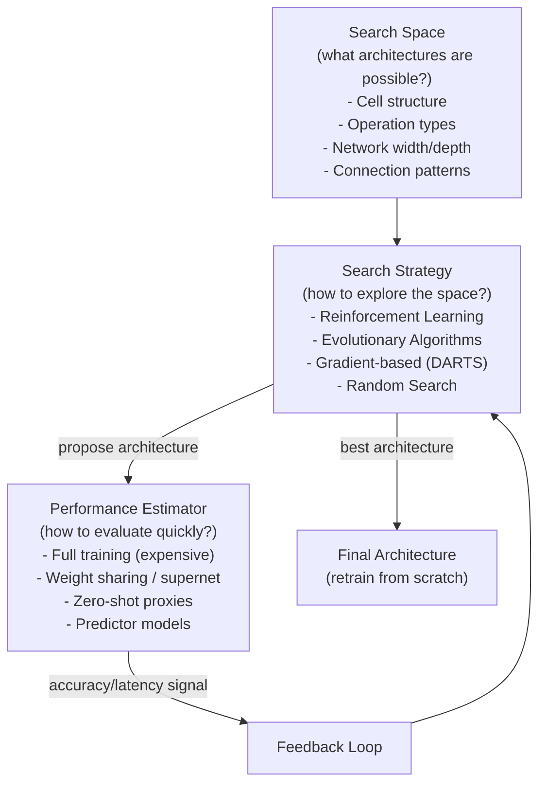

# 🔍 Neural Architecture Search

> [!abstract] TL;DR
> Neural Architecture Search (NAS) automates the design of neural network architectures using search algorithms instead of human intuition. A NAS system defines a **search space** (possible architectures), applies a **search strategy** (RL, evolutionary algorithms, or gradient-based DARTS), and evaluates candidates via a **performance estimator** (full training, weight sharing, or zero-shot proxies). The most impactful outputs: EfficientNet (Google, 2019) — Pareto-optimal accuracy/compute trade-off; MnasNet — hardware-aware mobile NAS; OFA (Once-for-All) — single supernetwork adaptable to any hardware. NAS has shifted from expensive RL (800 GPU-days) to weight-sharing approaches (1–4 GPU-days).

## Intuition — Analogy First

NAS is the meta-challenge: **using AI to design better AI architectures**.

Traditional deep learning: a human expert (the architect) studies years of papers, develops intuition, manually tries conv(3×3), then conv(5×5), then adds skip connections, then... This process relies entirely on human creativity and accumulated domain knowledge.

NAS automates this: define a blueprint library (search space — all possible operations: conv 3×3, conv 5×5, max pool, skip, etc.) and an assembly rule (how operations can connect). Then deploy a search agent (RL controller, evolutionary algorithm, or gradient descent) that proposes architectures, trains them (or approximates their quality cheaply), and iteratively refines toward better accuracy/efficiency.

The breakthrough: just as AlphaGo found moves humans never considered, NAS finds architecture patterns humans overlooked — like the inverted residual bottleneck in MobileNetV2 (small channels → expand → operate → compress) that counterintuitively outperforms the intuitive large-channels approach.

## How It Works

### Three Components of Every NAS System



### Search Strategies

**Reinforcement Learning (NASNet, 2017)**: a controller RNN proposes an architecture as a sequence of decisions (operation type, skip connections). The proposed architecture is trained, its validation accuracy becomes the reward, controller is updated via REINFORCE. Cost: 800 GPU-days. Produced NASNet-A, which was state-of-the-art ImageNet accuracy.

**Evolutionary Algorithms (AmoebaNet, 2019)**: a population of architectures evolves via mutation (random operation swap) and selection (accuracy-based tournament selection). Slightly better than RL NAS in quality; similar compute cost.

**DARTS — Differentiable Architecture Search (Liu et al., 2018)**: the insight that architecture selection is differentiable if you treat it as a continuous relaxation:

Instead of hard-selecting one operation per edge, maintain a continuous mixture:

$$o_{\text{mixed}}(x) = \sum_{o \in \mathcal{O}} \frac{\exp(\alpha_o)}{\sum_{o'} \exp(\alpha_{o'})} \cdot o(x)$$

The architectural parameters $\alpha$ are optimised by gradient descent (on validation set) simultaneously with weight parameters (on training set). After optimisation, discretise: keep the operation with highest $\alpha$ per edge.

Cost: 1–4 GPU-days. Democratised NAS.

**Weight Sharing / Supernet (SMASH, Once-for-All)**: train a single **supernetwork** where all operations share weights. Sample subnetworks and evaluate them without retraining — use inherited weights as a proxy for full training performance. OFA trains once and can produce architectures for any hardware constraint.

### Hardware-Aware NAS

Standard NAS optimises for FLOPs or parameter count — poor proxies for latency on specific hardware. Hardware-aware NAS directly measures latency on the target device:

$$\text{objective} = \text{accuracy} - \lambda \cdot \text{Latency}(\text{arch}, \text{device})$$

MnasNet uses this to find architectures optimal for Pixel phone inference. ProxylessNAS builds a hardware latency lookup table and integrates it into the gradient-based search.

## The Math

**DARTS bilevel optimisation**:

$$\min_\alpha \mathcal{L}_\text{val}(w^*(\alpha), \alpha)$$
$$\text{subject to } w^*(\alpha) = \arg\min_w \mathcal{L}_\text{train}(w, \alpha)$$

Approximated (first-order DARTS) by alternating:
1. Update $w$ via SGD on $\mathcal{L}_\text{train}(w, \alpha)$
2. Update $\alpha$ via Adam on $\mathcal{L}_\text{val}(w, \alpha)$

**EfficientNet compound scaling**: given a base architecture, scale width ($w$), depth ($d$), and resolution ($r$) jointly under a FLOP constraint $\phi$:

$$d = \alpha^\phi, \quad w = \beta^\phi, \quad r = \gamma^\phi$$
$$\text{s.t.} \quad \alpha \cdot \beta^2 \cdot \gamma^2 \approx 2$$

(doubling $\phi$ roughly doubles FLOPs). Found by NAS: $\alpha = 1.2, \beta = 1.1, \gamma = 1.15$.

**Architecture predictor**: train a GNN/MLP on (architecture graph, accuracy) pairs to predict performance without training:

$$\hat{a} = f_\theta(\text{arch graph}) \approx a_\text{actual}$$

Correlation of 0.9+ is achievable with 100–1000 trained architectures, enabling cheap search over millions of candidates.

## Code Demo

```python
# ── DARTS-style differentiable architecture search with Optuna ────
import torch
import torch.nn as nn
import torch.nn.functional as F
import optuna
from typing import List

# ── Simplified Mixed Operation (DARTS core concept) ───────────────
class MixedOp(nn.Module):
    """Each edge in the cell can be any of these operations."""
    PRIMITIVES = ['skip', 'conv3x3', 'conv5x5', 'maxpool3x3', 'avgpool3x3']

    def __init__(self, C: int):
        super().__init__()
        self._ops = nn.ModuleList()
        for prim in self.PRIMITIVES:
            if prim == 'skip':
                self._ops.append(nn.Identity())
            elif prim == 'conv3x3':
                self._ops.append(nn.Sequential(
                    nn.Conv2d(C, C, 3, padding=1, bias=False),
                    nn.BatchNorm2d(C), nn.ReLU()
                ))
            elif prim == 'conv5x5':
                self._ops.append(nn.Sequential(
                    nn.Conv2d(C, C, 5, padding=2, bias=False),
                    nn.BatchNorm2d(C), nn.ReLU()
                ))
            elif prim == 'maxpool3x3':
                self._ops.append(nn.MaxPool2d(3, stride=1, padding=1))
            elif prim == 'avgpool3x3':
                self._ops.append(nn.AvgPool2d(3, stride=1, padding=1))

        # Architecture parameters (one per operation)
        self.alphas = nn.Parameter(torch.zeros(len(self.PRIMITIVES)))

    def forward(self, x: torch.Tensor) -> torch.Tensor:
        weights = F.softmax(self.alphas, dim=0)  # continuous relaxation
        return sum(w * op(x) for w, op in zip(weights, self._ops))

    def discretise(self) -> str:
        """After search, return the best operation."""
        return self.PRIMITIVES[self.alphas.argmax().item()]

# ── Full DARTS bilevel training loop (simplified) ─────────────────
class DARTSCell(nn.Module):
    def __init__(self, num_edges: int = 4, C: int = 16):
        super().__init__()
        self.edges = nn.ModuleList([MixedOp(C) for _ in range(num_edges)])

    def forward(self, x: torch.Tensor) -> torch.Tensor:
        out = x
        for edge in self.edges:
            out = edge(out)
        return out

    def architecture_params(self):
        return [e.alphas for e in self.edges]

# Training loop sketch
def train_darts(cell: DARTSCell, train_loader, val_loader, epochs: int = 20):
    arch_params = cell.architecture_params()
    weight_params = [p for p in cell.parameters() if not any(p is a for a in arch_params)]

    weight_optimizer = torch.optim.SGD(weight_params, lr=0.025, momentum=0.9)
    arch_optimizer = torch.optim.Adam(arch_params, lr=3e-4)

    for epoch in range(epochs):
        # 1. Update weights on training data
        cell.train()
        for x_train, y_train in train_loader:
            weight_optimizer.zero_grad()
            loss = F.cross_entropy(cell(x_train), y_train)
            loss.backward()
            weight_optimizer.step()

        # 2. Update architecture on validation data
        for x_val, y_val in val_loader:
            arch_optimizer.zero_grad()
            loss = F.cross_entropy(cell(x_val), y_val)
            loss.backward()
            arch_optimizer.step()

    # Discretise: pick best op per edge
    for i, edge in enumerate(cell.edges):
        print(f"Edge {i}: best op = {edge.discretise()}")

# ── Optuna for hyperparameter/architecture search ─────────────────
def objective(trial: optuna.Trial) -> float:
    """Optuna search over architectural hyperparameters."""
    # Architecture decisions as Optuna hyperparameters
    num_layers = trial.suggest_int('num_layers', 4, 16)
    hidden_dim = trial.suggest_categorical('hidden_dim', [128, 256, 512, 1024])
    activation = trial.suggest_categorical('activation', ['relu', 'gelu', 'silu'])
    use_skip = trial.suggest_categorical('use_skip', [True, False])
    dropout = trial.suggest_float('dropout', 0.0, 0.5)

    act_fn = {'relu': nn.ReLU, 'gelu': nn.GELU, 'silu': nn.SiLU}[activation]
    layers = []
    for i in range(num_layers):
        layers.extend([nn.Linear(hidden_dim, hidden_dim), act_fn(), nn.Dropout(dropout)])

    model = nn.Sequential(nn.Linear(784, hidden_dim), *layers, nn.Linear(hidden_dim, 10))

    # Quick proxy training (5 epochs for search; retrain from scratch when done)
    optimizer = torch.optim.Adam(model.parameters(), lr=1e-3)
    # ... (training loop omitted)

    val_accuracy = 0.95  # placeholder
    return val_accuracy

study = optuna.create_study(direction='maximize', sampler=optuna.samplers.TPESampler())
study.optimize(objective, n_trials=100, timeout=3600)
print(f"Best architecture: {study.best_params}")

# ── EfficientNet compound scaling (usage) ─────────────────────────
from torchvision.models import efficientnet_b0, efficientnet_b7, EfficientNet_B7_Weights
# B0: NAS base model (found by MnasNet-inspired search)
# B1-B7: compound-scaled versions (no re-search; just scaling rules)
model_b0 = efficientnet_b0()    # 5.3M params, 77.7% ImageNet
model_b7 = efficientnet_b7(weights=EfficientNet_B7_Weights.DEFAULT)  # 66M, 84.1%
```

## Real-World Example

**EfficientNet** (Tan & Le, Google Brain, 2019) — the most influential NAS result in computer vision.

**Step 1 — NAS**: MnasNet-style RL NAS found the base architecture (EfficientNet-B0, 5.3M parameters, 77.1% ImageNet top-1) optimised for a Pixel phone with FLOP budget constraint.

**Step 2 — Compound scaling**: instead of re-running expensive NAS for each size variant, derive the optimal scaling rule (depth × width × resolution) analytically. B1–B7 are produced by applying this rule at increasing FLOP budgets.

**Result**: EfficientNet-B7 achieves 84.3% ImageNet top-1 with 66M parameters vs ResNet-152 (82.6% with 60M parameters) — better accuracy with similar size. EfficientNet-B1 achieves 79.1% with only 7.8M parameters — 8× smaller than ResNet-50 at similar accuracy.

**EfficientNetV2** (2021): NAS-found architecture that replaces early depthwise convolutions with Fused-MBConv (regular conv + MBConv in late stages) — 4× faster training, better accuracy on ImageNet-21k.

**ProxylessNAS** (MIT HAN Lab, 2019): directly searched hardware-aware architectures for GPU, CPU, and mobile separately. Found that optimal architectures differ per hardware — a GPU-optimal architecture is poor for mobile, and vice versa.

## Trade-offs

| Approach | Search Cost | Architecture Quality | Generality |
|---|---|---|---|
| Human-designed (ResNet, VGG) | Years of research | Expert-level | Very general |
| RL NAS (NASNet) | 800 GPU-days | State-of-the-art | Task/device specific |
| Evolutionary NAS | 3,150 GPU-days | Slightly better | Task/device specific |
| DARTS | 1–4 GPU-days | Good (not top) | Fairly general |
| Weight-sharing / OFA | 40 GPU-days (once) | Good for each target | Very general |
| Random NAS + predictor | 100 GPU-days | Competitive | General |
| Zero-shot NAS | < 1 GPU-day | Approximate | Requires proxy design |

## When to Use vs Avoid

**Use NAS when:**
- Deploying to a specific hardware target where optimal architecture is unknown (mobile, edge TPU)
- Standard architectures are insufficient and search compute budget is available
- Building a product that will serve millions of users (amortises search cost)

**Use DARTS/weight-sharing NAS when:**
- NAS budget is limited (< 1 week)
- Searching a new cell topology for a new domain (audio, graph, time-series)

**Use compound scaling when:**
- A good base architecture exists and you need multiple size variants
- No time/budget for full re-search

**Skip NAS when:**
- Model will be trained once for a specific task — standard architectures (ResNet, ViT) are well-studied
- Target hardware is a standard GPU — existing architectures are already optimised
- Data is small (< 10K examples) — architecture matters less than data quality

## Common Pitfalls

1. **Searching on proxy then deploying differently**: NAS found for CIFAR-10 proxy often doesn't transfer to ImageNet. Always validate the final architecture on the target task and hardware.
2. **DARTS collapse**: architectural parameters $\alpha$ tend to converge to "skip connection everywhere" (lowest parameter count, overfits architecture params). Use DARTS+ or PC-DARTS variants with regularisation.
3. **Forgetting to retrain from scratch**: the architecture found by weight-sharing NAS inherited shared weights — retrain the final architecture from scratch for fair performance evaluation.
4. **FLOPs ≠ latency**: a 1 GFLOP architecture on a mobile CPU may be slower than a 2 GFLOP architecture if the former has irregular memory access patterns. Always measure actual latency on target hardware.
5. **Search space too large**: exponential growth with number of cells/operations. Start with a small, well-defined search space; NAS cannot compensate for a poorly designed space.

## Related Concepts

- [[_MOC_Infrastructure|↑ Section MOC]]

- [[Famous_CNN_Architectures]] — EfficientNet, MobileNet are NAS-found architectures
- [[Hyperparameter_Tuning]] — related automation; NAS extends HPO to architecture
- [[Pruning]] — alternative to NAS for compression; NAS finds optimal from scratch, pruning compresses existing
- [[Knowledge_Distillation]] — often used to train the NAS-found student from a large teacher

## Review Questions

1. DARTS optimises architecture parameters $\alpha$ on the **validation** set while training weights on the **training** set. Why this split? What would go wrong if both $\alpha$ and weights were updated on the training set?
2. EfficientNet achieves compound scaling by jointly scaling depth, width, and resolution. Intuitively, why is joint scaling better than scaling only one dimension (e.g., just making the network deeper)?
3. MnasNet and ProxylessNAS both found hardware-specific architectures. A ProxylessNAS GPU-optimal architecture was worse than the mobile-optimal architecture on mobile, and vice versa. What architectural property drives this difference (hint: consider memory access patterns)?

## Sources

- Zoph & Le, "Neural Architecture Search with Reinforcement Learning" (ICLR 2017)
- Liu et al., "DARTS: Differentiable Architecture Search" (ICLR 2019)
- Tan et al., "MnasNet: Platform-Aware Neural Architecture Search for Mobile" (CVPR 2019)
- Tan & Le, "EfficientNet: Rethinking Model Scaling for Convolutional Neural Networks" (ICML 2019)
- Cai et al., "Once-for-All: Train One Network and Specialize it for Efficient Deployment" (ICLR 2020)

#nas #neural-architecture-search #automl #darts #efficientnet #infrastructure
