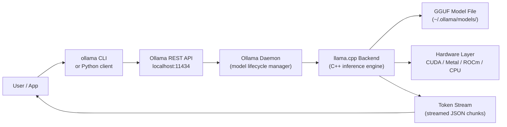

# Ollama

> [!abstract] TL;DR
> Ollama is a zero-configuration tool for running open-weight LLMs locally: one command installs it, one command downloads a model, one command runs it — and it exposes an OpenAI-compatible REST API so any existing app just works. It wraps llama.cpp behind a friendly interface, handles GGUF model management, and enables private, offline, cost-free LLM inference on your own hardware.

---

## Intuition

**Analogy:** Ollama is to LLMs what Docker is to containers.

Docker took the complexity of environment setup — compilers, libraries, dependencies, networking — and hid it behind `docker pull nginx && docker run nginx`. You didn't need to understand the internals to get a production-grade web server running in 30 seconds.

Ollama does exactly that for language models. You don't need to understand GGUF quantization formats, llama.cpp compile flags, CUDA layer offloading, or sampling parameter tuning. You just run `ollama run llama3.2` and get a working LLM in your terminal. The complexity is still there — Ollama just hides it until you need it.

---

## How It Works

### Core Mechanics

Ollama runs as a background daemon (`ollama serve`) that:

1. **Manages a model library** — downloads, stores, and versions GGUF model files in `~/.ollama/models/`
2. **Exposes a REST API** on `http://localhost:11434` — all clients talk to this server
3. **Delegates inference to llama.cpp** — the C++ inference engine does the actual computation
4. **Auto-detects hardware acceleration** — CUDA (NVIDIA), Metal (Apple Silicon), ROCm (AMD) are tried in order; falls back to CPU
5. **Manages model lifecycle** — loads a model into memory on first request, keeps it warm, unloads after an idle timeout (default 5 minutes)

When you call the API with a different model name than what is loaded, Ollama swaps the model: unloads the current one, loads the new one. Only one model is in memory at a time by default.

### Flow / Architecture



---

## GGUF Format and Hardware Requirements

### What GGUF Is

GGUF (GPT-Generated Unified Format) is the model file format used by llama.cpp and Ollama. It packs model weights, tokenizer vocabulary, and architecture metadata into a single binary file. Weights are stored in quantized integer format, not raw FP32.

### Quantization Levels and the Sweet Spot

| GGUF Type | Bits/weight | 7B Model Size | Quality Loss | Recommendation |
|-----------|-------------|---------------|--------------|----------------|
| Q2_K | 2.5 | ~2.7 GB | High | Research only |
| Q4_0 | 4.0 | ~3.8 GB | Moderate | Fast, some degradation |
| Q4_K_M | 4.5 | ~4.1 GB | Small | **Best 4-bit balance** |
| Q5_K_M | 5.7 | ~5.0 GB | Minimal | Quality-first 4-bit |
| Q8_0 | 8.0 | ~7.7 GB | Near-zero | Near FP16 quality |

**Q4_K_M is the default sweet spot**: the `_K` means key tensors (attention layers) use a slightly higher precision, and `_M` means medium-quality mixed precision for FFN layers. The result is better quality than Q4_0 at roughly the same size.

### Hardware Requirements Formula

```
Required VRAM/RAM (GB) ≈ (params_billions × quant_bits) / 8 + 1-2 GB overhead
```

Examples:
- 7B model, Q4_K_M (4.5 bits): `(7 × 4.5) / 8 ≈ 3.9 GB + 1 GB = ~5 GB`
- 13B model, Q4_K_M: `(13 × 4.5) / 8 ≈ 7.3 GB + 1 GB = ~8 GB`
- 70B model, Q4_K_M: `(70 × 4.5) / 8 ≈ 39 GB + 2 GB = ~41 GB`

If the model fits in VRAM, inference runs on GPU. If it is too large for VRAM but fits in RAM, Ollama offloads as many layers as possible to GPU (`--gpu-layers`) and runs the rest on CPU. Pure CPU inference is slow but functional.

---

## Ollama CLI

```bash
# Install (macOS/Linux, one command)
curl -fsSL https://ollama.com/install.sh | sh

# Windows: download installer from https://ollama.com

# ── Server ─────────────────────────────────────────────────────────
ollama serve                        # start the daemon (auto-starts on macOS/Windows)

# ── Model management ───────────────────────────────────────────────
ollama pull llama3.2                # download Llama 3.2 3B (default tag)
ollama pull llama3.2:1b             # specific parameter size variant
ollama pull qwen2.5:7b              # Qwen 2.5 7B
ollama pull mistral                 # Mistral 7B v0.3
ollama pull gemma2:9b               # Gemma 2 9B
ollama pull phi3:mini               # Phi-3 Mini 3.8B
ollama pull deepseek-r1:7b          # DeepSeek R1 7B (reasoning model)
ollama pull codellama:13b           # Code Llama 13B
ollama pull nomic-embed-text        # Nomic Embed (embedding model)

ollama list                         # list downloaded models
ollama show llama3.2                # show model metadata, parameters, Modelfile
ollama rm llama3.2                  # delete a model
ollama cp llama3.2 my-llama         # copy/rename a model
ollama ps                           # list currently loaded (in-memory) models

# ── Running models ─────────────────────────────────────────────────
ollama run llama3.2                 # interactive REPL chat
ollama run llama3.2 "Explain RAG"   # single prompt, print response, exit

# Pipe input
echo "Summarise this: $(cat report.txt)" | ollama run llama3.2
```

---

## REST API

Ollama exposes a REST API at `http://localhost:11434`. All endpoints support streaming by default.

```bash
# ── Text completion (streaming) ────────────────────────────────────
curl http://localhost:11434/api/generate -d '{
  "model": "llama3.2",
  "prompt": "What is the capital of France?",
  "stream": false
}'

# ── Chat completion ────────────────────────────────────────────────
curl http://localhost:11434/api/chat -d '{
  "model": "llama3.2",
  "messages": [
    {"role": "system", "content": "You are a helpful assistant."},
    {"role": "user",   "content": "Explain attention in one paragraph."}
  ],
  "stream": false
}'

# ── Embeddings ─────────────────────────────────────────────────────
curl http://localhost:11434/api/embeddings -d '{
  "model": "nomic-embed-text",
  "prompt": "The quick brown fox jumps over the lazy dog"
}'

# ── OpenAI-compatible endpoint (drop-in replacement) ───────────────
curl http://localhost:11434/v1/chat/completions \
  -H "Content-Type: application/json" \
  -d '{
    "model": "llama3.2",
    "messages": [{"role": "user", "content": "Hello!"}]
  }'
```

The `/v1/chat/completions` endpoint is compatible with the OpenAI Python SDK — just point `base_url` at Ollama and any existing OpenAI client works without code changes.

---

## Code Demo

```python
# pip install ollama openai

import ollama

# ── 1. Basic chat completion ───────────────────────────────────────
response = ollama.chat(
    model='llama3.2',
    messages=[
        {'role': 'system', 'content': 'You are a concise assistant.'},
        {'role': 'user',   'content': 'What is backpropagation?'}
    ]
)
print(response['message']['content'])
# response also contains: model, created_at, done, total_duration, eval_count

# ── 2. Streaming output ────────────────────────────────────────────
print("Streaming response: ", end='')
for chunk in ollama.chat(
    model='llama3.2',
    messages=[{'role': 'user', 'content': 'Write a Python quicksort.'}],
    stream=True
):
    print(chunk['message']['content'], end='', flush=True)
print()

# ── 3. Text embeddings ─────────────────────────────────────────────
embed = ollama.embeddings(
    model='nomic-embed-text',
    prompt='The attention mechanism computes weighted sums of value vectors.'
)
vector = embed['embedding']     # list of floats
print(f"Embedding dimensions: {len(vector)}")   # 768 for nomic-embed-text

# Simple cosine similarity between two embeddings
import numpy as np

def cosine_sim(a, b):
    a, b = np.array(a), np.array(b)
    return float(np.dot(a, b) / (np.linalg.norm(a) * np.linalg.norm(b)))

e1 = ollama.embeddings(model='nomic-embed-text', prompt='cat')['embedding']
e2 = ollama.embeddings(model='nomic-embed-text', prompt='kitten')['embedding']
e3 = ollama.embeddings(model='nomic-embed-text', prompt='database index')['embedding']

print(f"cat vs kitten:        {cosine_sim(e1, e2):.3f}")   # ~0.93
print(f"cat vs database index:{cosine_sim(e1, e3):.3f}")   # ~0.60

# ── 4. OpenAI-compatible client (drop-in for existing code) ────────
from openai import OpenAI

client = OpenAI(
    base_url='http://localhost:11434/v1',
    api_key='ollama',    # required by the SDK but not checked by Ollama
)

response = client.chat.completions.create(
    model='llama3.2',
    messages=[{'role': 'user', 'content': 'Explain gradient descent briefly.'}],
    max_tokens=200,
    temperature=0.7,
)
print(response.choices[0].message.content)

# ── 5. LangChain integration ───────────────────────────────────────
# pip install langchain-ollama
from langchain_ollama import OllamaLLM, OllamaEmbeddings

llm = OllamaLLM(model='llama3.2', temperature=0.3)
result = llm.invoke("What is RAG in 2 sentences?")
print(result)

embeddings = OllamaEmbeddings(model='nomic-embed-text')
docs_embedded = embeddings.embed_documents(["cats", "dogs", "neural networks"])
print(f"Embedded {len(docs_embedded)} documents, dim={len(docs_embedded[0])}")
```

---

## Modelfile: Customizing Models

A Modelfile is a text file (like a Dockerfile) that defines a model variant — its base weights, system prompt, sampling parameters, and context length. You use it to create derivative models with `ollama create`.

```dockerfile
# Modelfile — save as "Modelfile" (no extension)
# Base model: use a local GGUF file or a pulled Ollama model
FROM llama3.2

# System prompt baked into the model
SYSTEM """You are a senior Python engineer who gives concise, production-ready code.
Always include type hints. Never explain obvious things."""

# Sampling parameters
PARAMETER temperature 0.2       # lower = more deterministic
PARAMETER top_p 0.9
PARAMETER top_k 40
PARAMETER num_ctx 8192          # context window (tokens)
PARAMETER num_predict 1024      # max tokens to generate
PARAMETER repeat_penalty 1.1   # penalise repeated tokens
```

```bash
# Create the model from the Modelfile
ollama create python-engineer -f Modelfile

# Use it
ollama run python-engineer "Write a typed function that chunks a list."

# From a local GGUF file
# Replace FROM llama3.2 with: FROM ./my-model.gguf
ollama create my-custom-model -f Modelfile
ollama run my-custom-model
```

---

## Multimodal Models

Ollama supports vision-language models. Image input is passed as a base64-encoded string via the REST API.

```python
import ollama
import base64

# Pull a vision model first: ollama pull llava
with open('diagram.png', 'rb') as f:
    image_b64 = base64.b64encode(f.read()).decode()

response = ollama.chat(
    model='llava',
    messages=[{
        'role': 'user',
        'content': 'Describe what is in this image.',
        'images': [image_b64]   # list of base64 image strings
    }]
)
print(response['message']['content'])
```

Vision models available via Ollama: `llava` (LLaVA 7B/13B/34B), `bakllava` (Mistral backbone), `llava-phi3` (Phi-3 Mini backbone, fast on laptops).

---

## GPU Acceleration

Ollama automatically detects and uses:
- **NVIDIA CUDA** — detected via `nvidia-smi`; all modern CUDA versions supported
- **Apple Metal** — Apple Silicon (M1/M2/M3/M4) uses unified memory; entire model fits in RAM/VRAM shared pool, often 10-15 tokens/sec for 7B models
- **AMD ROCm** — Linux only, experimental; requires ROCm 5.7+

**Partial GPU offload** — when the model is larger than VRAM, Ollama offloads the top N transformer layers to GPU and runs the rest on CPU. Set via `OLLAMA_GPU_LAYERS` environment variable or `num_gpu` in the API request. Each layer offloaded to GPU reduces latency.

```bash
# Force specific GPU layer count
OLLAMA_GPU_LAYERS=20 ollama run llama3.2:13b

# Environment variables for tuning
OLLAMA_NUM_PARALLEL=4     # concurrent requests (default: 1)
OLLAMA_MAX_LOADED_MODELS=2  # models kept in memory simultaneously
OLLAMA_KEEP_ALIVE=10m     # how long to keep model loaded after last request
```

---

## Ollama vs llama.cpp vs LM Studio

| Dimension | Ollama | llama.cpp | LM Studio |
|-----------|--------|-----------|-----------|
| Setup effort | One command | Compile from source or binary | GUI installer |
| Interface | CLI + REST API | CLI only (with server option) | GUI-first, also has REST API |
| API style | OpenAI-compatible | OpenAI-compatible (server mode) | OpenAI-compatible |
| Model management | Built-in pull/list/rm | Manual GGUF download | GUI browser + download |
| Customization | Modelfile | Full llama.cpp flags | GUI sliders |
| Performance | Same (same backend) | Same | Same |
| Multi-user | Limited | Limited | No |
| Best for | Developers, automation, CI | Performance tuning, embedding in apps | Non-technical users, exploration |

All three use llama.cpp internally. Performance for the same GGUF model and hardware is essentially identical. The difference is entirely in the interface and developer experience.

---

## Real-World Example

> **Example:** A development team at a financial services firm builds an internal code-review assistant. Data cannot leave the corporate network — no OpenAI, no Anthropic. They deploy Ollama on a Linux server with two RTX 4090 GPUs (48 GB VRAM total). They pull `codellama:34b` in Q4_K_M format (~19 GB), which fits entirely in VRAM across both GPUs via partial offloading. The assistant is wired into their CI pipeline via the `/v1/chat/completions` endpoint using the existing OpenAI Python SDK — zero code changes required. Latency is 12-18 tokens/second, more than adequate for async review comments. Total infrastructure cost: the two GPUs already owned plus electricity.

---

## Trade-offs

| Aspect | Ollama (Local) | Cloud API (OpenAI/Anthropic) | vLLM (Self-hosted) |
|--------|----------------|------------------------------|---------------------|
| Privacy | Complete — data never leaves machine | Data sent to provider | Complete — self-hosted |
| Cost | One-time hardware; no per-token fees | Pay per token (~$0.50-15/M tokens) | Hardware + engineering effort |
| Setup | Minutes | Seconds (API key) | Hours to days |
| Model quality | Open-weight models (Llama, Qwen) | Frontier models (GPT-4o, Claude) | Open-weight models |
| Throughput (concurrent) | Low (1-2 concurrent, single user) | High (managed by provider) | High (PagedAttention, batching) |
| Latency | Low for single user | Network RTT + queuing | Low at scale |
| Auth / rate limiting | None built-in | Built-in | Configurable |
| Production readiness | Development / prototyping | Production-ready | Production-ready |

---

## When to Use vs Avoid

**Use when:**
- Data privacy is non-negotiable (healthcare, legal, finance, internal tools)
- You need offline capability (edge devices, air-gapped environments)
- You are prototyping or experimenting and don't want API costs during development
- You want to evaluate multiple open-weight models quickly without billing
- You are building a local app or automation that benefits from LLM capabilities

**Avoid when:**
- You need frontier model quality (GPT-4o, Claude 3.5 Sonnet) — open-weight models still trail on complex reasoning
- You need to serve multiple concurrent users in production — Ollama has no rate limiting, no auth, and limited concurrency; use vLLM or SGLang instead
- You have no local GPU and latency matters — CPU inference at ~2-5 tokens/sec is usable for batch tasks but frustrating interactively

---

## Common Pitfalls

- **Underestimating RAM requirements** — the formula `params × bits / 8` gives model weight size, but you also need RAM for the KV cache (scales with context length and batch size). A 7B Q4_K_M model (4.1 GB) needs ~6-8 GB total at a 4096 context window. Running on a 8 GB machine leaves no headroom and causes swapping — use a smaller model or reduce context.

- **CPU inference speed expectations** — without GPU offloading, 7B models run at 2-8 tokens/second on modern CPUs. This is fine for batch processing but painful for interactive use. Always check `ollama ps` to confirm GPU layers are actually loaded (`ollama show <model>` shows architecture; GPU offload is confirmed by tokens/sec > 20).

- **Forgetting context length limits** — Ollama defaults to the context window baked into the Modelfile (often 2048 or 4096 tokens). To extend it, set `num_ctx` in the API call or Modelfile. Longer context = more KV cache memory; doubling context length roughly doubles KV cache RAM usage.

- **Using Ollama in multi-user production** — Ollama has no authentication, no per-user rate limiting, and no request queuing beyond a small internal queue. Under concurrent load, requests queue and latency balloons. For multi-user production, use vLLM or Text Generation Inference (TGI) instead.

- **Model not unloading between requests** — by default, Ollama keeps the last model warm for 5 minutes. If you have a multi-model workflow (e.g., generate with `llama3.2`, then embed with `nomic-embed-text`), each switch loads/unloads the model (~5-15 sec overhead). Set `OLLAMA_MAX_LOADED_MODELS=2` to keep both in memory simultaneously if you have the RAM.

---

## Related Concepts

- [[_MOC_Infrastructure|Infrastructure MOC]]

- [[Quantization]] — Ollama's GGUF format relies on INT4/INT8 quantization; understanding quantization error and group-wise scaling explains why Q4_K_M beats Q4_0
- [[Quantization_for_Inference]] — deep dive into GGUF quantization types, GPTQ, and AWQ; the theory behind the format Ollama uses
- [[LLM_Inference_Optimization]] — explains the memory-bandwidth bottleneck, KV cache, and why vLLM/PagedAttention is needed for multi-user production (what Ollama does not provide)
- [[Docker_for_ML]] — Ollama can run inside Docker (`docker run ollama/ollama`); Docker is the standard way to deploy Ollama in a controlled server environment
- [[Model_Serving_Overview]] — positions Ollama in the broader serving landscape alongside TorchServe, TGI, vLLM, and BentoML
- [[LangChain]] — `langchain-ollama` provides `OllamaLLM` and `OllamaEmbeddings` integrations; Ollama is the recommended local backend for LangChain development
- [[LlamaIndex]] — LlamaIndex has first-class Ollama support via `llama-index-llms-ollama`; pairs well for local RAG pipelines
- [[GPU_Architecture_Basics]] — explains why VRAM capacity and memory bandwidth (not CUDA cores) determine Ollama inference speed; understanding HBM vs unified memory explains Apple Silicon advantage

---

## Review Questions

1. A colleague wants to run Llama 3 70B locally on a machine with 64 GB RAM and no discrete GPU. Using the hardware requirement formula, determine which GGUF quantization type (if any) fits in RAM, and estimate the expected tokens-per-second range. What would you recommend instead if latency matters?

2. You have an existing Python codebase using the `openai` library with `client = OpenAI(api_key="sk-...")`. Describe exactly what two-line change lets you point that code at a local Ollama instance, and explain why the rest of the code requires no changes.

3. A team wants to build an internal document Q&A tool using Ollama. They plan to use it as their production API serving 50 concurrent employees. What fundamental limitations of Ollama make this problematic, and what alternative would you recommend for production while still keeping data on-premises?

---

## Sources

- [Ollama GitHub Repository](https://github.com/ollama/ollama)
- [Ollama Modelfile Reference](https://docs.ollama.com/modelfile)
- [Ollama REST API Documentation](https://github.com/ollama/ollama/blob/main/docs/api.md)
- [llama.cpp — GGUF Format](https://github.com/ggerganov/llama.cpp)
- [How to Run LLMs Locally with Ollama — Developer Guide](https://apidog.com/blog/how-to-use-ollama/)

---

#ollama #local-llm #gguf #inference #infrastructure #llama-cpp #optimization #local-ai
