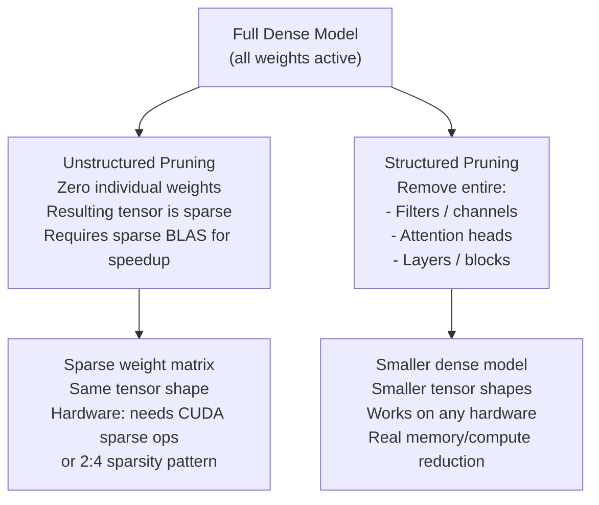

# ✂️ Pruning

> [!abstract] TL;DR
> Pruning removes redundant weights, neurons, or layers from a trained model to reduce size and inference cost. **Unstructured pruning** zeros individual weights (sparse tensors) — high compression but requires sparse compute support for speedup. **Structured pruning** removes entire filters, attention heads, or layers — immediately accelerates on standard hardware, no sparse ops needed. The key insight from the **Lottery Ticket Hypothesis** (Frankle & Carlin, 2019) is that large networks contain small subnetworks ("winning tickets") that can match full model performance when trained from scratch. Iterative pruning + fine-tuning recovers most of the accuracy lost from pruning.

## Intuition — Analogy First

Imagine **trimming a hedge** — two very different approaches:

**Unstructured pruning** (fine-grained): you snip individual leaves and thin twigs scattered throughout the hedge. The hedge becomes "sparse" — lots of empty space mixed with remaining foliage. The hedge *looks* smaller, but its overall shape (height, width, outer form) is unchanged. A bulldozer (GPU) that moves the whole hedge can't move it faster just because some leaves are gone.

**Structured pruning** (coarse-grained): you cut off entire branches. The hedge is physically smaller. The bulldozer now has less to move — real speedup, proportional to branches removed. But you might remove a branch that shaped the whole top — you must be selective about which branches to cut.

**The pruning insight**: a large overgrown hedge (overparameterised network) has many redundant branches (weights). Identifying and removing them without losing the essential shape (accuracy) requires finding which parts are truly load-bearing — that's the art of pruning.

## How It Works

### Unstructured vs Structured Pruning



### Pruning Criteria

**Magnitude-based** (simplest): prune weights with smallest absolute value. Assumption: small weights contribute little to the output.

**Gradient-based**: prune weights with smallest $|w_i \cdot g_i|$ (weight × gradient) — measures sensitivity of the loss to each weight.

**Taylor expansion** (Taylor FO pruning): approximate change in loss from removing weight $w_i$:

$$\Delta L \approx g_i \cdot w_i + \frac{1}{2} h_{ii} \cdot w_i^2$$

Second-order (Hessian $h_{ii}$) is more accurate but expensive. First-order ($g_i \cdot w_i$) is cheap and works well in practice.

**Activation-based (structured)**: prune channels/heads with low average activation magnitude. Channels that are typically zero after ReLU contribute nothing.

### Lottery Ticket Hypothesis

Frankle & Carlin (2019): "A randomly initialised, dense neural network contains a subnetwork ('winning ticket') that, when trained in isolation from its original initialisation, can match the full network's performance in comparable training time."

**Finding the ticket**: iterative magnitude pruning with weight rewinding:
1. Train full model to convergence.
2. Prune $p$\% of weights by magnitude.
3. Reset surviving weights to their values at initialisation (weight rewinding).
4. Train the subnetwork.
5. Repeat steps 2–4 until desired sparsity.

The subnetwork (winning ticket) with original initialisations can match full network accuracy at 80–90% sparsity for small models, though this effect is harder to demonstrate for very large models.

### Iterative Pruning + Fine-Tuning Pipeline

Best practice for structured pruning:

1. **Train** base model fully.
2. **Score** units (channels/heads) by importance criterion.
3. **Prune** lowest-scoring units (typically 10–30% per round).
4. **Fine-tune** for 1/3 the original training budget.
5. **Repeat** until target sparsity/size reached.

Gradual iterative pruning consistently outperforms one-shot pruning by 5–15% accuracy at equivalent sparsity.

### NVIDIA 2:4 Structured Sparsity

NVIDIA Ampere+ hardware natively accelerates **2:4 sparsity** (exactly 2 non-zero values in every group of 4 consecutive weights) via the Sparse Tensor Core. This is unstructured but in a regular pattern — 50% sparsity with 2× speedup on compatible hardware.

## The Math

**Pruning ratio**: $\rho = 1 - k/n$ where $k$ = remaining parameters, $n$ = total. At $\rho = 0.9$: 90% sparse, only 10% of weights remain.

**Taylor criterion** for structured channel pruning (first-order approximation of loss change from removing channel $c$):

$$\Theta(c) = \left|\sum_{f \in c} g_f \cdot h_f\right|$$

where $g_f$ = gradient, $h_f$ = activation value for feature $f$ in channel $c$. Prune channels with smallest $\Theta(c)$.

**Model speedup** from structured pruning of convolutional layers:

A conv layer with $C_{in}$ input channels, $C_{out}$ output channels, kernel $k \times k$, input $H \times W$:

$$\text{FLOPs} = 2 \times C_{in} \times C_{out} \times k^2 \times H \times W$$

Pruning $r$ fraction of output channels: $\text{FLOPs} \rightarrow (1-r) \times \text{FLOPs}$. **Linear speedup** with structured channel pruning.

**Accuracy-compression trade-off** (empirical rule of thumb): structured pruning loses ~0.5–1% accuracy per 10% channel reduction up to 50% reduction; then degradation accelerates.

## Code Demo

```python
import torch
import torch.nn as nn
import torch.nn.utils.prune as prune

# ── 1. Unstructured magnitude pruning ────────────────────────────
model = nn.Sequential(
    nn.Linear(256, 512), nn.ReLU(),
    nn.Linear(512, 512), nn.ReLU(),
    nn.Linear(512, 128),
)

linear1 = model[0]
print(f"Before pruning: {(linear1.weight != 0).sum()} non-zero weights")

# Apply L1 unstructured pruning (zero 30% of weights by magnitude)
prune.l1_unstructured(linear1, name='weight', amount=0.3)
print(f"After pruning:  {(linear1.weight != 0).sum()} non-zero weights")
print(f"Sparsity: {1 - (linear1.weight != 0).float().mean():.2%}")

# Make pruning permanent (remove hooks, create actual sparse weight)
prune.remove(linear1, 'weight')

# ── 2. Global magnitude pruning (across entire model) ─────────────
parameters_to_prune = (
    (model[0], 'weight'),
    (model[2], 'weight'),
    (model[4], 'weight'),
)

# Prune lowest 40% of weights globally across all layers
prune.global_unstructured(
    parameters_to_prune,
    pruning_method=prune.L1Unstructured,
    amount=0.4,
)

total = sum(p.nelement() for p in model.parameters() if p.requires_grad)
zero = sum((p == 0).sum().item() for p in model.parameters() if p.requires_grad)
print(f"Global sparsity: {zero/total:.2%}")

# ── 3. Structured pruning (remove entire channels) ───────────────
conv_model = nn.Sequential(
    nn.Conv2d(3, 64, 3, padding=1), nn.BatchNorm2d(64), nn.ReLU(),
    nn.Conv2d(64, 128, 3, padding=1), nn.BatchNorm2d(128), nn.ReLU(),
)

# Prune 30% of filters (structured along dim=0, which is output channels)
prune.ln_structured(conv_model[0], name='weight', amount=0.3, n=2, dim=0)
print(f"Conv1 output channels non-zero: {(conv_model[0].weight_mask.sum(dim=(1,2,3)) > 0).sum()}")

# ── 4. Iterative magnitude pruning with fine-tuning ───────────────
def iterative_prune_and_finetune(model, train_loader, num_rounds=5, prune_rate=0.2):
    """
    Iterative pruning: prune 20% per round, fine-tune between rounds.
    After 5 rounds: ~67% of weights removed (1 - 0.8^5).
    """
    optimizer = torch.optim.Adam(model.parameters(), lr=1e-4)
    criterion = nn.CrossEntropyLoss()

    for round_num in range(num_rounds):
        # Prune 20% more weights by magnitude
        for module in model.modules():
            if isinstance(module, nn.Linear):
                prune.l1_unstructured(module, name='weight', amount=prune_rate)

        # Fine-tune for a few steps
        model.train()
        for x, y in train_loader:
            optimizer.zero_grad()
            loss = criterion(model(x), y)
            loss.backward()
            optimizer.step()

        # Report sparsity
        total = sum(p.nelement() for p in model.parameters())
        zero = sum((p == 0).sum().item() for p in model.parameters())
        print(f"Round {round_num + 1}: Sparsity {zero/total:.1%}")

    # Make pruning permanent
    for module in model.modules():
        if isinstance(module, nn.Linear):
            prune.remove(module, 'weight')

    return model

# ── 5. Attention head pruning (structured, for transformers) ─────
from transformers import AutoModelForSequenceClassification

def prune_attention_heads(model, heads_to_prune: dict):
    """
    heads_to_prune: {layer_idx: [head_indices]}
    Example: {0: [0, 3], 6: [1, 7]}  — prune heads 0,3 from layer 0
    """
    model.prune_heads(heads_to_prune)
    return model

# Automated head importance scoring (Taylor criterion approximation)
def score_attention_heads(model, dataloader, device):
    """Score each head by gradient × activation magnitude."""
    head_importance = {}
    model.eval()

    for batch in dataloader:
        outputs = model(**batch, output_attentions=True)
        outputs.loss.backward()

        for layer_idx, layer in enumerate(model.bert.encoder.layer):
            attn = layer.attention.self
            # Importance: mean |gradient × weight| per head
            grad = attn.value.weight.grad
            weight = attn.value.weight
            num_heads = model.config.num_attention_heads
            head_dim = model.config.hidden_size // num_heads
            importance = (grad * weight).abs().view(num_heads, -1).mean(-1)
            head_importance[layer_idx] = importance.detach()

    return head_importance
```

## Real-World Example

**BERT-Medium** (Google, 2020) — structured pruning of BERT to produce a smaller, faster model.

The Google team applied structured attention head pruning and FFN layer pruning to BERT-Base (110M params):

- **Process**: score all 144 attention heads (12 layers × 12 heads) by Taylor importance. Prune lowest-scoring heads iteratively. Fine-tune after each round.
- **Result**: BERT-Medium (41M params, 8 layers, 8 heads) achieves 85% of BERT-Base accuracy with 63% fewer parameters and 2× faster inference.
- **Key finding**: some layers lose 4+ heads (very redundant); others lose only 1. Layer 12 (final) is most sensitive. This non-uniform pruning is impossible without structured importance scoring.

**NVIDIA 2:4 sparsity (A100/H100)**: NVIDIA demonstrated that ResNet-50 with 2:4 sparse pruning + fine-tuning achieves:
- Same ImageNet accuracy as dense model
- 2× Tensor Core speedup on Ampere hardware
- 50% model size reduction
This is the only form of unstructured pruning with hardware-native speedup on current GPUs.

## Trade-offs

| Method | Accuracy Impact | Real Speedup | Implementation | Hardware Requirement |
|---|---|---|---|---|
| Unstructured magnitude | Low (< 1% at 50%) | None without sparse ops | Simple | Sparse CUDA ops or NVIDIA 2:4 |
| NVIDIA 2:4 structured sparse | Very low | 2× on Ampere+ | Moderate | A100, H100 |
| Structured channel/filter | Moderate (1–3% at 50%) | Proportional (immediate) | Moderate | Any GPU/CPU |
| Attention head pruning | Low for moderate pruning | 1.5–2× | Moderate | Any |
| Layer pruning | High (risky) | Proportional | Simple | Any |
| Iterative + fine-tune | Lower than one-shot | Same as method | Higher cost | Any |

## When to Use vs Avoid

**Use structured pruning when:**
- Targeting deployment on standard CPU/GPU hardware (no sparse compute support)
- Model has clearly redundant attention heads or large FFN layers
- Can afford fine-tuning budget after pruning

**Use unstructured pruning when:**
- Targeting NVIDIA Ampere+ hardware with 2:4 sparsity support
- Model size (storage) is the constraint, not inference speed
- Compressing for transmission, not for compute

**Combine with quantization when:**
- Maximum compression needed: pruning first → quantize the pruned model → chain both benefits

**Avoid pruning when:**
- Model is already small (<10M params) — highly sensitive to pruning
- No fine-tuning budget available — accuracy loss from one-shot pruning is high
- Task is already at the accuracy edge — pruning will push it below acceptable threshold

## Common Pitfalls

1. **Pruning without fine-tuning**: one-shot pruning at >30% sparsity degrades accuracy severely. Always plan for at least 10% of original training budget for fine-tuning.
2. **Pruning too aggressively in early iterations**: prune slowly (10–20% per round) to give the network time to adapt. Pruning 80% in one shot destroys accuracy even if fine-tuning follows.
3. **Forgetting to prune BatchNorm channels alongside Conv channels**: if you prune 30% of Conv2d output channels, the corresponding BatchNorm2d must also have those 30% channels removed. Mismatched shapes cause runtime errors.
4. **Measuring sparsity instead of speedup**: a model with 90% weight sparsity may have zero speedup if the sparse ops are not hardware-accelerated. Always profile wall-clock inference time, not just parameter count.
5. **Ignoring the input channels of the next layer**: pruning output channels of layer $i$ requires pruning the corresponding input channels of layer $i+1$. Many pruning implementations handle this incorrectly for complex architectures (ResNets with skip connections).

## Related Concepts

- [[_MOC_Infrastructure|↑ Section MOC]]

- [[Knowledge_Distillation]] — train a small model to mimic a large one (often combined with pruning)
- [[Quantization]] — orthogonal compression: reduce precision of remaining weights
- [[Neural_Architecture_Search]] — automate finding compact architectures from scratch
- [[Mixed_Precision_Training]] — related concept of reducing numerical precision

## Review Questions

1. A ResNet-50 model is pruned with global unstructured magnitude pruning at 80% sparsity and inference time is unchanged. Why? What would need to change to get a real speedup from unstructured pruning?
2. Explain the Lottery Ticket Hypothesis. Why does weight rewinding (resetting to initial values) matter — what breaks if you reinitialise the surviving weights randomly instead?
3. You want to prune BERT for a low-latency inference requirement. You can achieve the target latency either by pruning 50% of attention heads or by pruning 30% of FFN channels. Which would you choose and why? Consider both accuracy and latency impacts.

## Sources

- Frankle & Carlin, "The Lottery Ticket Hypothesis: Finding Sparse, Trainable Neural Networks" (ICLR 2019)
- Molchanov et al., "Pruning Convolutional Neural Networks for Resource Efficient Inference" (ICLR 2017)
- Michel et al., "Are Sixteen Heads Really Better than One?" (NeurIPS 2019) — attention head pruning
- NVIDIA 2:4 Sparsity: https://developer.nvidia.com/blog/accelerating-inference-with-sparsity-using-ampere/
- PyTorch pruning tutorial: https://pytorch.org/tutorials/intermediate/pruning_tutorial.html

#pruning #compression #infrastructure #structured-pruning #unstructured-pruning #lottery-ticket
