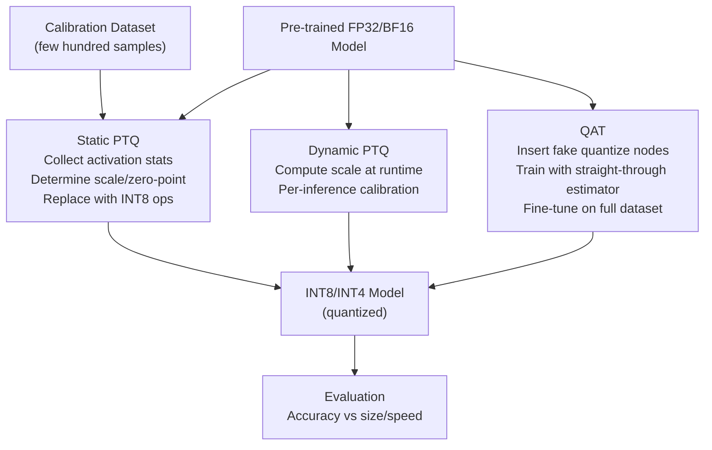

# 🎯 Quantization

> [!abstract] TL;DR
> Quantization reduces model precision from FP32/BF16 to lower-bit integers (INT8, INT4) to shrink model size and accelerate inference. The key trade-off is accuracy vs compression. Two strategies: **Post-Training Quantization (PTQ)** — calibrate a pre-trained model with a small dataset, no retraining; and **Quantization-Aware Training (QAT)** — simulate quantisation during training to recover accuracy loss. Modern LLM deployment heavily uses INT4 quantisation (GPTQ, AWQ, GGUF) to fit 70B models on consumer hardware. Edge deployment uses INT8 on Google Coral TPU and INT4 on Apple Neural Engine.

## Intuition — Analogy First

Think of quantization as **rounding π to different precisions**:

- FP32: π ≈ 3.14159265 (8 significant figures — exact enough for aerospace)
- BF16: π ≈ 3.14 (3 significant figures — good for most engineering)
- INT8: π ≈ 3 (integer — rough, but maybe enough if we're just counting apples)
- INT4: π ≈ 3 (very rough — works if the downstream task tolerates it)

The insight: neural networks have millions of parameters. Small errors in individual weights tend to **average out** across large operations (the law of large numbers). A ResNet-50 with 25M INT8 weights produces the same output as FP32 (within ~0.5% accuracy) because quantisation errors cancel. But quantise too aggressively (INT2) and errors amplify — the model loses coherence.

The challenge: **not all parameters are equally sensitive**. Certain activation layers and weight distributions have outliers that quantisation handles poorly. Modern LLM quantisation (GPTQ, AWQ) explicitly identifies and preserves these sensitive weights.

## How It Works

### Quantization Fundamentals

**Symmetric quantization** (zero-point = 0):

$$q = \text{clip}\left(\text{round}\left(\frac{x}{s}\right), -2^{b-1}, 2^{b-1}-1\right)$$

**Asymmetric quantization** (with zero-point offset):

$$q = \text{clip}\left(\text{round}\left(\frac{x}{s}\right) + z, 0, 2^b - 1\right)$$

where $s$ = scale factor, $z$ = zero-point integer, $b$ = bit width.

**Granularity levels**:
- **Per-tensor**: single scale/zero for the entire tensor (fastest, least accurate)
- **Per-channel**: one scale per output channel (better accuracy, standard for weights)
- **Per-group** (group quantization): one scale per group of N values (best accuracy, used in INT4 LLMs)



### PTQ vs QAT

| Approach | Data Required | Accuracy | Compute Cost | Use Case |
|---|---|---|---|---|
| Dynamic PTQ | None | -1–3% | None | RNNs, embeddings |
| Static PTQ | 100–500 calibration samples | -0.5–2% | Minutes | CNNs, transformers |
| QAT | Full training dataset | -0.1–0.5% | Full training cost | Mobile, edge, accuracy-critical |
| GPTQ (PTQ + reconstruction) | ~128 samples | -0.1–1% | Hours (per layer) | LLMs |
| AWQ (activation-aware) | ~128 samples | -0.1–0.5% | Hours | LLMs on edge |

### LLM-Specific Quantization

LLMs have **outlier activations** — a small fraction of channels have values 100× larger than the mean. This breaks per-tensor quantization for activations.

**LLM.int8()** (Dettmers et al., 2022): use INT8 for normal weights/activations, FP16 for outlier channels. Achieves near-FP16 accuracy with 8-bit memory.

**GPTQ** (Frantar et al., 2022): layer-wise quantization using second-order information (Hessian). Reconstructs each layer's output to minimise quantization error. Enables high-quality INT4 quantization of LLaMA-class models.

**AWQ** (Lin et al., 2023): identifies "salient" weight channels (those with large activation scales) and protects them with higher precision or per-group scaling. Better accuracy than GPTQ at INT4.

**GGUF/llama.cpp**: INT4/INT5/INT8 CPU inference format. Enables LLaMA 70B on a Mac Studio with 192GB unified memory.

## The Math

**Quantization and dequantization**:

$$q = \text{round}\!\left(\frac{x}{s}\right) + z, \qquad \hat{x} = s \cdot (q - z)$$

**Quantization error** (for uniform distribution of $x \in [-r, r]$):

$$\mathbb{E}\!\left[(\hat{x} - x)^2\right] = \frac{s^2}{12} = \frac{(2r)^2}{12 \cdot (2^b - 1)^2} \approx \frac{r^2}{3 \cdot 4^b}$$

Each additional bit halves the error standard deviation. INT8 error is $2^8 = 256\times$ smaller than INT4 in standard deviation.

**Per-group scale** (group size $g$): scale $s_j = \max(|x_{jg:(j+1)g}|) / (2^{b-1} - 1)$. With $g = 128$ and 16-bit scales stored, the overhead is $16/(128 \times b) = 1/8b$ bits per original parameter.

For INT4 with g=128: effective bits per weight = $4 + 16/128 = 4.125$ bits (vs 4 nominal).

## Code Demo

```python
import torch
import torch.nn as nn

# ── 1. Dynamic PTQ (simplest — no calibration data needed) ───────
model_fp32 = nn.Sequential(
    nn.Linear(512, 512), nn.ReLU(),
    nn.Linear(512, 512), nn.ReLU(),
    nn.Linear(512, 128),
)

# Dynamic: weights quantized at load, activations quantized at runtime
model_int8_dynamic = torch.quantization.quantize_dynamic(
    model_fp32,
    {nn.Linear},        # quantize these module types
    dtype=torch.qint8   # INT8
)
print(model_int8_dynamic)

# Size comparison
def model_size_mb(model):
    total = sum(p.nelement() * p.element_size() for p in model.parameters())
    return total / 1e6

print(f"FP32: {model_size_mb(model_fp32):.2f}MB")
print(f"INT8: {model_size_mb(model_int8_dynamic):.2f}MB")  # ~4x smaller

# ── 2. Static PTQ (calibration required) ──────────────────────────
# Prepare model with fake-quantize observers
model_fq = nn.Sequential(
    nn.Linear(512, 512), nn.ReLU(),
    nn.Linear(512, 512), nn.ReLU(),
    nn.Linear(512, 128),
)
model_fq.eval()

# Apply default quantization configuration
model_fq.qconfig = torch.quantization.get_default_qconfig("fbgemm")  # x86
torch.quantization.prepare(model_fq, inplace=True)  # insert observers

# Calibrate: run forward pass on representative data
calibration_data = torch.randn(100, 512)
with torch.no_grad():
    for i in range(0, len(calibration_data), 10):
        model_fq(calibration_data[i:i+10])  # observers collect statistics

# Convert: replace float ops with quantized ops
torch.quantization.convert(model_fq, inplace=True)
print(f"Static INT8: {model_size_mb(model_fq):.2f}MB")

# ── 3. ONNX Runtime INT8 (production inference) ───────────────────
# pip install onnxruntime optimum
import onnxruntime as ort
from onnxruntime.quantization import quantize_dynamic, QuantType
import numpy as np

# Export model to ONNX
dummy_input = torch.randn(1, 512)
torch.onnx.export(model_fp32, dummy_input, "model.onnx",
                  input_names=["input"], output_names=["output"])

# Quantize the ONNX model to INT8
quantize_dynamic(
    model_input="model.onnx",
    model_output="model_int8.onnx",
    weight_type=QuantType.QInt8,
)

# Run inference with ONNX Runtime
session = ort.InferenceSession("model_int8.onnx")
x_np = np.random.randn(1, 512).astype(np.float32)
out = session.run(["output"], {"input": x_np})
print(f"ONNX INT8 output shape: {out[0].shape}")

# ── 4. LLM INT4 with bitsandbytes (NF4 for QLoRA) ────────────────
# pip install bitsandbytes transformers
from transformers import AutoModelForCausalLM, BitsAndBytesConfig

bnb_config = BitsAndBytesConfig(
    load_in_4bit=True,           # load model in 4-bit
    bnb_4bit_quant_type="nf4",   # NormalFloat4 — better for normally distributed weights
    bnb_4bit_use_double_quant=True,  # quantize the quantization constants too
    bnb_4bit_compute_dtype=torch.bfloat16,  # compute in BF16 after dequantizing
)

# model = AutoModelForCausalLM.from_pretrained(
#     "meta-llama/Llama-3-70b-hf",
#     quantization_config=bnb_config,
#     device_map="auto",
# )
# Memory: ~35GB (vs 140GB for BF16) — fits on 2× A100 40GB or 1× H100 80GB
```

## Real-World Example

**Google Coral TPU** — purpose-built INT8 inference accelerator deployed at the edge.

- **Hardware**: Edge TPU (4 TOPS at INT8, <2W) — cameras, smart speakers, medical devices.
- **Quantization flow**: train FP32 model → QAT with TensorFlow's `tf.quantization` → export to INT8 TFLite → deploy to Coral.
- **Why INT8 specifically**: the Coral Edge TPU's systolic array is designed for 8-bit operations; FP16/FP32 is not supported. QAT is required for <1% accuracy loss.

**Apple Neural Engine (ANE)** — INT8 and INT4 for on-device ML:
- iPhone 16 ANE: 38 TOPS at INT8.
- Core ML tools quantize PyTorch/TF models to INT8/INT4 automatically via `coremltools.optimize`.
- LLaMA variants with INT4 (4-bit palettization) run at ~10 tokens/sec on iPhone 16 Pro.

**GPTQ + llama.cpp for local LLMs**: LLaMA-3 70B in Q4_K_M (4-bit with group quantization) fits in ~40GB RAM, runs at ~3 tokens/sec on Apple M3 Max with 128GB unified memory.

## Trade-offs

| Quantization | Size Reduction | Accuracy Loss | Inference Speed | Hardware |
|---|---|---|---|---|
| FP16/BF16 | 2× | None | 2–3× (Tensor Cores) | GPU |
| INT8 per-tensor | 4× | 0.5–2% | 2–4× | GPU, CPU, TPU |
| INT8 per-channel | 4× | 0.1–0.5% | 2–4× | GPU, CPU, TPU |
| INT4 (GPTQ) | 8× | 0.5–1.5% | 3–5× | GPU |
| INT4 (AWQ) | 8× | 0.2–0.8% | 3–5× | GPU |
| INT4 group-wise | 8× | 0.1–0.5% | 3–5× | GPU, CPU |
| INT2/INT3 | 16× | 2–10%+ | High | Experimental |

## When to Use vs Avoid

**Use PTQ (INT8) when:**
- Model is already trained; retraining is expensive or impossible
- Target hardware supports efficient INT8 (most modern accelerators)
- Accuracy drop < 1% is acceptable (typically true for large models)

**Use QAT when:**
- Mobile/edge deployment where every 0.1% accuracy matters
- Smaller models that are more sensitive to quantization
- Target hardware requires INT8 (Coral TPU, Apple ANE)

**Use INT4 (GPTQ/AWQ) when:**
- Deploying large LLMs (>7B) on resource-constrained hardware
- Memory bandwidth is the primary bottleneck (INT4 weights need less bandwidth)
- Using GGUF/llama.cpp for CPU inference

**Avoid aggressive quantization (INT4 or lower) when:**
- Model is small (< 100M params) — quantization errors don't average out
- Task is numerically sensitive (regression, probabilistic modelling)
- You need guaranteed accuracy (medical, safety-critical applications)

## Common Pitfalls

1. **Per-tensor vs per-channel**: per-tensor quantization for weights causes high accuracy loss. Always use per-channel (one scale per output channel) for weights. For activations, per-tensor is often necessary for hardware compatibility.
2. **Calibration set not representative**: static PTQ calibration data must cover the real data distribution. Calibrating on training data but deploying on out-of-distribution data causes accuracy degradation.
3. **Forgetting to `.eval()` before PTQ**: BatchNorm must be in eval mode during calibration to produce correct running statistics. Calibrating in train mode gives garbage statistics.
4. **Quantizing embeddings**: embedding layers with large vocabularies have irregular distributions — per-tensor quantization of embeddings causes large errors. Use dynamic quantization or keep embeddings in FP16.
5. **Ignoring outlier activations in LLMs**: transformers have large activation outliers in specific channels. Standard INT8 PTQ on LLMs (e.g., 175B GPT-3) without outlier handling loses ~5% accuracy. Use LLM.int8(), GPTQ, or AWQ instead.

## Related Concepts

- [[_MOC_Infrastructure|↑ Section MOC]]

- [[Mixed_Precision_Training]] — training-time precision reduction (BF16/FP16)
- [[Knowledge_Distillation]] — complementary to quantization for model compression
- [[Pruning]] — another orthogonal compression technique
- [[GPU_Architecture_Basics]] — INT8 Tensor Core support on Ampere+

## Review Questions

1. Explain the difference between symmetric and asymmetric quantization. When would you prefer asymmetric? What is the trade-off in terms of hardware efficiency?
2. Why do large LLMs (>1B parameters) suffer less accuracy loss from INT8 quantization than small models (< 10M parameters)? What statistical property of large models helps here?
3. You quantize a BERT model to INT8 using static PTQ and observe 3% accuracy loss on the dev set. List three things you would check/change to recover accuracy without switching to QAT.

## Sources

- Dettmers et al., "LLM.int8(): 8-bit Matrix Multiplication for Transformers at Scale" (NeurIPS 2022)
- Frantar et al., "GPTQ: Accurate Post-Training Quantization for Generative Pre-trained Transformers" (ICLR 2023)
- Lin et al., "AWQ: Activation-aware Weight Quantization for LLM Compression and Acceleration" (2023)
- Jacob et al., "Quantization and Training of Neural Networks for Efficient Integer-Arithmetic-Only Inference" (CVPR 2018)
- PyTorch quantization docs: https://pytorch.org/docs/stable/quantization.html

#quantization #inference #int8 #int4 #ptq #qat #infrastructure #optimisation
