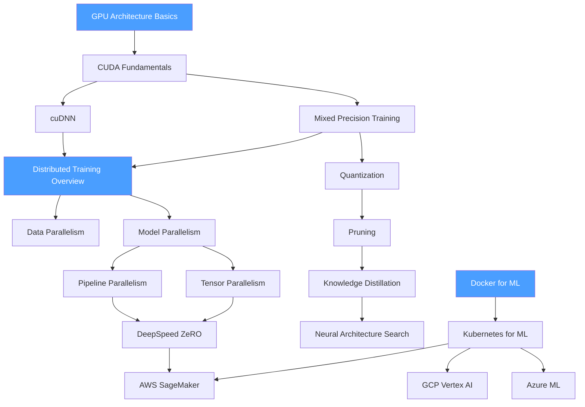

# 🗺️ Infrastructure — Map of Content

> [!info] How to use this map
> Start with Fundamentals, follow the arrows, and use the Learning Path below as your guide.

---

## Concept Map

---

## Learning Path

1. [[GPU_Architecture_Basics]] — understanding SM counts, memory hierarchy (HBM → L2 → SRAM), and the compute/memory bandwidth trade-off is the foundation for every optimization decision
2. [[CUDA_Fundamentals]] — kernels, threads, blocks, warps, and memory types; needed to understand cuDNN and profiling tools
3. [[Mixed_Precision_Training]] — FP16/BF16 with FP32 master weights and loss scaling; the single highest-impact training optimization, prerequisite to distributed training discussion
4. [[Data_Parallelism]] — DDP and parameter server patterns; the standard starting point for multi-GPU training
5. [[Model_Parallelism]] — tensor and pipeline splitting for models too large to fit on one device; required for LLM training
6. [[Pipeline_Parallelism]] — micro-batching across pipeline stages to hide bubble overhead; GPipe and PipeDream
7. [[Tensor_Parallelism]] — splitting individual weight matrices across devices; Megatron-LM column/row patterns
8. [[DeepSpeed_ZeRO]] — ZeRO stages 1/2/3, optimizer state partitioning, and offloading for extreme memory efficiency
9. [[Quantization]] — INT8/INT4 weight quantization, calibration, and GPTQ/AWQ post-training methods
10. [[Knowledge_Distillation]] — teacher-student training, soft labels, and intermediate feature distillation
11. [[Pruning]] — structured vs. unstructured pruning, magnitude and gradient criteria, and lottery ticket hypothesis
12. [[Neural_Architecture_Search]] — differentiable NAS, evolutionary search, and hardware-aware optimization
13. [[cuDNN]] — NVIDIA's deep learning primitives library; convolution algorithms, tensor ops, and profiling hooks
14. [[Distributed_Training_Overview]] — communication primitives (AllReduce, AllGather, ReduceScatter), NCCL, and topology awareness
15. [[Docker_for_ML]] — reproducible environments, CUDA base images, multi-stage builds, and GPU passthrough
16. [[Kubernetes_for_ML]] — GPU device plugins, resource quotas, node selectors, and scheduling for ML workloads
17. [[AWS_SageMaker]] — managed training jobs, distributed training libraries, SageMaker Pipelines, and endpoints
18. [[GCP_Vertex_AI]] — custom training, model registry, Vertex Pipelines, and TPU access
19. [[Azure_ML]] — compute clusters, environments, pipelines, and MLflow integration
20. [[Ollama]] — local LLM serving on CPU/GPU without cloud dependency; GGUF format, model pull/run API, and REST interface

---

## All Notes in This Section

| Note | Core Idea | Difficulty |
|------|-----------|------------|
| [[GPU_Architecture_Basics]] | SM architecture, memory hierarchy, occupancy, and roofline model | Beginner |
| [[CUDA_Fundamentals]] | Kernels, thread hierarchy, shared memory, and CUDA streams | Intermediate |
| [[cuDNN]] | Optimized primitives for conv, pooling, normalization, and RNN ops | Intermediate |
| [[Distributed_Training_Overview]] | Collective operations, NCCL, and distributed strategy selection | Intermediate |
| [[Data_Parallelism]] | DDP gradient synchronization, gradient accumulation, and all-reduce | Intermediate |
| [[Model_Parallelism]] | Tensor splitting and device placement for over-memory models | Advanced |
| [[Pipeline_Parallelism]] | Micro-batching, bubble fraction, and schedule variants | Advanced |
| [[Tensor_Parallelism]] | Column/row linear splits, fused attention, and communication volume | Advanced |
| [[DeepSpeed_ZeRO]] | Optimizer state, gradient, and parameter partitioning across ranks | Advanced |
| [[Mixed_Precision_Training]] | AMP, loss scaling, BF16 vs FP16, and numerical stability | Intermediate |
| [[Quantization]] | PTQ, QAT, GPTQ, AWQ, SmoothQuant, and hardware targets | Advanced |
| [[Pruning]] | Magnitude pruning, structured pruning, and sparse GPU execution | Advanced |
| [[Knowledge_Distillation]] | Soft targets, feature-level distillation, and DistilBERT case study | Intermediate |
| [[Neural_Architecture_Search]] | DARTS, EfficientNet search, hardware-aware NAS, and once-for-all | Advanced |
| [[Docker_for_ML]] | Dockerfile patterns, NVIDIA Container Toolkit, and image layering | Beginner |
| [[Kubernetes_for_ML]] | GPU scheduling, resource limits, taints/tolerations, and Volcano | Intermediate |
| [[AWS_SageMaker]] | Training jobs, distributed training library, SageMaker Studio | Intermediate |
| [[GCP_Vertex_AI]] | Custom jobs, TPU pods, Model Garden, and Vertex Pipelines | Intermediate |
| [[Azure_ML]] | Compute clusters, environments, component-based pipelines | Intermediate |
| [[Ollama]] | Local LLM serving; GGUF model management, REST API, and CPU/GPU inference without cloud dependency | Beginner |

---

## Key Questions This Section Answers

- What limits GPU utilization and how do you measure it using the roofline model?
- When should you use data parallelism vs. model parallelism vs. pipeline parallelism?
- How does DeepSpeed ZeRO achieve training of 100B+ parameter models on commodity GPU clusters?
- What is the difference between quantization-aware training and post-training quantization?
- How do knowledge distillation and pruning complement each other for model compression?
- Why is mixed precision training almost universally used for large model training?
- How does Kubernetes GPU scheduling work, and what are common pitfalls for ML workloads?
- What are the key trade-offs between AWS SageMaker, GCP Vertex AI, and Azure ML?

---

## Connections to Other Sections

- [[_MOC_MLOps]] — infrastructure is the execution substrate for MLOps pipelines; Kubernetes and cloud platforms host training, serving, and monitoring components
- [[_MOC_Deep_Learning]] — GPU computing and distributed training are prerequisites for understanding how large deep learning models are trained in practice
- [[_MOC_Generative_AI]] — inference optimization (quantization, Flash Attention, continuous batching) bridges infrastructure and generative AI serving
