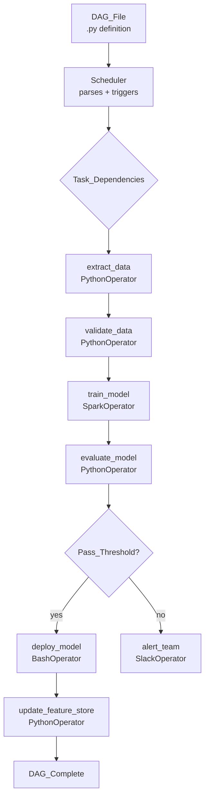

# 🌬️ Apache Airflow

> [!abstract] TL;DR
> Apache Airflow is a Python-based workflow orchestration platform that lets you define, schedule, monitor, and retry data and ML pipelines as Directed Acyclic Graphs (DAGs). It is the industry-standard for orchestrating ETL/ELT jobs, ML training runs, and multi-step data workflows at scale.

## Intuition — Analogy First

Airflow is a **factory production scheduler**. Imagine a car factory:
- Each workstation (task) has a defined job: weld chassis, attach doors, paint, quality check.
- The scheduler decides which workstations run, in what order, and when — and handles the case where one station breaks down (retry, alert, skip).
- The factory floor has a visual dashboard showing which cars are at which stage.

In data/ML: your "workstations" are Python functions, Spark jobs, SQL queries, or shell scripts. Airflow is the scheduler that connects them, handles dependencies, retries failures, and gives you a visual map of every pipeline run.

## How It Works — Mechanics

### Core Concepts

| Concept | Description |
|---|---|
| **DAG** | Directed Acyclic Graph — the pipeline definition. Nodes = tasks, edges = dependencies. |
| **Task** | A single unit of work (Python function, Bash command, SQL query, Spark job). |
| **Operator** | Template for a task type: `PythonOperator`, `BashOperator`, `SparkSubmitOperator`. |
| **Sensor** | Special operator that waits for a condition: file exists, HTTP endpoint responds, S3 key appears. |
| **XCom** | Cross-communication: mechanism for tasks to pass small values to downstream tasks. |
| **Scheduler** | Process that reads DAG files and triggers task runs based on schedule. |
| **Executor** | Determines how tasks run: `LocalExecutor` (subprocess), `CeleryExecutor` (distributed), `KubernetesExecutor` (K8s pods). |

### Execution Flow



### Scheduling

Airflow uses cron expressions or `timedelta` for scheduling:
- `@daily` = `0 0 * * *` — runs at midnight every day
- `@hourly` = every hour
- `timedelta(hours=6)` = every 6 hours
- `"0 6 * * 1"` = every Monday at 6 AM

### Backfill

Airflow tracks which DAG runs have been executed per schedule interval. If a DAG is created with a `start_date` in the past and `catchup=True`, Airflow automatically back-fills all missed runs.

```bash
# Manual backfill via CLI
airflow dags backfill -s 2026-01-01 -e 2026-01-31 my_ml_pipeline
```

## Code Demo

### Modern Airflow 2.x DAG with @dag/@task decorators

```python
from airflow.decorators import dag, task
from airflow.operators.bash import BashOperator
from airflow.providers.apache.spark.operators.spark_submit import SparkSubmitOperator
from datetime import datetime, timedelta
import pandas as pd

default_args = {
    "owner": "ml-team",
    "retries": 2,
    "retry_delay": timedelta(minutes=5),
    "email_on_failure": True,
    "email": ["ml-alerts@company.com"],
}

@dag(
    dag_id="ml_training_pipeline",
    schedule_interval="0 2 * * *",   # 2 AM daily
    start_date=datetime(2026, 1, 1),
    catchup=False,                    # don't backfill past runs
    default_args=default_args,
    tags=["ml", "training"],
)
def ml_training_pipeline():

    @task()
    def extract_features(**context) -> dict:
        """Pull feature data from BigQuery for yesterday's partition."""
        execution_date = context["ds"]  # "2026-07-25"
        # In production: run BigQuery/Spark query
        print(f"Extracting features for partition: {execution_date}")
        # XCom: return small metadata (not large datasets)
        return {"feature_path": f"gs://ml-bucket/features/{execution_date}/", "row_count": 1_250_000}

    @task()
    def validate_features(feature_meta: dict) -> dict:
        """Run data quality checks before training."""
        row_count = feature_meta["row_count"]
        if row_count < 100_000:
            raise ValueError(f"Too few rows: {row_count}. Expected >= 100,000")
        print(f"Validation passed: {row_count} rows at {feature_meta['feature_path']}")
        return feature_meta

    @task()
    def train_model(feature_meta: dict) -> dict:
        """Kick off model training (simplified — real case uses SparkOperator or KubernetesPodOperator)."""
        import subprocess
        result = subprocess.run([
            "python", "train.py",
            "--feature-path", feature_meta["feature_path"],
            "--output", f"gs://ml-bucket/models/{feature_meta['feature_path'].split('/')[-2]}/"
        ], capture_output=True, check=True)
        model_path = f"gs://ml-bucket/models/latest/"
        return {"model_path": model_path, "auc": 0.87}  # in reality, parse from training output

    @task()
    def evaluate_and_gate(training_result: dict) -> bool:
        """Gate: only deploy if AUC > threshold."""
        auc = training_result["auc"]
        threshold = 0.82
        print(f"Model AUC: {auc} vs threshold: {threshold}")
        if auc < threshold:
            raise ValueError(f"Model failed quality gate: AUC={auc} < {threshold}")
        return True

    @task()
    def deploy_model(training_result: dict, gate_passed: bool):
        """Register model in model registry and update serving endpoint."""
        print(f"Deploying model from {training_result['model_path']}")
        # In production: call MLflow, Vertex AI, or custom registry API

    # Wire up the DAG
    features = extract_features()
    validated = validate_features(features)
    trained = train_model(validated)
    gate = evaluate_and_gate(trained)
    deploy_model(trained, gate)

# Instantiate DAG
dag_instance = ml_training_pipeline()
```

### Sensor Example — Wait for upstream data

```python
from airflow.sensors.s3_key_sensor import S3KeySensor
from airflow.decorators import dag, task
from datetime import datetime

@dag(schedule_interval="0 4 * * *", start_date=datetime(2026, 1, 1), catchup=False)
def pipeline_with_sensor():

    # Wait until upstream pipeline deposits file in S3
    wait_for_data = S3KeySensor(
        task_id="wait_for_feature_file",
        bucket_name="ml-bucket",
        bucket_key="features/{{ ds }}/part-00000.parquet",
        poke_interval=300,   # check every 5 minutes
        timeout=3600,        # fail after 1 hour
        mode="reschedule",   # release worker slot while waiting
    )

    @task()
    def process_data():
        print("Data is ready, processing...")

    wait_for_data >> process_data()

dag_instance = pipeline_with_sensor()
```

### XCom for Inter-Task Data

```python
@task()
def get_config() -> dict:
    return {"learning_rate": 0.001, "epochs": 50}

@task()
def train(config: dict):
    print(f"Training with lr={config['learning_rate']}, epochs={config['epochs']}")

# TaskFlow API automatically pushes/pulls XCom
config = get_config()
train(config)
```

## Real-World Example

**Airbnb** open-sourced Airflow in 2014 (donated to Apache in 2016). They use it to orchestrate thousands of daily pipelines: data ingestion, feature computation, model training (pricing models, search ranking), and reporting. Their "metrics" pipeline DAG runs hundreds of SQL tasks every night to compute host/guest metrics used in ML models.

Airflow is used at **Spotify, Pinterest, Lyft, ING Bank, Robinhood** and thousands of other companies. Most large ML teams run 50–2,000+ DAGs in production.

## Trade-offs

| | Airflow | Prefect | Dagster |
|---|---|---|---|
| **Paradigm** | DAG-first, Python | Python-first, DAG auto-inferred | Asset-centric (data assets not tasks) |
| **Learning curve** | Moderate (DAG structure) | Low (pure Python) | Moderate (asset model) |
| **Observability** | Task-level UI | Flow-level, good UI | Asset lineage built-in |
| **Dynamic pipelines** | Limited (dynamic task mapping in 2.3+) | Native | Native |
| **Deployment** | Self-hosted or MWAA/Cloud Composer | Prefect Cloud or self-hosted | Dagster Cloud or self-hosted |
| **ML-native** | Needs plugins | Needs plugins | Has Dagster ML integrations |
| **Best for** | Established teams, complex ETL | Python-native teams, simpler pipelines | Data asset-centric organizations |

## When to Use vs Avoid

**Use Airflow when:**
- You need a battle-tested, widely-supported orchestrator with a large plugin ecosystem.
- Your pipelines are DAG-shaped (clear upstream/downstream dependencies).
- You need cross-team visibility via a shared UI.
- You're integrating with Spark, BigQuery, dbt, and cloud services (100+ providers available).

**Avoid Airflow when:**
- Pipelines are highly dynamic (hundreds of tasks generated at runtime) — consider Prefect or Dagster.
- You need sub-minute scheduling — Airflow's scheduler has ~seconds to minutes overhead.
- You want a pure-Python experience without learning Airflow concepts — use Prefect.
- Your "pipeline" is really a real-time stream — use Kafka/Flink instead.

## Common Pitfalls

1. **XCom abuse**: XCom is for small metadata (paths, row counts). Never push DataFrames or model weights through XCom — write to S3/GCS and pass the path.
2. **Top-level DB calls in DAG files**: the scheduler imports DAG files repeatedly. DB connections or API calls at module level cause scheduler overload. Move all I/O inside task functions.
3. **`catchup=True` with old start_date**: if you set `start_date=datetime(2020,1,1)` with `catchup=True`, Airflow queues 6 years of backfill runs. Always set `catchup=False` unless you explicitly need it.
4. **Parallelism without connection pooling**: many parallel DB tasks can exhaust DB connections. Use Airflow's connection pool settings and configure `max_active_runs`.
5. **Ignoring task idempotency**: if a task reruns due to failure, will it duplicate data? Design every task to be idempotent (see [[ETL_ELT_for_ML]]).
6. **Monolithic DAGs**: one giant DAG with 200 tasks is hard to debug. Break into smaller DAGs that trigger each other via `TriggerDagRunOperator`.

## Related Concepts

- [[_MOC_Data_Engineering|↑ Section MOC]]

- [[ETL_ELT_for_ML]] — the pipeline patterns Airflow orchestrates
- [[Apache_Spark_for_ML]] — commonly invoked by Airflow's `SparkSubmitOperator`
- [[Kubeflow]] — ML-specific orchestration running on Kubernetes
- [[Feature_Stores]] — Airflow pipelines often write computed features to feature stores
- [[Data_Quality_and_Validation]] — Great Expectations checks can be wired as Airflow tasks

## Review Questions

1. Why should you avoid making database connections at the top level of a DAG file (outside task functions), and what happens if you do?
2. A daily Airflow DAG has been failing for 3 days. When you fix the issue and turn it back on with `catchup=True`, what happens? How would you handle this safely?
3. You have a task that trains a model and produces a 2GB pickle file. A downstream task needs to use it. How should you pass this artifact between tasks, and why?

## Sources

- Apache Airflow Documentation — https://airflow.apache.org/docs/
- Airflow original paper: "Airflow: a workflow management platform" (Airbnb, 2015)
- "Data Pipelines with Apache Airflow" — Bas Harenslak & Julian de Ruiter (Manning, 2021)
- Airflow GitHub: https://github.com/apache/airflow

#data-engineering #orchestration #airflow #dag #pipelines #ml-infrastructure #scheduling
