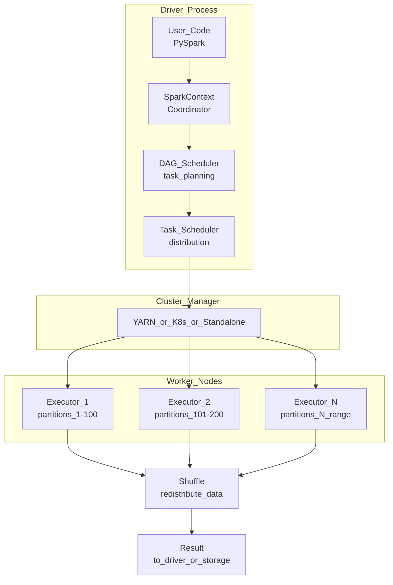

# ⚡ Apache Spark for ML

> [!abstract] TL;DR
> Apache Spark is a distributed data processing engine that processes datasets too large for a single machine. For ML, it provides PySpark for DataFrame operations and MLlib for distributed model training. Use it when data exceeds ~50–100 GB. Its lazy evaluation, in-memory computation, and unified batch+streaming API make it the default large-scale ML data prep tool.

## Intuition — Analogy First

A single Excel spreadsheet maxes out at about 1 million rows. When you have 1 billion rows, you need a **distributed Excel that runs on a thousand computers simultaneously**.

Spark is exactly that. You write the same DataFrame code (`df.groupBy().agg()`) but instead of running on your laptop, the computation is split across a cluster. Each machine processes its chunk, and Spark coordinates the results. The "magic" is that you don't need to think about which machine handles which rows — Spark's scheduler handles that transparently.

**RDDs vs DataFrames**: Think of RDDs (the old API) as programming in assembly — full control but verbose. DataFrames (the modern API) are like SQL — high-level, optimized automatically by Spark's Catalyst query optimizer, and 10–100x faster for most workloads.

## How It Works — Mechanics

### Spark Architecture



### Key Concepts

| Concept | Description |
|---|---|
| **RDD** | Resilient Distributed Dataset — immutable distributed collection, low-level API |
| **DataFrame** | Distributed table with named columns, optimized via Catalyst — use this |
| **Partition** | Chunk of data on one executor; more partitions = more parallelism |
| **Lazy evaluation** | Transformations build a plan; action (`.collect()`, `.write()`) triggers execution |
| **Shuffle** | Moving data between nodes for aggregations/joins — the expensive operation |
| **MLlib** | Spark's distributed ML library: pipelines, classification, regression, clustering, ALS |
| **Catalyst** | Query optimizer that rewrites your DataFrame plan for efficiency |

### When to Use Spark vs Pandas

| | Pandas | PySpark |
|---|---|---|
| **Data size** | < 10–20 GB | > 50–100 GB |
| **Compute** | Single machine | Cluster (cloud) |
| **Iteration speed** | Fast (no cluster startup) | Slow first run (~minutes) |
| **Supported ops** | Everything | ~80% of pandas ops |
| **ML libraries** | sklearn, XGBoost, PyTorch | MLlib, distributed sklearn via Spark |

### Spark + Delta Lake

Spark integrates natively with Delta Lake for ACID writes on object storage — important for ML feature tables where multiple pipelines write concurrently.

## Code Demo

### PySpark DataFrame Operations

```python
from pyspark.sql import SparkSession
from pyspark.sql import functions as F
from pyspark.sql.window import Window

spark = SparkSession.builder \
    .appName("ML-Feature-Engineering") \
    .config("spark.executor.memory", "8g") \
    .config("spark.executor.cores", "4") \
    .config("spark.sql.shuffle.partitions", "200") \
    .getOrCreate()

# Read parquet from S3 (lazy — no data loaded yet)
df = spark.read.parquet("s3://ml-bucket/raw/events/year=2026/")

# Transformations (still lazy — building execution plan)
df_features = df \
    .filter(F.col("event_type") == "purchase") \
    .filter(F.col("amount_usd") > 0) \
    .withColumn("log_amount", F.log1p(F.col("amount_usd"))) \
    .withColumn("hour_of_day", F.hour(F.col("event_timestamp")))

# Window function: 7-day rolling purchase count per user
w = Window.partitionBy("user_id").orderBy(F.col("event_timestamp").cast("long")).rangeBetween(-7*86400, 0)
df_features = df_features.withColumn("purchases_7d", F.count("*").over(w))

# Aggregate features
df_user_features = df_features.groupBy("user_id").agg(
    F.count("*").alias("total_purchases"),
    F.sum("amount_usd").alias("total_spend"),
    F.avg("amount_usd").alias("avg_order_value"),
    F.max("log_amount").alias("max_log_amount"),
    F.countDistinct("product_category").alias("category_diversity"),
)

# Action — triggers execution on cluster
df_user_features.write \
    .mode("overwrite") \
    .partitionBy("snapshot_date") \
    .parquet("s3://ml-bucket/features/user_purchase/")

print(f"Feature rows written: {df_user_features.count()}")
```

### Spark MLlib Pipeline

```python
from pyspark.ml import Pipeline
from pyspark.ml.feature import VectorAssembler, StandardScaler, StringIndexer
from pyspark.ml.classification import LogisticRegression
from pyspark.ml.tuning import CrossValidator, ParamGridBuilder
from pyspark.ml.evaluation import BinaryClassificationEvaluator

# Load labeled training data
train_df = spark.read.parquet("s3://ml-bucket/features/labeled_train/")
test_df = spark.read.parquet("s3://ml-bucket/features/labeled_test/")

# Stage 1: Encode categorical features
category_indexer = StringIndexer(inputCol="product_category", outputCol="category_idx")

# Stage 2: Assemble feature vector
feature_cols = ["total_purchases", "total_spend", "avg_order_value", "category_idx", "purchases_7d"]
assembler = VectorAssembler(inputCols=feature_cols, outputCol="features_raw")

# Stage 3: Scale features
scaler = StandardScaler(inputCol="features_raw", outputCol="features", withMean=True, withStd=True)

# Stage 4: Train logistic regression
lr = LogisticRegression(featuresCol="features", labelCol="label", maxIter=100)

# Assemble pipeline
pipeline = Pipeline(stages=[category_indexer, assembler, scaler, lr])

# Hyperparameter tuning with cross-validation (distributed)
param_grid = ParamGridBuilder() \
    .addGrid(lr.regParam, [0.01, 0.1, 1.0]) \
    .addGrid(lr.elasticNetParam, [0.0, 0.5]) \
    .build()

evaluator = BinaryClassificationEvaluator(labelCol="label", metricName="areaUnderROC")

cv = CrossValidator(
    estimator=pipeline,
    estimatorParamMaps=param_grid,
    evaluator=evaluator,
    numFolds=3,
    parallelism=6,   # run 6 folds in parallel across cluster
)

# Fit — trains 3*6=18 models in parallel across cluster
cv_model = cv.fit(train_df)

# Evaluate
predictions = cv_model.transform(test_df)
auc = evaluator.evaluate(predictions)
print(f"Best model AUC: {auc:.4f}")

# Save best model
cv_model.bestModel.write().overwrite().save("s3://ml-bucket/models/churn_model_v1/")
```

### Spark Streaming for Real-Time Features

```python
from pyspark.sql.functions import from_json, col, window
from pyspark.sql.types import StructType, StringType, DoubleType, TimestampType

# Schema for Kafka messages
event_schema = StructType() \
    .add("user_id", StringType()) \
    .add("amount_usd", DoubleType()) \
    .add("event_timestamp", TimestampType())

# Read from Kafka topic (streaming)
stream_df = spark.readStream \
    .format("kafka") \
    .option("kafka.bootstrap.servers", "kafka:9092") \
    .option("subscribe", "purchase_events") \
    .load() \
    .select(from_json(col("value").cast("string"), event_schema).alias("data")) \
    .select("data.*")

# Compute 5-minute windowed purchase counts (sliding window)
windowed_features = stream_df \
    .withWatermark("event_timestamp", "10 minutes") \
    .groupBy(
        col("user_id"),
        window(col("event_timestamp"), "5 minutes", "1 minute")
    ) \
    .agg(F.count("*").alias("purchases_5min"), F.sum("amount_usd").alias("spend_5min"))

# Write to Feature Store / Redis for online serving
query = windowed_features.writeStream \
    .format("redis") \
    .option("host", "redis:6379") \
    .outputMode("update") \
    .start()

query.awaitTermination()
```

## Real-World Example

**Spotify** processes 2+ billion streaming events per day using Spark. Their recommendation pipeline:
1. Raw listening events land in S3 via Kafka → S3 connector.
2. Daily Spark job computes user taste vectors (weighted average of track embeddings by listening history).
3. A separate Spark MLlib job trains collaborative filtering (ALS) on the full interaction matrix.
4. Resulting embeddings feed Discover Weekly, Radio, and Blend.

The key: Spotify's listening history is 5+ TB/day. Pandas is impossible; Spark handles it in ~45 minutes on a 200-node cluster.

## Trade-offs

| Dimension | Advantage | Limitation |
|---|---|---|
| Scale | Handles petabytes | Overkill for < 50 GB |
| Unified API | Batch + streaming + SQL + ML | Streaming is complex |
| Ecosystem | Delta Lake, MLlib, Koalas | Not every sklearn algorithm has a Spark equivalent |
| Cost | Efficient at scale | Cluster startup overhead (~3–10 min) |
| Debugging | Spark UI, lineage | Stack traces are verbose and distributed |
| MLlib | Distributed training | Limited model types vs sklearn/PyTorch |
| Pandas compat | PySpark has `pandas_api()` | Not 100% equivalent |

## When to Use vs Avoid

**Use Spark when:**
- Dataset exceeds 50–100 GB (single-machine pandas will OOM or be unacceptably slow).
- You need distributed ML (MLlib) or distributed feature engineering.
- You're integrating with a lakehouse (Delta Lake, Iceberg) architecture.
- You need Spark Streaming for near-real-time feature computation.

**Avoid Spark when:**
- Data fits in memory on one machine — pandas + sklearn is 10x simpler and faster for iteration.
- Rapid prototyping — Spark's cluster startup overhead slows experimentation.
- You need cutting-edge ML algorithms not in MLlib — train the model on a single GPU machine, just use Spark for data prep.

## Common Pitfalls

1. **Using `.collect()` on large DataFrames**: pulls all data to the driver, causes OOM. Never use on large data — use `.write()` to persist, or `.show(n)` to preview.
2. **Wrong number of partitions**: default `spark.sql.shuffle.partitions=200` is too high for small data (overhead) and too low for huge joins. Rule: aim for ~128MB per partition.
3. **Shuffles on large keys**: joining a 1TB table on a skewed key (e.g., "USA" has 90% of rows) creates a single hot partition. Use salting or broadcast join for small tables.
4. **Calling Python UDFs in loops**: Python UDFs bypass Catalyst optimization and have serialization overhead. Prefer built-in `pyspark.sql.functions` whenever possible.
5. **Not caching intermediate DataFrames**: if you use a DataFrame multiple times, call `.cache()` once to avoid recomputing from scratch each time.
6. **Spark for model training instead of PyTorch/TF**: for deep learning, use a single GPU machine or PyTorch DDP/Ray — MLlib doesn't support neural networks well.

## Related Concepts

- [[_MOC_Data_Engineering|↑ Section MOC]]

- [[ETL_ELT_for_ML]] — Spark is the compute engine for large-scale ELT
- [[Feature_Stores]] — Spark computes features that land in feature stores
- [[Delta_Lake]] — ACID table format natively integrated with Spark
- [[Streaming_ML_with_Kafka]] — Spark Structured Streaming consumes Kafka topics
- [[Data_Lakes_and_Lakehouses]] — Spark reads/writes to data lakes

## Review Questions

1. Your team switches from pandas to PySpark for a 500 GB dataset. You notice the job runs slower than expected. What are three likely causes, and how would you diagnose each?
2. When would you choose Spark MLlib's `LogisticRegression` over scikit-learn's? When would you choose the reverse, even for large datasets?
3. Explain lazy evaluation in Spark. What is the difference between a transformation and an action? Give one example of each.

## Sources

- Apache Spark Documentation — https://spark.apache.org/docs/latest/
- "Learning Spark, 2nd Edition" — Jules Damji et al. (O'Reilly, 2020)
- Spark MLlib Guide — https://spark.apache.org/docs/latest/ml-guide.html
- Databricks Engineering Blog: "Apache Spark at Scale"
- Spotify Engineering: "Personalization at Spotify using Cassandra" (Spotify Labs Blog)

#data-engineering #spark #pyspark #mllib #distributed-computing #big-data #ml-infrastructure
