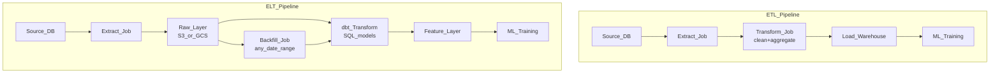

# 🔄 ETL and ELT for ML Pipelines

> [!abstract] TL;DR
> ETL transforms data *before* loading it into the destination; ELT loads raw data first and transforms inside the warehouse. Modern ML pipelines favor ELT because cheap cloud storage and powerful query engines make it better to keep raw data and derive features on demand. Idempotency and backfilling are non-negotiable production requirements.

## Intuition — Analogy First

Think of grocery shopping and meal prep.

**ETL** = you dice, marinate, and portion every ingredient *before* putting anything in the fridge. The fridge only holds ready-to-cook items. Fast to cook, but inflexible — if you decide you want a stew instead of stir-fry, you have to go back to the store.

**ELT** = you put everything raw into the fridge, then prep ingredients *when you decide what to cook*. More storage, but you can make any dish from the same raw ingredients. Modern cloud warehouses (BigQuery, Snowflake, Redshift) are cheap and fast enough to be that second fridge.

In ML: you almost always want ELT so you can re-derive features, fix bugs retroactively, and run experiments on the same raw history.

## How It Works — Mechanics

### ETL (Traditional)

```
Source → Extract → Transform (deduplicate, clean, aggregate) → Load (warehouse/DB)
```

- Transformation happens in an intermediate compute layer before data lands.
- Destination schema is fixed upfront — schema-on-write.
- Good when: destination DB is expensive (rows-based OLTP), privacy rules require stripping PII before landing.

### ELT (Modern ML Norm)

```
Source → Extract → Load (raw, object store or warehouse) → Transform (SQL/Spark/dbt)
```

- Raw data lands first, transformations run as SQL queries or Spark jobs.
- Schema-on-read: you query columns you need, when you need them.
- dbt (data build tool) manages SQL transformations as version-controlled models.

### ML-Specific Stages

```
Raw → Cleaned → Featured → Model-Ready (train/val/test splits)
```

Each stage is a separate dbt model or Spark job so failures isolate, reruns are safe, and the feature set is reproducible.

### Idempotency

A pipeline run is idempotent if running it twice produces the same output as running it once. Achieved by:
- Overwriting partitions, not appending rows.
- Using `MERGE INTO` or `INSERT OVERWRITE PARTITION`.
- Including run timestamps in output partition paths.

### Backfilling

Reprocessing historical data. Required when: fixing a bug in feature logic, adding a new feature column, or onboarding a new data source. Idempotency makes backfilling safe.



## Code Demo

### dbt Model (SQL transformation)

```sql
-- models/features/user_purchase_features.sql
-- dbt materializes this as a table, idempotent via INSERT OVERWRITE

{{
  config(
    materialized='incremental',
    unique_key='user_id || event_date',
    partition_by={'field': 'event_date', 'data_type': 'date'}
  )
}}

WITH purchase_agg AS (
  SELECT
    user_id,
    DATE(event_timestamp) AS event_date,
    COUNT(*) AS purchase_count_7d,
    SUM(amount_usd) AS total_spend_7d,
    AVG(amount_usd) AS avg_order_value_7d,
    MAX(amount_usd) AS max_order_value_7d
  FROM {{ source('raw', 'purchase_events') }}
  WHERE event_type = 'purchase'
    
      AND event_timestamp > (SELECT MAX(event_date) FROM {{ this }})
    
  GROUP BY 1, 2
)

SELECT * FROM purchase_agg
```

### Pandas ETL Pipeline

```python
import pandas as pd
from sqlalchemy import create_engine
from datetime import date

def extract(source_conn_str: str, date_partition: date) -> pd.DataFrame:
    """Extract: pull raw events for a given date partition."""
    engine = create_engine(source_conn_str)
    query = f"""
        SELECT user_id, event_type, amount_usd, event_timestamp
        FROM purchase_events
        WHERE DATE(event_timestamp) = '{date_partition}'
    """
    return pd.read_sql(query, engine)

def transform(df: pd.DataFrame) -> pd.DataFrame:
    """Transform: clean and derive features."""
    # Drop duplicates (idempotent)
    df = df.drop_duplicates(subset=['user_id', 'event_timestamp'])
    # Filter invalid
    df = df[df['amount_usd'] > 0]
    # Derive features
    df['log_amount'] = df['amount_usd'].apply(lambda x: __import__('math').log1p(x))
    return df

def load(df: pd.DataFrame, dest_conn_str: str, partition_date: date):
    """Load: overwrite partition — idempotent."""
    engine = create_engine(dest_conn_str)
    # Delete existing partition first (idempotency)
    with engine.connect() as conn:
        conn.execute(f"DELETE FROM ml_features WHERE event_date = '{partition_date}'")
    df['event_date'] = partition_date
    df.to_sql('ml_features', engine, if_exists='append', index=False)

def run_pipeline(source: str, dest: str, partition_date: date):
    raw = extract(source, partition_date)
    featured = transform(raw)
    load(featured, dest, partition_date)
    print(f"Processed {len(featured)} rows for {partition_date}")

# Backfill example
from datetime import timedelta
start = date(2026, 1, 1)
for i in range(30):
    run_pipeline("postgresql://...", "postgresql://...", start + timedelta(days=i))
```

### SQLAlchemy ELT (Load Raw, Then Query)

```python
from sqlalchemy import create_engine, text
import pandas as pd

# ELT Step 1: Load raw data as-is into raw schema
def load_raw(df: pd.DataFrame, table: str, engine):
    df.to_sql(table, engine, schema='raw', if_exists='append', index=False)

# ELT Step 2: Transform inside the DB using SQL
def transform_in_db(engine, output_table: str):
    sql = text(f"""
        INSERT INTO features.{output_table}
        SELECT
            user_id,
            DATE(event_timestamp) AS event_date,
            COUNT(*) FILTER (WHERE event_type = 'purchase') AS purchases,
            SUM(amount_usd) FILTER (WHERE event_type = 'purchase') AS total_spend
        FROM raw.events
        GROUP BY 1, 2
        ON CONFLICT (user_id, event_date) DO UPDATE
            SET purchases = EXCLUDED.purchases,
                total_spend = EXCLUDED.total_spend
    """)
    with engine.connect() as conn:
        conn.execute(sql)
        conn.commit()
```

## Real-World Example

**Airbnb** pioneered the "ELT + dbt" approach for ML. Their raw event data lands in S3, is catalogued via Hive metastore, and all feature transformations are dbt models running on Spark/Presto. When engineers discover a feature bug, they fix the dbt model and rerun the backfill job — the raw data is always preserved.

**Shopify's ML feature pipeline** uses an ELT pattern: transactional data loads to their data warehouse (BigQuery), and hundreds of dbt models derive merchant-level features for fraud detection, product recommendation, and LTV prediction models.

## Trade-offs

| Dimension | ETL | ELT |
|---|---|---|
| Storage cost | Lower (only transformed data) | Higher (raw + derived) |
| Flexibility | Low (transform logic baked in) | High (re-derive any time) |
| Debugging | Hard (raw data discarded) | Easy (raw always available) |
| Compute cost | Upfront extraction | On-demand transformation |
| Latency | Higher (transform before load) | Lower initial load |
| Compliance | Better (PII stripped early) | Requires access controls on raw layer |
| Backfilling | Painful (reprocess from source) | Easy (re-run SQL on existing raw) |

## When to Use vs Avoid

**Use ELT when:**
- You have a cloud data warehouse (BigQuery, Snowflake, Redshift).
- You need to experiment with different feature definitions.
- Backfilling historical features is likely.
- You have strict auditability requirements (raw data as source of truth).

**Use ETL when:**
- Loading into a row-store database that charges by storage (MySQL, Postgres).
- Strong regulatory requirements to never store raw PII (HIPAA, GDPR use cases).
- The downstream system cannot run SQL transformations (embedded system, legacy DB).

**Avoid** pure append-only pipelines in either pattern — always design for idempotency from day one. Retrofitting it is expensive.

## Common Pitfalls

1. **Non-idempotent pipelines**: appending rows on reruns creates duplicates. Always overwrite partitions or use UPSERT/MERGE.
2. **Schema drift**: upstream source adds a column → your transform breaks. Use dbt's `+column_types` or Great Expectations schema checks.
3. **Late-arriving data**: events arrive 2 days late. Partition on event time but check lookback windows; re-run recent partitions nightly.
4. **Ignoring backfill cost**: a 2-year backfill on 1TB/day = 730TB of Spark compute. Design incremental models early.
5. **No data lineage**: no record of which raw source created which feature table. Use dbt's DAG or OpenLineage.
6. **Transforming in the application layer**: putting feature logic in Python app code means it can't be backfilled or versioned easily. Push it to dbt/Spark.

## Related Concepts

- [[_MOC_Data_Engineering|↑ Section MOC]]

- [[Apache_Airflow]] — orchestrates ETL/ELT pipeline scheduling and dependencies
- [[Feature_Stores]] — purpose-built storage for computed ML features
- [[Data_Quality_and_Validation]] — validating data at each pipeline stage
- [[Apache_Spark_for_ML]] — distributed compute for large-scale ELT transformations
- [[Delta_Lake]] — ACID-transactional storage layer for ELT pipelines
- [[Data_Warehouses_for_ML]] — BigQuery, Snowflake as ELT destination and compute

## Review Questions

1. Why is idempotency essential for ML pipelines, and what pattern ensures a daily partition job is idempotent?
2. A dbt model computes 30-day rolling purchase counts. A bug is discovered in the calculation. What steps do you take to fix it, and why does ELT make this easier than ETL?
3. You need to serve a feature computed from the last 7 days of events with <50ms latency. Should you use an ELT pipeline feeding a feature store, or compute it on-the-fly? Justify your answer.

## Sources

- dbt documentation — https://docs.getdbt.com
- Airbnb Engineering Blog: "Democratizing Data at Airbnb"
- Shopify Engineering Blog: "Building Data-Driven Machine Learning Models"
- "The Data Warehouse Toolkit" — Kimball & Ross (ETL fundamentals)
- "Fundamentals of Data Engineering" — Joe Reis & Matt Housley (O'Reilly, 2022)

#data-engineering #etl #elt #dbt #ml-pipelines #idempotency #backfill
