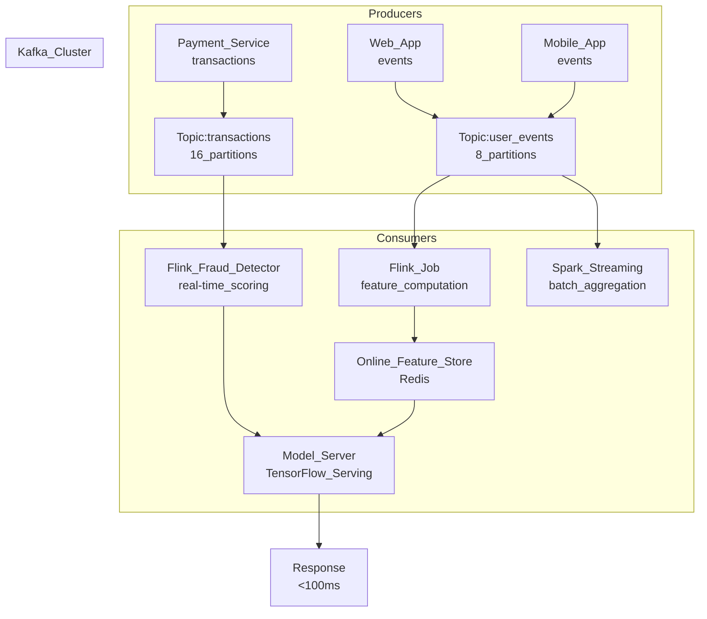

# 🌊 Streaming ML with Kafka

> [!abstract] TL;DR
> Apache Kafka is a distributed event streaming platform used to build real-time ML feature pipelines. Events (transactions, clicks, sensor readings) flow through Kafka topics; Flink or Kafka Streams transforms them into features within milliseconds. These features feed online models for latency-sensitive decisions like fraud detection, surge pricing, and ad targeting.

## Intuition — Analogy First

Kafka is a **live river of events**. Data flows continuously, and you can dip a bucket in at any point to read the latest data.

Unlike a lake (static batch data), a river never stops. You can set up as many "sampling stations" as you want along the river — each one independently reads the stream and does different processing. If one station breaks, the river keeps flowing; when the station comes back, it picks up from where it left off.

**For ML:** batch pipelines are like taking a photograph of the river every night. Streaming pipelines are like having a live video feed. When you need to detect fraud *during* the transaction (not after), you need the live video.

## How It Works — Mechanics

### Kafka Architecture



### Core Concepts

| Concept | Description |
|---|---|
| **Topic** | Named stream of events (like a DB table but append-only, immutable) |
| **Partition** | Topic divided into N partitions for parallelism; events with same key → same partition |
| **Offset** | Position in a partition; consumers track which offset they've read |
| **Consumer Group** | Set of consumers that each read a different partition — scale-out |
| **Retention** | How long events are kept (7 days default) — enables reprocessing |
| **Compaction** | Keep only the latest event per key — useful for state materialization |

### Exactly-Once Semantics

Critical for financial ML: Kafka 0.11+ supports exactly-once delivery with idempotent producers + transactional APIs. This prevents double-counting transactions in feature aggregations.

```
At-most-once: drop events on failure (fast, lossy)
At-least-once: may duplicate on failure (most common, requires deduplication)
Exactly-once: guaranteed no loss, no duplication (slowest, needed for money)
```

### Flink vs Kafka Streams

| | Kafka Streams | Apache Flink |
|---|---|---|
| Deployment | Library (runs in-process) | Separate cluster |
| State management | RocksDB per instance | Managed state with checkpoints |
| Complexity | Simple, Java-native | Complex but powerful |
| Use case | Per-event enrichment, simple windows | Complex event processing, large state |
| Latency | <10ms | ~50–200ms |

### Latency Requirements for Real-Time ML

| Use Case | Max Latency | Pattern |
|---|---|---|
| Fraud detection | < 100ms | Kafka → pre-computed features in Redis → score |
| Recommendation | < 200ms | Kafka → Flink → feature store → model server |
| Surge pricing | < 500ms | Kafka → Flink window → fare calculation |
| Personalization | < 1s | Kafka → Spark Streaming → batch feature update |

## Code Demo

### Confluent Kafka Python Producer

```python
from confluent_kafka import Producer
import json
from datetime import datetime

producer = Producer({
    "bootstrap.servers": "kafka:9092",
    "acks": "all",                    # wait for all replicas to acknowledge
    "enable.idempotence": True,       # exactly-once at producer level
    "compression.type": "lz4",
    "linger.ms": 5,                   # batch events for 5ms to improve throughput
})

def delivery_report(err, msg):
    if err is not None:
        print(f"Delivery failed: {err}")
    else:
        print(f"Delivered to {msg.topic()} [{msg.partition()}] @ offset {msg.offset()}")

def publish_transaction_event(transaction: dict):
    """Publish a payment transaction event to Kafka."""
    event = {
        "user_id": transaction["user_id"],
        "merchant_id": transaction["merchant_id"],
        "amount_usd": transaction["amount_usd"],
        "card_last4": transaction["card_last4"],
        "ip_address": transaction["ip_address"],
        "device_fingerprint": transaction["device_fingerprint"],
        "event_timestamp": datetime.utcnow().isoformat(),
    }
    producer.produce(
        topic="transactions",
        key=transaction["user_id"].encode("utf-8"),  # same user → same partition
        value=json.dumps(event).encode("utf-8"),
        callback=delivery_report,
    )
    producer.poll(0)  # trigger delivery callbacks

# Flush remaining messages before shutdown
producer.flush()
```

### Confluent Kafka Python Consumer

```python
from confluent_kafka import Consumer, KafkaError
import json

consumer = Consumer({
    "bootstrap.servers": "kafka:9092",
    "group.id": "fraud-feature-pipeline",
    "auto.offset.reset": "earliest",      # start from beginning if no committed offset
    "enable.auto.commit": False,          # manual commit for exactly-once guarantees
    "max.poll.interval.ms": 300000,       # 5 min before group rebalance
})

consumer.subscribe(["transactions"])

def compute_features(event: dict) -> dict:
    """Compute real-time features from a single transaction event."""
    return {
        "user_id": event["user_id"],
        "amount_log": __import__("math").log1p(event["amount_usd"]),
        "is_high_value": 1 if event["amount_usd"] > 500 else 0,
        "hour_of_day": int(event["event_timestamp"][11:13]),
        # In production: also fetch from Redis: 24h velocity, user avg, etc.
    }

def run_feature_pipeline():
    try:
        while True:
            msg = consumer.poll(timeout=1.0)
            if msg is None:
                continue
            if msg.error():
                if msg.error().code() == KafkaError._PARTITION_EOF:
                    continue
                raise Exception(f"Kafka error: {msg.error()}")

            event = json.loads(msg.value().decode("utf-8"))
            features = compute_features(event)

            # Write to Redis (online feature store)
            # redis_client.hset(f"features:{features['user_id']}", mapping=features)

            # Manual commit — only after successful processing
            consumer.commit(asynchronous=False)

    finally:
        consumer.close()
```

### Real-Time Feature Pipeline Sketch (Flink-style via Python)

```python
"""
Conceptual sketch of a Flink pipeline for real-time ML features.
In production, Flink jobs are written in Java/Scala or PyFlink.
"""
import redis
from collections import defaultdict
from datetime import datetime, timedelta

class RealTimeFeatureStore:
    """Simplified real-time feature computation — illustrates the pattern."""

    def __init__(self, redis_host: str = "localhost", redis_port: int = 6379):
        self.r = redis.Redis(host=redis_host, port=redis_port, decode_responses=True)
        self.window_seconds = 3600  # 1-hour window

    def update_velocity_features(self, user_id: str, amount: float, timestamp: datetime):
        """Update sliding window transaction count and sum for a user."""
        key = f"velocity:{user_id}"
        pipe = self.r.pipeline()

        # Store event in sorted set (score = unix timestamp)
        unix_ts = timestamp.timestamp()
        pipe.zadd(key, {f"{unix_ts}:{amount}": unix_ts})

        # Remove events outside 1-hour window
        cutoff = (timestamp - timedelta(seconds=self.window_seconds)).timestamp()
        pipe.zremrangebyscore(key, "-inf", cutoff)

        # Get current window stats
        pipe.zcard(key)                # transaction count
        pipe.execute()

        # Fetch and compute sum
        events = self.r.zrangebyscore(key, cutoff, "+inf")
        amounts = [float(e.split(":")[1]) for e in events]
        tx_count_1h = len(amounts)
        tx_sum_1h = sum(amounts)

        # Store computed features
        self.r.hset(f"features:{user_id}", mapping={
            "tx_count_1h": tx_count_1h,
            "tx_sum_1h": tx_sum_1h,
            "avg_tx_1h": tx_sum_1h / max(tx_count_1h, 1),
        })
        self.r.expire(f"features:{user_id}", 86400)  # TTL: 1 day

    def get_features(self, user_id: str) -> dict:
        """Retrieve pre-computed features for online serving."""
        features = self.r.hgetall(f"features:{user_id}")
        return {k: float(v) for k, v in features.items()} if features else {}


# Usage in event loop
feature_store = RealTimeFeatureStore()

def handle_transaction_event(event: dict):
    """Called for each Kafka message."""
    user_id = event["user_id"]
    amount = event["amount_usd"]
    ts = datetime.fromisoformat(event["event_timestamp"])

    # Update real-time features
    feature_store.update_velocity_features(user_id, amount, ts)

    # Get features for immediate scoring
    features = feature_store.get_features(user_id)

    # Score with fraud model (must be <100ms total)
    # fraud_score = model.predict([list(features.values())])[0]
    # if fraud_score > 0.85: block_transaction()
```

## Real-World Example

**Uber's ML Platform** processes 15+ million trip events per minute through Kafka for real-time surge pricing. The pipeline:
1. Trip request events → Kafka topic `trip_requests`.
2. Flink job computes supply/demand ratio per geohex cell in 30-second windows.
3. Computed ratios written to Redis (feature store).
4. Surge pricing model reads Redis features and prices trips in real-time.
5. Driver location updates flow through a separate Kafka topic at 5-second intervals.

End-to-end latency: **~200ms** from event to surge multiplier update. Without streaming, Uber would be computing surge prices on 10-minute stale batch data — unworkable for a dynamic marketplace.

## Trade-offs

| Dimension | Streaming (Kafka + Flink) | Batch (Airflow + Spark) |
|---|---|---|
| Latency | Milliseconds to seconds | Minutes to hours |
| Complexity | High (stateful ops, exactly-once) | Low (simple reruns) |
| Debugging | Hard (live data, race conditions) | Easy (replay logs) |
| Cost | Continuous compute | Pay per run |
| Freshness | Real-time | Staleness = batch cadence |
| ML use case | Fraud, pricing, safety | Recommendations, reporting |
| Correctness | Exactly-once is hard | Idempotent reruns are easy |

## When to Use vs Avoid

**Use Kafka + streaming when:**
- ML decision must be made in <1 second from the triggering event.
- Features must reflect events that just happened (last 5 minutes, not last hour).
- High-throughput event volumes (millions/minute) that can't wait for batch.
- Real-time model monitoring: detect drift as it happens.

**Avoid streaming when:**
- Features only need daily or hourly freshness — batch is simpler and cheaper.
- Model training (batch ML training doesn't need streaming infrastructure).
- Your team lacks streaming expertise — operational complexity is high.
- Use case tolerates staleness — prefer batch + pre-computation.

## Common Pitfalls

1. **Not handling late-arriving events**: events can arrive out of order (network delays). Use watermarks in Flink/Spark Streaming to define how long to wait before closing a time window.
2. **Unbounded state**: a Flink/Kafka Streams job that tracks per-user state without TTLs will OOM over time as user count grows. Always set state TTLs.
3. **Small message overhead**: sending one tiny event per Kafka message is inefficient. Use producer `linger.ms` to micro-batch and reduce broker overhead.
4. **Mixing batch and streaming feature logic**: if your offline training features are computed differently than your online streaming features, you get training/serving skew. Use a feature store that unifies both.
5. **No schema registry**: as event schema changes, consumers break. Use Confluent Schema Registry with Avro/Protobuf to enforce backward compatibility.
6. **Re-reading Kafka for backfilling**: Kafka retains data for 7 days by default. For long backfills, archive Kafka to S3 and process from there.

## Related Concepts

- [[_MOC_Data_Engineering|↑ Section MOC]]

- [[Feature_Stores]] — streaming features land in the online store; batch features in the offline store
- [[ETL_ELT_for_ML]] — streaming is the real-time version of ELT pipelines
- [[Apache_Spark_for_ML]] — Spark Structured Streaming can consume Kafka topics
- [[Model_Serving_Overview]] — real-time model serving consumes features from the online store
- [[Fraud_Detection_System]] — canonical streaming ML use case

## Review Questions

1. What is the difference between at-least-once and exactly-once delivery semantics in Kafka? When does the distinction matter for ML feature pipelines?
2. A user makes 10 transactions in 30 seconds. Your Flink job computes per-user transaction velocity in a 1-minute sliding window. The 8th message arrives 45 seconds after the 1st (out of order). How do watermarks help, and what happens if you ignore late events?
3. Your fraud model is trained on batch features computed in Spark. You deploy it to serve in real-time, fetching features from Kafka/Redis. Tests show the online model performs worse than offline evaluation. What is the likely cause and how do you fix it?

## Sources

- Apache Kafka Documentation — https://kafka.apache.org/documentation/
- "Kafka: The Definitive Guide, 2nd Ed." — Gwen Shapira et al. (O'Reilly, 2022)
- Apache Flink Documentation — https://flink.apache.org/
- Uber Engineering Blog: "Michelangelo: Uber's Machine Learning Platform"
- Confluent Blog: "Building a Real-Time Machine Learning Pipeline with Kafka"

#data-engineering #kafka #streaming #real-time #flink #online-ml #feature-pipeline
