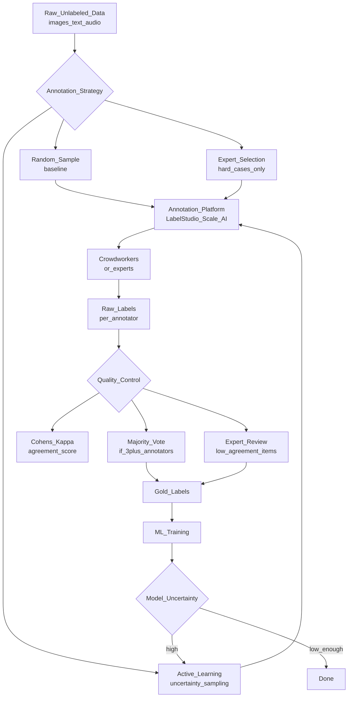

# 🏷️ Data Annotation Strategies

> [!abstract] TL;DR
> Data annotation (labeling) is the process of adding ground-truth labels to raw data so ML models can learn from it. Strategies range from crowdsourcing (MTurk, Scale AI) to expert annotation and active learning (smartly selecting which samples to label first). Quality control via inter-annotator agreement and majority voting is critical. Active learning reduces annotation cost by up to 80% by only labeling the most informative examples.

## Intuition — Analogy First

Imagine you're building a spam email classifier but have 1 million emails to label and a budget for only 10,000 annotations. How do you pick which 10,000 to label?

**Random sampling** = pick 10,000 at random. Simple, but you'll label many obvious "definitely not spam" emails that teach the model nothing new.

**Active learning** = ask the model "which emails are you most uncertain about?". The model says: "I'm 51% sure this is spam, 49% not spam — I really don't know." You label those. Each label teaches the model something it genuinely didn't know.

This is like teaching a student by giving them problems they almost understand — not ones they've already mastered and not ones that are completely beyond them. **Learning happens at the boundary of knowledge**.

## How It Works — Mechanics

### Annotation Workflow



### Crowdsourcing vs Expert Annotation

| Approach | Cost | Quality | Speed | Use When |
|---|---|---|---|---|
| **MTurk / Prolific** | $0.01–$0.10/item | Variable | Fast | Simple tasks (sentiment, basic categories) |
| **Scale AI / Labelbox** | $0.50–$5/item | High | Medium | Complex tasks, specialized domains |
| **In-house experts** | High | Highest | Slow | Medical, legal, security — where expertise is critical |
| **Semi-supervised** | Low | Medium | Fast | You have a weak model to pre-label |
| **LLM-assisted** | Low | Depends on LLM | Very fast | Pre-annotation + human review |

### Active Learning: Uncertainty Sampling

Select examples where the model is most uncertain:
- **Least confidence**: label the example where `max P(y|x)` is lowest.
- **Margin sampling**: label where the gap between top-2 class probabilities is smallest.
- **Entropy**: label where `H = -∑ p log p` is highest.

```
Iteration:
1. Train model on labeled set (initially small)
2. Run model on unlabeled pool
3. Select top-K most uncertain examples
4. Send to annotators
5. Add new labels to labeled set
6. Repeat
```

### Label Quality Control

**Inter-Annotator Agreement (IAA)**: measure how consistently annotators assign the same label.

**Cohen's Kappa** (for two annotators):
```
κ = (P_o - P_e) / (1 - P_e)
P_o = observed agreement
P_e = expected agreement by chance
```
- κ < 0.4: poor agreement → task is ambiguous, needs better guidelines
- 0.4–0.6: moderate
- 0.6–0.8: substantial
- > 0.8: excellent — trust majority vote

**Fleiss' Kappa**: extends to multiple annotators (same formula generalized).

### RLHF Annotation Pipeline

Reinforcement Learning from Human Feedback (RLHF) requires a specific annotation style:
- Annotators see **two LLM responses** to the same prompt.
- They choose which response is better (A vs B, not absolute rating).
- Pairwise comparisons are easier and more consistent than absolute 1–5 ratings.
- Thousands of preferences train a **reward model**.
- Reward model guides RLHF fine-tuning of the LLM.

## Code Demo

### Active Learning Annotation Loop (scikit-learn)

```python
import numpy as np
from sklearn.linear_model import LogisticRegression
from sklearn.preprocessing import StandardScaler
from scipy.stats import entropy
import pandas as pd

class ActiveLearner:
    """Uncertainty-based active learning loop."""
    
    def __init__(self, strategy: str = "entropy"):
        self.model = LogisticRegression(max_iter=500, random_state=42)
        self.scaler = StandardScaler()
        self.strategy = strategy
        self.labeled_indices = []
        self.label_history = []
    
    def uncertainty_score(self, proba: np.ndarray) -> np.ndarray:
        """Compute uncertainty for each sample."""
        if self.strategy == "entropy":
            return np.array([entropy(p) for p in proba])
        elif self.strategy == "least_confidence":
            return 1 - proba.max(axis=1)
        elif self.strategy == "margin":
            sorted_proba = np.sort(proba, axis=1)
            return 1 - (sorted_proba[:, -1] - sorted_proba[:, -2])
        raise ValueError(f"Unknown strategy: {self.strategy}")
    
    def fit(self, X_labeled: np.ndarray, y_labeled: np.ndarray):
        """Train on current labeled set."""
        X_scaled = self.scaler.fit_transform(X_labeled)
        self.model.fit(X_scaled, y_labeled)
    
    def select_for_annotation(self, X_pool: np.ndarray, n_select: int = 50) -> np.ndarray:
        """Return indices of most uncertain samples from unlabeled pool."""
        X_scaled = self.scaler.transform(X_pool)
        proba = self.model.predict_proba(X_scaled)
        scores = self.uncertainty_score(proba)
        # Return indices of top-N most uncertain samples
        return np.argsort(scores)[-n_select:]
    
    def run_loop(
        self,
        X_all: np.ndarray,
        y_oracle: np.ndarray,  # simulates human annotators
        initial_labeled: int = 100,
        iterations: int = 10,
        batch_size: int = 50,
    ) -> list:
        """Simulate active learning loop."""
        n = len(X_all)
        # Start with random seed set
        seed_idx = np.random.choice(n, initial_labeled, replace=False)
        labeled_mask = np.zeros(n, dtype=bool)
        labeled_mask[seed_idx] = True
        
        results = []
        for i in range(iterations):
            # Train on labeled set
            self.fit(X_all[labeled_mask], y_oracle[labeled_mask])
            
            # Evaluate on full set (simulated)
            from sklearn.metrics import f1_score
            y_pred = self.model.predict(self.scaler.transform(X_all))
            f1 = f1_score(y_oracle, y_pred, average="weighted")
            n_labeled = labeled_mask.sum()
            results.append({"iteration": i, "n_labeled": n_labeled, "f1": f1})
            print(f"Iter {i}: {n_labeled} labeled, F1={f1:.4f}")
            
            # Select next batch from unlabeled pool
            unlabeled_idx = np.where(~labeled_mask)[0]
            if len(unlabeled_idx) == 0:
                break
            
            relative_idx = self.select_for_annotation(X_all[unlabeled_idx], batch_size)
            new_labeled_idx = unlabeled_idx[relative_idx]
            labeled_mask[new_labeled_idx] = True
        
        return results

# Example usage
from sklearn.datasets import make_classification
X, y = make_classification(n_samples=5000, n_features=20, n_informative=10, random_state=42)

learner = ActiveLearner(strategy="entropy")
history = learner.run_loop(X, y, initial_labeled=100, iterations=15, batch_size=50)

# Compare with random sampling baseline
random_history = []  # ... run same loop with random batch selection
```

### Inter-Annotator Agreement (Cohen's Kappa)

```python
from sklearn.metrics import cohen_kappa_score
import numpy as np
import pandas as pd

# Simulate two annotators labeling 500 items
np.random.seed(42)
n_items = 500
categories = ["positive", "negative", "neutral"]

# Annotator 1 labels
annotator1 = np.random.choice(categories, size=n_items, p=[0.4, 0.3, 0.3])

# Annotator 2 agrees ~75% of the time
annotator2 = annotator1.copy()
disagreement_idx = np.random.choice(n_items, size=int(0.25 * n_items), replace=False)
annotator2[disagreement_idx] = np.random.choice(categories, size=len(disagreement_idx))

kappa = cohen_kappa_score(annotator1, annotator2)
agreement_pct = np.mean(annotator1 == annotator2) * 100
print(f"Raw agreement: {agreement_pct:.1f}%")
print(f"Cohen's Kappa: {kappa:.3f}")

if kappa > 0.8:
    print("Excellent agreement — label with majority vote")
elif kappa > 0.6:
    print("Good agreement — investigate disagreements")
elif kappa > 0.4:
    print("Moderate agreement — review annotation guidelines")
else:
    print("Poor agreement — task is ambiguous, redesign task or improve guidelines")

# Confusion matrix of disagreements
disagreement_df = pd.DataFrame({
    "annotator1": annotator1[disagreement_idx],
    "annotator2": annotator2[disagreement_idx],
})
print("\nDisagreement patterns:")
print(disagreement_df.value_counts().head(10))
```

### RLHF-Style Preference Collection

```python
from dataclasses import dataclass
from typing import Optional
import json
from datetime import datetime

@dataclass
class PreferenceRecord:
    """A single human preference between two LLM responses."""
    prompt: str
    response_a: str
    response_b: str
    preferred: str  # "A", "B", or "tie"
    annotator_id: str
    timestamp: str
    reasoning: Optional[str] = None
    
    def to_dict(self) -> dict:
        return {
            "prompt": self.prompt,
            "chosen": self.response_a if self.preferred == "A" else self.response_b,
            "rejected": self.response_b if self.preferred == "A" else self.response_a,
            "annotator_id": self.annotator_id,
            "timestamp": self.timestamp,
        }

def compute_preference_agreement(records: list[PreferenceRecord]) -> float:
    """Compute annotator agreement rate for pairwise preferences."""
    from collections import defaultdict
    
    # Group by (prompt, response_a, response_b)
    groups = defaultdict(list)
    for r in records:
        key = (r.prompt[:50], r.preferred)
        groups[key].append(r.preferred)
    
    agreements = []
    for key, prefs in groups.items():
        if len(prefs) >= 2:
            most_common = max(set(prefs), key=prefs.count)
            agreement = prefs.count(most_common) / len(prefs)
            agreements.append(agreement)
    
    return np.mean(agreements) if agreements else 0.0

# Load and convert to reward model training format
def prepare_reward_model_data(records: list[PreferenceRecord]) -> pd.DataFrame:
    """Convert preference records to (chosen, rejected) pairs for reward model training."""
    data = []
    for record in records:
        if record.preferred != "tie":
            data.append(record.to_dict())
    return pd.DataFrame(data)
```

## Real-World Example

**OpenAI's RLHF pipeline** for ChatGPT required tens of thousands of human preference judgments. Annotators (contractors via Scale AI) compared two ChatGPT responses and selected the better one — more helpful, more honest, less harmful. These preferences trained the reward model that guides RLHF fine-tuning. The annotation guidelines ran 70+ pages, covering edge cases like conflicting goals between helpfulness and safety.

**Scale AI** (now one of the most valuable AI-adjacent companies) was built entirely on the insight that high-quality annotation is the bottleneck for frontier AI. They power annotation for OpenAI, Meta, Microsoft, and most major AI labs — offering 3D bounding box labeling for autonomous vehicles, RLHF for LLMs, and medical image segmentation.

## Trade-offs

| Strategy | Cost/Label | Quality | Speed | Best For |
|---|---|---|---|---|
| **Crowdsourcing** | Low | Variable | Fast | Simple tasks, high volume |
| **Expert annotation** | High | High | Slow | Specialized domains |
| **Active learning** | Low (fewer labels) | Same as oracle | Slow (loop) | High annotation cost, lots of unlabeled data |
| **Semi-supervised** | Very low | Lower | Fast | Large unlabeled pool, few labels |
| **LLM pre-annotation** | Medium | High (GPT-4) | Very fast | Reduce expert annotation load |
| **RLHF pairwise** | Medium | High | Medium | Preference learning, LLM alignment |

## When to Use vs Avoid

**Use active learning when:**
- Annotation is expensive (expert labeling at $5+ per item).
- You have a large unlabeled pool but limited annotation budget.
- Task performance doesn't plateau after initial random labeled set.
- Query-by-committee (multiple weak models) can identify disagreement regions.

**Avoid active learning when:**
- Annotation is cheap (crowdsourcing at $0.05/item) — random sampling is simpler.
- Your unlabeled pool is small (<5K items) — just label it all.
- Domain shift makes uncertainty estimates unreliable.

## Common Pitfalls

1. **Label bias from crowdworkers**: MTurk workers may anchor on fast patterns (label length, sentence structure) rather than content. Always include honeypot (known-label) examples to detect gaming.
2. **Active learning with biased seed sets**: if your initial 100 labels are all from one class, the uncertainty sampler will also focus on that region. Use stratified seeding.
3. **Annotation guideline ambiguity**: if annotators disagree on edge cases, it's not their fault — improve the guidelines. Low kappa = unclear guidelines, not lazy annotators.
4. **Treating IAA as absolute**: high kappa between two annotators ≠ both are correct. An annotator pair that consistently agrees but is consistently wrong has high kappa and low accuracy.
5. **Not versioning annotation guidelines**: as guidelines evolve, earlier labels may no longer match the current definition. Version guidelines alongside datasets.

## Related Concepts

- [[_MOC_Data_Engineering|↑ Section MOC]]

- [[RLHF]] — annotation pipeline that powers LLM alignment
- [[Handling_Imbalanced_Data]] — annotation determines class balance in training data
- [[Synthetic_Data_Generation]] — alternative to annotation when real labels are scarce
- [[Data_Quality_and_Validation]] — label quality is a form of data quality

## Review Questions

1. You have 500,000 unlabeled customer reviews and a budget to label 5,000. Compare three annotation strategies (random sampling, active learning, LLM pre-annotation + human review) on cost, quality, and speed. Which would you recommend and why?
2. Your team collected pairwise preference annotations for RLHF from 3 different annotators. Annotators A and B have κ=0.82, A and C have κ=0.38. What are the implications for training the reward model, and how do you handle annotator C's labels?
3. Explain why active learning can be problematic when there is distribution shift between the labeled pool and the future serving data. Give a concrete example.

## Sources

- "Active Learning Literature Survey" — Burr Settles (2009)
- Scale AI Blog: "How We Build Ground Truth"
- OpenAI: "Instructional Following for Large Language Models via RLHF"
- "Collective Intelligence and the Data Factory" — Howe (on crowdsourcing)
- Labelbox Documentation — https://labelbox.com/
- Label Studio Documentation — https://labelstud.io/

#data-engineering #annotation #labeling #active-learning #rlhf #crowdsourcing #cohen-kappa
