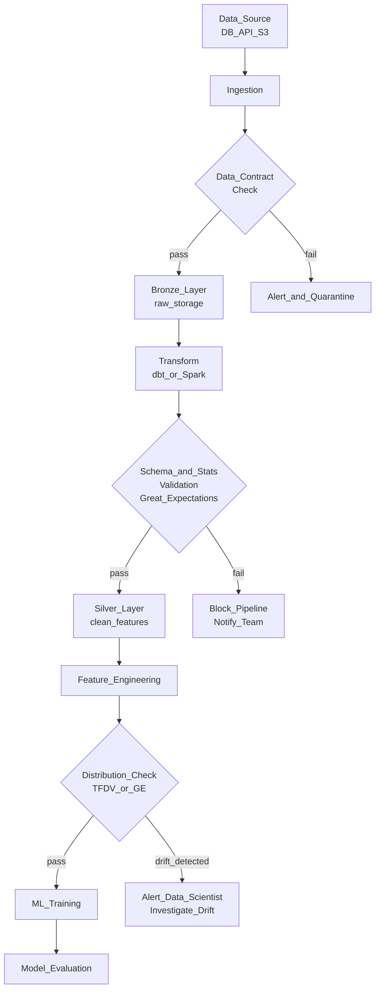

# ✅ Data Quality and Validation

> [!abstract] TL;DR
> Data quality validation catches bad data before it corrupts ML models and downstream systems. The five key dimensions are completeness, accuracy, consistency, timeliness, and validity. Tools like Great Expectations (Python), TFDV (TensorFlow Data Validation), and dbt tests automate assertion checks at every pipeline stage. Data contracts define explicit agreements between data producers and consumers.

## Intuition — Analogy First

Imagine a restaurant kitchen where ingredients arrive from suppliers. If the fish is spoiled, you don't discover it after serving the dish to customers — you check it at the loading dock. That's data quality validation: **inspect ingredients at every stage before they reach the final product**.

In ML, bad data is worse than no data because the model trains confidently on corrupted signals. A model trained on `NULL`-filled features or miscoded labels will silently underperform — and you may not notice until it causes a real business problem.

Great Expectations is the kitchen inspector who checks every delivery against a specification: "the `amount` column must be >= 0", "the `user_id` column must have <1% nulls", "the distribution of `age` must match what we saw last month".

## How It Works — Mechanics

### Data Quality Dimensions

| Dimension | Description | ML Impact |
|---|---|---|
| **Completeness** | Are all expected records and columns present? | Missing features → biased or error-prone predictions |
| **Accuracy** | Are values correct? | Mislabeled training data → model learns wrong patterns |
| **Consistency** | Same fact, same value across sources? | Conflicting joins → duplicates, data leakage |
| **Timeliness** | Is data fresh enough for its intended use? | Stale features → serving skew |
| **Validity** | Do values conform to schema, ranges, formats? | Schema drift → pipeline crashes |
| **Uniqueness** | Are there unexpected duplicates? | Overweighted samples → biased model |

### Validation Placement in ML Pipeline



### Data Contracts

A data contract is a formal agreement between a data producer (team A writes events) and a data consumer (team B reads features). It specifies:
- Schema (column names, types, nullability)
- Freshness SLA (updated every 15 minutes, max latency 30 minutes)
- Volume expectations (between 50K and 200K rows per day)
- Business rules (amount_usd >= 0, country is ISO 3166-1 alpha-2)

Contracts are enforced in code (Great Expectations suites or dbt tests) and monitored in production.

## Code Demo

### Great Expectations Suite

```python
import great_expectations as gx
import pandas as pd

# Load data
df = pd.read_parquet("s3://ml-bucket/silver/user_features/snapshot_date=2026-07-25/")

# Create GE context
context = gx.get_context()

# Build expectation suite
suite = context.add_or_update_expectation_suite("user_features_suite")

# Create validator from dataframe
validator = context.get_validator(
    batch_request=gx.core.BatchRequest(
        datasource_name="my_datasource",
        data_connector_name="default",
        data_asset_name="user_features",
    ),
    expectation_suite_name="user_features_suite",
)

# --- Completeness checks ---
validator.expect_column_values_to_not_be_null("user_id")
validator.expect_column_values_to_not_be_null("snapshot_date")
validator.expect_column_to_exist("purchase_count_30d")
validator.expect_column_to_exist("total_spend_30d")

# --- Validity / range checks ---
validator.expect_column_values_to_be_between(
    "purchase_count_30d", min_value=0, max_value=10_000
)
validator.expect_column_values_to_be_between(
    "total_spend_30d", min_value=0.0
)
validator.expect_column_values_to_be_between(
    "avg_order_value", min_value=0.0, max_value=50_000.0
)

# --- Uniqueness ---
validator.expect_compound_columns_to_be_unique(["user_id", "snapshot_date"])

# --- Statistical / distributional ---
validator.expect_column_mean_to_be_between(
    "avg_order_value", min_value=20.0, max_value=500.0
)
validator.expect_column_quantile_values_to_be_between(
    "purchase_count_30d",
    quantile_ranges={"quantiles": [0.5, 0.9, 0.99], "value_ranges": [[1, 5], [5, 50], [20, 500]]}
)

# --- Volume check ---
validator.expect_table_row_count_to_be_between(
    min_value=100_000, max_value=20_000_000
)

# Save suite
validator.save_expectation_suite()

# Run validation
results = context.run_validation_operator(
    "action_list_operator",
    assets_to_validate=[validator],
)

if not results["success"]:
    print("VALIDATION FAILED — blocking pipeline")
    for result in results.list_validation_results():
        if not result["success"]:
            print(f"  FAILED: {result['expectation_config']['expectation_type']} "
                  f"on column '{result['expectation_config']['kwargs'].get('column', 'N/A')}'")
    raise SystemExit(1)
else:
    print("Validation passed — proceeding with pipeline")
```

### TFDV (TensorFlow Data Validation)

```python
import tensorflow_data_validation as tfdv
import tensorflow as tf

# Generate statistics from training data
train_stats = tfdv.generate_statistics_from_dataframe(
    dataframe=train_df,
    stats_options=tfdv.StatsOptions(
        label_feature="label",
        num_top_values=20,
    )
)

# Infer schema from statistics (run once, then save and version)
schema = tfdv.infer_schema(train_stats)

# Display issues
tfdv.display_schema(schema)

# On serving data — check for drift vs training
serving_stats = tfdv.generate_statistics_from_dataframe(serving_df)

# Validate serving stats against training schema
anomalies = tfdv.validate_statistics(
    statistics=serving_stats,
    schema=schema,
    environment="SERVING"
)
tfdv.display_anomalies(anomalies)

if anomalies.anomaly_info:
    print("ANOMALIES DETECTED in serving data:")
    for feature, anomaly in anomalies.anomaly_info.items():
        print(f"  {feature}: {anomaly.description}")
    # Alert on-call team

# Save schema for comparison
tfdv.write_schema_text(schema, "schemas/user_features_schema.pbtxt")

# Compare two statistics protos (detect drift between weeks)
tfdv.visualize_statistics(
    lhs_statistics=train_stats,
    rhs_statistics=serving_stats,
    lhs_name="Training (July 1)",
    rhs_name="Serving (July 25)"
)
```

### dbt Tests (SQL-Based Validation)

```yaml
# models/features/user_features.yml
version: 2

models:
  - name: user_features
    description: "User-level purchase features, 30-day window"
    columns:
      - name: user_id
        description: "Unique user identifier"
        tests:
          - not_null
          - unique  # compound unique enforced at model level

      - name: purchase_count_30d
        tests:
          - not_null
          - dbt_utils.accepted_range:
              min_value: 0
              max_value: 10000

      - name: total_spend_30d
        tests:
          - not_null
          - dbt_utils.accepted_range:
              min_value: 0

    tests:
      - dbt_utils.equal_rowcount:
          compare_model: ref('user_features_prev_snapshot')
          tolerance: 0.05  # fail if row count changes by >5%
```

## Real-World Example

**LinkedIn** built a comprehensive data quality framework that monitors 5,000+ production datasets. Their system runs statistical assertions on every pipeline run and compares distributions against baselines. Result: they attribute a 40% reduction in ML model regression incidents to catching data quality issues before they reach model training — the data quality check runs as a blocking step in their CI/CD for ML pipelines.

**Airbnb's Minerva** (metrics platform) enforces data contracts between teams. When the pricing team changes their event schema, the downstream ML feature pipeline fails its contract check before running — forcing coordination rather than silent corruption.

## Trade-offs

| Approach | Strength | Limitation |
|---|---|---|
| **Great Expectations** | Rich assertion library, Python-native, HTML reports | Setup overhead; assertions must be maintained as data evolves |
| **TFDV** | Statistical distribution monitoring, TFX integration | TensorFlow dependency; less flexible than GE |
| **dbt tests** | SQL-based, colocated with transformations, CI-integrated | Only catches issues in the warehouse, not streaming data |
| **Custom assertions** | Maximum flexibility | High maintenance burden |
| **Monte Carlo / Bigeye** | Automated anomaly detection without writing rules | Black-box; requires SaaS subscription |

## When to Use vs Avoid

**Implement data validation when:**
- Model performance is business-critical (fraud, pricing, recommendations).
- Multiple upstream sources feed the pipeline — any one can go bad independently.
- Regulatory compliance requires data lineage and quality proof.
- You've been bitten by silent data quality bugs in production.

**Consider skipping or minimizing when:**
- Rapid prototyping / experimentation — use minimal checks (row count, null check on label).
- The pipeline is the only writer to a self-contained system with no external dependencies.

**Never skip:**
- Label column null check before training.
- Row count lower bound — catch empty datasets that train garbage models.

## Common Pitfalls

1. **Validating on a sample**: running GE on a 1% sample misses rare corruption patterns. Run on full data or stratified samples.
2. **Static thresholds on seasonal data**: purchase counts in December are 5x January. Use relative thresholds (mean ± 3σ from same-week last year) not absolute numbers.
3. **Blocking on warnings instead of errors**: not all anomalies are pipeline-blockers. Categorize expectations: errors (block pipeline), warnings (notify team), info (log only).
4. **Forgetting schema evolution**: when an upstream team adds a column, your `expect_table_columns_to_match_ordered_list` test fails. Use `expect_table_columns_to_match_set` instead to allow additions.
5. **No data contract ownership**: a contract that nobody owns degrades. Assign a data producer and consumer owner to every contract.

## Related Concepts

- [[_MOC_Data_Engineering|↑ Section MOC]]

- [[Data_Drift]] — production monitoring for distribution shift over time
- [[ETL_ELT_for_ML]] — data quality checks gate each pipeline stage
- [[Feature_Stores]] — feature stores should enforce type/range checks on writes
- [[Apache_Airflow]] — GE validation runs as Airflow tasks in the pipeline

## Review Questions

1. Your fraud model's precision drops from 0.85 to 0.72 in production. You suspect a data quality issue. Describe a systematic investigation process using TFDV's statistical comparison between training and serving data.
2. What is a data contract? Give a concrete example of a contract between a payments team (producer) and an ML fraud team (consumer), including schema, freshness, and volume terms.
3. Why is a simple row count check insufficient as a sole data quality check for an ML feature table? What additional checks are needed, and why?

## Sources

- Great Expectations Documentation — https://docs.greatexpectations.io/
- TensorFlow Data Validation — https://www.tensorflow.org/tfx/data_validation/get_started
- LinkedIn Engineering Blog: "Data Quality at LinkedIn"
- "Fundamentals of Data Engineering" — Joe Reis & Matt Housley (O'Reilly, 2022)
- Airbnb Engineering: "Minerva: Building Data Contracts"

#data-engineering #data-quality #validation #great-expectations #tfdv #data-contracts #monitoring
