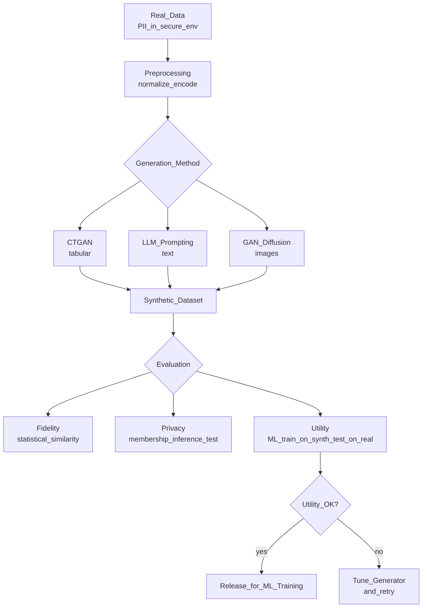

# 🧬 Synthetic Data Generation

> [!abstract] TL;DR
> Synthetic data is artificially generated data that statistically mirrors real data without containing actual personal records. It solves three ML problems: privacy (train without exposing PII), rare events (augment underrepresented cases like fraud or rare diseases), and data scarcity (generate training data when real data is expensive). Key methods: CTGAN for tabular, LLM-generated text, GANs/diffusion for images.

## Intuition — Analogy First

Imagine you want to train a medical AI to detect a rare cancer that affects 1 in 100,000 people. You only have 50 real patient cases — not nearly enough to train a good model. And even if you had more, sharing the actual patient records with ML engineers raises serious privacy concerns.

Synthetic data is like **a flight simulator for pilots**: it's not a real airplane, but it's designed to behave exactly like one. Pilots train thousands of hours in the simulator before flying real planes. The simulator generates realistic scenarios including rare emergencies — so pilots are prepared when they actually occur.

For ML: synthetic patient records are statistically equivalent to real ones (same correlations, same distributions, same rare-event rates) but contain no actual patient information. The model trains as if it had real data, without the privacy risk.

## How It Works — Mechanics

### Generation Pipeline



### Fidelity vs Privacy vs Utility Triangle

- **Fidelity**: how statistically similar is synthetic data to real data? (column distributions, correlations)
- **Privacy**: how hard is it to recover real records from synthetic data? (membership inference attacks)
- **Utility**: does a model trained on synthetic data perform well on real-world test data?

These three are in tension: maximum fidelity → higher privacy risk (model memorizes real records). The key is finding a working balance for your use case.

### Tabular Synthesis: CTGAN

CTGAN (Conditional Tabular GAN) addresses challenges specific to tabular data:
- Mixed types (numerical + categorical)
- Imbalanced categoricals (most purchases are in category "electronics")
- Multimodal distributions (age has peaks at 25 and 65)

Uses conditional generation: sample a minor category more frequently to balance distribution.

### Text Synthesis: LLM-Based

Use an LLM to generate realistic text samples given a few real examples and a template. For NLP training data: prompt the LLM with a label → get a synthetic example. Evaluate with a classifier trained on real data.

### Image Synthesis

- **GANs** (StyleGAN, DCGAN): trained on real images, generate novel samples. Adversarial training: generator tries to fool discriminator.
- **Diffusion models** (DALL-E, Stable Diffusion): better quality, more stable training. Given class prompt → generate diverse synthetic examples.

### Evaluation Metrics

| Metric | Description |
|---|---|
| **TVD (Total Variation Distance)** | Column-wise distribution difference between real and synthetic |
| **Correlation matrix difference** | Compare feature correlation matrices |
| **Train-Synth-Test-Real (TSTR)** | Train model on synthetic, test on real — utility measure |
| **Membership inference attack** | Can you determine if a real record was in the training set? |
| **FID (images)** | Frechet Inception Distance — quality + diversity of generated images |

## Code Demo

### SDV CTGAN for Tabular Data

```python
from sdv.tabular import CTGAN
from sdv.evaluation import evaluate
import pandas as pd

# Load real data (keep in secure environment)
real_df = pd.read_csv("secure/real_transactions.csv")
print(f"Real data shape: {real_df.shape}")
print(real_df.dtypes)

# Define metadata
from sdv.metadata import SingleTableMetadata
metadata = SingleTableMetadata()
metadata.detect_from_dataframe(real_df)

# Specify column types (CTGAN handles mixed types)
metadata.update_column("user_id", sdtype="id")
metadata.update_column("amount_usd", sdtype="numerical")
metadata.update_column("country", sdtype="categorical")
metadata.update_column("is_fraud", sdtype="boolean")

# Train CTGAN
model = CTGAN(
    metadata=metadata,
    epochs=300,
    batch_size=500,
    generator_dim=(256, 256),
    discriminator_dim=(256, 256),
    verbose=True,
)
model.fit(real_df)

# Generate synthetic data (no PII)
synthetic_df = model.sample(num_rows=100_000)
print(f"Synthetic data shape: {synthetic_df.shape}")
print(synthetic_df.head())

# Evaluate quality
from sdv.evaluation.single_table import run_diagnostic, evaluate_quality
diagnostic = run_diagnostic(real_df, synthetic_df, metadata)
quality = evaluate_quality(real_df, synthetic_df, metadata)
print(f"Overall quality score: {quality.get_score():.3f}")  # 0–1, higher is better

# Save model
model.save("models/ctgan_transactions.pkl")
synthetic_df.to_parquet("synthetic/transactions_synthetic.parquet", index=False)
```

### Conditional Synthesis for Rare Events (Fraud Augmentation)

```python
from sdv.tabular import CTGAN
import pandas as pd

real_df = pd.read_csv("secure/transactions.csv")
fraud_rate = real_df["is_fraud"].mean()
print(f"Real fraud rate: {fraud_rate:.4f} ({fraud_rate*100:.2f}%)")

# Train on fraud cases only to generate more fraud examples
fraud_df = real_df[real_df["is_fraud"] == 1]
model = CTGAN(metadata=metadata, epochs=500)
model.fit(fraud_df)

# Generate 10x more fraud cases
synthetic_fraud = model.sample(num_rows=len(fraud_df) * 10)
synthetic_fraud["is_fraud"] = 1

# Augmented training set: real data + synthetic fraud
augmented_df = pd.concat([real_df, synthetic_fraud], ignore_index=True)
print(f"Augmented fraud rate: {augmented_df['is_fraud'].mean():.4f}")
```

### LLM-Based NLP Data Generation

```python
from anthropic import Anthropic
import json
import pandas as pd

client = Anthropic()

def generate_synthetic_support_tickets(
    category: str,
    n_examples: int,
    real_examples: list[str]
) -> list[dict]:
    """Generate synthetic customer support tickets for a given category."""
    
    examples_text = "\n".join([f"  - {ex}" for ex in real_examples[:3]])
    
    prompt = f"""Generate {n_examples} realistic customer support ticket messages for the category: "{category}".

Real examples (for style reference only — do NOT repeat these):
{examples_text}

Requirements:
- Each ticket should sound like a real frustrated or confused customer
- Vary length (some short, some longer)
- Include diverse writing styles (formal, casual, broken English)
- Do NOT include any real names, emails, or PII
- Return as a JSON array of strings

Output format: ["ticket1 text", "ticket2 text", ...]"""

    response = client.messages.create(
        model="claude-opus-4-5",
        max_tokens=2000,
        messages=[{"role": "user", "content": prompt}]
    )
    
    tickets = json.loads(response.content[0].text)
    return [{"text": t, "category": category} for t in tickets]

# Generate synthetic data for each ticket category
categories = ["billing_issue", "login_problem", "product_defect", "shipping_delay"]
all_synthetic = []

for cat in categories:
    real_examples = real_df[real_df["category"] == cat]["text"].tolist()[:5]
    synthetic = generate_synthetic_support_tickets(cat, n_examples=200, real_examples=real_examples)
    all_synthetic.extend(synthetic)

synthetic_tickets_df = pd.DataFrame(all_synthetic)
print(f"Generated {len(synthetic_tickets_df)} synthetic tickets")

# Evaluate utility: TSTR (Train on Synthetic, Test on Real)
from sklearn.linear_model import LogisticRegression
from sklearn.feature_extraction.text import TfidfVectorizer
from sklearn.metrics import classification_report

# Train on synthetic
vec = TfidfVectorizer(max_features=5000)
X_synth = vec.fit_transform(synthetic_tickets_df["text"])
y_synth = synthetic_tickets_df["category"]
clf = LogisticRegression(max_iter=200)
clf.fit(X_synth, y_synth)

# Test on real
X_real = vec.transform(real_test_df["text"])
y_pred = clf.predict(X_real)
print(classification_report(real_test_df["category"], y_pred))
```

## Real-World Example

**Apple** generates synthetic data for Siri at massive scale. Training a speech recognition model for a new language requires thousands of hours of labeled audio. Apple generates synthetic accents, speech patterns, and vocabulary using TTS + voice synthesis — allowing them to launch new languages without recruiting thousands of human speakers.

**Medical AI** widely uses synthetic data. The Synthetic Data Vault SDV library was originally developed for healthcare: sharing de-identified EHR data between hospitals while preserving statistical properties. Models trained on synthetic patient data have shown comparable performance to real-data models in classification tasks.

**Waymo** generates billions of miles of synthetic driving data in simulation — no real-world edge case (pedestrian jumping out from behind a truck at night, in rain) needs to actually happen before the model learns to handle it.

## Trade-offs

| Method | Fidelity | Privacy | Speed | Complexity |
|---|---|---|---|---|
| **CTGAN (tabular)** | High | High (with DP) | Medium (train 10–30min) | Moderate |
| **Gaussian Copula** | Moderate | High | Fast | Low |
| **LLM prompting (text)** | High (style) | High | Fast | Low |
| **Fine-tuned LLM (text)** | Very high | Lower (memorization) | Slow | High |
| **GAN (images)** | High | Medium | Very slow (GPU) | High |
| **Diffusion (images)** | Excellent | Medium | Slow (GPU) | High |

## When to Use vs Avoid

**Use synthetic data when:**
- Raw data contains PII and can't leave a secure environment.
- You need more examples of rare events (fraud, critical failures, rare diseases).
- Accelerating data collection when real data takes months (new product launch).
- Regulatory compliance requires no real data in dev/test environments.

**Avoid synthetic data when:**
- You can obtain real data — real data always dominates for utility.
- High-stakes deployment where statistical approximation is insufficient.
- As a substitute for fixing fundamental data scarcity in production (masks root cause).

## Common Pitfalls

1. **Relying on utility without privacy evaluation**: a high-fidelity generator might memorize real records. Always run membership inference tests before releasing synthetic data.
2. **Mode collapse (GANs)**: the generator produces a narrow range of outputs, missing the real distribution's diversity. Monitor for this with coverage metrics.
3. **Training-serving distribution gap**: synthetic data may not capture the distributional shift that happens in production. Always validate TSTR metrics.
4. **Ignoring legal considerations**: some jurisdictions require explicit consent even for data used to train generators. Consult legal before generating synthetic data from personal records.
5. **Overclaiming privacy**: "we generated synthetic data" ≠ "we're fully GDPR compliant". Synthetic data is one layer of privacy protection, not the only one needed.

## Related Concepts

- [[_MOC_Data_Engineering|↑ Section MOC]]

- [[GAN]] — the generative model underlying CTGAN and image synthesis
- [[Diffusion_Models]] — higher-quality image synthesis than GANs
- [[Data_Annotation_Strategies]] — when to generate vs label real data
- [[Handling_Imbalanced_Data]] — synthetic generation is one imbalance correction strategy
- [[Data_Quality_and_Validation]] — validate synthetic data quality before use

## Review Questions

1. You work at a hospital. A data scientist wants to share the patient records dataset with a third-party ML vendor to train a diagnosis model. Propose a synthetic data strategy: which generation method, what privacy evaluation, and what caveats would you include?
2. Explain the TSTR (Train on Synthetic, Test on Real) evaluation. Why is a high TSTR score necessary but not sufficient to validate synthetic data quality?
3. Your fraud detection CTGAN model shows excellent fidelity scores but when you train a fraud classifier on the synthetic data, it performs 15% worse than the real-data baseline. What are the likely causes?

## Sources

- SDV (Synthetic Data Vault) — https://sdv.dev/
- "Modeling Tabular Data using Conditional GAN" — Xu et al. (NeurIPS 2019)
- Apple ML Research: "Synthetic Data for ML"
- "Synthetic Data for Deep Learning" — Sergey Nikolenko (Springer, 2021)
- Google Blog: "Improving ML models with synthetic data"

#data-engineering #synthetic-data #privacy #gan #ctgan #augmentation #tabular-synthesis
