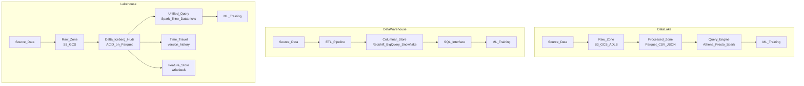

# 🏞️ Data Lakes and Lakehouses

> [!abstract] TL;DR
> A **data lake** stores raw data cheaply in object storage (S3/GCS). A **data warehouse** stores structured data with fast SQL queries but at high cost. A **lakehouse** combines both: ACID transactions, schema enforcement, and fast queries directly on cheap object storage files (via Delta Lake, Apache Iceberg, or Apache Hudi). ML teams increasingly adopt lakehouses because they enable versioned, auditable training datasets without expensive data duplication.

## Intuition — Analogy First

**Data Lake** = a filing cabinet where you dump *everything* — raw emails, scanned receipts, photos, handwritten notes. Nothing is organized. Cheap storage, but finding anything takes a long time and you might pick up the wrong version.

**Data Warehouse** = a well-organized office library with catalogued books, indexing systems, and a strict "return books to the right shelf" policy. Fast to query, but expensive and inflexible — you can only store "approved" structured data.

**Lakehouse** = the organized library *inside* the filing cabinet building. Same cheap storage as the filing cabinet, but with a proper cataloguing system (transaction log), librarians who enforce "one checkout at a time" (ACID), and a record of every book's history (time travel). You get the best of both worlds.

## How It Works — Mechanics

### The Three Architectures



### Data Lake Zones

Raw → Bronze (ingested as-is) → Silver (cleaned, deduplicated) → Gold (aggregated, feature-ready)

This "medallion architecture" is the standard pattern in lakehouses:
- **Bronze**: exact copy of source data, immutable. Format: JSON, CSV, Parquet.
- **Silver**: cleaned, joined, schema-enforced. Format: Delta/Iceberg Parquet.
- **Gold**: aggregated features, model-ready datasets. Format: Delta/Parquet.

### Lakehouse Key Features

| Feature | Why It Matters for ML |
|---|---|
| **ACID transactions** | Multiple Spark jobs can write to the same table concurrently without corruption |
| **Time travel** | Reproduce exact training dataset from 6 months ago for debugging or auditing |
| **Schema evolution** | Add a new feature column without breaking downstream readers |
| **DML (UPDATE/DELETE/MERGE)** | Fix bad data in historical partitions; GDPR right-to-erasure |
| **Z-ordering / data skipping** | Query only relevant partitions → 10–100x faster feature extraction |
| **Unified batch + streaming** | Same Delta table receives batch and streaming writes |

## Code Demo

### Reading from S3 with Pandas

```python
import pandas as pd
import boto3

# Option 1: Direct S3 URL (requires s3fs)
df = pd.read_parquet("s3://ml-bucket/silver/user_features/snapshot_date=2026-07-25/")

# Option 2: Boto3 for fine-grained control
s3 = boto3.client("s3")
obj = s3.get_object(Bucket="ml-bucket", Key="silver/user_features/part-00000.parquet")
df = pd.read_parquet(obj["Body"])

print(f"Loaded {len(df)} rows, {df.shape[1]} features")
print(df.dtypes)
```

### Reading from S3 with PySpark

```python
from pyspark.sql import SparkSession

spark = SparkSession.builder \
    .appName("Lakehouse-ML") \
    .config("spark.jars.packages", "io.delta:delta-core_2.12:2.4.0") \
    .config("spark.sql.extensions", "io.delta.sql.DeltaSparkSessionExtension") \
    .getOrCreate()

# Read entire partitioned dataset
df = spark.read.parquet("s3://ml-bucket/silver/user_features/")

# Partition pruning — only reads 2026-07-25 partition
df_today = spark.read.parquet("s3://ml-bucket/silver/user_features/") \
    .filter("snapshot_date = '2026-07-25'")

print(f"Rows: {df_today.count()}")
```

### Delta Lake Table Creation and Time Travel

```python
from delta import DeltaTable
from pyspark.sql import SparkSession
import pyspark.sql.functions as F

spark = SparkSession.builder \
    .config("spark.jars.packages", "io.delta:delta-core_2.12:2.4.0") \
    .config("spark.sql.extensions", "io.delta.sql.DeltaSparkSessionExtension") \
    .config("spark.sql.catalog.spark_catalog", "org.apache.spark.sql.delta.catalog.DeltaCatalog") \
    .getOrCreate()

delta_path = "s3://ml-bucket/gold/model_training_features"

# Write training dataset as Delta table
train_df.write \
    .format("delta") \
    .mode("overwrite") \
    .option("overwriteSchema", "true") \
    .partitionBy("snapshot_date") \
    .save(delta_path)

# Time travel: read table as it was 7 days ago
df_historical = spark.read \
    .format("delta") \
    .option("timestampAsOf", "2026-07-18") \
    .load(delta_path)

# Or by version number
df_v2 = spark.read \
    .format("delta") \
    .option("versionAsOf", 2) \
    .load(delta_path)

# Show Delta history
delta_table = DeltaTable.forPath(spark, delta_path)
delta_table.history(10).show(truncate=False)

# Schema evolution: add a new feature column without rewriting
spark.sql(f"""
    ALTER TABLE delta.`{delta_path}` 
    ADD COLUMN new_feature DOUBLE
""")
```

### MERGE INTO for Incremental Updates

```python
from delta import DeltaTable

delta_table = DeltaTable.forPath(spark, "s3://ml-bucket/gold/user_features")
new_data = spark.read.parquet("s3://ml-bucket/bronze/new_features/")

# Upsert: update existing users, insert new ones
delta_table.alias("existing").merge(
    new_data.alias("updates"),
    "existing.user_id = updates.user_id"
).whenMatchedUpdateAll() \
 .whenNotMatchedInsertAll() \
 .execute()
```

## Real-World Example

**Databricks Lakehouse** (the company that created Delta Lake) migrated from a classic two-tier architecture (S3 data lake + Redshift warehouse) to a lakehouse in 2019. Result: eliminated data duplication, reduced storage costs by 40%, and gave ML teams direct access to ACID tables. Their ML platform reads Delta tables for training data, with time travel to reproduce any historical experiment.

**Snowflake Data Cloud** takes a warehouse-first approach but introduced Snowpark (DataFrame API) and external tables (querying S3 Parquet directly), moving toward lakehouse capabilities.

## Trade-offs

| Dimension | Data Lake | Data Warehouse | Lakehouse |
|---|---|---|---|
| Storage cost | Very low | High | Low |
| Query speed | Slow (no indexes) | Fast (columnar, indexed) | Fast (Z-ordering, column stats) |
| ACID | No | Yes | Yes (Delta/Iceberg) |
| Schema enforcement | None (schema-on-read) | Strict (schema-on-write) | Configurable |
| Time travel | No | Limited | Yes (full version history) |
| ML training | Raw, needs prep | SQL only | Native DataFrame + SQL |
| Streaming writes | Yes | Limited | Yes (Delta merge) |
| Governance | Hard | Good (column-level) | Good (Unity Catalog) |

## When to Use vs Avoid

**Use a Lakehouse when:**
- You need both SQL analytics and ML training on the same data.
- Regulatory requirements demand point-in-time reproducibility of training data.
- Multiple pipelines write to the same tables (ACID prevents corruption).
- You need schema evolution without pipeline downtime.

**Use a pure Data Warehouse when:**
- Your primary use case is BI/analytics by SQL users.
- Data is already structured and you don't do raw-data ML.
- Team expertise is SQL-centric, not Spark.

**Use a pure Data Lake when:**
- Storing raw data that may never be structured (logs, media, unstructured text).
- Extremely cost-sensitive with infrequent access.

## Common Pitfalls

1. **Small files problem**: streaming writes create thousands of tiny Parquet files, destroying query performance. Run periodic `OPTIMIZE` (Delta) to compact files.
2. **Forgetting to vacuum**: Delta time travel accumulates old file versions. Run `VACUUM` after 7+ days to reclaim storage.
3. **Mixed writes without transactions**: mixing a Delta writer and a raw Parquet writer to the same path corrupts the transaction log. All writers must use the Delta protocol.
4. **Over-partitioning**: partitioning by user_id on a 100M-user table creates 100M tiny directories. Partition by date or coarser buckets.
5. **No data catalog**: S3 paths without a catalog (Hive Metastore, AWS Glue, Unity Catalog) mean teams can't discover datasets. Always register tables.

## Related Concepts

- [[_MOC_Data_Engineering|↑ Section MOC]]

- [[Delta_Lake]] — specific implementation of lakehouse on Parquet with ACID transactions
- [[Apache_Spark_for_ML]] — primary compute engine for lakehouse queries
- [[ETL_ELT_for_ML]] — lakehouse enables the ELT pattern at scale
- [[Data_Warehouses_for_ML]] — comparison: when to use DW vs lakehouse
- [[Feature_Stores]] — Gold layer tables often feed feature stores

## Review Questions

1. What is the "small files problem" in a data lake, and why does it get worse in streaming ingestion scenarios? How does the lakehouse format address it?
2. Your team trained a model in January 2026 using a feature table. In July, data quality issues are discovered in the February data. How does time travel in a lakehouse help you (a) reproduce the January training run and (b) retroactively fix the corrupted data?
3. Compare ACID transactions in a relational database vs Delta Lake. What guarantee does Delta provide, and where does it fall short compared to a traditional RDBMS?

## Sources

- Databricks: "Delta Lake: High-Performance ACID Table Storage" (VLDB 2020)
- Apache Iceberg documentation — https://iceberg.apache.org/
- "Delta Lake: The Definitive Guide" — Denny Lee et al. (O'Reilly, 2024)
- Snowflake Blog: "The Data Lakehouse"
- Databricks Blog: "Medallion Architecture"

#data-engineering #storage #data-lake #lakehouse #delta-lake #iceberg #architecture
