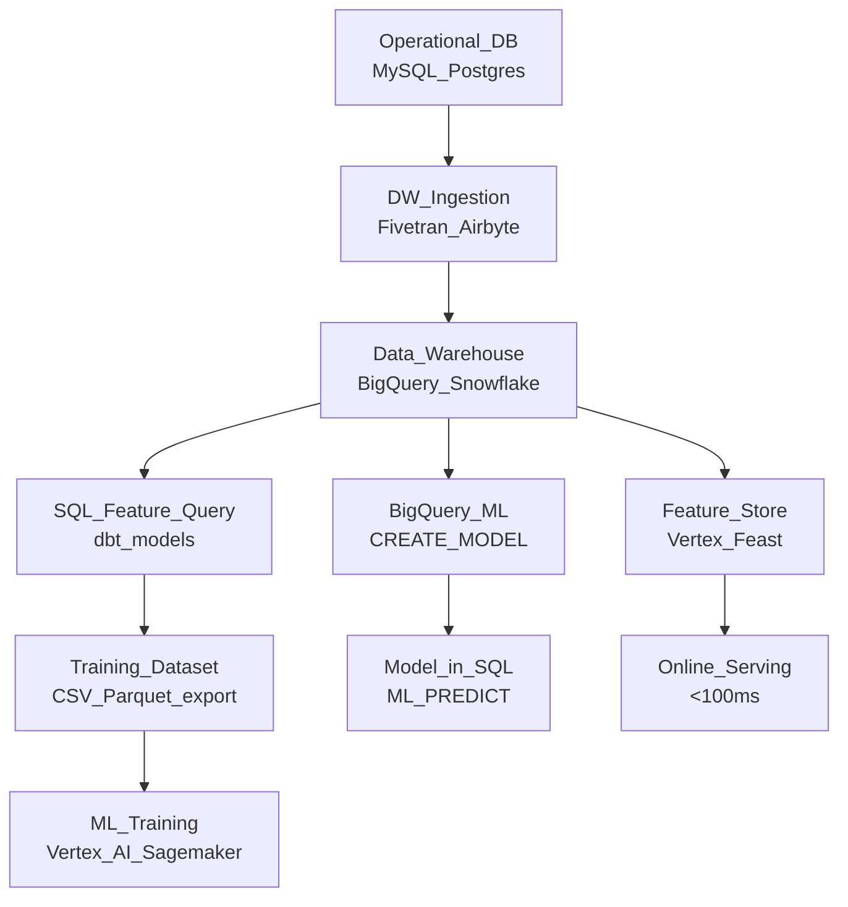

# 🏛️ Data Warehouses for ML

> [!abstract] TL;DR
> Cloud data warehouses (BigQuery, Snowflake, Redshift) use columnar storage and massively parallel SQL to query terabytes in seconds. For ML, they serve as both the source of feature extraction queries and (increasingly) the execution environment for model training via BigQuery ML. Use them when your data is structured, your team speaks SQL, and you need fast ad-hoc feature exploration.

## Intuition — Analogy First

A data warehouse is a **highly organized, fast-access filing system optimized for reading columns of data**, not individual records.

Imagine a library where all books are stored spine-up in columns: every book's "title" is together, every "author" is together, every "publication year" is together. If you want to find all books published in the 1990s, you only need to scan the "year" column — you don't touch the "title" or "author" shelves at all.

This is **columnar storage**: each column is stored separately. A query like `SELECT AVG(amount) WHERE country = 'US'` only reads the `amount` and `country` columns from disk — skipping everything else. On a 100-column table with 1 billion rows, this can be 50x faster than row storage.

## How It Works — Mechanics

### Columnar Storage

Traditional databases store rows together: `[user1_id, user1_name, user1_amount, user2_id, ...]`. Warehouses store columns together: `[user1_id, user2_id, ..., user1_name, user2_name, ..., user1_amount, user2_amount, ...]`.

Benefits for ML:
- Feature extraction queries only read needed columns.
- Better compression (column values are similar → higher compression ratio).
- Parallel scan across many CPU cores.

### Performance Tuning

| Technique | How It Works | When to Use |
|---|---|---|
| **Partitioning** | Divide table by a column (date). Queries with date filter skip irrelevant partitions. | Time-series tables; partition on `event_date` |
| **Clustering** | Within partitions, sort by one or more columns. Queries on those columns read fewer blocks. | User-level feature tables; cluster on `user_id` |
| **Materialized views** | Pre-compute expensive aggregations. Query hits cached result. | Frequently-run feature extraction queries |
| **Columnar compression** | Parquet/ORC encoding compresses repetitive column values. | Automatic in BigQuery/Snowflake |

### BigQuery ML

BigQuery ML runs ML models inside BigQuery using SQL syntax — no data movement, no separate compute infrastructure. Good for fast prototyping, less good for custom architectures.

Supported models: Linear/Logistic Regression, K-Means, Matrix Factorization, XGBoost, DNN, ARIMA, TensorFlow imported models.

### DW vs Feature Store

| Use Case | Data Warehouse | Feature Store |
|---|---|---|
| Feature extraction from raw data | Yes | No (reads pre-computed features) |
| Ad-hoc exploration | Yes (SQL) | No |
| Online (low-latency) serving | No (<100ms impossible) | Yes (Redis, DynamoDB) |
| Feature reuse across teams | Limited | Yes (central registry) |
| Training data generation | Yes | Offline store |
| Real-time features | No | Yes (streaming write) |

### ML Pipeline Position



## Code Demo

### BigQuery Python Client

```python
from google.cloud import bigquery
import pandas as pd

client = bigquery.Client(project="my-ml-project")

# Feature extraction query — runs distributed on BigQuery
query = """
WITH user_history AS (
    SELECT
        user_id,
        COUNT(*) AS purchase_count_90d,
        SUM(amount_usd) AS total_spend_90d,
        AVG(amount_usd) AS avg_order_value_90d,
        COUNTIF(event_type = 'refund') / COUNT(*) AS refund_rate_90d,
        DATE_DIFF(CURRENT_DATE(), MAX(DATE(event_timestamp)), DAY) AS days_since_last_purchase,
        COUNT(DISTINCT product_category) AS category_diversity
    FROM `my-ml-project.raw.purchase_events`
    WHERE event_timestamp >= TIMESTAMP_SUB(CURRENT_TIMESTAMP(), INTERVAL 90 DAY)
    GROUP BY user_id
),
user_labels AS (
    SELECT user_id, 1 AS churned
    FROM `my-ml-project.raw.churned_users`
)

SELECT
    h.*,
    COALESCE(l.churned, 0) AS label
FROM user_history h
LEFT JOIN user_labels l USING (user_id)
"""

# Execute and load to Pandas (for datasets that fit in memory)
df = client.query(query).to_dataframe()
print(f"Training dataset: {len(df)} rows, {df.shape[1]} features")

# For large datasets, export to GCS first
job_config = bigquery.QueryJobConfig(
    destination="my-ml-project.ml_features.user_churn_features",
    write_disposition="WRITE_TRUNCATE",
)
client.query(query, job_config=job_config).result()
print("Features written to BigQuery table")
```

### SQL Feature Extraction (BigQuery SQL)

```sql
-- Production-grade feature table materialized in BigQuery
CREATE OR REPLACE TABLE ml_features.user_churn_v2
PARTITION BY snapshot_date
CLUSTER BY user_id
AS

WITH base AS (
    SELECT
        user_id,
        CURRENT_DATE() AS snapshot_date,
        -- Recency
        DATE_DIFF(CURRENT_DATE(), MAX(DATE(event_timestamp)), DAY) AS recency_days,
        -- Frequency
        COUNT(*) AS purchase_count_30d,
        COUNT(DISTINCT DATE(event_timestamp)) AS active_days_30d,
        -- Monetary
        SUM(amount_usd) AS total_spend_30d,
        AVG(amount_usd) AS avg_order_value,
        STDDEV(amount_usd) AS std_order_value,
        PERCENTILE_CONT(amount_usd, 0.5) OVER (PARTITION BY user_id) AS median_order_value,
        -- Behavioral
        COUNT(DISTINCT product_category) AS category_diversity,
        COUNTIF(channel = 'mobile') / COUNT(*) AS mobile_pct,
        COUNTIF(event_type = 'refund') AS refund_count
    FROM raw.purchase_events
    WHERE event_timestamp >= TIMESTAMP_SUB(CURRENT_TIMESTAMP(), INTERVAL 30 DAY)
    GROUP BY user_id
)

SELECT * FROM base
```

### BigQuery ML — Train Model in SQL

```sql
-- Train a logistic regression model directly in BigQuery — no infra needed
CREATE OR REPLACE MODEL ml_models.user_churn_classifier
OPTIONS (
    model_type = 'LOGISTIC_REG',
    input_label_cols = ['label'],
    l1_reg = 0.1,
    l2_reg = 0.01,
    max_iterations = 100,
    data_split_method = 'AUTO_SPLIT'  -- BigQuery handles train/val split
) AS
SELECT
    purchase_count_30d,
    total_spend_30d,
    avg_order_value,
    recency_days,
    category_diversity,
    mobile_pct,
    refund_count,
    label
FROM ml_features.user_churn_v2
WHERE snapshot_date = CURRENT_DATE();

-- Evaluate
SELECT * FROM ML.EVALUATE(MODEL ml_models.user_churn_classifier);

-- Predict on new data
SELECT
    user_id,
    predicted_label,
    predicted_label_probs
FROM ML.PREDICT(
    MODEL ml_models.user_churn_classifier,
    (SELECT * FROM ml_features.user_churn_v2 WHERE snapshot_date = CURRENT_DATE())
);
```

### Snowflake Feature Extraction

```python
import snowflake.connector
import pandas as pd

conn = snowflake.connector.connect(
    account="mycompany.us-east-1",
    user="ml_service_user",
    password="...",  # use environment variables in production
    warehouse="ML_WH_LARGE",
    database="ML_DB",
    schema="FEATURES",
)

cursor = conn.cursor()
query = """
    SELECT
        USER_ID,
        DATEDIFF('day', MAX(PURCHASE_DATE), CURRENT_DATE()) AS RECENCY_DAYS,
        COUNT(*) AS PURCHASE_COUNT_90D,
        SUM(AMOUNT_USD) AS TOTAL_SPEND_90D
    FROM RAW.PURCHASE_EVENTS
    WHERE PURCHASE_DATE >= DATEADD('day', -90, CURRENT_DATE())
    GROUP BY USER_ID
"""
cursor.execute(query)
df = cursor.fetch_pandas_all()
cursor.close()
conn.close()
print(df.head())
```

## Real-World Example

**Shopify** builds training datasets directly from BigQuery. Their checkout fraud detection model is trained on 3+ years of transaction history stored in BigQuery. The feature engineering runs as nightly dbt jobs on BigQuery, and the resulting feature table (~200M rows) is exported to GCS as Parquet for XGBoost training on Vertex AI.

**BigQuery ML** is used heavily by smaller teams at Google for quick prototyping. A product team can train and evaluate a recommendation model in SQL in under 10 minutes — without moving any data.

## Trade-offs

| Dimension | BigQuery | Snowflake | Redshift |
|---|---|---|---|
| Pricing model | On-demand per TB queried | Credit-based (storage + compute) | Reserved or Serverless |
| ML in SQL | Yes (BigQuery ML) | Yes (Snowpark ML) | Limited |
| Streaming ingest | Yes (Streaming API) | Snowpipe | Kinesis Firehose |
| Feature store integration | Vertex AI Feature Store | Limited | SageMaker Feature Store |
| Max query performance | Excellent (serverless MPP) | Excellent | Good (needs tuning) |
| Data sharing | Analytics Hub | Snowflake Marketplace | Limited |

## When to Use vs Avoid

**Use a data warehouse for ML when:**
- Feature extraction from structured operational data at TB scale.
- Team is SQL-fluent and wants fast iteration.
- Quick model prototyping without infrastructure setup (BigQuery ML).
- Scheduled batch feature materialization for training datasets.

**Avoid using a data warehouse when:**
- Online (real-time) feature serving needed (<100ms) — use a feature store with Redis.
- Unstructured data (images, text, audio) — store in S3/GCS.
- Interactive ML experimentation requiring Python/Jupyter — export to Pandas or use Spark.

## Common Pitfalls

1. **Full table scans on non-partitioned tables**: a `WHERE event_date = '2026-07-25'` on an unpartitioned BigQuery table scans the entire table. Always partition by date for event tables.
2. **Overusing BigQuery ML for production**: BigQuery ML is great for prototyping. For production, export to a proper serving layer (Vertex AI Prediction) for latency and monitoring.
3. **Joining on high-cardinality columns without clustering**: joining two 100M-row tables on `user_id` without clustering causes full scans. Cluster both tables by `user_id`.
4. **Exporting features without versioning**: if you overwrite the feature table daily and later need last week's features, you can't get them. Use partitioned tables or versioned exports.
5. **Not monitoring slot utilization (BigQuery)**: on-demand pricing can be expensive for complex queries. Set capacity commitments for predictable costs.

## Related Concepts

- [[_MOC_Data_Engineering|↑ Section MOC]]

- [[Data_Lakes_and_Lakehouses]] — lakehouses complement warehouses for raw data
- [[Feature_Stores]] — warehouses generate features; feature stores serve them online
- [[ETL_ELT_for_ML]] — ELT pattern: transform in warehouse using dbt/SQL
- [[Delta_Lake]] — open-source alternative to managed warehouse tables
- [[Apache_Spark_for_ML]] — Spark for warehouse workloads that need more flexibility

## Review Questions

1. Explain the difference between partitioning and clustering in BigQuery (or Snowflake). When would you apply each, and what happens to query performance if you apply them to the wrong columns?
2. A data scientist wants to train a churn model on 2 years of purchase history (50 GB). Compare three approaches: (a) BigQuery ML, (b) export to Pandas, (c) Spark on Dataproc. When is each appropriate?
3. Your feature extraction SQL query costs $50/run in BigQuery. What are three specific strategies to reduce this cost without changing the features being computed?

## Sources

- BigQuery ML Documentation — https://cloud.google.com/bigquery/docs/bqml-introduction
- Snowflake Documentation — https://docs.snowflake.com/
- Amazon Redshift Developer Guide — https://docs.aws.amazon.com/redshift/
- "Designing Data-Intensive Applications" — Martin Kleppmann (O'Reilly, 2017) — Ch. 3 on columnar storage
- dbt Documentation for Warehouse SQL Transformations — https://docs.getdbt.com/

#data-engineering #storage #data-warehouse #bigquery #snowflake #redshift #columnar #ml-features
