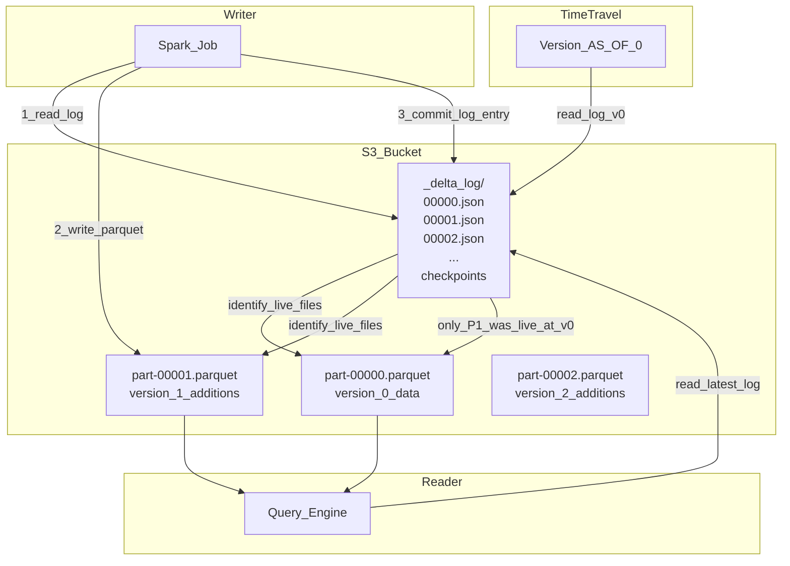

# 🔷 Delta Lake

> [!abstract] TL;DR
> Delta Lake adds ACID transactions, time travel (version history), schema enforcement, and DML operations (UPDATE/DELETE/MERGE) to Parquet files stored in object storage (S3/GCS/ADLS). It's "Git for data tables" — every write creates a new version, and you can query any historical state. Created by Databricks, now an Apache open-source project.

## Intuition — Analogy First

Delta Lake is **Git for your data tables**.

When you use Git:
- Every commit creates a versioned snapshot of the code.
- You can `checkout` any past commit to see the code exactly as it was.
- Two developers can merge changes without corrupting each other's work.
- The commit log tells you who changed what and when.

Delta Lake does exactly this for data tables:
- Every write (INSERT, UPDATE, DELETE) creates a new version logged in the transaction log (`_delta_log/`).
- You can `SELECT * FROM table VERSION AS OF 7` to get the table as it looked at version 7.
- Concurrent Spark jobs can write to the same Delta table using optimistic concurrency — Delta detects conflicts and either merges or rejects.
- The `DESCRIBE HISTORY` command shows every change made to the table.

## How It Works — Mechanics

### Architecture



### Transaction Log

Every Delta table has a `_delta_log/` directory alongside its Parquet data files:
- Each commit creates a JSON file (e.g., `00000000000000000042.json`).
- The JSON records: which files were added, which were removed, schema, statistics, metadata.
- Every 10 commits, Delta creates a **checkpoint** (Parquet file) for fast log replay.
- Time travel = replay the log up to a given version.

### ACID Guarantees

| Property | How Delta Provides It |
|---|---|
| **Atomicity** | Either the full commit log entry is written or none — partial writes don't appear |
| **Consistency** | Schema enforcement rejects writes that violate the table schema |
| **Isolation** | Snapshot isolation — readers see consistent snapshot regardless of concurrent writers |
| **Durability** | Data in S3/GCS — no data loss once `_delta_log/` entry is committed |

### Z-Ordering (Data Skipping)

Z-ordering co-locates related data in the same Parquet file. When you filter by `country = 'US'`, Spark only reads files where the `country` column statistics include 'US'. This can reduce data scanned by 10–100x on selective queries.

```sql
OPTIMIZE delta.`s3://ml-bucket/features/user_table`
ZORDER BY (user_id, country)
```

## Code Demo

### Delta Library (Python/PySpark)

```python
from pyspark.sql import SparkSession
from delta import DeltaTable, configure_spark_with_delta_pip
import pyspark.sql.functions as F

# Configure Spark with Delta
builder = SparkSession.builder \
    .appName("DeltaLakeDemo") \
    .config("spark.sql.extensions", "io.delta.sql.DeltaSparkSessionExtension") \
    .config("spark.sql.catalog.spark_catalog",
            "org.apache.spark.sql.delta.catalog.DeltaCatalog")

spark = configure_spark_with_delta_pip(builder).getOrCreate()

delta_path = "s3://ml-bucket/gold/user_features"
```

### CREATE TABLE (first write)

```python
from pyspark.sql.types import StructType, StructField, StringType, DoubleType, LongType, DateType

schema = StructType([
    StructField("user_id", StringType(), False),
    StructField("snapshot_date", DateType(), False),
    StructField("purchase_count_30d", LongType(), True),
    StructField("total_spend_30d", DoubleType(), True),
    StructField("avg_order_value", DoubleType(), True),
])

# Write v0 — creates Delta table
initial_df = spark.createDataFrame([], schema)
initial_df.write \
    .format("delta") \
    .mode("overwrite") \
    .partitionBy("snapshot_date") \
    .save(delta_path)

# Append production data
prod_df = spark.read.parquet("s3://ml-bucket/silver/user_features/")
prod_df.write \
    .format("delta") \
    .mode("append") \
    .save(delta_path)
```

### MERGE INTO (Upsert)

```python
# Incremental upsert — the most important Delta operation for ML feature tables
delta_table = DeltaTable.forPath(spark, delta_path)
new_features = spark.read.parquet("s3://ml-bucket/incremental/new_features/")

delta_table.alias("target").merge(
    new_features.alias("source"),
    "target.user_id = source.user_id AND target.snapshot_date = source.snapshot_date"
).whenMatchedUpdate(set={
    "purchase_count_30d": "source.purchase_count_30d",
    "total_spend_30d": "source.total_spend_30d",
    "avg_order_value": "source.avg_order_value",
}).whenNotMatchedInsert(values={
    "user_id": "source.user_id",
    "snapshot_date": "source.snapshot_date",
    "purchase_count_30d": "source.purchase_count_30d",
    "total_spend_30d": "source.total_spend_30d",
    "avg_order_value": "source.avg_order_value",
}).execute()

print("Merge complete")
```

### Time Travel Query

```python
# Read table as it was at a specific timestamp
df_july_1 = spark.read \
    .format("delta") \
    .option("timestampAsOf", "2026-07-01") \
    .load(delta_path)

# Read table at a specific version
df_v5 = spark.read \
    .format("delta") \
    .option("versionAsOf", 5) \
    .load(delta_path)

# View full history
delta_table = DeltaTable.forPath(spark, delta_path)
delta_table.history(20).select(
    "version", "timestamp", "operation", "operationParameters", "userMetadata"
).show(truncate=False)

# Restore to a previous version (undo a bad write)
delta_table.restoreToVersion(3)
```

### SQL Interface for Delta

```sql
-- Create managed Delta table via SQL
CREATE TABLE IF NOT EXISTS ml_catalog.gold.user_features (
    user_id STRING NOT NULL,
    snapshot_date DATE NOT NULL,
    purchase_count_30d BIGINT,
    total_spend_30d DOUBLE,
    avg_order_value DOUBLE
)
USING DELTA
PARTITIONED BY (snapshot_date)
LOCATION 's3://ml-bucket/gold/user_features'
TBLPROPERTIES (
    'delta.autoOptimize.optimizeWrite' = 'true',
    'delta.autoOptimize.autoCompact' = 'true'
);

-- Optimize with Z-ordering for fast user_id lookups
OPTIMIZE ml_catalog.gold.user_features
ZORDER BY (user_id);

-- Remove files older than 7 days (reclaim storage)
VACUUM ml_catalog.gold.user_features RETAIN 168 HOURS;

-- Schema evolution: add a new feature column
ALTER TABLE ml_catalog.gold.user_features
ADD COLUMN category_diversity INT;
```

### GDPR Right-to-Erasure (DELETE)

```python
# Delete all records for a specific user (GDPR erasure)
delta_table = DeltaTable.forPath(spark, delta_path)
delta_table.delete(condition=F.col("user_id") == "user_abc_123")

# After deletion, VACUUM removes the historical records from storage too
# (after the configured retention period)
```

## Real-World Example

**Databricks** uses Delta Lake throughout their own platform. All tables in the Databricks Unity Catalog are Delta tables.

**Comcast** migrated their recommendation engine feature store to Delta Lake. Previously, pipeline failures would corrupt the feature table (no ACID). Post-migration: zero data corruption incidents, 8x faster feature queries via Z-ordering on user_id + content_id.

**H&M** uses Delta Lake for their ML training data (fashion recommendation). The time travel feature lets them reproduce any model's training set for compliance/audit purposes — critical in the EU under GDPR's right to explainability.

## Trade-offs

| Dimension | Advantage | Limitation |
|---|---|---|
| ACID | Safe concurrent writes | Slight write overhead vs raw Parquet |
| Time travel | Reproducible ML experiments | Storage grows until VACUUM runs |
| Schema enforcement | Prevents bad data | Schema changes require ALTER TABLE |
| Performance | Z-ordering speeds up filtered reads | OPTIMIZE must be run manually (or auto) |
| Ecosystem | Spark-native, open Apache | Heavier than plain Parquet for simple reads |
| Delta vs Iceberg | More Databricks tooling | Iceberg has broader cloud-native support |

## When to Use vs Avoid

**Use Delta Lake when:**
- Multiple jobs write to the same data directory concurrently.
- You need to reproduce a specific historical version of a training dataset.
- You need GDPR-compliant data deletion from large tables.
- Performing incremental updates (upserts) to feature tables.

**Avoid Delta (use plain Parquet) when:**
- Simple write-once, read-many patterns with no concurrent writers.
- Data accessed by non-Spark tools that don't support Delta (some legacy systems).
- Maximum query performance for non-Databricks tools (consider Iceberg for broader support).

## Common Pitfalls

1. **Forgetting to run VACUUM**: Delta keeps all historical versions indefinitely. Set a retention policy and run `VACUUM RETAIN 168 HOURS` periodically.
2. **Mixing Parquet and Delta writers**: writing raw Parquet to a Delta table path corrupts the transaction log. All writes must go through the Delta protocol.
3. **Too many small files after streaming writes**: use `OPTIMIZE` with auto-compaction (`delta.autoOptimize.autoCompact = true`) to merge small files.
4. **Dropping a partition without DML**: `DELETE FROM table WHERE snapshot_date = '...'` is correct. Deleting the Parquet files directly bypasses the transaction log and breaks the table.
5. **Not setting `delta.logRetentionDuration`**: default is 30 days. If you need time travel beyond 30 days, increase this property.

## Related Concepts

- [[_MOC_Data_Engineering|↑ Section MOC]]

- [[Data_Lakes_and_Lakehouses]] — Delta Lake is the foundation of the lakehouse architecture
- [[Apache_Spark_for_ML]] — Delta's primary compute engine; native Spark integration
- [[ETL_ELT_for_ML]] — Delta tables are the target for ELT pipelines
- [[Feature_Stores]] — Gold-layer Delta tables often serve as offline feature stores

## Review Questions

1. Explain how Delta Lake achieves atomicity for a concurrent write. What happens if two Spark jobs try to write to the same Delta table simultaneously?
2. You ran a buggy pipeline that computed incorrect features and saved them to a Delta table. How would you use time travel to (a) identify when the bug was introduced and (b) restore the table to the last known-good state?
3. Your Delta table has grown to 10 TB with 5 years of history. VACUUM hasn't been run in 6 months. What are the storage and performance implications, and what is your remediation plan?

## Sources

- Delta Lake Documentation — https://docs.delta.io/
- "Delta Lake: High-Performance ACID Table Storage over Cloud Object Stores" (VLDB 2020)
- "Delta Lake: The Definitive Guide" — Denny Lee et al. (O'Reilly, 2024)
- Delta Lake GitHub — https://github.com/delta-io/delta
- Databricks Blog: "Introducing Delta Lake"

#data-engineering #storage #delta-lake #acid #time-travel #parquet #lakehouse
