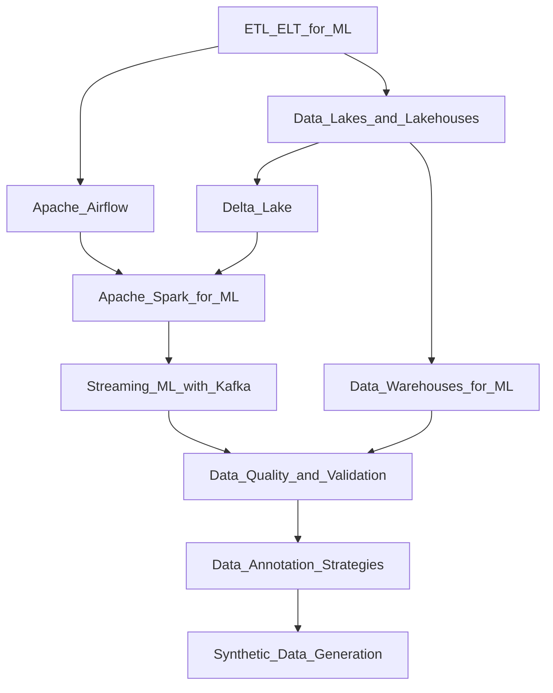

# 🗺️ Data Engineering — Map of Content

> [!info] How to use this map
> Start with Fundamentals, follow the arrows, and use the Learning Path below as your guide.

---

## Concept Map

---

## Learning Path
1. [[Pipelines/ETL_ELT_for_ML]] — Understand batch vs. streaming ingestion patterns and the ELT shift driven by cloud data warehouses
2. [[Pipelines/Apache_Airflow]] — Learn how to orchestrate multi-step pipelines with DAGs, retries, and scheduling
3. [[Storage/Data_Lakes_and_Lakehouses]] — Understand raw storage, schema-on-read, and the lakehouse architecture that unifies lakes and warehouses
4. [[Storage/Delta_Lake]] — See how ACID transactions and time-travel are added on top of object storage
5. [[Pipelines/Apache_Spark_for_ML]] — Apply distributed compute to feature engineering and large-scale data transformations
6. [[Pipelines/Streaming_ML_with_Kafka]] — Handle real-time event streams for online inference and continuous training
7. [[Storage/Data_Warehouses_for_ML]] — Understand structured, query-optimized storage and its role as an ML feature source
8. [[Quality/Data_Quality_and_Validation]] — Enforce schema contracts, detect drift, and validate data before model training
9. [[Quality/Data_Annotation_Strategies]] — Design labeling workflows (crowdsource, expert, active learning) for supervised tasks
10. [[Quality/Synthetic_Data_Generation]] — Generate artificial training data to augment rare classes or protect privacy

---

## All Notes in This Section

| Note | Core Idea | Difficulty |
|------|-----------|------------|
| [[Pipelines/ETL_ELT_for_ML]] | Extract-Transform-Load vs Extract-Load-Transform for ML pipelines | Beginner |
| [[Pipelines/Apache_Airflow]] | Workflow orchestration using directed acyclic graphs (DAGs) | Intermediate |
| [[Pipelines/Apache_Spark_for_ML]] | Distributed in-memory data processing for large-scale ML | Intermediate |
| [[Pipelines/Streaming_ML_with_Kafka]] | Event-driven, low-latency data pipelines for real-time ML | Advanced |
| [[Storage/Data_Lakes_and_Lakehouses]] | Unified storage architecture combining raw lakes with warehouse capabilities | Beginner |
| [[Storage/Delta_Lake]] | ACID-compliant open table format for reliable data lakes | Intermediate |
| [[Storage/Data_Warehouses_for_ML]] | Columnar, query-optimized storage for structured analytical workloads | Beginner |
| [[Quality/Data_Quality_and_Validation]] | Schema contracts, anomaly detection, and Great Expectations-style checks | Intermediate |
| [[Quality/Data_Annotation_Strategies]] | Labeling workflows, crowdsourcing, active learning for ground-truth creation | Intermediate |
| [[Quality/Synthetic_Data_Generation]] | GANs, VAEs, and rule-based methods to create artificial training data | Advanced |

---

## Key Questions This Section Answers
- What is the difference between ETL and ELT, and which is better for ML use cases?
- How do you orchestrate a multi-step ML pipeline with retries and monitoring?
- When should you use a data lake, a data warehouse, or a lakehouse?
- How does Delta Lake add reliability guarantees to object storage?
- How do you process petabyte-scale feature engineering jobs with Spark?
- What does it take to serve real-time ML predictions from a streaming source?
- How do you detect and prevent bad data from polluting model training?
- What are the trade-offs between human annotation, crowdsourcing, and active learning?
- When and how should you generate synthetic training data?

---

## Connections to Other Sections
- [[AI-ML/06_MLOps/_MOC_MLOps]] — Data pipelines feed feature stores, training triggers, and experiment tracking in MLOps
- [[AI-ML/09_AI_System_Design/_MOC_AI_System_Design]] — System design problems (recommendations, fraud, search) rely on data engineering patterns for feature serving and data freshness
