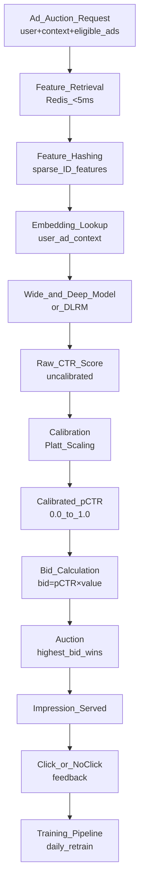

# 💰 Ad Click Prediction System Design

> [!abstract] TL;DR
> Ad CTR prediction estimates P(click | user, ad, context) for billions of impression-eligible ad pairs. Key challenges: extreme sparsity (one-hot encoded ad IDs × millions of ads), real-time serving latency (<10ms), extreme class imbalance (CTR ~0.5%), feedback loop management, and calibration for bid pricing. Google's Wide & Deep and Facebook's DLRM are the canonical architectures.

## Intuition — Analogy First

Imagine a billboard company with 10 million different ads and they must decide, in 50 milliseconds, which ad to show a specific driver passing a specific location at 9 AM on a Tuesday. They need to predict: given everything they know about this driver (their app history, demographics, past ad interactions) and this billboard slot (time, location, weather), what is the probability they click this ad?

This is the fundamental CTR prediction problem — except instead of a billboard, it's a 300×250 pixel square on a webpage, and instead of "10 milliseconds after a driver passes", it's a **real-time auction** where the highest bidder wins the impression.

The catch: the ad ID and user ID are **sparse categorical features** — there are 10 million ad IDs and 100 million user IDs. You can't one-hot encode those. You **learn embeddings** for each ad and user that capture their latent characteristics.

## How It Works — Mechanics

### CTR Prediction Pipeline



### Feature Types in CTR Prediction

| Feature Type | Examples | Encoding |
|---|---|---|
| **Sparse ID features** | user_id, ad_id, advertiser_id, publisher_id | Embedding lookup (10–128 dim) |
| **Dense numerical** | user_age, time_of_day, CTR history | Direct, normalized |
| **Multi-hot categorical** | user interests, ad keywords | Pooled embeddings (mean/sum) |
| **Cross features** | user_country × ad_category | Wide component (memorization) |
| **Context** | device, hour, day_of_week, page_category | Embedding or bucket |
| **Historical CTR** | user_CTR_last_7d, ad_CTR_last_7d | Direct numerical |

### Wide & Deep Architecture (Google, 2016)

```
Wide component: memorization
  Σ (feature_cross_i × weight_i) — logistic regression on hand-crafted cross features
  Example: user_installed_app="Pandora" × impression_app="Spotify" → learn this correlation

Deep component: generalization  
  Embeddings of sparse features → concatenated → MLP → dense output
  Generalizes to unseen feature combinations

Output: sigmoid(wide_output + deep_output) → pCTR
```

The wide component memorizes specific correlation patterns ("users who installed Pandora click Spotify ads"). The deep component generalizes ("users who like music streaming apps tend to click music ads").

### Feature Hashing

With 100M user IDs, storing per-ID embeddings requires 100M × embedding_dim × 4 bytes = 6.4GB just for user embeddings (dim=16). Feature hashing reduces this:
- Map each feature ID to one of N buckets (N << total unique IDs).
- Multiple IDs share the same bucket ("hash collision") → reduces expressiveness but saves memory.
- N = 10^6 buckets per feature type is common.

```python
bucket_index = hash(feature_id) % n_buckets
embedding = embedding_table[bucket_index]
```

### Calibration for Bid Pricing

The model outputs a score proportional to CTR but not equal to actual CTR. If your model says 0.05 but actual CTR is 0.02, your bid prices are 2.5× too high — overpaying for clicks.

**Platt scaling**: fit a logistic regression on model scores using validation data to transform scores to calibrated probabilities.

**Isotonic regression**: non-parametric calibration — better for more complex miscalibration.

### Feedback Loop

Problem: Model ranks ad A high → shown more → gets more clicks → model ranks A even higher → long tail ads starve.
Mitigation: randomize a small % of impressions (ε-greedy exploration), add freshness features, retrain with inverse propensity weighting.

## Code Demo

### Wide & Deep Model in PyTorch

```python
import torch
import torch.nn as nn
import torch.nn.functional as F
from dataclasses import dataclass

@dataclass
class ModelConfig:
    n_users: int = 1_000_000
    n_ads: int = 5_000_000
    n_categories: int = 500
    n_devices: int = 10
    user_emb_dim: int = 32
    ad_emb_dim: int = 32
    category_emb_dim: int = 16
    deep_hidden_dims: list = None
    
    def __post_init__(self):
        if self.deep_hidden_dims is None:
            self.deep_hidden_dims = [512, 256, 128]

class WideAndDeep(nn.Module):
    """Wide & Deep CTR prediction model."""
    
    def __init__(self, config: ModelConfig, n_dense_features: int = 10):
        super().__init__()
        self.config = config
        
        # ─── Embedding tables (Deep component) ─────────────────────────────
        self.user_embedding = nn.EmbeddingBag(config.n_users, config.user_emb_dim, mode="mean")
        self.ad_embedding = nn.EmbeddingBag(config.n_ads, config.ad_emb_dim, mode="mean")
        self.category_embedding = nn.EmbeddingBag(config.n_categories, config.category_emb_dim, mode="mean")
        self.device_embedding = nn.Embedding(config.n_devices, 8)
        
        # ─── Deep component: MLP ───────────────────────────────────────────
        deep_input_dim = (
            config.user_emb_dim + config.ad_emb_dim +
            config.category_emb_dim + 8 +  # device embedding
            n_dense_features
        )
        
        deep_layers = []
        prev_dim = deep_input_dim
        for hidden_dim in config.deep_hidden_dims:
            deep_layers.extend([
                nn.Linear(prev_dim, hidden_dim),
                nn.ReLU(),
                nn.BatchNorm1d(hidden_dim),
                nn.Dropout(0.2),
            ])
            prev_dim = hidden_dim
        self.deep_net = nn.Sequential(*deep_layers)
        
        # ─── Wide component: linear on cross features ──────────────────────
        self.n_wide_features = 50  # hand-crafted cross-product features
        self.wide = nn.Linear(self.n_wide_features, 1)
        
        # ─── Output: combine wide + deep ──────────────────────────────────
        self.deep_output = nn.Linear(config.deep_hidden_dims[-1], 1)
    
    def forward(
        self,
        user_ids: torch.Tensor,          # [B]
        ad_ids: torch.Tensor,            # [B]
        category_ids: torch.Tensor,      # [B, max_categories]
        device_ids: torch.Tensor,        # [B]
        dense_features: torch.Tensor,    # [B, n_dense]
        wide_features: torch.Tensor,     # [B, n_wide_features]
    ) -> torch.Tensor:
        
        # Deep: embed all sparse features
        user_emb = self.user_embedding(user_ids.unsqueeze(1))
        ad_emb = self.ad_embedding(ad_ids.unsqueeze(1))
        cat_emb = self.category_embedding(category_ids)
        device_emb = self.device_embedding(device_ids)
        
        deep_input = torch.cat([user_emb, ad_emb, cat_emb, device_emb, dense_features], dim=1)
        deep_hidden = self.deep_net(deep_input)
        deep_logit = self.deep_output(deep_hidden)
        
        # Wide: memorization
        wide_logit = self.wide(wide_features)
        
        # Combined output
        logit = wide_logit + deep_logit
        return torch.sigmoid(logit.squeeze(-1))  # pCTR


class CTRTrainer:
    """Training loop for CTR model with class imbalance handling."""
    
    def __init__(self, model: WideAndDeep, device: str = "cuda"):
        self.model = model.to(device)
        self.device = device
        # BCELoss with positive class weight for ~0.5% CTR
        self.pos_weight = torch.tensor([200.0]).to(device)
        self.criterion = nn.BCEWithLogitsLoss(pos_weight=self.pos_weight)
        self.optimizer = torch.optim.Adam(model.parameters(), lr=1e-3, weight_decay=1e-5)
    
    def train_step(self, batch: dict) -> float:
        self.model.train()
        y_pred = self.model(
            batch["user_ids"].to(self.device),
            batch["ad_ids"].to(self.device),
            batch["category_ids"].to(self.device),
            batch["device_ids"].to(self.device),
            batch["dense_features"].to(self.device),
            batch["wide_features"].to(self.device),
        )
        loss = self.criterion(y_pred, batch["labels"].float().to(self.device))
        self.optimizer.zero_grad()
        loss.backward()
        torch.nn.utils.clip_grad_norm_(self.model.parameters(), max_norm=1.0)
        self.optimizer.step()
        return loss.item()
```

### Feature Hashing for Sparse Categorical Features

```python
import hashlib
import numpy as np

class FeatureHasher:
    """Feature hashing for high-cardinality categorical IDs."""
    
    def __init__(self, n_buckets: int = 1_000_000):
        self.n_buckets = n_buckets
    
    def hash_feature(self, feature_name: str, feature_value: str) -> int:
        """Hash a (name, value) pair to a bucket index."""
        combined = f"{feature_name}:{feature_value}"
        hash_val = int(hashlib.md5(combined.encode()).hexdigest(), 16)
        return hash_val % self.n_buckets
    
    def hash_batch(self, feature_name: str, values: list[str]) -> np.ndarray:
        return np.array([self.hash_feature(feature_name, v) for v in values])

# Usage
hasher = FeatureHasher(n_buckets=2_000_000)
user_buckets = hasher.hash_batch("user_id", ["user_001", "user_002", "user_001"])
ad_buckets = hasher.hash_batch("ad_id", ["ad_xyz", "ad_abc", "ad_xyz"])
print(f"User buckets: {user_buckets}")   # same user always maps to same bucket
```

### Calibration with Platt Scaling

```python
from sklearn.linear_model import LogisticRegression
from sklearn.calibration import calibration_curve
import numpy as np

class PlattScaler:
    """Post-hoc calibration using Platt scaling."""
    
    def __init__(self):
        self.calibrator = LogisticRegression(C=1.0, solver="lbfgs")
    
    def fit(self, raw_scores: np.ndarray, labels: np.ndarray):
        """Fit calibrator on validation set (not training set!)."""
        self.calibrator.fit(raw_scores.reshape(-1, 1), labels)
        print(f"Calibrator fitted. Intercept: {self.calibrator.intercept_[0]:.3f}")
    
    def predict(self, raw_scores: np.ndarray) -> np.ndarray:
        """Transform raw model scores to calibrated probabilities."""
        return self.calibrator.predict_proba(raw_scores.reshape(-1, 1))[:, 1]
    
    def evaluate_calibration(self, raw_scores: np.ndarray, labels: np.ndarray, n_bins: int = 10):
        """Check calibration: predicted probability vs actual CTR."""
        calibrated = self.predict(raw_scores)
        fraction_positive, mean_predicted = calibration_curve(
            labels, calibrated, n_bins=n_bins, strategy="quantile"
        )
        print("\nCalibration Check (predicted vs actual):")
        for pred, actual in zip(mean_predicted, fraction_positive):
            bar = "█" * int(actual / pred * 10) if pred > 0 else ""
            print(f"  Predicted={pred:.4f}, Actual={actual:.4f} {bar}")

# Usage
scaler = PlattScaler()
scaler.fit(val_raw_scores, val_labels)
calibrated_pctrs = scaler.predict(test_raw_scores)
```

## Real-World Example

**Google's Wide & Deep** (2016) was deployed in Google Play Store app recommendations:
- Wide: 10^7 sparse features (app install history, demographic cross features)
- Deep: 32-dim embeddings for 10^6+ app IDs → 3-layer MLP
- Training: 500 billion examples from the Play Store
- Serving: <10ms per request at 10M+ QPS
- Result: 3.9% improvement in app acquisitions over the previous model

**Meta's DLRM** (Deep Learning Recommendation Model, 2019) introduced "dense features interact with sparse features via dot products" — more parameter-efficient than concatenation. Used for News Feed ranking and ad CTR prediction at 10M+ QPS.

**TikTok's For You Page** uses a similar architecture with extra signals: video completion rate, share rate, re-watch rate — not just click. Their training data refresh rate is extremely high (near-real-time) because content trends change hourly.

## Trade-offs

| Design Choice | Trade-off |
|---|---|
| Wide (logistic reg) + Deep | Wide = memorization; Deep = generalization. Both needed. |
| Embedding dim | Larger = more expressive; smaller = less memory, faster serving |
| Positive class weight | Higher = better recall (find all clickers); lower = better precision |
| Retrain frequency | Daily retraining catches trends; more compute cost |
| Feature hashing | Less memory; hash collisions slightly reduce accuracy |
| Calibration | Required for bid pricing; adds small latency |

## When to Use vs Avoid

**Wide & Deep CTR architecture when:**
- Billions of sparse ID features (user_id, ad_id, item_id).
- Memorization of specific patterns AND generalization both matter.
- Serving latency must be <10ms at very high QPS.

**Simpler LightGBM ranker when:**
- Sparse ID features are not important (using dense features only).
- Team has less deep learning expertise.
- Lower QPS, more latency tolerance.

## Common Pitfalls

1. **Not calibrating output probabilities**: raw model outputs are monotonic with CTR but not equal to CTR. Miscalibration causes systematic overbidding or underbidding.
2. **Feedback loop leading to filter bubbles**: if you only show ads with high predicted CTR, you never explore potentially high-value but unseen ad-user combinations. Use ε-exploration.
3. **Attribution window errors**: a user sees an ad, doesn't click immediately, but clicks later. If your label cutoff is 1 hour, you miss conversions that happen on day 2. Use proper attribution windows.
4. **Hash collision causing degraded performance**: if your hash table is too small, many distinct IDs map to the same bucket. Monitor collision rates and increase n_buckets if accuracy degrades.
5. **Not separating train/val by time**: click logs from the same day for train and validation will have data leakage (temporal autocorrelation). Always split by time; validate on tomorrow's data.

## Related Concepts

- [[_MOC_AI_System_Design|↑ Section MOC]]

- [[Recommendation_System]] — identical two-tower + ranker architecture pattern
- [[Feature_Stores]] — user and ad features served from online feature store
- [[Ranking_System]] — ranking after CTR scoring; NDCG vs CTR as optimization target
- [[Handling_Imbalanced_Data]] — CTR is 0.1–2%; requires class weighting

## Review Questions

1. In the Wide & Deep architecture, the "wide" component is a logistic regression on cross-product features. Give three concrete examples of cross-product features for an app store CTR model, and explain what pattern each one memorizes.
2. Your CTR model achieves AUC-ROC=0.83 on the validation set, but when deployed, the bid prices are 3× higher than competitors yet you're losing money. What is the likely technical issue, and how do you fix it?
3. A new advertiser launches their first ad campaign. The ad has zero historical click data. How does your CTR model score this ad, and what mechanisms do you use to handle the cold-start problem for new ads without starving them of impressions?

## Sources

- "Wide & Deep Learning for Recommender Systems" — Cheng et al. (Google, RecSys 2016)
- "Deep Learning Recommendation Model (DLRM)" — Naumov et al. (Meta, 2019)
- "Practical Lessons from Predicting Clicks on Ads at Facebook" — He et al. (KDD 2014)
- "TikTok Recommendation System" — ByteDance Research (2021)
- "Ad Click Prediction: a View from the Trenches" — McMahan et al. (Google, KDD 2013)

#ai-system-design #advertising #ctr-prediction #wide-and-deep #dlrm #feature-hashing #calibration
