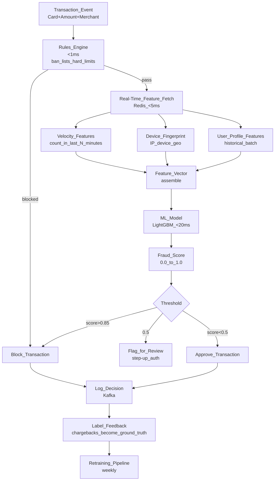

# 🚨 Fraud Detection System Design

> [!abstract] TL;DR
> Fraud detection ML must score transactions in <100ms at point-of-sale, with only ~0.1% of transactions being fraud (extreme class imbalance). Key design challenges: real-time feature computation (velocity checks, device fingerprinting), model cascade (fast rules → gradient boosted trees), concept drift (fraud patterns evolve), and feedback loop handling. Stripe Radar, PayPal, and Visa operate production systems at billion-transaction scale.

## Intuition — Analogy First

Think of a fraud detection system as a **nightclub bouncer**. The bouncer has to make a split-second decision: let this person in or not. They check: is this face on the banned list? (rule-based) Does this person look like they're too young? (simple signal) Are they acting suspiciously? (behavioral pattern). Does something just feel wrong based on experience with thousands of guests? (ML intuition).

The bouncer can't spend 10 minutes deliberating per person — the queue would never move. They need a sub-second decision with limited information.

For fraud: the "bouncer" sees the transaction in real-time. They have <100ms to check the "banned list" (known fraud patterns), compute quick signals (unusual amount, new device), and apply ML intuition (this pattern matches past fraud). Miss a fraudster (false negative) → financial loss. Block a legitimate customer (false positive) → angry customer, abandoned cart, churn.

## How It Works — Mechanics

### End-to-End Fraud Detection Pipeline



### Feature Categories for Fraud

| Category | Features | Freshness Required |
|---|---|---|
| **Velocity** | Tx count last 1/5/60 min, spend sum, unique merchants | Real-time (<1 min) |
| **Device** | Device fingerprint, IP, geo, VPN/proxy, new device flag | Real-time |
| **Behavioral** | Unusual amount vs user avg, unusual time/location | Real-time + batch |
| **User history** | Account age, lifetime tx count, chargeback history | Batch (hourly) |
| **Merchant** | Merchant risk score, high-fraud-rate category | Batch (daily) |
| **Network** | Shared device/IP with known fraud accounts | Batch (daily) |
| **Card** | New card, first use, multiple failed attempts | Real-time |

### Model Cascade (Speed vs Accuracy)

```
1. Blocklist rules: <1ms — hard stops (stolen card numbers, known fraud IPs)
2. Simple rules: <1ms — obvious patterns (amount > $50K in first transaction)
3. Fast ML (logistic regression): <5ms — catch obvious fraud cheaply
4. Full ML (LightGBM): <20ms — main model
5. Deep model (optional): <50ms — for high-value transactions only
```

Only send to step N if step N-1 didn't block. This reduces compute cost and latency.

### Class Imbalance (~0.1% Fraud)

Without correction, the model learns "predict not-fraud for everything" → 99.9% accuracy but 0% fraud recall.

Techniques:
- **Class weights**: weight fraud samples 1000× in the loss function.
- **Undersampling**: downsample non-fraud to 10:1 or 5:1 ratio.
- **Oversampling (SMOTE)**: synthetically generate minority class examples.
- **Threshold calibration**: lower decision threshold to 0.3 (not default 0.5) to increase recall.

Evaluation metric: **F1 on minority class**, **Precision-Recall AUC** (not ROC-AUC — misleading with imbalanced classes).

### Concept Drift in Fraud

Fraudsters actively adapt. If you block "IP from country X in the first transaction", they'll just use VPNs. Models trained on last year's fraud patterns miss this year's attack vectors.

Mitigation:
- Retrain weekly on rolling 30-day window.
- Monitor feature distribution shifts.
- Add newer features to encode new patterns.
- Trigger emergency retrain when fraud rate spikes (anomaly detection on the fraud rate itself).

## Code Demo

### LightGBM Fraud Model

```python
import lightgbm as lgb
import numpy as np
import pandas as pd
from sklearn.model_selection import train_test_split
from sklearn.metrics import (precision_recall_curve, f1_score,
                              average_precision_score, classification_report)

# Load training data (past 30 days of transactions)
df = pd.read_parquet("s3://ml-bucket/training/transactions_30d.parquet")
print(f"Fraud rate: {df['is_fraud'].mean():.4f} ({df['is_fraud'].sum()} fraud / {len(df)} total)")

feature_cols = [
    "tx_amount_log",
    "tx_count_1min", "tx_count_5min", "tx_count_60min",
    "spend_sum_1h", "spend_sum_24h",
    "user_avg_tx_amount", "user_std_tx_amount",
    "tx_amount_vs_user_avg_ratio",
    "is_new_device", "is_new_ip_country",
    "merchant_fraud_rate_30d",
    "account_age_days",
    "hours_since_last_tx",
    "unique_merchants_7d",
    "failed_auth_count_24h",
    "is_vpn", "is_tor",
    "card_age_days", "card_tx_count",
]

X = df[feature_cols]
y = df["is_fraud"]

# Time-based split (never shuffle time-series data)
split_date = df["tx_timestamp"].quantile(0.8)
train_mask = df["tx_timestamp"] <= split_date
X_train, X_val = X[train_mask], X[~train_mask]
y_train, y_val = y[train_mask], y[~train_mask]

# Compute scale_pos_weight to handle imbalance
fraud_count = y_train.sum()
non_fraud_count = len(y_train) - fraud_count
scale_pos_weight = non_fraud_count / fraud_count
print(f"scale_pos_weight: {scale_pos_weight:.1f}")

# Train LightGBM
model = lgb.LGBMClassifier(
    n_estimators=1000,
    learning_rate=0.05,
    num_leaves=127,
    max_depth=-1,
    scale_pos_weight=scale_pos_weight,
    subsample=0.8,
    colsample_bytree=0.8,
    min_child_samples=20,
    random_state=42,
)

model.fit(
    X_train, y_train,
    eval_set=[(X_val, y_val)],
    eval_metric="average_precision",
    callbacks=[lgb.early_stopping(50), lgb.log_evaluation(100)],
)

# Evaluate
y_proba = model.predict_proba(X_val)[:, 1]
ap = average_precision_score(y_val, y_proba)
print(f"PR-AUC: {ap:.4f}")

# Threshold calibration: find threshold that maximizes F1
precisions, recalls, thresholds = precision_recall_curve(y_val, y_proba)
f1_scores = 2 * precisions * recalls / (precisions + recalls + 1e-8)
best_threshold = thresholds[np.argmax(f1_scores)]
print(f"Best threshold: {best_threshold:.3f}, Best F1: {f1_scores.max():.4f}")

# Final evaluation at chosen threshold
y_pred = (y_proba >= best_threshold).astype(int)
print(classification_report(y_val, y_pred, target_names=["legit", "fraud"]))

# Feature importance
feat_imp = pd.DataFrame({
    "feature": feature_cols,
    "importance": model.feature_importances_,
}).sort_values("importance", ascending=False)
print(feat_imp.head(10))
```

### Real-Time Feature Serving Sketch

```python
import redis
import time
from datetime import datetime, timedelta

class FraudFeatureStore:
    """Real-time feature computation for fraud detection (<10ms target)."""
    
    def __init__(self, redis_host: str = "localhost"):
        self.r = redis.Redis(host=redis_host, port=6379, decode_responses=True)
    
    def get_velocity_features(self, user_id: str) -> dict:
        """Get transaction velocity features from Redis sliding windows."""
        now = time.time()
        pipe = self.r.pipeline()
        
        # Count and sum in sliding windows using sorted sets
        for window_seconds, name in [(60, "1min"), (300, "5min"), (3600, "60min")]:
            key = f"velocity:{user_id}"
            cutoff = now - window_seconds
            pipe.zcount(key, cutoff, now)  # count
        
        counts = pipe.execute()
        
        return {
            "tx_count_1min": int(counts[0]),
            "tx_count_5min": int(counts[1]),
            "tx_count_60min": int(counts[2]),
        }
    
    def get_user_profile_features(self, user_id: str) -> dict:
        """Get pre-computed user profile features (batch-computed hourly)."""
        features = self.r.hgetall(f"user_profile:{user_id}")
        if not features:
            return {
                "user_avg_tx_amount": 0.0,
                "user_std_tx_amount": 0.0,
                "account_age_days": 0,
                "failed_auth_count_24h": 0,
            }
        return {k: float(v) for k, v in features.items()}
    
    def update_velocity(self, user_id: str, amount: float):
        """Update velocity counters after each transaction."""
        now = time.time()
        key = f"velocity:{user_id}"
        pipe = self.r.pipeline()
        pipe.zadd(key, {f"{now}:{amount}": now})
        pipe.zremrangebyscore(key, "-inf", now - 3600)  # keep only last hour
        pipe.expire(key, 7200)  # TTL 2 hours
        pipe.execute()
    
    def get_all_features(self, user_id: str, tx_amount: float, is_new_device: bool) -> dict:
        """Assemble complete feature vector for real-time scoring."""
        import math
        velocity = self.get_velocity_features(user_id)
        profile = self.get_user_profile_features(user_id)
        
        avg = profile.get("user_avg_tx_amount", 0.0)
        return {
            "tx_amount_log": math.log1p(tx_amount),
            "tx_amount_vs_user_avg_ratio": tx_amount / max(avg, 1.0),
            "is_new_device": int(is_new_device),
            **velocity,
            **profile,
        }
```

### Threshold Calibration for Precision-Recall Trade-off

```python
import numpy as np
import matplotlib
matplotlib.use("Agg")
import matplotlib.pyplot as plt
from sklearn.metrics import precision_recall_curve

def calibrate_threshold(
    y_true: np.ndarray,
    y_proba: np.ndarray,
    target_precision: float = 0.90,
) -> float:
    """Find threshold that achieves target precision while maximizing recall."""
    precisions, recalls, thresholds = precision_recall_curve(y_true, y_proba)
    
    # Find thresholds where precision >= target
    mask = precisions[:-1] >= target_precision
    if not mask.any():
        print(f"Warning: cannot achieve precision={target_precision}. Using max precision threshold.")
        return thresholds[-1]
    
    # Among those, pick the one with highest recall (lowest threshold)
    valid_thresholds = thresholds[mask]
    valid_recalls = recalls[:-1][mask]
    
    best_idx = np.argmax(valid_recalls)
    threshold = valid_thresholds[best_idx]
    
    print(f"At threshold={threshold:.3f}: "
          f"precision={precisions[:-1][mask][best_idx]:.3f}, "
          f"recall={valid_recalls[best_idx]:.3f}")
    return threshold
```

## Real-World Example

**Stripe Radar** is one of the most sophisticated fraud ML systems. Key design elements:
- Processes 100K+ transactions per second globally.
- Uses a gradient boosted model (similar to LightGBM) + deep neural network ensemble.
- Velocity features computed in real-time via Redis.
- Leverages network effects: Stripe sees transactions across 1M+ businesses — a new card showing up at 5 different businesses in 10 minutes is a cross-merchant velocity signal no single merchant can see.
- Adaptive ML: Radar learns fraud patterns per industry, per country, per merchant category.

**PayPal** uses a 700+ feature model with features including device fingerprint, behavioral biometrics (typing speed, mouse movements), and graph neural network features (is this account connected to known fraud accounts via shared device/IP?).

## Trade-offs

| Design Choice | Option A | Option B | Decision |
|---|---|---|---|
| Real-time features | Pre-computed (batch) | Live velocity computation | Both: batch for history, live for velocity |
| Primary model | Logistic regression | LightGBM | LightGBM unless latency is <5ms |
| Threshold | Fixed 0.5 | Calibrated per segment | Calibrate: different thresholds by tx type |
| Feedback | Immediate (real-time chargebacks) | Delayed (30-day chargeback window) | Design for 30-day delay in labels |
| Evaluation | ROC-AUC | PR-AUC | PR-AUC for imbalanced fraud data |

## When to Use vs Avoid

**This architecture is required when:**
- Decisions must be made at transaction time (<100ms).
- Class imbalance is extreme (0.01%–1% positive class).
- Fraudsters actively adapt (concept drift is guaranteed).
- Network effects matter (cross-account/cross-merchant signals).

**Simpler approach when:**
- Post-hoc fraud review (batch detection, hours after transaction).
- Low transaction volume (<10K/day) — simpler rules + manual review is cost-effective.
- Known fraud patterns are stable and rule-based detection is sufficient.

## Common Pitfalls

1. **Using ROC-AUC for imbalanced evaluation**: ROC-AUC is misleading when classes are 1000:1. Use PR-AUC or F1@recall=0.9. A model that predicts 0.1% fraud randomly achieves 0.5 ROC-AUC but near-zero precision.
2. **Shuffling time-series for train/val split**: fraud patterns are time-dependent. Train on Jan–May, validate on June. Never shuffle and split randomly.
3. **Label delay**: chargebacks arrive 15–45 days after the transaction. If you use chargeback as labels, you're training on incomplete data for recent transactions. Use a separate "dispute" signal for real-time feedback.
4. **Feature staleness in velocity**: if the velocity Redis cache is stale by 30 seconds, a fraudster who makes 50 transactions in 30 seconds will not be detected. Ensure velocity is truly real-time.
5. **No human review loop**: blocked transactions that are false positives → angry customers. Route medium-confidence scores to a human review queue + step-up authentication rather than hard blocking.

## Related Concepts

- [[_MOC_AI_System_Design|↑ Section MOC]]

- [[Handling_Imbalanced_Data]] — class imbalance techniques for fraud
- [[Feature_Stores]] — online/offline feature store architecture for real-time serving
- [[Streaming_ML_with_Kafka]] — Kafka pipeline for real-time event processing
- [[Concept_Drift]] — fraud patterns evolve; monitoring and retraining strategies

## Review Questions

1. Your fraud model has 95% ROC-AUC but your operations team says they're seeing too many false positives. What metric should you use instead of ROC-AUC, and how do you tune the model to reduce false positives while maintaining acceptable fraud recall?
2. Describe the "delayed label problem" in fraud detection. A transaction is made on July 1st. The chargeback arrives on July 30th. How does this affect model training, and what is your strategy to still retrain weekly?
3. Stripe Radar uses "network-level features" — patterns across all of Stripe's merchants, not just one merchant's data. Give two concrete examples of such features, and explain why they provide signal that a single-merchant fraud system would miss.

## Sources

- Stripe Engineering Blog: "Radar: Protecting Stripe's Merchants from Fraud"
- PayPal AI Blog: "Machine Learning at PayPal"
- "Fraud Detection in the Real World" — IEEE ICDM Workshop (various years)
- "Imbalanced Learning" — Haibo He & Garcia (IEEE TKDE 2009)
- "Adaptive Fraud Detection" — ACM KDD (various)

#ai-system-design #fraud-detection #real-time-ml #class-imbalance #lightgbm #feature-store #streaming
