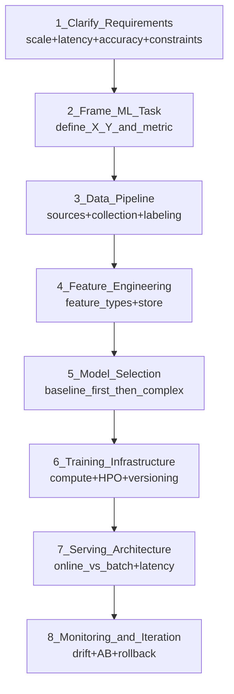

# 🏛️ ML System Design Interview Framework

> [!abstract] TL;DR
> ML system design interviews assess your ability to design end-to-end ML systems at scale. The framework: clarify requirements → frame the ML task → design data pipeline → feature engineering → model selection → training infrastructure → serving → monitoring → iteration. Interviewers evaluate breadth (do you know all components?), depth (can you reason about trade-offs?), and judgment (do you make the right calls for the given constraints?).

## Intuition — Analogy First

Building an ML system is like an architect designing a building. Before drawing plans, a good architect asks:

- **What's the building for?** (requirements clarification — office vs hospital vs stadium)
- **How many people use it?** (scale — hundreds vs millions)
- **What are the constraints?** (budget, timeline, safety codes)
- **What is non-negotiable?** (lifts for disability access, fire exits)

Then they design: foundation first (data), structure (model), services (serving), maintenance plan (monitoring).

A junior architect draws the prettiest building. A senior architect asks whether it will still stand in 20 years during an earthquake. In ML design interviews, interviewers want the senior architect who thinks about failure modes, scale, and iteration — not just the model architecture.

## How It Works — Framework Structure

### The 8-Step Framework



### Step 1 — Clarify Requirements (5 minutes)

Never jump to solutions. Ask:

| Question | Why It Matters |
|---|---|
| "What is the business objective?" | Defines success metric |
| "How many requests per second?" | Drives serving architecture choice |
| "What is the latency requirement?" | Real-time vs batch |
| "What is acceptable accuracy?" | Baseline to beat |
| "How much training data is available?" | Model complexity budget |
| "Is there label data or do we need to generate it?" | Data pipeline complexity |
| "Any regulatory constraints?" (GDPR, HIPAA) | Data handling requirements |
| "What's the deployment environment?" | Cloud vs edge vs embedded |

### Step 2 — Frame the ML Task

Make the ML problem concrete:
- **What is X?** (input features)
- **What is Y?** (label/output)
- **What ML task type?** classification, regression, ranking, generation, clustering
- **What is the primary metric?** precision, recall, NDCG, RMSE, CTR

Example: "Design a spam filter"
- X = email content, sender, headers, user history
- Y = binary (spam/not spam)
- ML task = binary classification
- Metric = precision@high_recall (we care more about false negatives = missed spam, but not too many false positives = blocking legit mail)

### Step 3 — Data Pipeline

- Data sources: where does training data come from?
- Collection: how to gather labeled examples?
- Storage: warehouse, data lake, feature store
- Labeling: crowdsourced, expert, semi-supervised, weak supervision
- Volume and freshness requirements

### Step 4 — Feature Engineering

- Feature categories: user features, item features, context features, interaction features
- Feature store: offline (training) vs online (serving)
- Feature transformations: normalization, embeddings, bucketization
- Avoid leakage: no features that use future information

### Step 5 — Model Selection

Always start simple:
```
1. Heuristic / rule-based baseline
2. Logistic regression / linear model
3. Gradient boosted trees (XGBoost/LightGBM)
4. Neural network (BERT, two-tower, MLP)
5. Large foundation model (fine-tuned)
```

Each step adds complexity. Justify why you're going further. The question "why not just use XGBoost?" should always have a real answer.

### Step 6 — Training Infrastructure

- **Compute**: single GPU? Multi-GPU? TPU pod? How long to train?
- **HPO**: grid search, Bayesian optimization, population-based training
- **Experiment tracking**: MLflow, W&B — track metrics, hyperparameters, artifacts
- **Model versioning**: MLflow model registry, staging → production promotion
- **Retraining cadence**: daily? weekly? triggered by drift?

### Step 7 — Serving Architecture

| Pattern | Latency | Use When |
|---|---|---|
| Real-time (online) | <100ms | Fraud detection, ad ranking |
| Batch (async) | Hours/days | Nightly recommendations |
| Pre-computed | <10ms | Popular items in recommendation |
| Streaming | Seconds | Personalization feed updates |

Also cover: model server (TensorFlow Serving, TorchServe, Triton), load balancing, fallbacks (if model is down, serve most popular items), A/B testing infrastructure.

### Step 8 — Monitoring and Iteration

- **Data drift**: input feature distributions shift
- **Concept drift**: relationship between X and Y changes
- **Performance degradation**: model accuracy drops in production
- **A/B testing**: compare model versions with statistical significance
- **Rollback**: automatic revert if new model drops below threshold
- **Feedback loop**: labels from production serve next retraining

## Code Demo — Design Template / Checklist

```python
"""
ML System Design Interview Template
Use this as a mental checklist during the interview.
"""

ML_DESIGN_TEMPLATE = {
    "1_requirements": {
        "business_objective": None,
        "scale_qps": None,
        "latency_p99_ms": None,
        "accuracy_target": None,
        "training_data_available": None,
        "regulatory_constraints": [],
    },
    
    "2_ml_task": {
        "input_X": None,
        "output_Y": None,
        "task_type": None,  # classification, regression, ranking, generation
        "primary_metric": None,
        "secondary_metrics": [],
    },
    
    "3_data_pipeline": {
        "data_sources": [],
        "collection_strategy": None,
        "labeling_approach": None,
        "storage": None,
        "volume_gb": None,
        "freshness_hours": None,
    },
    
    "4_features": {
        "feature_categories": [],
        "offline_features": [],
        "online_realtime_features": [],
        "embeddings": [],
        "feature_store": None,
    },
    
    "5_model": {
        "baseline": "most_frequent_class_or_heuristic",
        "v1_simple": "logistic_regression_or_gbm",
        "v2_complex": None,
        "justification_for_complexity": None,
    },
    
    "6_training": {
        "compute": None,
        "training_time_hours": None,
        "retraining_cadence": None,
        "hpo_strategy": None,
        "experiment_tracking": "mlflow_or_wandb",
    },
    
    "7_serving": {
        "serving_pattern": None,  # online/batch/precomputed
        "model_server": None,
        "p99_latency_target_ms": None,
        "fallback_strategy": None,
        "ab_testing": True,
    },
    
    "8_monitoring": {
        "metrics": [],
        "drift_detection": None,
        "alert_thresholds": [],
        "rollback_trigger": None,
        "retraining_trigger": None,
    },
}
```

### Worked Example: Ad Click Prediction (condensed)

```
1. Requirements:
   - 10M ad impressions/day, serving in <50ms
   - Optimize CTR; business metric is revenue/impression
   - Labels available (click/no-click from logs)

2. ML Task:
   - X: user features, ad features, context (device, time, page)
   - Y: binary click probability (0/1)
   - Task: binary classification → calibrated probability for bid pricing
   - Metric: AUC-ROC offline; CTR/revenue online

3. Data Pipeline:
   - Click logs from ad server → Kafka → S3 → feature pipeline
   - Label: click within 1 hour of impression (avoid attribution window errors)
   - Volume: 500M impression/day × 30 days = 15B rows

4. Features:
   - User: demographics, historical CTR, category affinity (batch)
   - Ad: creative embedding, historical CTR, advertiser (batch)
   - Context: device, hour, page embedding, recency (online)

5. Model:
   - Baseline: ad's historical average CTR
   - V1: Logistic Regression with feature hashing
   - V2: Wide & Deep (sparse ad IDs + dense features)
   - V3: two-tower retrieval + cross features

6. Training:
   - Daily retrain on 30-day sliding window
   - 4× V100 GPUs, ~3 hours
   - HPO: learning rate, embedding dim, tower depth

7. Serving:
   - Pre-fetch user features from Redis at request time
   - Model in TorchServe, P99 <20ms
   - Fallback: serve average CTR for ad

8. Monitoring:
   - Alert if AUC drops >2% vs last week
   - Monitor click-through rate by device/hour
   - Detect feedback loop: high CTR ads dominate → diversity degrades
```

## Real-World Example

The framework above is used by FAANG ML engineers in system design interviews at **Google, Meta, Apple, Netflix, Amazon**. Senior ML engineer interviews at these companies run 45–60 minutes and cover exactly these 8 steps.

Typical questions: "Design YouTube's recommendation system", "Design a fraud detection system for Stripe", "Design Gmail's spam filter". The goal isn't one right answer — it's demonstrating systematic thinking and engineering judgment.

## Trade-offs Table

| Focus Area | Beginner Mistake | Senior Engineer Approach |
|---|---|---|
| Requirements | Assume; jump to model | Ask 5+ clarifying questions; write down constraints |
| ML task framing | Skip directly to model | Explicitly define X, Y, metric, baseline |
| Model selection | Start with complex DNN | Start simple; add complexity with justification |
| Serving | Assume real-time for everything | Match serving pattern to latency + freshness requirements |
| Monitoring | Forget about it | Design monitoring as a first-class concern |
| Data pipeline | Assume data exists | Describe collection, labeling, freshness explicitly |

## When to Use vs Avoid

**Use this framework when:**
- ML system design interview at a tech company.
- Designing a new ML product from scratch.
- Reviewing an existing ML system for architectural gaps.

**Adapt the framework when:**
- LLM application design: emphasize prompt management, RAG, cost optimization, safety layers.
- Real-time system: spend more time on serving latency budget and online feature freshness.
- Research system: de-emphasize serving; focus more on training infrastructure and experiment tracking.

## Common Pitfalls

1. **Jumping to the model**: the most common mistake. 80% of the system is data + features + serving + monitoring. The model is ~20%.
2. **Forgetting baselines**: always propose the simplest possible baseline. If logistic regression achieves 92% of the gain of a deep network with 1/100th the infrastructure, that's often the right choice.
3. **No discussion of retraining**: a model deployed without a retraining strategy will degrade. Always discuss cadence and triggers.
4. **Ignoring feedback loops**: high-CTR ads dominate → model only shows high-CTR ads → diversity degrades → user engagement drops. Mention feedback loops for recommendation/ranking/ad systems.
5. **Giving exact numbers without reasoning**: "we need 200 GPUs" without justification sounds made up. Say "200 examples/s × 100ms/example = 2M examples/min → estimate ~4 GPUs based on benchmarks". Show your math.

## Related Concepts

- [[_MOC_AI_System_Design|↑ Section MOC]]

- [[Model_Serving_Overview]] — Step 7 of the framework in detail
- [[Feature_Stores]] — Step 4 of the framework in detail
- [[Recommendation_System]] — worked example applying this framework
- [[Fraud_Detection_System]] — another worked example
- [[ML_Monitoring_Overview]] — Step 8 of the framework in detail

## Review Questions

1. A candidate is asked to "design Twitter's tweet ranking system". They spend 30 minutes designing a complex BERT-based cross-encoder and only mention deployment in the last 2 minutes. What is wrong with this approach, and what should they have covered?
2. You're designing a recommendation system for a new product launch where there is zero historical user data. Walk through how the "cold start problem" affects your framework at steps 3, 4, and 5.
3. What is a "feedback loop" in an ML system, and give an example of how it can degrade a recommendation or ad-ranking system over time? What monitoring would detect it?

## Sources

- "Designing Machine Learning Systems" — Chip Huyen (O'Reilly, 2022)
- "Machine Learning System Design Interview" — Ali Aminian & Alex Xu (Byte Byte Go, 2023)
- MLOps Community: ML System Design Interview Guides
- Meta AI Blog: "AI/ML Infrastructure at Meta"
- Google Cloud Architecture: "MLOps: Continuous delivery and automation pipelines in ML"

#ai-system-design #interview #framework #ml-design #mlops #system-design
