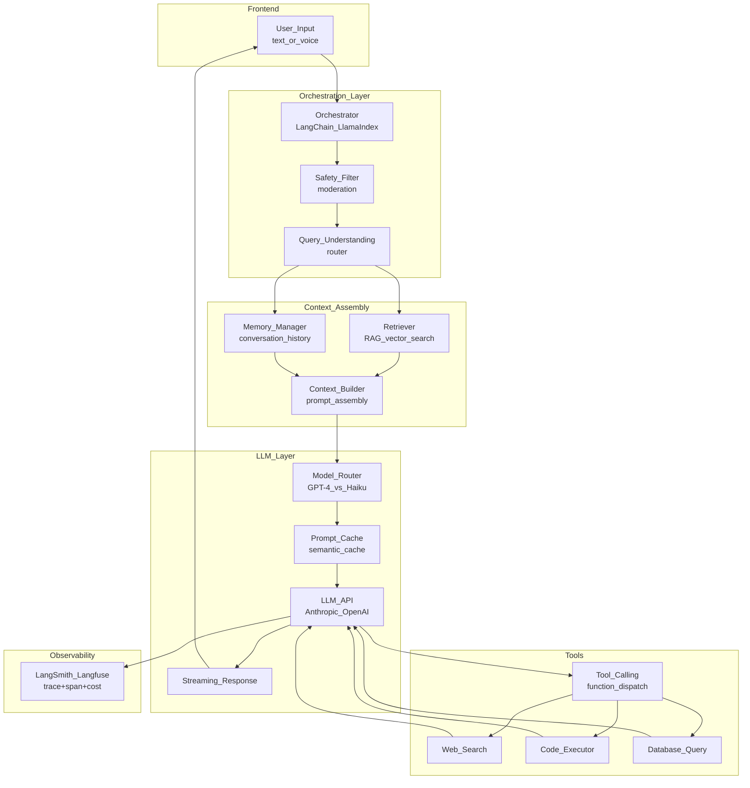

# 🏗️ LLM Application Architecture

> [!abstract] TL;DR
> LLM applications are built from composable components: an LLM API, orchestration layer (LangChain/LlamaIndex), memory (conversation history + vector store), tools (function calling, search, code execution), and a UI. RAG grounds the LLM in external knowledge, streaming improves perceived latency, and observability tools (LangSmith, Langfuse) trace every call. Cost optimization via caching and model routing is critical at scale.

## Intuition — Analogy First

Building an LLM application is like building a **smart consultant's office**:
- The **LLM** is the consultant — brilliant, but needs to be told what's in the company's files because they have no built-in access.
- **RAG** is the filing system — when a question comes in, the assistant retrieves relevant documents from the filing cabinet (vector store) and puts them on the consultant's desk.
- **Memory** is the meeting notes — the consultant can refer back to what was discussed in previous meetings (conversation history).
- **Tools** are the phone, calculator, and computer — the consultant can call someone (API), do math (code interpreter), or look something up online (web search).
- **Observability** is the audit log — every question, every retrieved document, every answer is recorded so you can debug when the consultant gives bad advice.

The hard part: managing cost (consultants are expensive), latency (clients hate waiting), and reliability (what happens when the consultant gives wrong information?).

## How It Works — Mechanics

### Full LLM Application Architecture



### Core Components

| Component | Purpose | Tools |
|---|---|---|
| **LLM API** | Core generation | Claude (Anthropic), GPT-4 (OpenAI), Gemini (Google) |
| **Orchestration** | Chains, agents, RAG pipelines | LangChain, LlamaIndex, custom |
| **Memory** | Conversation context | Redis (short-term), vector DB (long-term semantic) |
| **RAG / Retrieval** | Ground LLM in external knowledge | FAISS, Pinecone, Weaviate, pgvector |
| **Tools** | LLM actions on the world | Function calling, MCP protocol |
| **Streaming** | Reduce perceived latency | Server-Sent Events (SSE) |
| **Prompt management** | Version and track prompts | LangSmith, Promptflow |
| **Observability** | Trace, debug, cost tracking | LangSmith, Langfuse, Helicone |
| **Safety layer** | Filter unsafe inputs/outputs | Llama Guard, AWS Bedrock Guardrails |
| **Cache** | Reduce cost + latency | Exact cache (hash), semantic cache (embeddings) |

### Model Routing for Cost Optimization

Not every query needs GPT-4. A routing layer classifies the query complexity:
- Simple fact lookups → Claude Haiku ($0.25/MTok) → 95% of queries
- Complex reasoning → Claude Sonnet ($3/MTok) → 4% of queries
- Agentic multi-step → Claude Opus → 1% of queries

Result: 80–90% cost reduction vs always using the most powerful model.

### Streaming

Without streaming: user waits 10–30 seconds for full response → feels broken.
With streaming: first token appears in 200ms → response "types out" → feels instant.

Implementation: SSE (Server-Sent Events) or WebSocket. The LLM API streams tokens; the server relays them to the client as they arrive.

## Code Demo

### Full LLM App with LangChain (RAG + Memory + Streaming + Tool Use)

```python
from langchain_anthropic import ChatAnthropic
from langchain.chains import ConversationalRetrievalChain
from langchain.memory import ConversationBufferWindowMemory
from langchain_community.vectorstores import FAISS
from langchain_community.embeddings import HuggingFaceEmbeddings
from langchain.tools import tool
from langchain.agents import create_tool_calling_agent, AgentExecutor
from langchain.prompts import ChatPromptTemplate, MessagesPlaceholder
from langchain_core.callbacks import StreamingStdOutCallbackHandler
import json

# 1. LLM with streaming
llm = ChatAnthropic(
    model="claude-sonnet-4-5",
    streaming=True,
    callbacks=[StreamingStdOutCallbackHandler()],
    temperature=0,
    max_tokens=2048,
)

# 2. RAG Retriever
embeddings = HuggingFaceEmbeddings(model_name="BAAI/bge-small-en-v1.5")
vectorstore = FAISS.load_local("indexes/product_docs", embeddings)
retriever = vectorstore.as_retriever(search_kwargs={"k": 5})

# 3. Memory (last 10 turns)
memory = ConversationBufferWindowMemory(
    k=10,
    return_messages=True,
    memory_key="chat_history",
    output_key="answer",
)

# 4. Tools
@tool
def get_order_status(order_id: str) -> str:
    """Look up the current status of an order by order ID."""
    # In production: query order management system
    orders = {
        "ORD-12345": {"status": "shipped", "eta": "2026-07-28", "carrier": "FedEx"},
        "ORD-67890": {"status": "processing", "eta": "2026-07-30"},
    }
    order = orders.get(order_id)
    if order:
        return json.dumps(order)
    return f"Order {order_id} not found"

@tool
def search_knowledge_base(query: str) -> str:
    """Search the product documentation and knowledge base."""
    docs = retriever.get_relevant_documents(query)
    return "\n\n".join([f"[{i+1}] {doc.page_content}" for i, doc in enumerate(docs[:3])])

@tool
def create_support_ticket(issue_summary: str, priority: str = "medium") -> str:
    """Create a support ticket for an issue that cannot be resolved automatically."""
    ticket_id = f"TKT-{hash(issue_summary) % 100000:05d}"
    return f"Created ticket {ticket_id} with priority {priority}. A support agent will follow up within 24 hours."

tools = [get_order_status, search_knowledge_base, create_support_ticket]

# 5. Agent with tool calling
prompt = ChatPromptTemplate.from_messages([
    ("system", """You are a helpful customer support agent for an e-commerce company. 
You have access to order status lookups, the knowledge base, and can create support tickets.

Guidelines:
- Always be empathetic and professional
- Use tools to look up real information, don't make things up
- If you can't solve the issue, create a support ticket
- Keep responses concise but complete"""),
    MessagesPlaceholder("chat_history"),
    ("user", "{input}"),
    MessagesPlaceholder("agent_scratchpad"),
])

agent = create_tool_calling_agent(llm, tools, prompt)
agent_executor = AgentExecutor(
    agent=agent,
    tools=tools,
    memory=memory,
    verbose=True,
    max_iterations=5,
    handle_parsing_errors=True,
)

# 6. Multi-turn conversation
def chat(user_message: str) -> str:
    result = agent_executor.invoke({"input": user_message})
    return result["output"]

# Example conversation
print(chat("Hi, I placed an order last week, order ORD-12345. Where is it?"))
print("---")
print(chat("It says shipped — when exactly will it arrive? And what if it doesn't show up?"))
```

### Streaming FastAPI Endpoint

```python
from fastapi import FastAPI
from fastapi.responses import StreamingResponse
from langchain_anthropic import ChatAnthropic
from langchain_core.messages import HumanMessage, SystemMessage
import asyncio

app = FastAPI()
llm = ChatAnthropic(model="claude-haiku-4-5", streaming=True)

@app.post("/chat/stream")
async def chat_stream(user_message: str, session_id: str):
    """Stream LLM response via Server-Sent Events."""
    
    messages = [
        SystemMessage(content="You are a helpful assistant."),
        HumanMessage(content=user_message),
    ]
    
    async def generate():
        async for chunk in llm.astream(messages):
            if chunk.content:
                # SSE format: "data: <text>\n\n"
                yield f"data: {chunk.content}\n\n"
        yield "data: [DONE]\n\n"
    
    return StreamingResponse(
        generate(),
        media_type="text/event-stream",
        headers={
            "Cache-Control": "no-cache",
            "X-Accel-Buffering": "no",
        },
    )
```

### Semantic Cache for Cost Reduction

```python
from langchain.cache import RedisSemanticCache
from langchain_community.embeddings import HuggingFaceEmbeddings
import langchain
import redis

# Semantic cache: if a new query is 95% similar to a cached query, return cached answer
embeddings = HuggingFaceEmbeddings(model_name="BAAI/bge-small-en-v1.5")
redis_client = redis.Redis(host="redis", port=6379)

langchain.llm_cache = RedisSemanticCache(
    redis_url="redis://redis:6379",
    embedding=embeddings,
    score_threshold=0.9,   # 90% similarity threshold for cache hit
)

# Now all LLM calls automatically check the semantic cache first
# "What is the capital of France?" and "Tell me the capital city of France" 
# → same cached answer (cosine similarity > 0.9)
```

### Observability with Langfuse

```python
from langfuse import Langfuse
from langfuse.callback import CallbackHandler

langfuse = Langfuse(
    public_key="pk-lf-...",
    secret_key="sk-lf-...",
    host="https://cloud.langfuse.com",
)

# Add to LangChain as callback
langfuse_handler = CallbackHandler(
    public_key="pk-lf-...",
    secret_key="sk-lf-...",
)

# All chains/agents with this callback will be traced
result = agent_executor.invoke(
    {"input": "What is your return policy?"},
    config={"callbacks": [langfuse_handler]},
)

# In Langfuse dashboard you can see:
# - Full trace (each LLM call, tool call, retrieval)
# - Token counts and cost per request
# - Latency breakdown
# - Input/output for debugging
```

## Real-World Example

**Cursor** (AI code editor) uses an LLM application architecture with:
- **Context assembly**: embeddings of your codebase → retrieved on every query; open files + cursor position added to context.
- **Model routing**: Tab autocomplete uses a small fast model; `Cmd+K` chat uses Claude Sonnet; complex multi-file refactoring uses Claude Opus.
- **Streaming**: autocomplete streams tokens as the user types.
- **Safety**: code execution results are sandboxed.
- **Caching**: repository indexing is cached; re-indexed on file changes.

**Notion AI** adds write assistance, Q&A over your notes, and AI summarization. Architecture: bi-encoder retrieves relevant pages from your workspace (semantic search) → cross-encoder re-ranks → top-3 pages + conversation history → Claude Sonnet for generation → streamed to UI.

## Trade-offs

| Component | Complexity | Impact | Notes |
|---|---|---|---|
| RAG | Medium | High (reduces hallucinations) | Essential for knowledge-grounded apps |
| Streaming | Low | High (UX) | Always implement for chat UIs |
| Semantic cache | Medium | Medium (cost) | High ROI for FAQ-type queries |
| Model routing | Medium | High (cost) | Route 90%+ to smaller models |
| Observability | Low | Critical (debugging) | Install from day 1, not day 100 |
| Safety layer | Low | Critical (trust) | Required for user-facing apps |
| Agents/tools | High | Varies | Only if rule-based logic is insufficient |

## When to Use vs Avoid

**Add RAG when:**
- LLM needs to answer from a proprietary knowledge base.
- The domain changes faster than model training cycles.
- You need citations/sources for answers.

**Skip agents when:**
- A deterministic pipeline (fixed sequence of steps) handles the use case.
- Latency is critical (<500ms) — agent loops add 1–3 seconds per tool call.
- Reliability is critical — agents can fail in unexpected ways.

**Use LLM application architecture when:**
- Building user-facing features on top of foundation models.
- The task requires combining retrieval + generation + tools.
- You need to track cost, latency, and quality at scale.

## Common Pitfalls

1. **Not measuring token cost from day 1**: LLM API costs can spiral unexpectedly. Add token counting to every request before you have real traffic.
2. **Context window overflow**: RAG retrieves 20 documents × 500 tokens each = 10K tokens of context + conversation history. Track context usage and truncate intelligently.
3. **LLM-as-judge hallucination**: using an LLM to evaluate other LLM outputs works for relative comparisons but absolute quality scores are unreliable. Always calibrate with human eval.
4. **No retry logic**: LLM APIs have rate limits and occasional failures. Implement exponential backoff with jitter for all API calls.
5. **Storing full conversation in memory**: unbounded conversation history eventually overflows the context window. Use sliding window memory (last N turns) or summarization memory for long sessions.

## Related Concepts

- [[_MOC_AI_System_Design|↑ Section MOC]]

- [[RAG_Overview]] — retrieval-augmented generation in depth
- [[AI_Agents_Overview]] — agentic loops, tool use, multi-agent systems
- [[LangChain]] — primary orchestration framework for LLM apps
- [[Semantic_Search_System]] — the retrieval component of RAG
- [[Embedding_Models]] — powers the semantic search in RAG

## Review Questions

1. A user asks your LLM chatbot the same question 100 times per hour. Describe how you would implement caching at multiple levels (exact match, semantic match, result cache) and the trade-offs of each.
2. Your LLM application is spending $5,000/month on GPT-4 API calls. Propose a model routing strategy that could reduce costs by 70% without significantly degrading quality. What queries go to which models?
3. A deployed LLM application starts giving wrong answers after a product update. How does your observability setup (LangSmith/Langfuse) help you diagnose: (a) whether the retrieved context was correct, (b) whether the LLM hallucinated, and (c) whether the prompt needs updating?

## Sources

- LangChain Documentation — https://docs.langchain.com/
- Anthropic Claude API Documentation — https://docs.anthropic.com/
- Langfuse Documentation — https://langfuse.com/docs
- "Building LLM Applications" — Chip Huyen (O'Reilly, 2024)
- Cursor Engineering Blog: "How Cursor Works"
- "RAG vs Fine-tuning" — Anthropic Research (2024)

#ai-system-design #llm #rag #agents #langchain #streaming #observability #architecture
