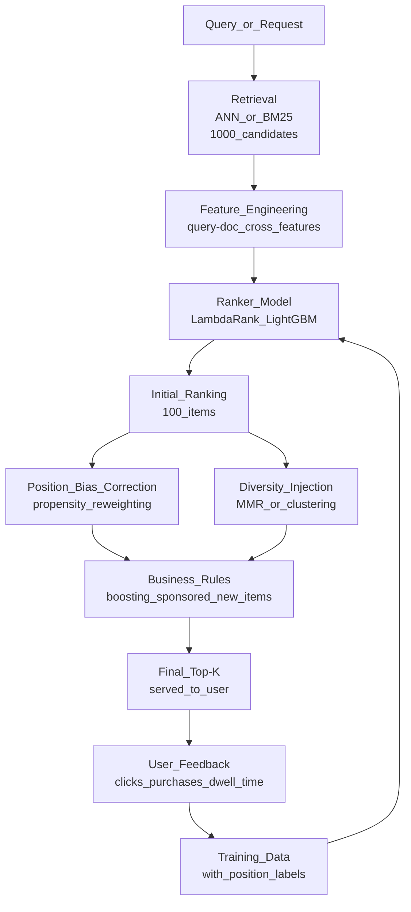

# 📊 Ranking System Design

> [!abstract] TL;DR
> Ranking systems order a set of items to maximize user utility (click, purchase, engagement). Learning-to-rank (LTR) trains a model to optimize ranking metrics directly: pointwise (treat as regression), pairwise (prefer item A over B), listwise (optimize NDCG directly). LambdaMART (LightGBM LambdaRank) dominates practical deployments. Position bias, diversity, and cascade ranking are the hardest operational challenges.

## Intuition — Analogy First

Imagine a teacher sorting 100 job applications to present to a hiring committee. They could:
- **Pointwise**: give each application an independent score 1–10 based on qualifications. Sort by score. (Doesn't consider that "best vs second-best" matters more than "worst vs second-worst".)
- **Pairwise**: compare applications two at a time. "Is this candidate better than that one?" Build a total ordering. More contextual, but only considers pairs.
- **Listwise**: optimize the final ranked list directly. "What ordering of these 100 applications maximizes the chance the hiring committee picks a great candidate from the top-5?" Considers the entire list at once.

LambdaMART is listwise — it directly optimizes NDCG, the ranking quality metric, rather than learning individual scores and hoping the ranking comes out right.

## How It Works — Mechanics

### Learning-to-Rank Approaches

| Approach | Trains On | Loss Function | Pros | Cons |
|---|---|---|---|---|
| **Pointwise** | Individual (doc, relevance_score) pairs | MSE / cross-entropy | Simple, any classifier works | Ignores inter-item relationships |
| **Pairwise** | (doc_A, doc_B, prefer_A) triples | Pairwise log-loss | Captures relative preference | Combinatorial explosion of pairs |
| **Listwise** | Full ranked list per query | NDCG-based (LambdaLoss) | Directly optimizes ranking metric | Harder to implement |

### NDCG — The Ranking Metric

**DCG (Discounted Cumulative Gain)**:
```
DCG@k = Σᵢ₌₁ᵏ (2^relᵢ - 1) / log₂(i + 1)
```

Where `relᵢ` is the relevance score of the item at position i (0=irrelevant, 1=somewhat, 2=relevant, 3=highly relevant).

**NDCG (Normalized DCG)**:
```
NDCG@k = DCG@k / IDCG@k
```

Where IDCG = DCG of the ideal (perfect) ranking. NDCG is always between 0 and 1.

**Example**: Query = "running shoes", top-5 results:
```
Position 1: Nike Air Max (relevance=3)     → (2³-1)/log₂(2) = 7/1 = 7.0
Position 2: Adidas Ultraboost (rel=3)      → 7/log₂(3) = 7/1.585 = 4.42
Position 3: Fashion sneakers (rel=0)       → 0/log₂(4) = 0
Position 4: Running socks (rel=1)          → 1/log₂(5) = 0.43
Position 5: Running shorts (rel=1)         → 1/log₂(6) = 0.39
DCG@5 = 7.0 + 4.42 + 0 + 0.43 + 0.39 = 12.24
Ideal: put rel=3 items first → IDCG@5 = 7.0 + 4.42 + ... = higher value
NDCG@5 = 12.24 / IDCG@5 = 0.78 (example)
```

### LambdaMART / LambdaRank

LambdaMART trains gradient boosted trees where the gradient (`λ`) for each pair (i, j) is derived from how much swapping i and j would change the NDCG:

```
λᵢⱼ = -dNDCG_if_i_and_j_swapped × σ(sⱼ - sᵢ)/(1 + exp(σ(sᵢ - sⱼ)))
```

This means: large gradient for pairs where swapping would significantly change NDCG (i.e., a relevant item at rank 20 being moved to rank 1 improves NDCG a lot → strong gradient).

### Full Ranking Pipeline



### Position Bias Correction

Users click items at position 1 more than position 10 regardless of relevance. If you train on raw clicks without correction, the model learns "position 1 items are relevant" → self-fulfilling prophecy.

**Propensity weighting**: estimate P(click | position, item_shown) using counterfactual evaluation or examination hypothesis (clicks follow a position-dependent propensity model). Weight each training example by 1/propensity.

**Randomized intervention**: occasionally swap item positions to measure true relevance vs position effect.

### Diversity and Serendipity

Pure relevance ranking leads to homogeneous results. A search for "Python tutorial" that returns 10 similar Python beginner guides is less useful than one that covers beginner, intermediate, advanced, and different learning styles.

**Maximum Marginal Relevance (MMR)**:
```
MMR_score(doc) = λ × relevance(doc) - (1-λ) × max_sim(doc, already_selected)
```

Greedily select items that are both relevant and different from already-selected items.

**Cascade ranking** (Diversity in subsequent positions): given item i was shown, how does showing item j affect P(click on j)? Model inter-item dependencies.

## Code Demo

### LightGBM LambdaRank

```python
import lightgbm as lgb
import numpy as np
import pandas as pd
from sklearn.datasets import make_classification
from sklearn.metrics import ndcg_score

# ─── Feature engineering ──────────────────────────────────────────────────────
def build_ranking_features(query_df: pd.DataFrame, doc_df: pd.DataFrame) -> pd.DataFrame:
    """Build query-document cross-features for ranking."""
    features = []
    for _, q_row in query_df.iterrows():
        for _, d_row in doc_df.iterrows():
            features.append({
                "query_id": q_row["query_id"],
                # Query features
                "query_length": len(q_row["query"].split()),
                # Document features
                "doc_popularity_7d": d_row["click_count_7d"],
                "doc_freshness_days": d_row["age_days"],
                "doc_avg_rating": d_row["avg_rating"],
                # Cross/interaction features
                "bm25_score": d_row.get("bm25_score", 0.0),
                "semantic_similarity": d_row.get("embedding_similarity", 0.0),
                "query_doc_category_match": int(q_row["category"] == d_row["category"]),
                # Label
                "label": d_row["relevance"],  # 0, 1, 2, 3
            })
    return pd.DataFrame(features)

# ─── Train LambdaRank ──────────────────────────────────────────────────────────
def train_lambdarank(train_df: pd.DataFrame, val_df: pd.DataFrame) -> lgb.LGBMRanker:
    feature_cols = [
        "query_length", "doc_popularity_7d", "doc_freshness_days",
        "doc_avg_rating", "bm25_score", "semantic_similarity",
        "query_doc_category_match",
    ]
    
    # Group sizes: how many documents per query
    train_groups = train_df.groupby("query_id").size().values
    val_groups = val_df.groupby("query_id").size().values
    
    model = lgb.LGBMRanker(
        boosting_type="gbdt",
        num_leaves=127,
        n_estimators=500,
        learning_rate=0.05,
        subsample=0.8,
        colsample_bytree=0.8,
        min_child_samples=20,
        lambdarank_norm=True,
        label_gain=[0, 1, 3, 7, 15],  # exponential gain for relevance levels 0,1,2,3,4
        random_state=42,
    )
    
    model.fit(
        train_df[feature_cols],
        train_df["label"],
        group=train_groups,
        eval_set=[(val_df[feature_cols], val_df["label"])],
        eval_group=[val_groups],
        eval_metric=["ndcg"],
        eval_at=[1, 3, 5, 10],
        callbacks=[lgb.early_stopping(50), lgb.log_evaluation(100)],
    )
    
    return model

# ─── NDCG Calculation ─────────────────────────────────────────────────────────
def compute_ndcg(y_true_groups: list, y_scores_groups: list, k: int = 10) -> float:
    """Compute mean NDCG@k across queries."""
    ndcg_values = []
    for y_true, y_scores in zip(y_true_groups, y_scores_groups):
        if len(y_true) == 0 or max(y_true) == 0:
            continue
        # sklearn expects shape [n_queries, n_docs]
        ndcg = ndcg_score(
            np.array(y_true).reshape(1, -1),
            np.array(y_scores).reshape(1, -1),
            k=k,
        )
        ndcg_values.append(ndcg)
    return np.mean(ndcg_values) if ndcg_values else 0.0

# Manual NDCG calculation for illustration
def manual_ndcg(relevances: list[int], k: int = None) -> float:
    """Compute NDCG for a single ranked list of relevance scores."""
    import math
    k = k or len(relevances)
    
    def dcg(rels, k):
        return sum(
            (2**rel - 1) / math.log2(i + 2)  # i+2 because log2(1)=0
            for i, rel in enumerate(rels[:k])
        )
    
    dcg_val = dcg(relevances, k)
    ideal = dcg(sorted(relevances, reverse=True), k)
    return dcg_val / ideal if ideal > 0 else 0.0

# Example
ranking1 = [3, 2, 0, 1, 0]   # good: high relevance at top
ranking2 = [0, 1, 0, 2, 3]   # bad: high relevance buried at bottom
print(f"NDCG (good ranking): {manual_ndcg(ranking1):.4f}")
print(f"NDCG (bad ranking):  {manual_ndcg(ranking2):.4f}")
# Output: NDCG (good ranking): 0.8891, NDCG (bad ranking): 0.4561
```

### Maximum Marginal Relevance (Diversity)

```python
import numpy as np
from sklearn.metrics.pairwise import cosine_similarity

def mmr_rerank(
    candidates: list[dict],   # [{"id": ..., "relevance_score": ..., "embedding": np.array}]
    top_k: int = 10,
    lambda_: float = 0.7,     # 0=pure diversity, 1=pure relevance
) -> list[dict]:
    """Re-rank candidates using Maximum Marginal Relevance for diversity."""
    if not candidates:
        return []
    
    selected = []
    remaining = candidates.copy()
    
    embeddings = np.array([c["embedding"] for c in candidates])
    
    for _ in range(min(top_k, len(candidates))):
        if not selected:
            # First item: pick highest relevance
            best = max(remaining, key=lambda x: x["relevance_score"])
        else:
            # Subsequent: balance relevance + diversity
            selected_embs = np.array([c["embedding"] for c in selected])
            
            best_score = -float("inf")
            best_item = None
            
            for candidate in remaining:
                relevance = candidate["relevance_score"]
                
                # Max similarity to any already-selected item
                sims = cosine_similarity(
                    candidate["embedding"].reshape(1, -1),
                    selected_embs
                )[0]
                max_sim = sims.max()
                
                mmr = lambda_ * relevance - (1 - lambda_) * max_sim
                if mmr > best_score:
                    best_score = mmr
                    best_item = candidate
            
            best = best_item
        
        selected.append(best)
        remaining.remove(best)
    
    return selected
```

## Real-World Example

**LinkedIn job ranking**: when a job seeker searches for "Senior Software Engineer, remote", LinkedIn ranks thousands of matching jobs. Features include:
- Textual match (BM25 + semantic similarity)
- Job freshness (posted yesterday vs 2 weeks ago)
- Candidate-job fit (skills match, years of experience vs requirements)
- Historical engagement (jobs like this in the same city have high application rates)
- Diversity: shows jobs from different companies, not 20 jobs from one company

LinkedIn uses a LambdaMART model retrained weekly. The model is evaluated with NDCG@10 offline but the business metric is **apply rate** (online).

**Amazon product search**: their A9/COSMO ranking model uses hundreds of features: exact keyword match, semantic relevance, customer reviews, Prime eligibility, price competitiveness, and personalization signals. Position bias correction is critical because items at position 1 get 20× more clicks than position 10 on the same page.

## Trade-offs

| Approach | NDCG Quality | Training Cost | Inference Speed | Interpretability |
|---|---|---|---|---|
| **BM25 (no ML)** | Low | None | Very fast | High |
| **Pointwise (LR)** | Moderate | Low | Fast | High |
| **LambdaMART (LGBM)** | High | Medium | Fast | Medium |
| **Neural ranker (BERT)** | Highest | High | Slow (50ms+) | Low |
| **Cascade (LGBM → BERT)** | Highest | High | Medium | Low |

## When to Use vs Avoid

**Use LambdaRank/LambdaMART when:**
- You have training data with graded relevance labels or click/purchase signals.
- Serving latency requirement is <20ms (LGBM is fast).
- Corpus has enough candidates to make ranking non-trivial (>20 candidates).

**Use neural ranker (BERT-based) when:**
- Very high accuracy needed and latency allows >50ms.
- You have enough training data (>10K queries with relevance judgments).
- Re-ranking stage after initial LGBM retrieval.

**Skip LTR when:**
- Small corpus (<20 items) — exhaustive scoring is fine.
- No relevance labels and no click logs (can't train without signal).

## Common Pitfalls

1. **Ignoring position bias**: training on clicks without propensity correction → model learns to rank popular items higher → reinforces popularity → rich get richer.
2. **NDCG as sole metric**: NDCG measures ranking quality but not diversity. Monitor also: coverage, diversity, serendipity.
3. **Training/serving feature skew**: using BM25 score as a feature in training but computing it differently at serving time → silent accuracy degradation.
4. **Query-level train/val split**: don't shuffle individual query-document pairs. Split at the query level, ensuring all documents for a query are in the same split.
5. **Not handling the "no relevant results" case**: if no documents have relevance > 0 for a query, NDCG is undefined. Handle gracefully in evaluation and in production (fallback to popularity ranking).

## Related Concepts

- [[_MOC_AI_System_Design|↑ Section MOC]]

- [[Recommendation_System]] — uses same two-tower retrieval + ranker pattern
- [[LightGBM]] — gradient boosted framework for LambdaRank
- [[XGBoost]] — alternative GBM for LTR
- [[Ad_Click_Prediction]] — closely related: CTR model + ranking
- [[Semantic_Search_System]] — retrieval stage that feeds the ranker

## Review Questions

1. Compute NDCG@3 for the following two rankings of a query with ideal relevances [3, 3, 2, 1, 0]: Ranking A = [3, 2, 1, 3, 0], Ranking B = [3, 3, 2, 0, 1]. Show your calculation step by step.
2. Your search ranking model achieves NDCG@10 of 0.85 in offline evaluation, but online A/B test shows no improvement in conversion rate vs the baseline. Give three possible explanations for this offline-online gap.
3. Explain position bias in ranking. If you train a ranker on raw click logs from a search engine where 60% of clicks go to the first result regardless of relevance, what will your trained model learn to optimize, and how does propensity weighting correct this?

## Sources

- "Learning to Rank for Information Retrieval" — Liu (Microsoft Research, 2009)
- "From RankNet to LambdaRank to LambdaMART: An Overview" — Burges (2010)
- "Unbiased LambdaMART: An Unbiased Pairwise Learning-to-Rank Algorithm" (2019)
- LightGBM LambdaRank Documentation — https://lightgbm.readthedocs.io/en/latest/Parameters.html#lambdarank
- LinkedIn Engineering Blog: "Building LinkedIn's Job Recommendation System"

#ai-system-design #ranking #learning-to-rank #lambdamart #ndcg #lightgbm #diversity
