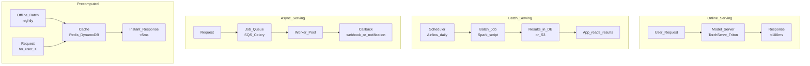

# ⚡ Real-Time vs Batch Inference

> [!abstract] TL;DR
> ML inference has four patterns based on latency and freshness requirements: **online** (synchronous request → response, <100ms), **batch** (process millions offline, hours/day), **async** (queue + webhook, minutes), and **pre-computed** (cache all possible outputs, <10ms). Netflix pre-computes most recommendations nightly; fraud detection must be real-time. Choosing the right pattern is the most important infrastructure decision in ML system design.

## Intuition — Analogy First

Think of how different restaurants work:

**Batch inference** = a meal prep service. Every Sunday, a chef cooks 50 different meals and puts them in labeled containers in the fridge. When you want dinner, you just grab a container — instant. But what you get is what was cooked last Sunday, not freshly made.

**Pre-computed inference** = a vending machine. Every possible meal choice is already packaged and ready. Perfect for a menu of 100 items, but you can't handle 1 million possible meal combinations.

**Real-time (online) inference** = a restaurant kitchen. You sit down, order your specific meal, and the chef makes it fresh right now. You wait 20 minutes, but it's made exactly for you, with today's ingredients.

**Async inference** = ordering via delivery app. You submit the order (request), do something else, and get a notification when it's ready (callback/webhook). Good when you don't need to wait at the counter.

## How It Works — Mechanics

### The Four Serving Patterns



### Decision Matrix

| Pattern | Latency | Freshness | Cost | Scale | Best For |
|---|---|---|---|---|---|
| **Online (sync)** | <100ms | Real-time | High (GPU on-demand) | Medium | Fraud, ad ranking, chatbots |
| **Batch** | Hours/day | Stale | Low (off-peak) | Very high | Nightly reports, bulk labeling |
| **Async** | Minutes | Near-real-time | Medium | High | Document processing, video analysis |
| **Pre-computed** | <10ms | As fresh as last batch | Medium (storage) | Very high | Recommendations (popular users) |

### When to Pre-Compute

Pre-computation makes sense when:
- **Input space is bounded**: can enumerate all possible users (10M users → 10M precomputed vectors).
- **Freshness tolerance**: recommendations can be stale by 1–24 hours.
- **High QPS, simple lookup**: read-heavy at peak load → Redis/DynamoDB lookup is cheaper than model inference.

Not feasible when:
- Input is real-time context-dependent (fraud detection: the same user + same amount = different fraud risk on different devices).
- Input space is unbounded (free-form queries in search).

### Latency Budget Breakdown (Online Serving)

```
Total: 100ms budget
├── Load balancer routing: 1ms
├── Feature fetch (Redis): 5ms
├── Feature preprocessing: 3ms
├── Model inference (GPU): 20ms
├── Post-processing + thresholding: 1ms
├── Network serialization: 5ms
└── Buffer for variance: 65ms
```

## Code Demo

### FastAPI Real-Time Serving

```python
from fastapi import FastAPI, HTTPException
from pydantic import BaseModel
import torch
import numpy as np
import redis
import time
import asyncio
from contextlib import asynccontextmanager

# Global model and feature store
model = None
feature_store = None

@asynccontextmanager
async def lifespan(app: FastAPI):
    """Initialize resources on startup."""
    global model, feature_store
    model = torch.jit.load("models/fraud_detector_v3.pt")
    model.eval()
    feature_store = redis.Redis(host="redis", port=6379, decode_responses=True)
    yield
    # Cleanup on shutdown

app = FastAPI(lifespan=lifespan)

class TransactionRequest(BaseModel):
    user_id: str
    amount: float
    merchant_id: str
    device_fingerprint: str
    ip_country: str

class FraudResponse(BaseModel):
    fraud_score: float
    decision: str  # "approve", "review", "block"
    latency_ms: float

@app.post("/predict/fraud", response_model=FraudResponse)
async def predict_fraud(request: TransactionRequest):
    start = time.perf_counter()
    
    # 1. Fetch features from Redis (5ms target)
    user_features_raw = feature_store.hgetall(f"user:{request.user_id}")
    if not user_features_raw:
        # Cold start: use default features
        user_features_raw = {"avg_amount": "50", "tx_count_30d": "0"}
    
    # 2. Assemble feature vector (1ms)
    import math
    features = np.array([
        math.log1p(request.amount),
        float(user_features_raw.get("avg_amount", "50")),
        float(user_features_raw.get("tx_count_30d", "0")),
        1.0 if request.ip_country == "US" else 0.0,
        # ... more features
    ], dtype=np.float32)
    
    # 3. Model inference (20ms target)
    with torch.no_grad():
        tensor = torch.from_numpy(features).unsqueeze(0)
        fraud_score = float(torch.sigmoid(model(tensor)).item())
    
    # 4. Decision
    if fraud_score > 0.85:
        decision = "block"
    elif fraud_score > 0.5:
        decision = "review"
    else:
        decision = "approve"
    
    latency_ms = (time.perf_counter() - start) * 1000
    
    return FraudResponse(
        fraud_score=round(fraud_score, 4),
        decision=decision,
        latency_ms=round(latency_ms, 2),
    )

@app.get("/health")
async def health():
    return {"status": "ok", "model_loaded": model is not None}
```

### Batch Inference Pipeline (Airflow + Spark)

```python
from airflow.decorators import dag, task
from datetime import datetime
import subprocess

@dag(
    schedule_interval="0 2 * * *",   # 2 AM daily
    start_date=datetime(2026, 1, 1),
    catchup=False,
    tags=["ml", "batch-inference"],
)
def nightly_recommendation_pipeline():

    @task()
    def generate_recommendations() -> str:
        """Run batch inference on all active users."""
        # In production: submit PySpark job
        result = subprocess.run([
            "spark-submit",
            "--master", "yarn",
            "--executor-memory", "8g",
            "--num-executors", "50",
            "jobs/batch_recommendation.py",
            "--date", "{{ ds }}",
            "--output", "s3://ml-bucket/recommendations/{{ ds }}/",
        ], check=True, capture_output=True)
        
        output_path = f"s3://ml-bucket/recommendations/2026-07-25/"
        print(f"Recommendations written to {output_path}")
        return output_path

    @task()
    def load_to_serving_db(output_path: str):
        """Load batch recommendations into Redis for serving."""
        # In production: read Parquet files, load to Redis
        import redis
        r = redis.Redis(host="redis", port=6379)
        
        # Pseudo-code for reading Parquet and loading to Redis
        import pandas as pd
        df = pd.read_parquet(output_path)
        
        pipe = r.pipeline()
        for _, row in df.iterrows():
            # Store list of recommended item_ids per user
            key = f"recs:{row['user_id']}"
            pipe.set(key, ",".join(row["item_ids"]), ex=86400)  # TTL 24 hours
        pipe.execute()
        print(f"Loaded {len(df)} user recommendations to Redis")

    output = generate_recommendations()
    load_to_serving_db(output)

dag_instance = nightly_recommendation_pipeline()
```

### Async Inference with Queue

```python
import celery
from celery import Celery
from pydantic import BaseModel
import uuid

# Celery for async task queue
celery_app = Celery("ml_tasks", broker="redis://redis:6379/0", backend="redis://redis:6379/1")

@celery_app.task(bind=True, max_retries=3)
def process_document(self, document_id: str, document_text: str) -> dict:
    """Async task: classify and extract entities from a document."""
    try:
        from transformers import pipeline
        
        # Load model (in production, pre-loaded in worker)
        classifier = pipeline("text-classification", model="models/doc_classifier")
        ner = pipeline("ner", model="models/doc_ner", aggregation_strategy="simple")
        
        classification = classifier(document_text[:512])[0]
        entities = ner(document_text[:512])
        
        return {
            "document_id": document_id,
            "category": classification["label"],
            "confidence": classification["score"],
            "entities": [{"text": e["word"], "type": e["entity_group"]} for e in entities],
        }
    except Exception as exc:
        raise self.retry(exc=exc, countdown=30)


# FastAPI endpoint for async submission
from fastapi import FastAPI, BackgroundTasks
app = FastAPI()

class DocumentRequest(BaseModel):
    document_text: str

@app.post("/classify/document/async")
async def submit_document(request: DocumentRequest):
    """Submit document for async processing; return job ID."""
    document_id = str(uuid.uuid4())
    task = process_document.delay(document_id, request.document_text)
    return {"job_id": task.id, "document_id": document_id, "status": "queued"}

@app.get("/classify/document/result/{job_id}")
async def get_result(job_id: str):
    """Poll for result by job ID."""
    task = celery_app.AsyncResult(job_id)
    if task.ready():
        return {"status": "complete", "result": task.result}
    return {"status": task.state.lower()}
```

## Real-World Example

**Netflix** uses a hybrid approach:
- **Pre-computed (nightly batch)**: 80% of the recommendation surface is pre-computed overnight for all users. The "Top Picks for You" row is cached in Redis; when you open the app, it's instant.
- **Real-time (online)**: the first row above the fold is personalized in real-time using your current session context (what you just searched, time of day, device) — a lighter model with <50ms latency.
- **Async**: thumbnail personalization (which screenshot of a show to show you) is computed asynchronously per user segment and cached.

The result: Netflix spends very little on real-time GPU inference while still delivering a personalized experience. Pre-computing is 10–100x cheaper than real-time inference at Netflix scale.

## Trade-offs

| Consideration | Online | Batch | Async | Pre-computed |
|---|---|---|---|---|
| **Freshness** | Perfect | Hours stale | Minutes stale | Batch frequency |
| **Cost** | Highest | Lowest | Medium | Medium |
| **Complexity** | High (SLAs, fallbacks) | Low | Medium | Medium (cache invalidation) |
| **Scalability** | Harder (auto-scaling) | Easy (add workers) | Medium | Very easy |
| **Feature freshness** | Real-time features | Batch features | Batch or near-RT | Batch features |
| **Fallback** | Essential | Nice to have | Essential | Stale cache is fallback |

## When to Use vs Avoid

**Online inference:**
- Required: fraud detection, ad bidding, content safety (sync with action).
- Avoid: if you can pre-compute without meaningful freshness loss.

**Batch inference:**
- Required: nightly churn scoring, bulk document classification, weekly reports.
- Avoid: if results are needed within minutes of the triggering event.

**Async inference:**
- Required: long-running tasks (video analysis, 100-page document parsing).
- Avoid: when user expects an instant response.

**Pre-computed:**
- Required: recommendations for popular users, product embeddings, common query responses.
- Avoid: when input space is unbounded or context changes per-request.

## Common Pitfalls

1. **Over-engineering with online serving**: teams default to online serving because it "feels more ML". Often batch + cache is 10x cheaper and fast enough.
2. **No fallback for online serving**: when the model server is down, what happens? Always have a fallback (rule-based, cached result, most popular items).
3. **Cache invalidation bugs (pre-computed)**: recommendations are pre-computed at 2 AM but a new campaign launches at 9 AM — the pre-computed list doesn't include campaign items. Design explicit cache invalidation.
4. **Batch skew**: a batch job processes 10M users in 6 hours. Users processed first get fresh features; users processed last get features that are 6 hours staler. In fraud, this can mean vulnerability windows.
5. **Async result polling overloading the server**: if every async submission triggers a polling loop, you've effectively built a synchronous system with extra latency. Use webhooks or push notifications.

## Related Concepts

- [[_MOC_AI_System_Design|↑ Section MOC]]

- [[Model_Serving_Overview]] — detailed serving infrastructure (TorchServe, Triton, Seldon)
- [[Feature_Stores]] — online store enables real-time features; offline store for batch
- [[Recommendation_System]] — canonical pre-compute + online hybrid example
- [[Fraud_Detection_System]] — canonical real-time serving example
- [[Apache_Airflow]] — orchestrates batch inference pipelines

## Review Questions

1. Netflix has 250M users. Pre-computing recommendations for all users takes 4 hours in a nightly batch job. A new user signs up at 10 AM — recommendations aren't computed until 2 AM the next day. What serving pattern do you use for new users in the meantime, and how does this affect the system architecture?
2. Your ML team proposes running a content moderation model in real-time on every post (5,000 posts/second). Each model inference takes 50ms on a single GPU. How many GPUs are needed for peak load, and is there a cheaper alternative that maintains quality?
3. Describe three situations where pre-computed inference becomes stale and problematic. For each, propose a mechanism to detect staleness and handle it gracefully.

## Sources

- "Designing Machine Learning Systems" — Chip Huyen (O'Reilly, 2022), Ch. 7
- Netflix Tech Blog: "System Architectures for Personalization and Recommendation"
- "Machine Learning in Production" — MLOps Community
- FastAPI Documentation — https://fastapi.tiangolo.com/
- Celery Documentation — https://docs.celeryq.dev/

#ai-system-design #inference #serving #real-time #batch #pre-computed #async #mlops
