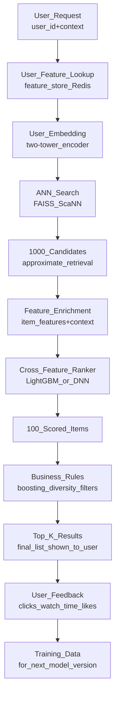

# 🎯 Recommendation System Design

> [!abstract] TL;DR
> Modern recommendation systems use a two-stage pipeline: **retrieval** (two-tower model finds ~100–1000 candidate items from millions via ANN search) followed by **ranking** (a heavier cross-feature model scores candidates for final ordering). Cold start, explore-exploit, and feedback loops are the hardest operational challenges. YouTube, Netflix, and Spotify Discover Weekly all use this two-stage architecture.

## Intuition — Analogy First

Imagine a librarian helping a patron find a book. If they checked every single book in the library (5 million volumes), it would take hours. Instead:

**Stage 1 — Retrieval**: The librarian uses the patron's profile ("likes mystery novels, read Agatha Christie, prefers short books") to quickly pull 100 candidates from the relevant sections. This is fast but approximate — they grab anything that *might* be good.

**Stage 2 — Ranking**: They carefully examine each of the 100 candidates: does this book have similar themes to what the patron just finished? Is it available? Is it currently popular? They rank all 100 and hand over the top 5.

This two-stage design lets you search millions of items efficiently (Stage 1) while applying sophisticated scoring that would be too slow at full scale (Stage 2).

## How It Works — Mechanics

### Full Recommendation Pipeline



### Two-Tower Model (Retrieval)

The two-tower model trains a user encoder and item encoder to produce embeddings in the same vector space. At training time: maximize similarity of (user, item) pairs the user interacted with.

At serving:
1. Precompute all item embeddings offline → index in FAISS.
2. Compute user embedding at request time.
3. ANN search: find K nearest item embeddings.

```
User tower:  [user_features] → MLP → user_embedding (128-dim)
Item tower:  [item_features] → MLP → item_embedding (128-dim)
Loss: in-batch softmax or noise-contrastive estimation
```

### Collaborative Filtering vs Content-Based

| Approach | Signal Used | Cold Start | Best For |
|---|---|---|---|
| **Collaborative filtering** | User-item interactions (clicks, purchases) | Bad (new items/users) | Personalization for established products |
| **Content-based** | Item features (genre, description) | Good | New items; niche preferences |
| **Hybrid** | Both | Moderate | Production systems (usually this) |
| **Two-tower** | Both (learned embeddings) | Moderate | Large-scale retrieval |

### Cold Start Problem

New user: no interaction history.
- Strategy: ask onboarding questions (favorite genres), use demographics, use popularity-based fallback.
- Model approach: use content features only; gradually incorporate CF as interactions accumulate.

New item: no interaction history.
- Strategy: use item content embedding for retrieval; boost new items in ranking with a freshness score.
- After 100 interactions: transition to full CF signal.

### Explore-Exploit

Pure exploitation (always show items you know they like) → filter bubble, user disengagement.
Exploration (show novel items) → risk of irrelevance, but higher long-term engagement.

Strategies:
- **ε-greedy**: ε% of recommendations are random exploration.
- **Thompson sampling**: Bayesian uncertainty → naturally explore less-seen items.
- **Diversity constraint**: post-hoc: ensure top-K list covers ≥3 different categories.

## Code Demo

### Two-Tower Model in PyTorch

```python
import torch
import torch.nn as nn
import torch.nn.functional as F
from torch.utils.data import Dataset, DataLoader

class Tower(nn.Module):
    """Generic encoder tower for user or item."""
    def __init__(self, input_dim: int, hidden_dims: list[int], embedding_dim: int):
        super().__init__()
        layers = []
        prev_dim = input_dim
        for hidden_dim in hidden_dims:
            layers.extend([nn.Linear(prev_dim, hidden_dim), nn.ReLU(), nn.BatchNorm1d(hidden_dim)])
            prev_dim = hidden_dim
        layers.append(nn.Linear(prev_dim, embedding_dim))
        self.net = nn.Sequential(*layers)
    
    def forward(self, x: torch.Tensor) -> torch.Tensor:
        return F.normalize(self.net(x), p=2, dim=-1)  # L2 normalize for cosine sim

class TwoTowerModel(nn.Module):
    def __init__(self, user_dim: int, item_dim: int, embedding_dim: int = 128):
        super().__init__()
        self.user_tower = Tower(user_dim, [512, 256], embedding_dim)
        self.item_tower = Tower(item_dim, [512, 256], embedding_dim)
        self.temperature = nn.Parameter(torch.ones(1) * 0.07)
    
    def forward(self, user_features: torch.Tensor, item_features: torch.Tensor) -> torch.Tensor:
        user_emb = self.user_tower(user_features)  # [B, D]
        item_emb = self.item_tower(item_features)  # [B, D]
        # In-batch negative sampling: every item in batch is a negative for every other user
        logits = torch.matmul(user_emb, item_emb.T) / self.temperature  # [B, B]
        return logits

class InteractionDataset(Dataset):
    def __init__(self, user_features: torch.Tensor, item_features: torch.Tensor):
        self.user_features = user_features
        self.item_features = item_features
    
    def __len__(self): return len(self.user_features)
    def __getitem__(self, idx): return self.user_features[idx], self.item_features[idx]

def train_two_tower(model: TwoTowerModel, loader: DataLoader, epochs: int = 10):
    optimizer = torch.optim.Adam(model.parameters(), lr=1e-3)
    for epoch in range(epochs):
        total_loss = 0
        for user_feat, item_feat in loader:
            logits = model(user_feat, item_feat)
            # Labels: diagonal = positive pairs (user_i matched with item_i)
            labels = torch.arange(len(user_feat))
            loss = F.cross_entropy(logits, labels)
            optimizer.zero_grad()
            loss.backward()
            optimizer.step()
            total_loss += loss.item()
        print(f"Epoch {epoch}: loss={total_loss/len(loader):.4f}")
```

### FAISS Retrieval

```python
import faiss
import numpy as np
import torch

def build_faiss_index(item_embeddings: np.ndarray, use_gpu: bool = False) -> faiss.Index:
    """Build approximate nearest neighbor index for item embeddings."""
    d = item_embeddings.shape[1]  # embedding dimension
    
    # IVF index: cluster items into nlist groups, search nprobe groups at query time
    nlist = 1000  # number of Voronoi cells
    quantizer = faiss.IndexFlatIP(d)  # inner product (cosine sim with normalized vectors)
    index = faiss.IndexIVFFlat(quantizer, d, nlist, faiss.METRIC_INNER_PRODUCT)
    
    if use_gpu:
        res = faiss.StandardGpuResources()
        index = faiss.index_cpu_to_gpu(res, 0, index)
    
    index.train(item_embeddings)
    index.add(item_embeddings)
    index.nprobe = 64  # search 64 of 1000 clusters — trade accuracy for speed
    
    return index

def retrieve_candidates(
    model: TwoTowerModel,
    user_features: torch.Tensor,
    index: faiss.Index,
    item_ids: list,
    k: int = 1000,
) -> list[tuple[str, float]]:
    """Get top-K candidate items for a user."""
    with torch.no_grad():
        user_emb = model.user_tower(user_features.unsqueeze(0)).numpy()  # [1, D]
    
    scores, indices = index.search(user_emb, k)  # [1, k]
    
    candidates = [
        (item_ids[idx], float(score))
        for idx, score in zip(indices[0], scores[0])
    ]
    return candidates  # list of (item_id, similarity_score)
```

### LightGBM Ranker (Second Stage)

```python
import lightgbm as lgb
import numpy as np
import pandas as pd
from sklearn.preprocessing import LabelEncoder

def train_ranker(train_df: pd.DataFrame) -> lgb.LGBMRanker:
    """Train LightGBM LambdaRank for second-stage ranking."""
    feature_cols = [
        "user_age", "user_purchase_count_30d",
        "item_popularity_7d", "item_avg_rating",
        "user_item_category_match",  # cross feature
        "retrieval_score",           # first-stage similarity
        "item_freshness_days",
        "user_item_co_occurrence",   # collaborative signal
    ]
    
    train_groups = train_df.groupby("query_id").size().values  # items per query
    
    model = lgb.LGBMRanker(
        boosting_type="gbdt",
        num_leaves=127,
        n_estimators=500,
        learning_rate=0.05,
        label_gain=[0, 1, 3, 7, 15],  # gains for labels 0,1,2,3,4
    )
    
    model.fit(
        train_df[feature_cols],
        train_df["label"],
        group=train_groups,
        eval_set=[(val_df[feature_cols], val_df["label"])],
        eval_group=[val_groups],
        eval_metric="ndcg",
        callbacks=[lgb.early_stopping(50)],
    )
    
    return model

def rerank(
    candidates: list[tuple[str, float]],
    user_features: dict,
    item_feature_store: dict,
    ranker: lgb.LGBMRanker,
) -> list[tuple[str, float]]:
    """Rerank retrieval candidates using cross-feature ranker."""
    rows = []
    for item_id, retrieval_score in candidates:
        item_feat = item_feature_store.get(item_id, {})
        rows.append({
            "item_id": item_id,
            "retrieval_score": retrieval_score,
            **user_features,
            **item_feat,
        })
    df = pd.DataFrame(rows)
    df["rank_score"] = ranker.predict(df[feature_cols])
    df = df.sort_values("rank_score", ascending=False)
    return list(zip(df["item_id"], df["rank_score"]))
```

## Real-World Example

**YouTube's recommendation system** (Deep Neural Network for YouTube Recommendations, 2016) established the two-tower paradigm for large-scale RecSys:
- **Candidate generation**: a two-layer DNN takes user watch history + demographic features → outputs 256-dim embedding → retrieves 200 videos from 1M+ corpus via ANN.
- **Ranking**: a wider DNN with hundreds of features (video age, impression CTR, user-video relationship features) ranks the 200 candidates.
- Scale: 1B+ users, 500 hours of video uploaded per minute.
- Serving latency: <100ms end-to-end.

**Spotify Discover Weekly** uses collaborative filtering to find users with similar listening histories → identify songs they loved that you haven't heard → personalize with audio features. Updated weekly; 40M+ users receive personalized playlists.

## Trade-offs

| Design Decision | Option A | Option B | Notes |
|---|---|---|---|
| Retrieval | Two-tower (learned) | Matrix factorization | Two-tower: handles new items better via content features |
| Retrieval | FAISS (dense) | BM25 (sparse) | Hybrid often best for long-tail items |
| Ranking | LightGBM (trees) | DNN (cross features) | LightGBM: faster, more interpretable |
| Serving | Pre-computed nightly | Real-time on request | Pre-computed cheaper; real-time fresher |
| Cold start | Popularity fallback | Content-based embedding | Start with popularity; transition to personalized |
| Explore | ε-greedy | Thompson sampling | Thompson is more principled but complex |

## When to Use vs Avoid

**Use two-tower retrieval + ranking when:**
- Corpus has >100K items (brute-force scoring is too slow).
- Both user and item features are available.
- Training interaction data is abundant.

**Use simpler approaches when:**
- Small corpus (<10K items): score all items directly.
- No user interaction data: content-based only.
- Strict cold-start: use popularity + onboarding preferences.

## Common Pitfalls

1. **Training-serving skew**: training two-tower with random negatives, but serving with ANN that retrieves hard negatives. Model underperforms because it never learned to distinguish hard negatives.
2. **Feedback loop**: popular items get clicked → more data → ranked higher → shown more → more data. Long-tail items starve. Monitor diversity metrics; add freshness boost.
3. **Position bias in labels**: items shown at position 1 get clicked more than position 5, regardless of quality. Use position bias correction or propensity weighting in training.
4. **Leaking future information**: using user features that include behavior *after* the recommendation → inflated offline metrics. Use strict time-based train/val splits.
5. **Offline-online metric gap**: NDCG@10 improves but CTR doesn't. Offline metrics are proxies. Always A/B test model changes.

## Related Concepts

- [[_MOC_AI_System_Design|↑ Section MOC]]

- [[Ranking_System]] — detailed ranking models: LambdaMART, NDCG
- [[Embedding_Models]] — embeddings for user/item representation
- [[Feature_Stores]] — user and item features for retrieval and ranking
- [[Ad_Click_Prediction]] — closely related: uses similar two-tower + ranker pipeline
- [[Real_Time_vs_Batch_Inference]] — pre-compute vs real-time recommendation serving

## Review Questions

1. In a two-tower retrieval model trained with in-batch negatives, why can random negatives lead to poor serving performance? How does "hard negative mining" address this?
2. YouTube uses a two-stage pipeline (retrieval → ranking) rather than scoring all videos with the ranking model directly. Calculate roughly why direct ranking of 5M videos per request at 1M QPS is infeasible, assuming the ranker takes 0.1ms per item.
3. A/B test shows your new recommendation model improves NDCG@10 by 5% but online CTR is flat. Give three possible explanations, and for each, suggest how you'd investigate it.

## Sources

- "Deep Neural Networks for YouTube Recommendations" — Covington et al. (RecSys 2016)
- "Recommender Systems Handbook" — Ricci et al. (Springer, 2022)
- Netflix Tech Blog: "Netflix Recommendations: Beyond the 5 stars"
- Spotify Engineering: "How Spotify Discovers Weekly Playlists"
- "Two-Tower Model for Retrieval in Recommendation" — Yi et al. (Google, 2019)

#ai-system-design #recommendation #two-tower #retrieval #ranking #cold-start #collaborative-filtering
