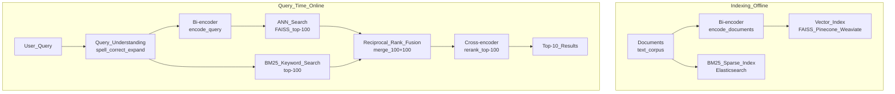

# 🔍 Semantic Search System Design

> [!abstract] TL;DR
> Semantic search finds results by *meaning*, not keyword overlap. Architecture: a **bi-encoder** generates query and document embeddings for fast ANN retrieval (thousands of candidates in <10ms); a **cross-encoder** re-ranks the top-100 using full attention over query+document pairs for maximum accuracy (slower). Hybrid search (dense + BM25 sparse) usually outperforms either alone, especially for rare or exact-match queries.

## Intuition — Analogy First

Classic keyword search is like a **librarian who only matches exact words**: search "cardiac arrest" and miss all documents containing "heart attack" even though they're the same thing.

Semantic search is like a **librarian who understands meaning**: she knows "cardiac arrest" and "heart attack" are synonyms, and "myocardial infarction" is the medical term. She returns books that discuss *the concept*, regardless of exact wording.

**Why two stages (bi-encoder + cross-encoder)?**
The cross-encoder reads *both* the query and document together with full attention — it's extremely accurate but takes 100ms per document pair. You can't afford that for 10M documents. The bi-encoder runs independently on query and document — pre-compute document embeddings, then just compare with query embedding. Fast (ANN in 5ms for 10M docs), but less accurate because it can't see both at once.

**Solution**: bi-encoder retrieves 100 candidates in 5ms, cross-encoder rescores 100 in ~200ms total. Best of both.

## How It Works — Mechanics

### Full Search Architecture



### Bi-Encoder (Retrieval)

- Independently encodes query and document into dense vectors.
- Pre-compute all document embeddings offline (indexed in FAISS).
- At query time: encode query → ANN search → O(log N) retrieval.
- Models: `sentence-transformers/all-MiniLM-L6-v2` (fast), `BAAI/bge-large-en-v1.5` (accurate).
- **Limitation**: query and document encoded independently → can't use cross-attention between them.

### Cross-Encoder (Re-ranking)

- Takes `[CLS] query [SEP] document [SEP]` as input.
- Full bidirectional attention between query and document tokens.
- Outputs a single relevance score.
- Much more accurate but O(N) — can't scale to millions.
- Models: `cross-encoder/ms-marco-MiniLM-L-6-v2`.

### Hybrid Search (Dense + Sparse)

Dense retrieval (bi-encoder) excels at: semantic similarity, paraphrase matching, concept retrieval.
Sparse retrieval (BM25) excels at: exact keyword matching, rare terms, product codes, names.

**Reciprocal Rank Fusion (RRF)** merges ranked lists:
```
RRF_score(doc) = Σ_i 1 / (k + rank_i(doc))   where k=60 is a constant
```

Empirically, RRF with k=60 works well across domains without tuning weights.

### Latency Budget

| Component | Latency | Notes |
|---|---|---|
| Query encoding (bi-encoder) | 5–15ms | GPU; batch queries |
| ANN search (FAISS, 10M docs) | 5–20ms | IVF index; depends on nprobe |
| BM25 search (Elasticsearch) | 10–50ms | Full-text inverted index |
| Merge (RRF) | <1ms | Pure computation |
| Cross-encoder rerank (100 docs) | 50–200ms | GPU; BERT-size model |
| **Total** | **70–300ms** | Within 300ms target |

## Code Demo

### Sentence-Transformers Bi-Encoder + FAISS

```python
from sentence_transformers import SentenceTransformer
import faiss
import numpy as np
from typing import List, Tuple

class BiEncoderRetriever:
    """Dense retrieval using a bi-encoder + FAISS index."""
    
    def __init__(self, model_name: str = "BAAI/bge-large-en-v1.5"):
        self.model = SentenceTransformer(model_name)
        self.index = None
        self.documents = []
    
    def index_documents(self, documents: List[str], batch_size: int = 256):
        """Encode and index documents offline."""
        print(f"Encoding {len(documents)} documents...")
        # Prefix for BGE models: add "Represent this passage:"
        prefixed = [f"Represent this passage: {doc}" for doc in documents]
        embeddings = self.model.encode(
            prefixed,
            batch_size=batch_size,
            show_progress_bar=True,
            normalize_embeddings=True,  # for cosine similarity
        ).astype("float32")
        
        d = embeddings.shape[1]
        self.index = faiss.IndexFlatIP(d)  # inner product (= cosine with normalized vecs)
        self.index.add(embeddings)
        self.documents = documents
        print(f"Indexed {self.index.ntotal} documents, dim={d}")
    
    def retrieve(self, query: str, k: int = 100) -> List[Tuple[str, float]]:
        """Retrieve top-k documents for a query."""
        # Prefix for BGE query encoding
        query_emb = self.model.encode(
            [f"Represent this query for searching relevant passages: {query}"],
            normalize_embeddings=True,
        ).astype("float32")
        
        scores, indices = self.index.search(query_emb, k)
        return [(self.documents[i], float(s)) for i, s in zip(indices[0], scores[0])]
    
    def save_index(self, path: str):
        faiss.write_index(self.index, f"{path}/faiss.index")
        import json
        with open(f"{path}/documents.json", "w") as f:
            json.dump(self.documents, f)
```

### Cross-Encoder Re-Ranker

```python
from sentence_transformers import CrossEncoder
from typing import List, Tuple

class CrossEncoderReranker:
    """Re-rank retrieval candidates using cross-attention."""
    
    def __init__(self, model_name: str = "cross-encoder/ms-marco-MiniLM-L-6-v2"):
        self.model = CrossEncoder(model_name)
    
    def rerank(
        self,
        query: str,
        candidates: List[Tuple[str, float]],
        top_k: int = 10,
    ) -> List[Tuple[str, float]]:
        """Rerank candidate documents using cross-encoder relevance score."""
        # Create (query, document) pairs
        pairs = [(query, doc) for doc, _ in candidates]
        
        # Score all pairs (batch for efficiency)
        scores = self.model.predict(pairs, batch_size=32, show_progress_bar=False)
        
        # Zip with documents and sort
        ranked = sorted(
            zip([doc for doc, _ in candidates], scores),
            key=lambda x: x[1],
            reverse=True,
        )
        return ranked[:top_k]
```

### Hybrid Search with RRF

```python
from elasticsearch import Elasticsearch

def rrf_merge(
    dense_results: List[Tuple[str, float]],
    sparse_results: List[Tuple[str, float]],
    k: int = 60,
) -> List[Tuple[str, float]]:
    """Reciprocal Rank Fusion — merge dense and sparse ranked lists."""
    scores = {}
    
    for rank, (doc_id, _) in enumerate(dense_results):
        scores[doc_id] = scores.get(doc_id, 0) + 1.0 / (k + rank + 1)
    
    for rank, (doc_id, _) in enumerate(sparse_results):
        scores[doc_id] = scores.get(doc_id, 0) + 1.0 / (k + rank + 1)
    
    sorted_results = sorted(scores.items(), key=lambda x: x[1], reverse=True)
    return sorted_results


class HybridSearchEngine:
    """Combines dense bi-encoder retrieval with BM25 keyword search."""
    
    def __init__(self, bi_encoder: BiEncoderRetriever, es_index: str):
        self.bi_encoder = bi_encoder
        self.es = Elasticsearch("http://localhost:9200")
        self.es_index = es_index
        self.reranker = CrossEncoderReranker()
    
    def bm25_search(self, query: str, k: int = 100) -> List[Tuple[str, float]]:
        """BM25 keyword search via Elasticsearch."""
        resp = self.es.search(
            index=self.es_index,
            body={"query": {"match": {"content": query}}, "size": k},
        )
        return [(hit["_id"], hit["_score"]) for hit in resp["hits"]["hits"]]
    
    def search(self, query: str, final_k: int = 10) -> List[Tuple[str, float]]:
        """Full hybrid search pipeline."""
        # Stage 1: Parallel retrieval
        dense = self.bi_encoder.retrieve(query, k=100)
        sparse = self.bm25_search(query, k=100)
        
        # Stage 2: Merge with RRF
        merged = rrf_merge(dense, sparse)[:100]
        
        # Stage 3: Get document text for reranking
        candidate_docs = [(doc_id, score) for doc_id, score in merged[:100]]
        
        # Stage 4: Cross-encoder rerank
        reranked = self.reranker.rerank(query, candidate_docs, top_k=final_k)
        return reranked
```

## Real-World Example

**Google's semantic search** migrated from pure TF-IDF/BM25 to a hybrid system with BERT encoders (BERT for dense retrieval, MUM for multimodal). Their 2020 BERT integration improved 10% of English queries on day one — the biggest single improvement to Google Search in 5 years.

**Notion AI search** uses a bi-encoder to embed all workspace pages, stores embeddings in a vector DB, and retrieves semantically relevant pages at query time. The user asks "notes from last month's product planning session" — Notion finds the right page even without exact words.

**GitHub code search** uses a specialized code bi-encoder (CodeBERT/UniXcoder) that understands programming constructs — searching for "function that parses dates from strings" finds relevant code even if the function has no documentation.

## Trade-offs

| Dimension | Bi-encoder | Cross-encoder | BM25 |
|---|---|---|---|
| Speed | Very fast (ANN) | Slow (full attention) | Fast (inverted index) |
| Accuracy | Good | Best | Moderate (lexical only) |
| Memory | High (embeddings index) | None (stateless) | Moderate |
| New doc latency | Re-encode + re-index | None | Re-index |
| Rare terms | Poor | Poor | Excellent |
| Semantic | Excellent | Excellent | None |

## When to Use vs Avoid

**Use full semantic search stack when:**
- Queries are natural language with paraphrase/synonym matching needed.
- Document corpus is large (>10K docs) requiring efficient retrieval.
- Latency budget allows ~200ms end-to-end.

**Use BM25-only when:**
- Corpus is small and indexing overhead isn't worth it.
- Queries are exact-match (product IDs, codes, legal citations).
- Latency must be <50ms and you can't afford cross-encoder.

**Skip the cross-encoder when:**
- Latency is paramount and bi-encoder quality is sufficient.
- Cost is a constraint — cross-encoder requires GPU inference for each reranking request.

## Common Pitfalls

1. **Not normalizing embeddings**: if embeddings aren't L2-normalized, inner product ≠ cosine similarity. Always normalize before FAISS IndexFlatIP.
2. **Using wrong model for code vs text**: `all-MiniLM-L6-v2` is great for English text but terrible for code. Use CodeBERT/UniXcoder for code search.
3. **Re-indexing latency**: when new documents arrive, they need to be encoded and indexed before they appear in results. For real-time document updates, use an online index that supports incremental adds (HNSW with dynamic insertion).
4. **Query expansion gone wrong**: expanding "ML" to "machine learning, ML, deep learning, AI" can improve recall but tank precision if the expansion is too broad.
5. **Ignoring sparse retrieval for product names**: searching for "iPhone 15 Pro Max" — the exact product name will score lower in dense retrieval than in BM25. Hybrid search is critical for e-commerce.

## Related Concepts

- [[_MOC_AI_System_Design|↑ Section MOC]]

- [[Embedding_Models]] — the bi-encoder backbone that generates dense vectors
- [[RAG_Overview]] — semantic search is the retrieval component of RAG
- [[Recommendation_System]] — similar two-tower + ANN + reranking architecture
- [[Feature_Stores]] — document embeddings can be stored and served as features

## Review Questions

1. Explain why a cross-encoder is more accurate than a bi-encoder for relevance scoring, but cannot be used for first-stage retrieval over 10M documents at 1000 QPS. Use concrete numbers to justify.
2. Your e-commerce search system uses only a dense bi-encoder. Users complain that searching exact product SKUs ("SKU-XK2891") returns irrelevant results. What is the cause, and how do you fix it with minimal architecture changes?
3. You deploy a semantic search system with FAISS IVF index. Users complain that rare/niche documents that were found previously are no longer returned. You investigate and find nprobe=8. What is nprobe, how does it affect recall vs latency, and what value would you recommend?

## Sources

- "Sentence-BERT: Sentence Embeddings using Siamese BERT-Networks" — Reimers & Gurevych (EMNLP 2019)
- "Pretrained Transformers for Text Ranking: BERT and Beyond" — Lin et al. (2021)
- Google AI Blog: "Understanding Searches Better than Ever Before" (BERT, 2019)
- FAISS Documentation — https://github.com/facebookresearch/faiss
- "Passage Retrieval with Dense Representations" — Karpukhin et al. (EMNLP 2020)

#ai-system-design #search #semantic-search #bi-encoder #cross-encoder #faiss #hybrid-search
