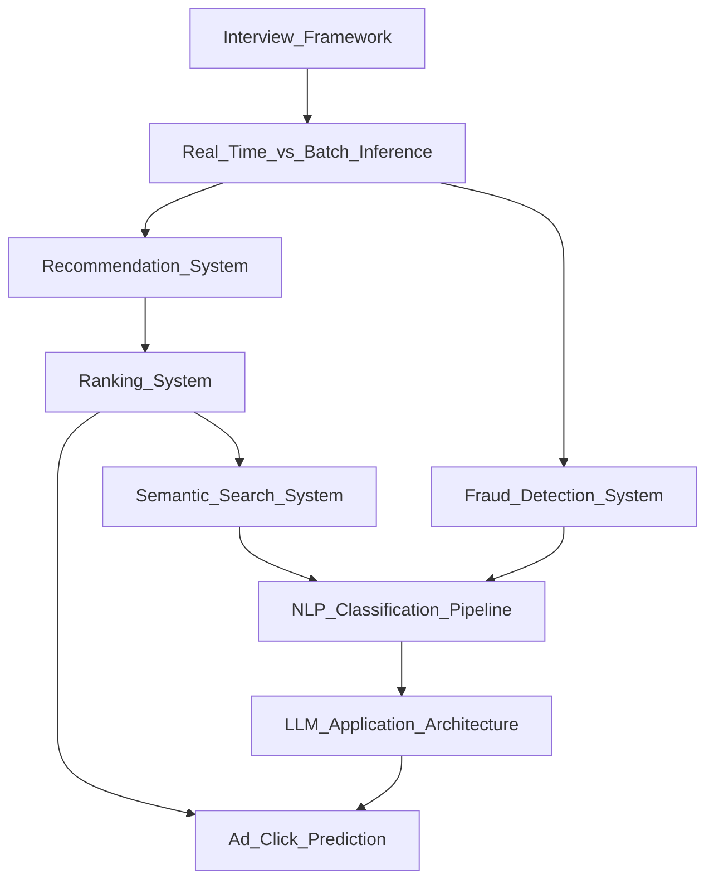

# 🗺️ AI System Design — Map of Content

> [!info] How to use this map
> Start with Fundamentals, follow the arrows, and use the Learning Path below as your guide.

---

## Concept Map

---

## Learning Path
1. [[Interview_Framework]] — Master the canonical ML system design interview template: requirements, data, modelling, serving, monitoring
2. [[Real_Time_vs_Batch_Inference]] — Understand the latency-throughput trade-off that governs every architectural choice downstream
3. [[Recommendation_System]] — Design a two-stage (retrieval + ranking) recommender at scale, the archetype for most ML systems
4. [[Ranking_System]] — Deep-dive the ranking stage: pointwise/pairwise/listwise loss functions and feature engineering
5. [[Semantic_Search_System]] — Build dense retrieval with embeddings, ANN indexes, and hybrid sparse-dense pipelines
6. [[Fraud_Detection_System]] — Handle severe class imbalance, concept drift, and low-latency scoring requirements
7. [[NLP_Classification_Pipeline]] — End-to-end text classification: preprocessing, fine-tuning, and production deployment
8. [[LLM_Application_Architecture]] — Design RAG, agents, and prompt-management layers around large language models
9. [[Ad_Click_Prediction]] — Apply deep CTR models (Wide & Deep, DIN, DIEN) in an ultra-high-QPS ad-serving context

---

## All Notes in This Section

| Note | Core Idea | Difficulty |
|------|-----------|------------|
| [[Interview_Framework]] | Structured template for scoping, designing, and communicating ML systems | Beginner |
| [[Real_Time_vs_Batch_Inference]] | Latency vs. throughput trade-offs and when to use online vs. offline serving | Intermediate |
| [[Recommendation_System]] | Two-stage retrieval-then-ranking architecture for personalized content | Intermediate |
| [[Ranking_System]] | Learning-to-rank methods, feature engineering, and serving pipelines | Intermediate |
| [[Semantic_Search_System]] | Dense embeddings, ANN indexes, and hybrid retrieval for search | Intermediate |
| [[Fraud_Detection_System]] | Imbalanced classification, graph features, and real-time rule-model hybrids | Advanced |
| [[NLP_Classification_Pipeline]] | Text preprocessing, fine-tuning transformers, and production NLP deployment | Intermediate |
| [[LLM_Application_Architecture]] | RAG, tool-use, agents, guardrails, and prompt management for LLM products | Advanced |
| [[Ad_Click_Prediction]] | CTR prediction with deep feature crossing in high-QPS ad auctions | Advanced |

---

## Key Questions This Section Answers
- What is the standard structure for answering an ML system design interview question?
- When should you choose real-time inference over batch prediction?
- How does a production recommendation system scale to billions of items and users?
- What is the difference between retrieval and ranking, and why do you need both?
- How do you build semantic search that understands intent rather than keywords?
- How do you detect fraud in milliseconds while handling severe class imbalance?
- What does a full NLP classification pipeline look like from raw text to deployed API?
- How do you architect an LLM application with RAG and tool-use at production scale?
- What deep learning architectures are used for click-through rate prediction?

---

## Connections to Other Sections
- [[AI-ML/06_MLOps/_MOC_MLOps]] — MLOps provides the feature stores, model registries, and CI/CD pipelines that operationalize these system designs
- [[AI-ML/03_NLP/_MOC_NLP]] — NLP fundamentals underpin the NLP pipeline, semantic search, and LLM application architectures
- [[AI-ML/05_Generative_AI/_MOC_Generative_AI]] — LLM Application Architecture and RAG design patterns draw directly from Generative AI concepts
- [[AI-ML/08_Data_Engineering/_MOC_Data_Engineering]] — Data engineering pipelines supply the training data and real-time features each system depends on
