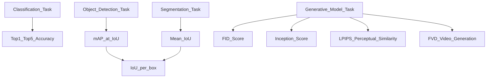

# 👁️ Computer Vision Evaluation Metrics

> [!abstract] TL;DR
> CV tasks each have specialised metrics: top-1/5 accuracy for classification, mAP@IoU for detection, mIoU for segmentation, and FID/IS/LPIPS for generative models. Knowing which metric to report — and its failure modes — is as important as the architecture.

## Intuition — Analogy First

Think of CV evaluation like grading different types of artists:
- **Classification** = "Name what's in this painting" → graded on correct label (accuracy)
- **Object Detection** = "Draw bounding boxes around every object" → graded on box tightness AND correct label (mAP)
- **Segmentation** = "Colour every pixel by object class" → graded pixel-by-pixel overlap (mIoU)
- **Generative quality** = "Paint me a dog" → graded by a judge who compares your style to real paintings (FID), not by matching any specific painting

## How It Works — Mechanics



### Classification: Top-1 / Top-5 Accuracy
- **Top-1**: the single most probable predicted class matches ground truth
- **Top-5**: ground truth appears in the model's five highest-probability predictions

### Object Detection: mAP@IoU
1. For each image, predict bounding boxes with confidence scores
2. Match predictions to ground truth using **Intersection over Union (IoU)**
3. A prediction is a True Positive if IoU ≥ threshold (e.g., 0.5)
4. Compute **Precision-Recall curve** per class
5. Compute **Average Precision (AP)** = area under PR curve per class
6. **mAP** = mean of AP across all classes
7. **COCO mAP** = mean over IoU thresholds 0.5:0.05:0.95

### Segmentation: mIoU (Jaccard Index)
IoU per class = intersection pixels / union pixels; mIoU = mean over classes.

### Generative Models: FID
**Fréchet Inception Distance**: compare statistics (mean + covariance) of Inception-v3 embeddings of real vs. generated images. Lower = more realistic.

### Inception Score (IS)
Measures both quality (sharp, recognisable images) and diversity using the KL divergence between the conditional label distribution $p(y|x)$ and marginal $p(y)$. Higher = better (but gameable).

### LPIPS (Learned Perceptual Image Patch Similarity)
Uses deep features (VGG/AlexNet) to measure perceptual distance between two images. Closer to human similarity judgements than pixel-level MSE/SSIM.

### FVD (Fréchet Video Distance)
Extension of FID for video — uses a 3D Inception network to capture temporal coherence.

## The Math

**IoU (Intersection over Union):**
$$\text{IoU} = \frac{|A \cap B|}{|A \cup B|} = \frac{\text{intersection area}}{\text{union area}}$$

**Average Precision (interpolated, PASCAL VOC):**
$$\text{AP} = \sum_{k=0}^{K-1} P(k) \cdot \Delta R(k)$$
where $P(k)$ and $R(k)$ are precision and recall at threshold $k$.

**mAP (COCO-style, averaged over IoU thresholds):**
$$\text{mAP} = \frac{1}{|C|} \sum_{c \in C} \frac{1}{|\mathcal{T}|} \sum_{\tau \in \mathcal{T}} \text{AP}^c_\tau$$
where $\mathcal{T} = \{0.50, 0.55, \ldots, 0.95\}$.

**mIoU:**
$$\text{mIoU} = \frac{1}{C} \sum_{c=1}^{C} \frac{TP_c}{TP_c + FP_c + FN_c}$$

**FID:**
$$\text{FID} = ||\mu_r - \mu_g||^2 + \text{Tr}\!\left(\Sigma_r + \Sigma_g - 2(\Sigma_r \Sigma_g)^{1/2}\right)$$
where $(\mu_r, \Sigma_r)$ are statistics of real image features and $(\mu_g, \Sigma_g)$ of generated.

**Inception Score:**
$$\text{IS} = \exp\!\left(\mathbb{E}_{x}\left[D_{KL}\!\left(p(y|x) \,\|\, p(y)\right)\right]\right)$$

## Code Demo

```python
# pip install torchmetrics cleanfid lpips

import torch
from torchmetrics.detection.mean_ap import MeanAveragePrecision
from torchmetrics.segmentation import MeanIoU

# ---------- mAP for Object Detection ----------
metric = MeanAveragePrecision(iou_type="bbox")

preds = [{
    "boxes":  torch.tensor([[10, 20, 200, 300], [50, 60, 150, 250]], dtype=torch.float),
    "scores": torch.tensor([0.9, 0.75]),
    "labels": torch.tensor([0, 1]),
}]
targets = [{
    "boxes":  torch.tensor([[15, 25, 195, 295], [45, 55, 145, 245]], dtype=torch.float),
    "labels": torch.tensor([0, 1]),
}]

metric.update(preds, targets)
result = metric.compute()
print(f"mAP@[0.5:0.95]: {result['map']:.4f}")
print(f"mAP@0.50:       {result['map_50']:.4f}")

# ---------- mIoU for Segmentation ----------
miou_metric = MeanIoU(num_classes=21, per_class=False)
pred_mask   = torch.randint(0, 21, (4, 256, 256))   # B x H x W
gt_mask     = torch.randint(0, 21, (4, 256, 256))
miou_metric.update(pred_mask, gt_mask)
print(f"mIoU: {miou_metric.compute():.4f}")

# ---------- FID for Generative Models ----------
from cleanfid import fid

# Compute FID between two folders of images
score = fid.compute_fid(
    fdir1="path/to/real_images",
    fdir2="path/to/generated_images",
    mode="legacy_pytorch",   # matches original FID paper
    num_workers=4,
)
print(f"FID: {score:.2f}")   # Lower is better; <10 is excellent

# ---------- LPIPS ----------
import lpips

loss_fn = lpips.LPIPS(net="alex")        # AlexNet backbone
img0 = torch.randn(1, 3, 256, 256)       # fake generated image
img1 = torch.randn(1, 3, 256, 256)       # reference image
d = loss_fn(img0, img1)
print(f"LPIPS distance: {d.item():.4f}") # Lower = more perceptually similar
```

## Real-World Example

**ImageNet**: The benchmark that launched the deep learning era. Top-1/Top-5 accuracy on ImageNet-1K drove the field from AlexNet (57.1% top-1) to ViT-22B (90.0%+). Human performance is ~94.9% top-5.

**COCO Detection Leaderboard**: COCO mAP (averaged across IoU thresholds and scales) is the standard for comparing object detectors. YOLO models emphasise speed vs. mAP trade-offs here.

**Stable Diffusion FID**: Stable Diffusion v1.5 achieved FID ~8.59 on COCO 30K, compared to GAN baselines of ~20–50. FID drove the field to recognise diffusion models as superior generators. SD 3.0 pushed below FID = 5.

## Trade-offs

| Metric | Task | Strength | Weakness |
|---|---|---|---|
| Top-1/Top-5 Accuracy | Classification | Simple, interpretable | Single-label only; doesn't capture confidence |
| mAP@0.5 | Detection | Standard, fast | Ignores tight localisation |
| mAP@[.5:.95] | Detection | Comprehensive | Complex to compute; slower |
| mIoU | Segmentation | Handles class imbalance via averaging | Small objects underweighted |
| FID | Generation | Correlates well with human quality | Needs 50K+ images for stable estimate |
| IS | Generation | Measures quality + diversity | Gameable; doesn't compare to real data |
| LPIPS | Perceptual similarity | Matches human perception | Slow; model-dependent |
| FVD | Video generation | Temporal quality | Rarely standardised; slow |

## When to Use vs Avoid

**Top-1/Top-5**: Standard for classification benchmarks. Avoid for severely class-imbalanced datasets — prefer balanced accuracy or per-class recall.

**mAP@0.5**: Use for real-time detection (PASCAL VOC style). COCO-style mAP@[.5:.95] for research benchmarks.

**mIoU**: Always report per-class IoU alongside mean — it reveals which classes the model fails on.

**FID**: Require 50K samples minimum for a stable estimate. Don't use for evaluating a single image — it's a distributional metric.

**LPIPS**: Use when measuring reconstruction quality (super-resolution, inpainting, style transfer) where you have a reference image.

## Common Pitfalls

1. **FID with too few samples**: FID with < 10K images is highly variable. Always use 50K samples for final evaluation.
2. **mAP threshold choice**: Reporting mAP@0.5 hides poor localisation; COCO mAP is stricter and preferred.
3. **IS as the sole generative metric**: IS doesn't compare to real data distribution — a model that generates sharp images of one class gets a high IS score.
4. **Ignoring class imbalance in mIoU**: If 95% of pixels are background, mIoU inflated by background class hides poor foreground performance.
5. **Not resizing for FID**: Inception expects 299×299; different resize methods can shift FID by several points.

## Related Concepts

- [[_MOC_Evaluation_Safety|↑ Section MOC]]

- [[Image_Classification]] — tasks where top-1/top-5 accuracy applies
- [[Object_Detection]] — mAP in context
- [[GAN]] — IS and FID developed to evaluate GAN outputs

## Review Questions

1. **Why is FID considered a distributional metric, and why does it require many thousands of images to be statistically stable?**
2. **A segmentation model achieves mIoU = 0.85 on a dataset where 90% of pixels are background. What additional metric or analysis should you report, and why?**
3. **You are comparing two generative models: Model A has FID = 12 and IS = 8.5; Model B has FID = 8 and IS = 6.2. Which is likely better and why?**

## Sources

- Russakovsky et al. (2015). *ImageNet Large Scale Visual Recognition Challenge*. IJCV.
- Lin et al. (2014). *Microsoft COCO: Common Objects in Context*. ECCV.
- Heusel et al. (2017). *GANs Trained by a Two Time-Scale Update Rule* (FID). NeurIPS.
- Salimans et al. (2016). *Improved Techniques for Training GANs* (Inception Score). NeurIPS.
- Zhang et al. (2018). *The Unreasonable Effectiveness of Deep Features as a Perceptual Metric* (LPIPS). CVPR.

#evaluation #computer-vision #metrics #map #miou #fid #lpips
