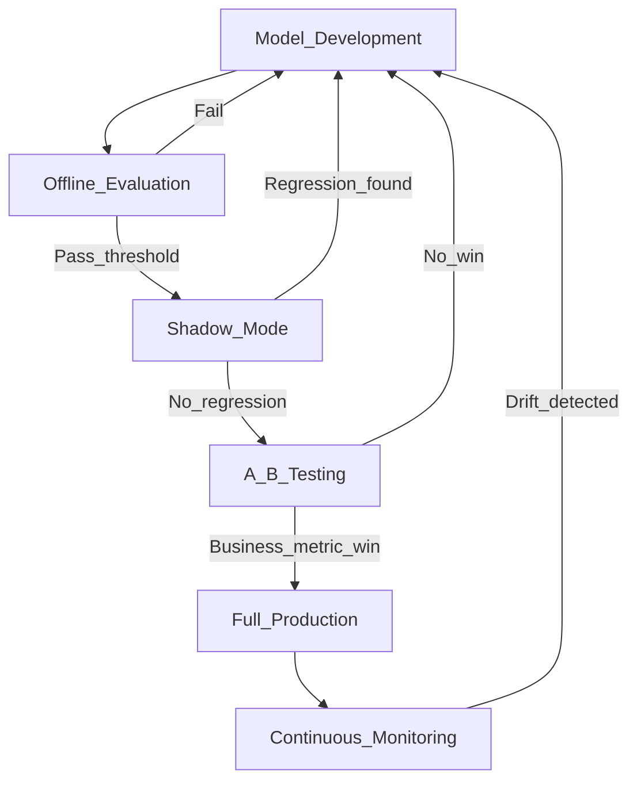

# 🧪 ML Evaluation Frameworks

> [!abstract] TL;DR
> Robust ML evaluation requires a layered pipeline: offline testing against golden datasets, shadow mode on live traffic, A/B testing with business metrics, and continuous monitoring in production. LLM-as-judge and frameworks like RAGAS and DeepEval operationalise this for generative AI systems.

## Intuition — Analogy First

Think of ML evaluation like software quality assurance, but with extra dimensions:

- **Unit tests** → offline evaluation on curated golden datasets (regression testing)
- **Integration tests** → shadow mode (new model runs alongside prod, no traffic impact)
- **Staged rollout** → A/B testing (expose a % of users, measure business metrics)
- **Production monitoring** → data drift, concept drift, anomaly detection

The difference from software QA: ML models can be subtly wrong in ways that unit tests won't catch — a model can pass all existing tests and still fail on real-world distribution shift.

## How It Works — Mechanics



### Offline Evaluation

Testing against a **golden dataset** — a curated, versioned set of inputs with known expected outputs. Key principles:
- Never use this dataset for training or tuning
- Version-control the dataset alongside the model
- Track all metrics per run in an experiment tracker (MLflow, W&B)
- Run regression tests: new model must not be worse than baseline on golden set

### Shadow Mode

The new model receives live traffic but its outputs are **not served to users**. Instead:
1. Route a copy of each request to both the current model and the challenger
2. Log both outputs
3. Evaluate offline with automated metrics + human spot-checks
4. No business risk; full production traffic distribution

### A/B Testing

Split live traffic between control (current model) and treatment (new model). Measure:
- **Primary metric**: the business KPI (CTR, task completion rate, revenue)
- **Guardrail metrics**: must not regress (latency, error rate, safety violations)
- **Sample size**: calculated from minimum detectable effect (MDE) and desired power (80%+)

### LLM-as-Judge

Use a capable LLM (GPT-4, Claude Opus) to evaluate outputs of a weaker/different LLM. The judge scores criteria like factual accuracy, coherence, helpfulness, or safety on a 1–5 Likert scale with a structured prompt.

**Limitations**: positional bias (prefers first answer), verbosity bias (longer = better), self-preference (LLM prefers its own outputs).

### RAGAS (RAG Assessment)

Framework for evaluating RAG pipelines on four metrics:
- **Faithfulness**: is the answer grounded in retrieved context? (reduces hallucinations)
- **Answer Relevance**: does the answer address the question?
- **Context Precision**: are the retrieved chunks relevant?
- **Context Recall**: do the retrieved chunks cover the ground-truth answer?

### DeepEval

Open-source testing framework for LLM applications with pytest-compatible syntax.

## The Math

**A/B test sample size** (two-proportion z-test):
$$n = \frac{(z_{\alpha/2} + z_\beta)^2 \cdot (p_1(1-p_1) + p_2(1-p_2))}{(p_1 - p_2)^2}$$

where $z_{\alpha/2} = 1.96$ for 95% confidence, $z_\beta = 0.84$ for 80% power.

**RAGAS Faithfulness** (claims in answer that are entailed by context):
$$\text{Faithfulness} = \frac{|\text{claims entailed by context}|}{|\text{total claims in answer}|}$$

**RAGAS Answer Relevance** (average cosine similarity of reverse-generated questions to original):
$$\text{AnswerRelevance} = \frac{1}{N} \sum_{i=1}^{N} \cos(\text{embed}(q_i), \text{embed}(q_\text{orig}))$$

## Code Demo

```python
# pip install evaluate deepeval ragas

# --- HuggingFace Evaluate for offline evaluation ---
import evaluate

rouge   = evaluate.load("rouge")
bleu    = evaluate.load("sacrebleu")
bertscore = evaluate.load("bertscore")

predictions = ["The cat sat on a mat.", "It rained heavily in Paris."]
references  = [["A cat was sitting on a mat."], ["Heavy rain fell over Paris."]]

print(rouge.compute(predictions=predictions, references=[r[0] for r in references]))
print(bleu.compute(predictions=predictions, references=references))
print(bertscore.compute(predictions=predictions, references=[r[0] for r in references], lang="en"))
```

```python
# --- LLM-as-Judge prompt template ---
LLM_JUDGE_PROMPT = """\
You are an impartial judge evaluating AI assistant responses.
Score the response on a scale of 1-5 for each criterion.

Question: {question}
Response: {response}
Reference Answer: {reference}

Criteria:
1. Factual Accuracy (1=wrong, 5=fully correct)
2. Completeness (1=missing key info, 5=comprehensive)
3. Clarity (1=confusing, 5=very clear)

Respond in JSON: {{"factual_accuracy": X, "completeness": X, "clarity": X, "reasoning": "..."}}
"""

import json, openai

def llm_judge(question: str, response: str, reference: str) -> dict:
    client = openai.OpenAI()
    result = client.chat.completions.create(
        model="gpt-4o",
        messages=[{"role": "user", "content": LLM_JUDGE_PROMPT.format(
            question=question, response=response, reference=reference
        )}],
        response_format={"type": "json_object"},
    )
    return json.loads(result.choices[0].message.content)
```

```python
# --- RAGAS for RAG evaluation ---
from ragas import evaluate
from ragas.metrics import faithfulness, answer_relevancy, context_precision, context_recall
from datasets import Dataset

# Your RAG pipeline outputs
data = {
    "question":        ["What is the capital of France?"],
    "answer":          ["Paris is the capital of France."],
    "contexts":        [["France is a country in Western Europe. Its capital is Paris."]],
    "ground_truth":    ["Paris"],
}
dataset = Dataset.from_dict(data)

result = evaluate(
    dataset,
    metrics=[faithfulness, answer_relevancy, context_precision, context_recall],
)
print(result)
```

```python
# --- DeepEval pytest-based LLM testing ---
import pytest
from deepeval import assert_test
from deepeval.metrics import AnswerRelevancyMetric, FaithfulnessMetric
from deepeval.test_case import LLMTestCase

@pytest.mark.parametrize("test_case", [
    LLMTestCase(
        input="What is RLHF?",
        actual_output="RLHF stands for Reinforcement Learning from Human Feedback, used to align LLMs.",
        expected_output="Reinforcement Learning from Human Feedback",
        retrieval_context=["RLHF is a technique to align language models using human preference data."],
    )
])
def test_answer_relevancy(test_case):
    metric = AnswerRelevancyMetric(threshold=0.7)
    assert_test(test_case, [metric])
```

## Real-World Example

**Google's LLM Evaluation**: Google uses a multi-stage pipeline before every Gemini release: automated benchmarks (offline), human side-by-side preference ratings (shadow/A/B), and red teaming (safety). The HELM framework was developed at Stanford specifically to standardise holistic offline evaluation.

**RAGAS in Production**: Adopted by teams building RAG products on top of LLMs. Provides a signal for RAG quality that correlates with human ratings better than ROUGE or BLEU alone, particularly for faithfulness (hallucination detection).

## Trade-offs

| Stage | Cost | Risk | Signal Quality |
|---|---|---|---|
| Offline (golden set) | Low | None | Limited to curated distribution |
| Shadow mode | Medium | None (no user impact) | Full traffic distribution |
| A/B test | High | Low–Medium (% exposed) | Real business signal |
| Continuous monitoring | Medium (infra) | N/A | Detects drift over time |
| LLM-as-judge | Medium | Bias from judge model | Good for open-ended quality |
| RAGAS | Low | None | RAG-specific; no code eval |

## When to Use vs Avoid

**Offline evaluation**: Always use as the first gate. Never skip.

**Shadow mode**: Use before A/B tests for high-risk models (medical, financial) where a bad rollout is unacceptable.

**A/B testing**: Essential for measuring business impact. Skip if you have no reliable business metric or insufficient traffic.

**LLM-as-judge**: Use for open-ended generation where automated metrics fail. Mitigate positional bias by swapping answer order and averaging.

**RAGAS**: Purpose-built for RAG; not appropriate for non-RAG systems.

## Common Pitfalls

1. **Golden dataset leakage**: If examples from the golden set appear in training data, offline evaluation is useless — version-lock the test set.
2. **A/B test peeking**: Ending an A/B test early because you see a positive signal inflates false positive rate — commit to the predetermined sample size.
3. **LLM judge verbosity bias**: Judges tend to prefer longer, more verbose answers; normalise by answer length or explicitly instruct the judge to ignore length.
4. **RAGAS with poor retrieval**: Faithfulness can be perfect (answer is entailed by retrieved chunks) but context recall poor (wrong chunks retrieved) — report all four metrics.
5. **No regression monitoring**: Many teams evaluate on a new test set but forget to track whether the model degraded on the original golden set after updates.

## Related Concepts

- [[_MOC_Evaluation_Safety|↑ Section MOC]]

- [[NLP_Evaluation_Metrics]] — string-matching metrics used within offline evaluation
- [[AB_Testing_for_ML]] — statistical details of A/B testing in ML
- [[ML_Monitoring_Overview]] — production monitoring for drift and anomalies

## Review Questions

1. **What is the difference between shadow mode and A/B testing? When would you prefer to run shadow mode before an A/B test?**
2. **You use an LLM judge to evaluate your RAG system and notice consistent 5/5 faithfulness scores even when the retrieved context seems irrelevant. What could explain this, and how would you investigate?**
3. **Design an evaluation pipeline for a medical QA chatbot from development through production. What metrics, stages, and safeguards would you include?**

## Sources

- Liang et al. (2022). *Holistic Evaluation of Language Models* (HELM). [https://arxiv.org/abs/2211.09110](https://arxiv.org/abs/2211.09110)
- Es et al. (2023). *RAGAS: Automated Evaluation of Retrieval Augmented Generation*. [https://arxiv.org/abs/2309.15217](https://arxiv.org/abs/2309.15217)
- Zheng et al. (2023). *Judging LLM-as-a-Judge with MT-Bench and Chatbot Arena*. NeurIPS. [https://arxiv.org/abs/2306.05685](https://arxiv.org/abs/2306.05685)
- HuggingFace Evaluate library: [https://huggingface.co/docs/evaluate](https://huggingface.co/docs/evaluate)
- DeepEval: [https://github.com/confident-ai/deepeval](https://github.com/confident-ai/deepeval)

#evaluation #mlops #frameworks #ragas #deepeval #llm-judge #ab-testing
