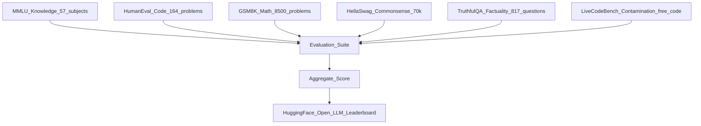

# 🏆 LLM Benchmarks

> [!abstract] TL;DR
> LLM benchmarks are standardised test suites that measure specific capabilities — knowledge, reasoning, coding, honesty — allowing apples-to-apples comparison of models. Every benchmark has blind spots; the most credible evaluation uses a diverse suite, watches for contamination, and supplements with human judgement.

## Intuition — Analogy First

Evaluating an LLM is like evaluating a student who claims to know everything. You give them:
- An **SAT/GRE** (MMLU) — breadth of academic knowledge
- A **coding interview** (HumanEval) — can they write correct programs?
- A **word problem quiz** (GSM8K) — step-by-step reasoning
- A **common sense pop quiz** (HellaSwag) — do they understand the world?
- A **fact-check exam** (TruthfulQA) — do they confabulate?

No single test defines a great student (or a great LLM), which is why holistic suites like HELM bundle everything together.

## How It Works — Mechanics



### Key Benchmarks

| Benchmark | Task | Size | Format | What it Tests |
|---|---|---|---|---|
| **MMLU** | Multiple choice | 14,042 questions, 57 subjects | 4-way MCQ | Academic knowledge breadth |
| **HumanEval** | Code generation | 164 problems | Write Python function | Functional correctness |
| **GSM8K** | Grade school math | 8,500 problems | Chain-of-thought | Multi-step arithmetic reasoning |
| **HellaSwag** | Sentence completion | 70,000 examples | 4-way MCQ | Physical commonsense |
| **TruthfulQA** | QA factuality | 817 questions | Yes/No + explanation | Avoiding hallucination |
| **HELM** | Holistic | 42 scenarios | Multiple | Accuracy + calibration + robustness |
| **LiveCodeBench** | Live coding | Rolling | Write code | Contamination-free coding |

### Benchmark Contamination

A critical problem: if an LLM was trained on text containing benchmark answer keys (common on the internet), its scores are inflated. This is known as **data contamination** or **benchmark leakage**.

Detection methods:
- **Membership inference**: test if the model "recognises" benchmark examples
- **Perplexity analysis**: LM perplexity is suspiciously low on benchmark texts
- **n-gram overlap**: between pretraining data and benchmark questions
- **LiveCodeBench** explicitly uses post-cutoff problems to avoid this

## The Math

MMLU accuracy:
$$\text{Acc} = \frac{\text{correct answers}}{\text{total questions}} \times 100$$

HumanEval pass@k (probability that at least one of k samples passes all unit tests):
$$\text{pass@k} = 1 - \frac{\binom{n-c}{k}}{\binom{n}{k}}$$
where $n$ = total samples per problem, $c$ = correct samples.

GSM8K uses exact match after chain-of-thought extraction; the metric is simply accuracy.

## Code Demo

```python
# Install: pip install lm-eval

# Run MMLU, HellaSwag, GSM8K with lm-evaluation-harness
# (EleutherAI's standard harness — used for the Open LLM Leaderboard)

# From the command line:
# lm_eval --model hf \
#         --model_args pretrained=meta-llama/Llama-3.2-3B \
#         --tasks mmlu,hellaswag,gsm8k \
#         --num_fewshot 5 \
#         --output_path ./results

# Python API usage:
import lm_eval

model = lm_eval.models.get_model("hf")(
    pretrained="meta-llama/Llama-3.2-3B",
    device="cuda",
    dtype="float16",
)

results = lm_eval.simple_evaluate(
    model=model,
    tasks=["mmlu", "hellaswag", "gsm8k"],
    num_fewshot={"mmlu": 5, "hellaswag": 10, "gsm8k": 8},
    batch_size="auto",
)

# Print results table
import json
for task, metrics in results["results"].items():
    print(f"{task}: {json.dumps(metrics, indent=2)}")
```

```python
# Evaluating code generation with HumanEval
from datasets import load_dataset
from human_eval.evaluation import evaluate_functional_correctness

dataset = load_dataset("openai_humaneval", split="test")

# Generate completions (replace with your model's generate fn)
def generate_completion(prompt: str, n: int = 20) -> list[str]:
    # ... call your LLM here ...
    pass

samples = []
for problem in dataset:
    completions = generate_completion(problem["prompt"])
    for completion in completions:
        samples.append({
            "task_id": problem["task_id"],
            "completion": completion,
        })

results = evaluate_functional_correctness(samples)
print(f"pass@1: {results['pass@1']:.3f}")
print(f"pass@10: {results['pass@10']:.3f}")
```

## Real-World Example

**HuggingFace Open LLM Leaderboard** (https://huggingface.co/spaces/HuggingFaceH4/open_llm_leaderboard) evaluates open-source models on a standardised suite (ARC, HellaSwag, MMLU, TruthfulQA, Winogrande, GSM8K) using lm-evaluation-harness. This is the de facto ranking for open models.

**GPT-4 Technical Report** reported MMLU = 86.4% (5-shot), compared to GPT-3.5 at 70.0% and human expert at 89.8%, illustrating how benchmarks track progress toward human-level performance.

**Contamination in the wild**: A 2023 study found that several popular models had unexpectedly high GSM8K scores that deflated when evaluated on a fresh, isomorphic benchmark (GSM-Symbolic), suggesting contamination.

## Trade-offs

| Benchmark | Strength | Weakness |
|---|---|---|
| MMLU | Broad, reproducible | MCQ format rewards guessing; static |
| HumanEval | Objective pass/fail | Only 164 problems; Python-only |
| GSM8K | Tests reasoning chains | Solvable without true understanding via pattern matching |
| HellaSwag | Large, robust | Near-saturated by current models |
| TruthfulQA | Unique factuality focus | Small; human-labelled answers subjective |
| HELM | Comprehensive | Resource-intensive; slow |
| LiveCodeBench | Contamination-resistant | Rolling — historical scores not comparable |

## When to Use vs Avoid

**Use when:**
- Comparing models before deploying to a task — pick benchmarks closest to your domain
- Tracking regression between model versions (always use the same evaluation harness)
- Reporting results in a paper or blog post — cite the harness version and shot counts

**Avoid relying on a single benchmark when:**
- A model is suspiciously high (check for contamination)
- You need domain-specific performance — generic benchmarks may not predict real-world task quality
- The task involves judgment, creativity, or long-context reasoning not captured by MCQ

## Common Pitfalls

1. **Shot count inconsistency**: MMLU 0-shot vs 5-shot gives very different numbers; always report both the benchmark name and the shot count.
2. **Comparing across harnesses**: Running MMLU with lm-eval vs. a custom harness can differ by 2–5 points due to tokenisation and prompt formatting.
3. **Overfitting to leaderboards**: Fine-tuning specifically on benchmark-adjacent data inflates scores without improving real capability.
4. **Missing safety/alignment**: Standard benchmarks don't measure refusals, toxicity, or RLHF alignment — use TruthfulQA + red-teaming for that.
5. **Ignoring calibration**: A model can be accurate but overconfident (high ECE) — HELM reports calibration; most leaderboards don't.

## Related Concepts

- [[_MOC_Evaluation_Safety|↑ Section MOC]]

- [[NLP_Evaluation_Metrics]] — string-match metrics (BLEU, ROUGE, BERTScore) that benchmarks build on
- [[RAG_Evaluation]] — specialised benchmarks for retrieval-augmented generation

## Review Questions

1. **HumanEval uses pass@k. Why is pass@1 an insufficient metric for code generation, and when would you report pass@10 instead?**
2. **A model achieves 92% on HellaSwag. Should you be excited? Why might this score be less informative now than it was in 2019?**
3. **You're selecting a model for a legal document analysis product. Which benchmarks would you prioritise, which would you ignore, and what custom evaluation would you add?**

## Sources

- Hendrycks et al. (2021). *Measuring Massive Multitask Language Understanding* (MMLU). ICLR. [https://arxiv.org/abs/2009.03300](https://arxiv.org/abs/2009.03300)
- Chen et al. (2021). *Evaluating Large Language Models Trained on Code* (HumanEval). [https://arxiv.org/abs/2107.03374](https://arxiv.org/abs/2107.03374)
- Cobbe et al. (2021). *Training Verifiers to Solve Math Word Problems* (GSM8K). [https://arxiv.org/abs/2110.14168](https://arxiv.org/abs/2110.14168)
- Zellers et al. (2019). *HellaSwag*. ACL. [https://arxiv.org/abs/1905.07830](https://arxiv.org/abs/1905.07830)
- Lin et al. (2022). *TruthfulQA*. ACL. [https://arxiv.org/abs/2109.07958](https://arxiv.org/abs/2109.07958)
- Liang et al. (2022). *Holistic Evaluation of Language Models* (HELM). [https://arxiv.org/abs/2211.09110](https://arxiv.org/abs/2211.09110)

#evaluation #benchmarks #llm #mmlu #humaneval #gsm8k
