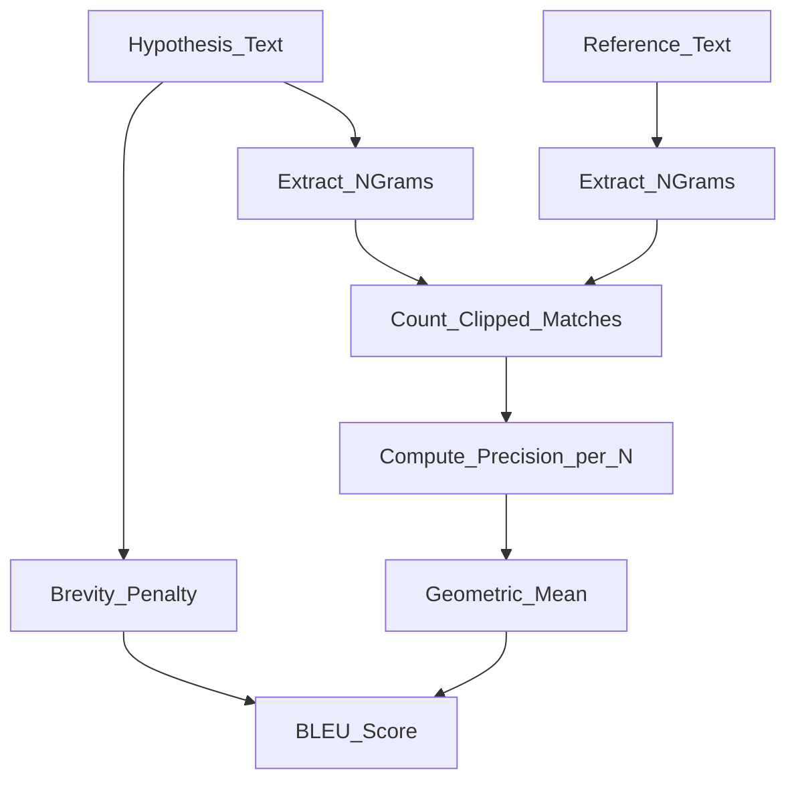

# 📏 NLP Evaluation Metrics

> [!abstract] TL;DR
> NLP evaluation metrics quantify how good a generated text is — from n-gram overlap (BLEU, ROUGE) to neural embedding similarity (BERTScore). No single automated metric perfectly correlates with human judgment; choose the metric that fits the task and always interpret it alongside human evaluation.

## Intuition — Analogy First

Imagine grading an essay. A teacher who only counts how many exact words from the answer key appear (BLEU) misses a well-phrased paraphrase. A teacher who reads the full essay and judges meaning (BERTScore) gives a fairer grade. But even the best automated grader can't fully replace a human examiner — that's the fundamental tension in NLP evaluation.

Each metric family trades off precision for practicality:
- **N-gram metrics** (BLEU, ROUGE, ChrF): fast, cheap, reproducible — but brittle to paraphrasing
- **Embedding metrics** (BERTScore, BLEURT): understand semantics — but opaque and slow
- **Human evaluation**: the gold standard — but expensive and hard to reproduce

## How It Works — Mechanics

### BLEU (Bilingual Evaluation Understudy)
Measures **precision** of n-gram overlap between hypothesis and reference(s), with a brevity penalty to discourage short outputs.



### ROUGE (Recall-Oriented Understudy for Gisting Evaluation)
Measures **recall** — how much of the reference appears in the hypothesis. Common variants:
- **ROUGE-N**: n-gram recall (ROUGE-1, ROUGE-2)
- **ROUGE-L**: longest common subsequence (respects word order)
- **ROUGE-S**: skip-bigram co-occurrence

### METEOR
Combines unigram precision/recall with alignment, stemming, synonym matching, and a penalty for fragmented matches. Better correlation with human judgments than BLEU.

### BERTScore
Uses contextual embeddings from a pretrained BERT model to compute token-level similarity. Each token in the hypothesis is matched to its nearest token in the reference by cosine similarity.

### ChrF (Character F-score)
F-score over character n-grams — particularly useful for morphologically rich languages and low-resource settings.

## The Math

**BLEU:**

$$\text{BLEU} = BP \times \exp\!\left(\sum_{n=1}^{N} w_n \log p_n\right)$$

where:
- $p_n = \frac{\text{clipped n-gram matches}}{\text{total n-grams in hypothesis}}$ is modified n-gram precision
- $w_n = \frac{1}{N}$ (uniform weights, $N=4$ by default)
- $BP = \min\!\left(1,\, e^{1 - r/c}\right)$ is the brevity penalty ($c$ = hypothesis length, $r$ = reference length)

**ROUGE-N recall:**
$$\text{ROUGE-N} = \frac{\sum_{\text{ref}} \sum_{n\text{-gram} \in \text{ref}} \text{Count}_\text{match}(n\text{-gram})}{\sum_{\text{ref}} \sum_{n\text{-gram} \in \text{ref}} \text{Count}(n\text{-gram})}$$

**BERTScore Precision / Recall / F1:**

$$P_\text{BERT} = \frac{1}{|\hat{y}|} \sum_{\hat{y}_j \in \hat{y}} \max_{y_i \in y} \mathbf{x}_{\hat{y}_j}^\top \mathbf{x}_{y_i}$$

$$R_\text{BERT} = \frac{1}{|y|} \sum_{y_i \in y} \max_{\hat{y}_j \in \hat{y}} \mathbf{x}_{\hat{y}_j}^\top \mathbf{x}_{y_i}$$

$$F_\text{BERT} = 2 \cdot \frac{P_\text{BERT} \cdot R_\text{BERT}}{P_\text{BERT} + R_\text{BERT}}$$

where $\mathbf{x}$ are L2-normalised BERT token embeddings.

## Code Demo

```python
# Install: pip install sacrebleu rouge-score bert-score

import sacrebleu
from rouge_score import rouge_scorer
from bert_score import score as bert_score

hypothesis = "The cat sat on the mat in the living room."
reference  = "A cat was sitting on a mat in the room."

# ----- BLEU (sacrebleu) -----
bleu = sacrebleu.corpus_bleu([hypothesis], [[reference]])
print(f"BLEU: {bleu.score:.2f}")  # 0–100 scale

# ----- ROUGE -----
scorer = rouge_scorer.RougeScorer(["rouge1", "rouge2", "rougeL"], use_stemmer=True)
scores = scorer.score(reference, hypothesis)
for k, v in scores.items():
    print(f"{k}: P={v.precision:.3f}  R={v.recall:.3f}  F={v.fmeasure:.3f}")

# ----- BERTScore -----
P, R, F1 = bert_score(
    [hypothesis], [reference],
    lang="en",
    model_type="microsoft/deberta-xlarge-mnli",
    verbose=False
)
print(f"BERTScore F1: {F1.mean().item():.4f}")

# ----- ChrF (sacrebleu) -----
chrf = sacrebleu.corpus_chrf([hypothesis], [[reference]])
print(f"ChrF: {chrf.score:.2f}")
```

## Real-World Example

**WMT Translation Evaluation**: The WMT shared task (Workshop on Machine Translation) evaluates translation systems annually. BLEU was the standard metric for 15+ years; WMT now reports COMET and human MQM judgments because BLEU correlates poorly with human judgments at the system level, especially for neural MT outputs.

**CNN/DailyMail Summarization**: The CNN/DailyMail dataset is the standard summarization benchmark. Papers report ROUGE-1, ROUGE-2, and ROUGE-L — but researchers have noted ROUGE-1 of 45 for extractive systems vs. 42 for abstractive ones, yet humans prefer abstractive summaries. BERTScore narrows this gap.

## Trade-offs

| Metric | Speed | Linguistic Depth | Human Correlation | Reference Needed | Notes |
|---|---|---|---|---|---|
| BLEU | Fast | Shallow (n-gram) | Low–Medium | Yes (1+) | Standard for MT; brittle |
| ROUGE-N | Fast | Shallow | Medium | Yes | Standard for summarization |
| ROUGE-L | Fast | Structural | Medium | Yes | Respects order via LCS |
| METEOR | Medium | Shallow+synonyms | Medium-High | Yes | Better for low-resource |
| ChrF | Fast | Character-level | Medium-High | Yes | Good for morphology |
| BERTScore | Slow | Semantic (BERT) | High | Yes | GPU needed; model-dependent |
| Human | Very Slow | Complete | Gold | Yes | Expensive, not reproducible |

## When to Use vs Avoid

**Use BLEU when:**
- Comparing MT systems on the same dataset as prior work (reproducibility)
- Quick sanity check during development

**Use ROUGE when:**
- Evaluating summarization (ROUGE-1/2/L is the field standard)
- You need lightweight recall-oriented evaluation

**Use BERTScore when:**
- Semantic equivalence matters more than surface overlap
- Evaluating paraphrase generation, dialogue, or QA outputs
- You have GPU compute available

**Avoid automated metrics alone when:**
- Evaluating open-ended generation (creative writing, chat)
- The task has no clear single correct answer
- System-level comparison with high stakes

## Common Pitfalls

1. **Comparing BLEU across datasets**: BLEU scores are not comparable across different test sets or tokenization schemes — always use SacreBLEU for reproducible tokenization.
2. **Treating ROUGE as absolute**: ROUGE-1 = 0.45 is meaningless without context; report it relative to a baseline.
3. **BERTScore model sensitivity**: The score changes depending on the base model (DeBERTa, RoBERTa, etc.) — always report which model was used.
4. **Single-reference evaluation**: BLEU and ROUGE dramatically underestimate quality when only one reference is used; collect multiple references when possible.
5. **Ignoring n-gram diversity**: High BLEU can coexist with degenerate repetitive output if n-gram precision is inflated.

## Related Concepts

- [[_MOC_Evaluation_Safety|↑ Section MOC]]

- [[LLM_Benchmarks]] — how benchmarks aggregate multiple metrics for holistic evaluation
- [[RAG_Evaluation]] — ROUGE and BERTScore adapted for retrieval-augmented generation
- [[GPT_Family]] — models whose outputs these metrics evaluate

## Review Questions

1. **Why does BLEU use a brevity penalty, and what happens when a system outputs very short translations?**
2. **BERTScore uses contextual embeddings instead of n-gram matching. What specific weakness of BLEU does this address, and what new failure mode does it introduce?**
3. **A summarization system achieves ROUGE-1 = 0.48 but human evaluators rate it poorly for coherence. How would you design a better evaluation protocol?**

## Sources

- Papineni et al. (2002). *BLEU: a Method for Automatic Evaluation of Machine Translation*. ACL.
- Lin (2004). *ROUGE: A Package for Automatic Evaluation of Summaries*. ACL Workshop.
- Zhang et al. (2020). *BERTScore: Evaluating Text Generation with BERT*. ICLR. [https://arxiv.org/abs/1904.09675](https://arxiv.org/abs/1904.09675)
- Popovic (2015). *chrF: character n-gram F-score for automatic MT evaluation*. WMT.
- Post (2018). *A Call for Clarity in Reporting BLEU Scores*. (SacreBLEU paper). WMT.

#evaluation #nlp #metrics #bleu #rouge #bertscore
