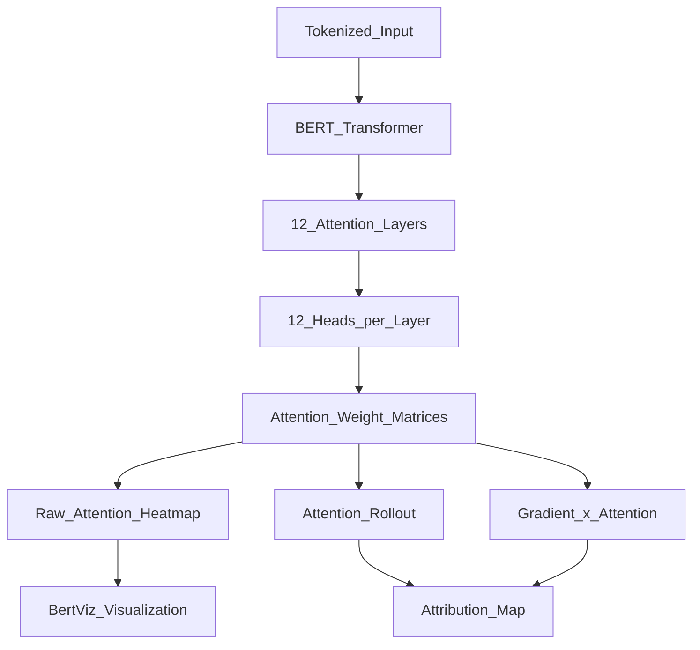

# 👁️ Attention Visualization

> [!abstract] TL;DR
> Attention visualization renders which input tokens a transformer attends to when producing each output token, using heatmaps over attention weight matrices. While intuitive, raw attention weights are **not** reliable explanations of model decisions — gradient-weighted or rollout methods give more faithful attribution.

## Intuition — Analogy First

When you read the sentence "The trophy didn't fit in the bag because **it** was too small", your brain resolves the pronoun "it" by attending back to relevant nouns (trophy? bag?). Humans decide it refers to "bag" — the smaller object.

Attention visualization makes a transformer's similar "gaze" visible: heatmaps show which previous tokens each new token is attending to. It's like turning on eye-tracking for the model's reading.

**But** — just as humans can look at irrelevant words while still understanding text, models can produce correct outputs even when attention patterns look "wrong". Attention weights measure where the model looks, not necessarily what it uses.

## How It Works — Mechanics



### Layer and Head Structure
A BERT-base model has:
- 12 transformer layers
- 12 attention heads per layer
- → 144 different attention patterns per input

Each head specialises in different linguistic phenomena:
- Some heads track syntactic dependencies (subject-verb agreement)
- Some track co-reference (pronoun → antecedent)
- Some attend to positional neighbors
- Some attend to special tokens ([SEP], [CLS])

### BertViz
An interactive tool for visualising BERT/GPT attention across all heads and layers:
- **Head view**: shows all heads for a selected layer
- **Model view**: heatmap over all layers simultaneously
- **Neuron view**: shows individual neurons feeding into attention computation

### Attention Rollout
Raw attention is computed at each layer, but information flows through all layers. **Attention rollout** (Abnar & Zuidema, 2020) computes the combined attention from input to output by recursively multiplying attention matrices (accounting for residual connections):

$$\tilde{A}^{(l)} = A^{(l)} \cdot \tilde{A}^{(l-1)} + I$$
$$\tilde{A}^{(l)} \leftarrow \tilde{A}^{(l)} / \text{rowsum}$$

### Gradient × Attention
More reliable than raw attention: scale attention weights by the gradient of the loss with respect to the attention. Features the model actually uses (high gradient) get higher attribution even if their raw attention weight is moderate.

### Probing Classifiers
Instead of visualising attention, train a simple linear classifier on a frozen layer's hidden states to test if the layer encodes a specific linguistic property (POS tags, parse tree depth, named entities). If the probe achieves high accuracy, the layer encodes that property.

## The Math

**Scaled Dot-Product Attention:**
$$\text{Attention}(Q, K, V) = \text{softmax}\!\left(\frac{QK^\top}{\sqrt{d_k}}\right) V$$

The softmax output $A = \text{softmax}(QK^\top / \sqrt{d_k})$ is the **attention weight matrix**, shape $(T_q \times T_k)$.

**Gradient × Attention attribution:**
$$\text{attr}(x_i) = \left|\frac{\partial f(x)}{\partial A_{ij}}\right| \cdot A_{ij}$$

summed over positions $j$ in the sequence.

**Attention Rollout (recursive formulation):**
$$R^{(l)} = \hat{A}^{(l)} \cdot R^{(l-1)}, \quad R^{(0)} = I$$

where $\hat{A}^{(l)} = \frac{1}{2} A^{(l)} + \frac{1}{2} I$ (residual connection contribution).

## Code Demo

```python
# pip install bertviz transformers torch seaborn

# ===== 1. BertViz — interactive attention visualization =====
from bertviz import head_view, model_view
from transformers import BertTokenizer, BertModel

tokenizer = BertTokenizer.from_pretrained("bert-base-uncased")
model = BertModel.from_pretrained("bert-base-uncased", output_attentions=True)
model.eval()

sentence = "The trophy didn't fit in the bag because it was too small."
inputs = tokenizer(sentence, return_tensors="pt")

import torch
with torch.no_grad():
    outputs = model(**inputs)

attention = outputs.attentions          # tuple of (1, 12, seq_len, seq_len) per layer
tokens    = tokenizer.convert_ids_to_tokens(inputs["input_ids"][0])

# Interactive visualization in Jupyter:
# head_view(attention, tokens)
# model_view(attention, tokens)

# ===== 2. Custom attention heatmap with seaborn =====
import seaborn as sns
import matplotlib.pyplot as plt
import numpy as np

# Visualise layer 11, head 3 (often captures long-range dependencies in BERT)
layer, head = 11, 3
attn_matrix = attention[layer][0, head].numpy()   # (seq_len, seq_len)

fig, ax = plt.subplots(figsize=(10, 8))
sns.heatmap(
    attn_matrix,
    xticklabels=tokens,
    yticklabels=tokens,
    ax=ax,
    cmap="Blues",
    annot=False,
    fmt=".2f",
)
ax.set_title(f"BERT Attention — Layer {layer+1}, Head {head+1}")
plt.xticks(rotation=45, ha="right")
plt.tight_layout()
plt.savefig("attention_heatmap.png", dpi=150)

# ===== 3. Attention Rollout =====
def attention_rollout(attentions: tuple) -> np.ndarray:
    """Compute attention rollout from all layers."""
    # attentions: tuple of (batch, heads, seq, seq) tensors
    rollout = None
    for layer_attn in attentions:
        # Average over heads, then add identity (residual)
        avg_attn = layer_attn[0].mean(dim=0).numpy()       # (seq, seq)
        residual = 0.5 * avg_attn + 0.5 * np.eye(avg_attn.shape[0])
        residual = residual / residual.sum(axis=-1, keepdims=True)
        if rollout is None:
            rollout = residual
        else:
            rollout = residual @ rollout
    return rollout

rollout = attention_rollout(attention)
# rollout[0] = attention from [CLS] to all tokens = "global" attribution
cls_attention = rollout[0]
print("CLS token attends most to:", tokens[cls_attention.argmax()])

# ===== 4. Probing classifier (POS tagging) =====
from sklearn.linear_model import LogisticRegression
from sklearn.metrics import accuracy_score
import torch

def get_layer_embeddings(texts: list[str], layer: int) -> np.ndarray:
    """Extract hidden states from a specific BERT layer."""
    all_embeddings = []
    for text in texts:
        inputs = tokenizer(text, return_tensors="pt")
        with torch.no_grad():
            outputs = model(**inputs, output_hidden_states=True)
        hidden = outputs.hidden_states[layer][0].numpy()  # (seq_len, 768)
        all_embeddings.append(hidden)
    return all_embeddings

# Train a linear probe for POS tags using layer-12 embeddings
# (Use NLTK or spaCy to get POS labels for your corpus)
# probe = LogisticRegression(max_iter=1000)
# probe.fit(train_embeddings, train_pos_labels)
# accuracy_score(test_pos_labels, probe.predict(test_embeddings))
```

## Real-World Example

**BERT's Learned Syntax (Clark et al. 2019)**: A systematic study of all 144 attention heads in BERT-base found:
- Head 8-10 attends to direct syntactic objects
- Head 7-6 attends to coreferent mentions
- Some heads track sentence structure (attending to the SEP token at clause boundaries)
- Several heads attend to syntactically related words across long distances

This analysis was done using probing classifiers and attention pattern analysis with BertViz, providing strong evidence that BERT learns linguistic structure without explicit supervision.

## Trade-offs

| Method | Speed | Faithfulness | Ease of Use | Scope |
|---|---|---|---|---|
| Raw attention | Fast | Low | Easy | Single layer/head |
| BertViz | Fast | Low | Easy | All layers/heads |
| Attention rollout | Medium | Medium | Medium | Cross-layer |
| Gradient × attention | Slow | Higher | Hard | Per-prediction |
| Probing classifier | Slow | Structural only | Medium | Global / representational |

## When to Use vs Avoid

**Use attention visualization when:**
- Debugging unexpected model behaviour (checking if the model "focuses" on relevant tokens)
- Communicating model workings to non-technical stakeholders (visual, intuitive)
- Exploratory analysis of what a model might have learned
- Teaching or educational contexts

**Use gradient × attention or rollout when:**
- You need more faithful attribution for model decisions
- Running formal interpretability analysis

**Avoid relying on raw attention as explanation when:**
- Making formal claims about what features caused a prediction
- Regulatory auditing (attention ≠ explanation; use SHAP or LIME)
- The task has long sequences (attention patterns become diffuse and hard to interpret)

## Common Pitfalls

1. **Attention is not explanation** (Jain & Wallace, 2019): High attention weight on a token does not imply that token is important for the prediction — adversarial attention patterns can produce the same output with very different attention weights.
2. **Multi-head averaging is misleading**: Averaging attention across heads collapses information; different heads specialise in different things — always visualise individual heads.
3. **[CLS] and [SEP] attention**: BERT heads frequently attend to these special tokens as a "no-op" — this is not meaningful and should not be interpreted as important.
4. **Layer selection bias**: Early layers track surface/positional patterns; later layers track semantics. Always specify which layer you're visualising.
5. **Causal vs encoder confusion**: Decoder-only (GPT-style) models use **causal** (masked) attention — cannot attend to future tokens. Ensure your visualization correctly shows only past-context attention.

## Related Concepts

- [[_MOC_Evaluation_Safety|↑ Section MOC]]

- [[SHAP]] — gradient-based, more faithful attribution method
- [[Transformer_Architecture]] — the Q/K/V mechanism behind attention weights
- [[BERT]] — primary model studied through attention visualization

## Review Questions

1. **Jain & Wallace (2019) showed that "attention is not explanation." Describe an experiment that demonstrates raw attention weights are not faithful explanations, and what this means practically for interpretability.**
2. **Attention rollout multiplies attention matrices across layers. What is the purpose of adding the identity matrix (residual connection) at each step, and what does the final rollout matrix represent?**
3. **You observe that BERT head 7-3 consistently shows high attention from pronouns to their antecedents. How would you rigorously test whether this head is causally responsible for co-reference resolution, beyond just visualising attention patterns?**

## Sources

- Clark et al. (2019). *What Does BERT Look at? An Analysis of BERT's Attention*. BlackboxNLP. [https://arxiv.org/abs/1906.04341](https://arxiv.org/abs/1906.04341)
- Jain & Wallace (2019). *Attention is not Explanation*. NAACL. [https://arxiv.org/abs/1902.10186](https://arxiv.org/abs/1902.10186)
- Abnar & Zuidema (2020). *Quantifying Attention Flow in Transformers* (Attention Rollout). ACL. [https://arxiv.org/abs/2005.00928](https://arxiv.org/abs/2005.00928)
- Vig (2019). *A Multiscale Visualization of Attention in the Transformer Model* (BertViz). ACL Workshop. [https://arxiv.org/abs/1906.05714](https://arxiv.org/abs/1906.05714)
- BertViz: [https://github.com/jessevig/bertviz](https://github.com/jessevig/bertviz)

#interpretability #attention #transformers #visualization #bertviz
