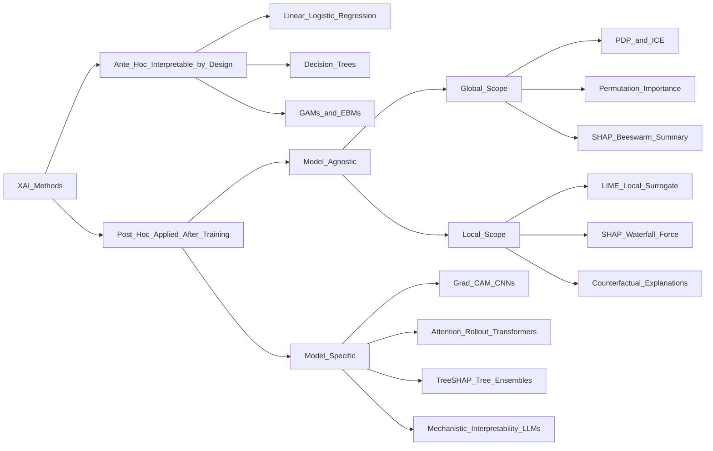

# 🔬 Explainable AI (XAI)

> [!abstract] TL;DR
> Explainable AI (XAI) is the field of methods that make ML model predictions understandable to humans — spanning inherently interpretable models (decision trees, linear regression), post-hoc attribution tools (SHAP, LIME, Grad-CAM), and mechanistic research. XAI is now a legal requirement (GDPR, EU AI Act) for high-stakes automated decisions and a prerequisite for detecting bias, debugging failures, and building trustworthy systems.

---

## Intuition — Analogy First

**Analogy:** Imagine two doctors. The first says, "You have cancer — you need surgery immediately." The second says, "Your PSA is 18 (elevated), your Gleason score is 7 (moderately aggressive), and your biopsy shows pattern 4+3 — this meets the standard-of-care threshold for surgery." The first doctor may be equally skilled, but only the second gives you — and a review board — something to interrogate, audit, and challenge.

ML models are the first doctor by default. XAI transforms them into the second: systems that surface their reasoning so humans can verify it, correct it, and hold it accountable. Without explainability, a model's accuracy on a test set gives no guarantee it is reasoning correctly — it may have learned that a metal ruler in the corner of an X-ray (a medical imaging artifact) predicts pneumonia, not the lung tissue itself.

**Why XAI matters in practice:**
- **Trust and adoption**: clinicians, judges, and loan officers adopt AI-assisted decisions far more often when explanations align with their domain knowledge
- **Debugging**: SHAP reveals that a churn model is predicting based on call-centre hold time, not actual product satisfaction — a fixable data artifact
- **Regulatory compliance**: GDPR Article 22 (right not to be subject to solely automated decisions) and the EU AI Act mandate explanations for high-risk AI (credit, hiring, healthcare, law enforcement)
- **Bias detection**: SHAP attribution shows that "postcode" drives loan rejections for one demographic group — a proxy for race
- **Safety**: understanding what a model uses is a prerequisite for understanding what it might do wrong

---

## How It Works — Mechanics

### Interpretability vs Explainability

These terms are often conflated but mean different things:

| Term | Definition | Example |
|------|-----------|---------|
| **Interpretability** | A model whose internal mechanism can be directly understood by a human | A 5-node decision tree: read the if-then rules |
| **Explainability** | A post-hoc account of a black-box model's output, without changing the model | SHAP waterfall plot for an XGBoost prediction |
| **Ante-hoc (intrinsic)** | Interpretable by design — constraints baked in at training time | Linear regression, decision trees, GAMs |
| **Post-hoc** | Explanation applied after training; leaves model weights unchanged | LIME, SHAP, Grad-CAM, attention rollout |

A **linear regression** is interpretable: its coefficient for `age` tells you directly how a one-unit increase affects the predicted output. An **XGBoost model** with 500 trees is not interpretable, but it can be explained post-hoc using SHAP.

### Taxonomy of XAI Methods

Three orthogonal axes classify every XAI method:

| Axis | Options | Key Distinction |
|------|---------|----------------|
| **Scope** | Global vs Local | Global: model behaviour across all inputs; Local: one specific prediction |
| **Model dependency** | Model-agnostic vs Model-specific | Agnostic: treats model as a black box; Specific: exploits architecture |
| **Stage** | Ante-hoc vs Post-hoc | Ante-hoc: interpretable by design; Post-hoc: explain after training |

SHAP is post-hoc, model-agnostic (KernelSHAP) or model-specific (TreeSHAP), and covers both global and local scope — which is why it dominates in practice.

### Post-Hoc Model-Agnostic Methods

**SHAP (SHapley Additive exPlanations)**
- Based on cooperative game theory: each feature's contribution is its average marginal contribution across all possible feature orderings
- Guarantees: $f(x) = \phi_0 + \sum_{i=1}^p \phi_i$ — values always sum to prediction minus baseline (efficiency axiom)
- **Global use**: beeswarm/summary plots rank features by mean absolute SHAP value across the dataset
- **Local use**: waterfall and force plots show per-prediction breakdown from baseline to output
- TreeSHAP computes exact Shapley values for tree models in polynomial time; KernelSHAP is approximate and model-agnostic
- Industry standard for regulated ML — see [[SHAP]]

**LIME (Local Interpretable Model-Agnostic Explanations)**
- Fits a local linear model around a single prediction by perturbing the input and sampling model responses
- Works for tabular (feature perturbation), text (word removal), and image (superpixel masking) data
- Local only; stochastic — results vary between runs with the same parameters
- Fast, visual, and works across modalities — see [[LIME]]

**Partial Dependence Plots (PDP)**
- Shows the marginal effect of one (or two) features on predicted output, averaged across all other features
- Global scope; reveals learned relationship shape (linear? monotone? U-shaped?)
- Assumes feature independence — misleading when features are highly correlated

**Individual Conditional Expectation (ICE)**
- Like PDP but draws one line per data point instead of averaging
- Uncovers heterogeneous effects that PDP averages out (e.g., age matters positively for some subgroups and negatively for others)
- Centered ICE (c-ICE) subtracts the value at a reference point to show relative change

**Permutation Importance**
- Shuffles one feature's values and measures the resulting drop in model performance
- Global, model-agnostic, and captures both linear and non-linear effects
- Biased upward for correlated features (shuffling one leaves the other intact, so the effect is underestimated)

### Post-Hoc Model-Specific Methods

**Grad-CAM (Gradient-weighted Class Activation Mapping)** — for CNNs
- Computes the gradient of the class score with respect to the last convolutional feature map
- Each feature map $k$ gets a weight $\alpha_k^c = \frac{1}{Z}\sum_{i,j} \frac{\partial y^c}{\partial A^k_{ij}}$ (global average pooling of gradients)
- Final heatmap: $L_c^{\text{Grad-CAM}} = \text{ReLU}\!\left(\sum_k \alpha_k^c A^k\right)$
- Produces a coarse spatial heatmap of which image regions drove the prediction
- **Saliency maps** (plain gradient $\partial y / \partial x_{\text{pixel}}$) are faster but noisier; Grad-CAM++ is more accurate for multi-object scenes

**Attention Visualization** — for Transformers
- Raw attention weights visualise which tokens attend to which — intuitive but not reliably faithful
- Attention rollout propagates attention recursively through all layers with residual corrections
- Gradient × attention weights raw attention by how much the loss changes with respect to each attention weight — more faithful
- Critical caveat: **attention is not explanation** (Jain & Wallace, 2019) — see [[Attention_Visualization]]

**TreeSHAP** — for tree ensembles
- Exploits the recursive structure of decision trees to compute exact Shapley values in $O(TLD^2)$ time (T = trees, L = leaves, D = depth), versus exponential time for exact Shapley computation
- The gold standard for XGBoost, LightGBM, Random Forest, and sklearn tree models

### Inherently Interpretable Models

Some models are interpretable by construction — no post-hoc explanation needed:

| Model | Interpretable Element | Limitation |
|-------|-----------------------|------------|
| [[Linear_Regression]] | Coefficient $\beta_i$ = change in output per unit increase in $x_i$ | Only captures linear relationships |
| [[Logistic_Regression]] | Log-odds: $\log\frac{p}{1-p} = \beta_0 + \sum \beta_i x_i$; odds ratio = $e^{\beta_i}$ | Linear in log-odds only |
| [[Decision_Trees]] | Follow the if-then path from root to leaf; each split is a readable rule | Deep trees (>5 levels) become unreadable |
| GAMs (Generalized Additive Models) | $g(\mu) = \beta_0 + f_1(x_1) + f_2(x_2) + \ldots$ — each $f_j$ plotted as a curve | No interaction terms; misses feature correlations |
| Rule-based systems | Explicit IF-THEN-ELSE rules | Manual engineering; poor scalability |

**GAMs** occupy the sweet spot between power and interpretability: each feature's effect is a non-linear shape function that can be plotted and inspected, but there are no interaction terms to hide anything. The **Explainable Boosting Machine (EBM)** from Microsoft's `interpret` library is a modern boosted GAM that achieves near-tree-ensemble accuracy while remaining fully interpretable.

### XAI for LLMs

Large language models introduce interpretability challenges at a different scale — standard SHAP/LIME are too expensive for token-level attribution over billion-parameter models.

**Chain-of-Thought (CoT) as Explanation**
- Prompting the LLM to reason step-by-step ("Let's think step by step") produces human-readable intermediate steps
- **Faithfulness problem**: the CoT may not reflect the actual internal computation. A model can produce a plausible-sounding chain of reasoning that contradicts the actual mechanism that produced the final token. CoT is a structured output technique, not a reliable causal explanation — see [[Chain_of_Thought]]
- Unfaithful CoT is detectable: if you force incorrect reasoning in the scratchpad, the final answer often still changes — revealing the model was using the scratchpad

**Attention Rollout**
- Propagates attention matrices through all layers (see [[Attention_Visualization]])
- Cheap and gives a global view of which input tokens influenced the final prediction
- Limited faithfulness; use gradient × attention for higher confidence

**Mechanistic Interpretability**
- Research programme aiming to reverse-engineer neural network computations into human-understandable algorithms
- **Features**: individual neurons or linear directions in activation space that correspond to semantic concepts (the "banana" direction in a vision model; the "Paris" direction in a language model)
- **Circuits**: subgraphs of neurons that implement a specific capability (Elhage et al. identified the "indirect object identification" circuit in GPT-2 — a 3-component circuit that correctly completes "John gave Mary the ball. Mary gave it to ___")
- **Superposition**: models encode more features than they have neurons by representing multiple concepts in overlapping directions — makes interpretability harder and individual neurons polysemantic
- **Sparse Autoencoders (SAEs)**: train a sparse autoencoder on layer activations to extract near-monosemantic features from superposition; active research frontier (Anthropic, DeepMind, EleutherAI)
- Tools: TransformerLens (Neel Nanda), Neuroscope, SAELens

**Probing Classifiers**
- Train a lightweight linear classifier on frozen layer hidden states to test whether the layer encodes a specific property (POS tags, named entities, factual knowledge)
- High probe accuracy → the representation encodes the property
- Caveat: proves accessibility, not usage — the model may not actually use the property in its final prediction

### Counterfactual Explanations

"What is the minimal change to the input that would flip the prediction?"

A loan applicant denied credit receives: *"If your annual income were $5,000 higher and your debt-to-income ratio were 0.05 lower, your application would be approved."* This is more actionable than feature importance because it gives the user a path to recourse.

Properties of a good counterfactual:
- **Validity**: actually flips the prediction
- **Proximity**: small distance from the original input (few, small changes)
- **Sparsity**: modifies as few features as possible
- **Plausibility**: the counterfactual lies in a realistic, data-manifold-consistent region

Methods: **DiCE** (Diverse Counterfactual Explanations — generates multiple valid counterfactuals covering different paths to recourse), **Wachter et al.** (gradient-based minimisation with a proximity regulariser).

### Concept-Based Explanations (TCAV)

**TCAV (Testing with Concept Activation Vectors)** — Kim et al. (2018)

Instead of asking "which feature?" TCAV asks "which human-defined concept does this model use?"

Procedure:
1. Collect positive examples and counter-examples of a concept (e.g., "stripiness" for a zebra classifier, using images of striped objects vs non-striped)
2. Train a linear probe in layer $l$'s activation space separating positive from negative examples → the decision boundary normal vector is the **Concept Activation Vector** $v_C^l$
3. Compute the **TCAV score**: fraction of inputs of class $c$ for which $\nabla_{h_l} f_c(x) \cdot v_C^l > 0$ (gradient points in the concept direction)
4. Test statistical significance with random CAV baselines

High TCAV score → the model uses this concept when predicting this class. A skin-lesion classifier with high TCAV score for "ruler" (a medical imaging artifact) is learning the wrong signal — clinics that put rulers in images of melanomas have inadvertently labelled rulers as cancer.

### XAI in Production

**Explanation APIs**: Azure ML Responsible AI Dashboard, AWS SageMaker Clarify, Google Vertex AI Explainable AI, and Seldon Alibi all serve SHAP-based explanations alongside model predictions at inference time. Latency overhead: TreeSHAP ~1-5ms; KernelSHAP 100ms–seconds per prediction.

**Explanation Logging**: store feature attributions alongside predictions in the prediction log. This enables:
- **Regulatory audit**: reconstruct the exact reasoning behind a specific past decision
- **Explanation drift**: if the distribution of top SHAP features shifts over time, the model is responding to distribution shift in the input data
- **Anomaly detection**: predictions with unusual SHAP patterns (features never important before suddenly dominant) may indicate data quality issues or adversarial inputs

**Model Cards and Regulators**: [[Model_Cards]] are the structured disclosure artefact for communicating model behaviour, performance disaggregated by demographic subgroup, limitations, and XAI findings to regulators, customers, and deployment teams. The EU AI Act Article 13 mandates transparency documentation including explanation capability for high-risk AI systems. GDPR Article 22 gives EU residents the right to a "meaningful explanation" for automated decisions with significant effects.

---

### Method Taxonomy



---

## Code Demo

```python
# pip install shap lime scikit-learn xgboost pandas matplotlib numpy

import shap
import lime
import lime.lime_tabular
import numpy as np
import pandas as pd
import matplotlib.pyplot as plt
import xgboost as xgb
from sklearn.datasets import load_breast_cancer
from sklearn.model_selection import train_test_split

# ---------- Data and black-box model ----------
data = load_breast_cancer()
X = pd.DataFrame(data.data, columns=data.feature_names)
y = data.target

X_train, X_test, y_train, y_test = train_test_split(X, y, test_size=0.2, random_state=42)

model = xgb.XGBClassifier(n_estimators=100, max_depth=4, random_state=42, eval_metric="logloss")
model.fit(X_train, y_train, verbose=False)
print(f"Test accuracy: {model.score(X_test, y_test):.3f}")

# ================================================================
# 1. SHAP — TreeSHAP: exact global + local explanations
# ================================================================
shap_explainer = shap.TreeExplainer(model)
shap_values = shap_explainer(X_test)        # shape: (n_test, n_features)

# Global: which features matter most across the whole test set?
shap.summary_plot(shap_values, X_test, plot_type="bar", show=False)
plt.title("SHAP: Global Feature Importance (Mean |SHAP value|)")
plt.tight_layout()
plt.savefig("shap_global.png", dpi=120)
plt.close()

# Local: waterfall plot explaining instance 0
shap.plots.waterfall(shap_values[0], show=False)
plt.tight_layout()
plt.savefig("shap_waterfall_i0.png", dpi=120)
plt.close()

# Verify the SHAP efficiency axiom: phi_0 + sum(phi_i) = f(x)
pred_prob = model.predict_proba(X_test.iloc[[0]])[0, 1]
shap_reconstructed = shap_values.values[0].sum() + shap_values.base_values[0]
print(f"\nPrediction (prob class 1): {pred_prob:.4f}")
print(f"SHAP sum + baseline:       {shap_reconstructed:.4f}")   # should match

# Top-5 features for instance 0 (by absolute SHAP value)
shap_series = pd.Series(shap_values.values[0], index=X_test.columns)
top5_idx = shap_series.abs().nlargest(5).index
print("\nTop-5 SHAP features for instance 0:")
for feat in top5_idx:
    print(f"  {feat:<35} phi = {shap_series[feat]:+.4f}")

# ================================================================
# 2. LIME — local linear surrogate explanation
# ================================================================
lime_explainer = lime.lime_tabular.LimeTabularExplainer(
    training_data=X_train.values,
    feature_names=list(X_train.columns),
    class_names=data.target_names.tolist(),
    mode="classification",
    discretize_continuous=True,
    random_state=42,
)

instance = X_test.iloc[0].values
lime_exp = lime_explainer.explain_instance(
    data_row=instance,
    predict_fn=model.predict_proba,
    num_features=8,        # top-8 features in local linear model
    num_samples=5000,      # more samples = more stable LIME
)

print("\nLIME top feature contributions (local linear model, instance 0):")
for condition, weight in lime_exp.as_list():
    print(f"  {condition:<45}: {weight:+.4f}")

lime_exp.save_to_file("lime_i0.html")      # interactive HTML explanation

# ================================================================
# 3. Side-by-side comparison: where do SHAP and LIME agree?
# ================================================================
shap_top5 = list(top5_idx)
lime_top5 = [cond for cond, _ in lime_exp.as_list()[:5]]

print("\n--- SHAP top-5 features ---")
for f in shap_top5:
    print(f"  {f}")

print("\n--- LIME top-5 conditions (discretised) ---")
for c in lime_top5:
    print(f"  {c}")

# Note: SHAP and LIME should agree on which features matter (different scale/representation).
# If top features diverge significantly, investigate using larger num_samples in LIME.
```

---

## Real-World Example

> **Example: COMPAS Recidivism Algorithm (ProPublica, 2016)**
> COMPAS was a proprietary black-box ML model used in US criminal courts to predict recidivism risk and inform bail and sentencing decisions. ProPublica's investigation found it was twice as likely to falsely flag Black defendants as high-risk compared to white defendants. Because COMPAS provided no feature-level explanations, defendants and defence lawyers had no means to identify or challenge the source of bias in court.
>
> This case became the catalyst for XAI regulation: GDPR Article 22 (right to explanation for automated decisions), the EU AI Act's transparency requirements for high-risk AI, and a wave of US state-level algorithmic accountability legislation all trace back to cases like COMPAS. The recommended modern alternative: an XGBoost model with SHAP explanations for each prediction (showing which factors drove the score) and counterfactual explanations ("if your charge were a misdemeanor and you had no prior juvenile offenses, your risk score would be low") — satisfying both audit and recourse requirements.

---

## Trade-offs

| Method | Scope | Model Agnostic | Faithfulness | Speed | Theoretical Grounding |
|--------|-------|----------------|-------------|-------|-----------------------|
| SHAP (TreeSHAP) | Global + Local | Trees only | Exact (Shapley axioms) | Fast (poly time) | Strongest: game theory axioms |
| SHAP (KernelSHAP) | Global + Local | Yes | Approximate | Slow (sampling) | Strong: Shapley axioms |
| LIME | Local only | Yes | Heuristic, unstable | Medium | Weak: no formal guarantees |
| PDP / ICE | Global | Yes | Good (marginal effect) | Fast | Moderate |
| Permutation Importance | Global | Yes | Good | Fast | Moderate |
| Grad-CAM | Local (spatial) | No (CNNs) | Medium (gradient-based) | Fast | Medium |
| Attention Visualization | Local + Global | No (Transformers) | Low (attention != explanation) | Fast | Weak |
| Mechanistic Interpretability | Global (circuits) | No (LLMs/NNs) | High (causal circuits) | Very slow (research) | Strong but incomplete |

---

## When to Use vs Avoid

**Use XAI when:**
- Deploying in a regulated domain (credit, healthcare, hiring, law enforcement) where decisions must be auditable and explained
- Debugging a model that underperforms on a subgroup — SHAP beeswarm reveals which features the model over-relies on
- Detecting proxy discrimination: permutation importance or SHAP reveals that "postcode" is the top feature in a hiring model (proxy for protected attribute)
- Communicating model behaviour to non-technical stakeholders or regulators (visualisations over raw metrics)
- Building a human-in-the-loop system: clinicians, loan officers, and judges need to understand a recommendation to effectively override it

**Avoid or be cautious when:**
- Treating any explanation as ground truth — SHAP, LIME, and Grad-CAM are all approximations or proxies
- Using raw attention weights as a faithful explanation for regulatory purposes
- Relying on LIME for high-stakes audit (its instability makes it unsuitable as a primary accountability mechanism)
- Using SHAP values to make causal claims: high SHAP value means the feature correlates with the prediction, not that it caused the outcome
- Choosing interpretable models purely for auditability if they are significantly less accurate — a less accurate but interpretable model may cause more harm

---

## Common Pitfalls

- **Attention is not explanation** — Jain & Wallace (2019) showed that adversarially perturbing attention weights without changing the model's prediction is possible, proving raw attention cannot be a faithful explanation. Always use gradient-weighted attention or SHAP for formal attribution.
- **LIME instability** — LIME's stochastic perturbation means running it twice on the same instance with identical parameters can produce different top features. Use `num_samples >= 5000`, fix `random_state`, and average across multiple runs before reporting critical explanations.
- **SHAP feature independence assumption** — KernelSHAP marginalises features using the marginal distribution (treating features as independent). When features are highly correlated, SHAP distributes credit among them in potentially misleading ways. Use TreeSHAP with `feature_perturbation="tree_path_dependent"` (conditional SHAP) for correlated-feature settings.
- **Confusing explanation with causation** — a SHAP value shows that "age" pushed a prediction up; it does not show that changing a person's age would change their outcome. SHAP is observational, not interventional. For causal attribution, use causal inference methods alongside SHAP.
- **Faithfulness of chain-of-thought** — LLM CoT reasoning can sound plausible while contradicting the actual internal mechanism. Faithful CoT is an open research problem; do not use CoT as a regulatory explanation without additional validation.
- **Interpretable model as afterthought** — if a GAM is chosen over XGBoost solely for interpretability but has 12% lower accuracy in a medical triage setting, the interpretability gain does not outweigh the harm. Quantify the accuracy-interpretability tradeoff explicitly before committing.
- **Global explanations hide local failures** — permutation importance shows feature X is globally unimportant, but for a specific demographic subgroup it may be the dominant driver. Always supplement global explanations with local SHAP analysis for vulnerable subgroups.

---

## Related Concepts

- [[_MOC_Evaluation_Safety|Section MOC]]

- [[SHAP]] — game-theoretic feature attribution with exact Shapley values; the primary XAI tool for tree models and the industry standard for regulated ML
- [[LIME]] — local linear surrogate explanations; model-agnostic and supports tabular, text, and image data
- [[Attention_Visualization]] — inspecting transformer attention weights; qualitative interpretability for sequence models with important faithfulness caveats
- [[Responsible_AI]] — governance frameworks, GDPR, EU AI Act, and organisational practices that create the legal and ethical mandate for XAI
- [[AI_Bias_and_Fairness]] — SHAP attribution and permutation importance are the primary tools for detecting which model features proxy for protected attributes
- [[Red_Teaming]] — adversarial testing that complements XAI; explanations reveal what a model uses, red teaming reveals what it does in edge cases and adversarial conditions
- [[Adversarial_Robustness]] — explanation methods can surface fragile input dependencies (e.g., SHAP shows the model relies on background pixels), flagging robustness risks
- [[Decision_Trees]] — the canonical ante-hoc interpretable model; human-readable if-then rules with no post-hoc method required
- [[Linear_Regression]] — the simplest interpretable model; regression coefficients are direct feature importances with statistical significance tests
- [[Logistic_Regression]] — ante-hoc interpretable classifier; log-odds coefficients and odds ratios give per-feature effect sizes interpretable to domain experts
- [[Model_Cards]] — structured disclosure artefact for communicating XAI findings, disaggregated performance, and limitations to regulators and deployment teams
- [[Chain_of_Thought]] — prompting technique that elicits step-by-step LLM reasoning; used as a proxy for explainability despite known faithfulness limitations

---

## Review Questions

1. **A bank deploys an XGBoost loan-approval model in the EU. A customer denied credit invokes their GDPR Article 22 right to explanation. Which XAI method would you use, what exact output would you present to satisfy the legal requirement, and how would you verify the explanation is faithful to the model's actual computation?**
2. **You compute SHAP values and find that "postcode" has the highest positive SHAP value for loan default predictions, followed by "annual income." Your LIME explanation for the same instance shows "postcode in [SW1, SW3]" as the top condition. What does this combination of signals tell you, and what fairness analysis would you run next?**
3. **A team is deciding between: (a) XGBoost + SHAP post-hoc explanations, or (b) an Explainable Boosting Machine (GAM). The GAM has 4% lower AUC. What factors determine which option is better, and are there domains where the 4% accuracy cost is clearly worth paying for ante-hoc interpretability?**

---

## Sources

- Ribeiro et al. (2016). *"Why Should I Trust You?": Explaining the Predictions of Any Classifier* (LIME). KDD. [https://arxiv.org/abs/1602.04938](https://arxiv.org/abs/1602.04938)
- Lundberg & Lee (2017). *A Unified Approach to Interpreting Model Predictions* (SHAP). NeurIPS. [https://arxiv.org/abs/1705.07874](https://arxiv.org/abs/1705.07874)
- Jain & Wallace (2019). *Attention is not Explanation*. NAACL. [https://arxiv.org/abs/1902.10186](https://arxiv.org/abs/1902.10186)
- Kim et al. (2018). *Interpretability Beyond Classification Output: Quantitative Testing with Concept Activation Vectors (TCAV)*. ICML. [https://arxiv.org/abs/1711.11279](https://arxiv.org/abs/1711.11279)
- Selvaraju et al. (2017). *Grad-CAM: Visual Explanations from Deep Networks via Gradient-based Localization*. ICCV. [https://arxiv.org/abs/1610.02391](https://arxiv.org/abs/1610.02391)
- Elhage et al. (2021). *A Mathematical Framework for Transformer Circuits*. Transformer Circuits Thread. [https://transformer-circuits.pub/2021/framework/index.html](https://transformer-circuits.pub/2021/framework/index.html)
- Anthropic (2023). *Towards Monosemanticity: Decomposing Language Models With Dictionary Learning*. [https://transformer-circuits.pub/2023/monosemanticity/index.html](https://transformer-circuits.pub/2023/monosemanticity/index.html)
- Wachter et al. (2017). *Counterfactual Explanations Without Opening the Black Box: Automated Decisions and the GDPR*. Harvard JOLT. [https://arxiv.org/abs/1711.00399](https://arxiv.org/abs/1711.00399)
- Molnar, C. (2022). *Interpretable Machine Learning* (2nd ed.). [https://christophm.github.io/interpretable-ml-book/](https://christophm.github.io/interpretable-ml-book/)
- EU AI Act (2024). [https://artificialintelligenceact.eu](https://artificialintelligenceact.eu)

#interpretability #xai #explainability #responsible-ai #shap #lime #grad-cam #mechanistic-interpretability #ante-hoc #post-hoc
