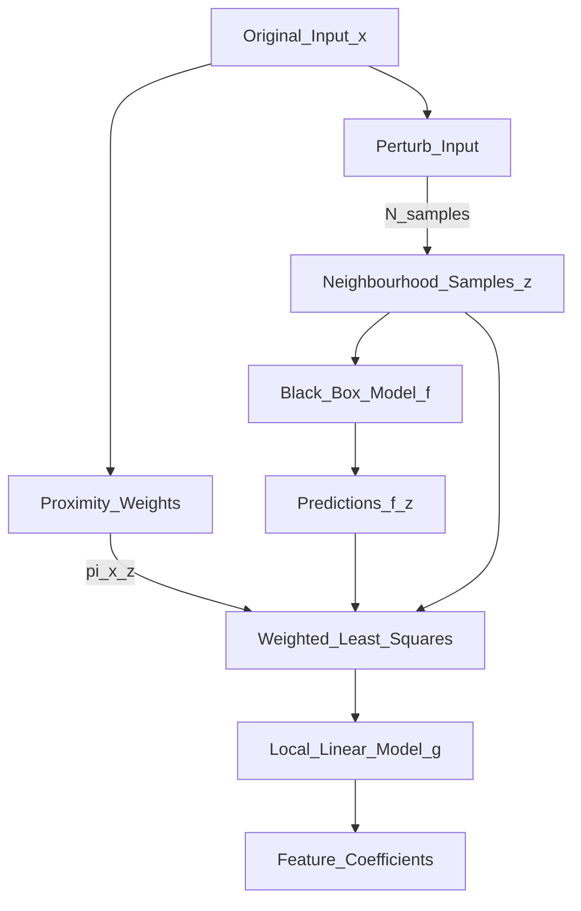

# 🔎 LIME — Local Interpretable Model-agnostic Explanations

> [!abstract] TL;DR
> LIME explains a single prediction by fitting a simple interpretable model (linear regression) locally around that input, using perturbed samples weighted by proximity. It is model-agnostic and works for tabular, image, and text data, but explanations can be unstable across runs.

## Intuition — Analogy First

Imagine a very complex function — say, the shape of a mountain range. Globally, it's impossible to describe with a simple equation. But **locally, near any specific point, the terrain is approximately flat** — describable by a plane (linear model).

LIME does exactly this:
1. Pick the point you want to explain (your prediction)
2. "Perturb" the input — generate many nearby points by randomly turning features on/off
3. Ask the black-box model what it predicts for each nearby point
4. Fit a simple linear model to these neighbourhood points, weighted by their distance from the original
5. The linear model's coefficients = "feature importances" for this specific prediction

Key insight: you're not approximating the model globally — only locally around this one prediction. Hence **Local** Interpretable Model-Agnostic Explanations.

## How It Works — Mechanics



### Modality-specific perturbation

**Tabular data:**
- Sample around the instance by perturbing feature values (replace with training set values drawn from each feature's marginal distribution)
- Proximity weight: $\pi_x(z) = \exp(-D(x, z)^2 / \sigma^2)$ where $D$ is Euclidean distance in the normalised feature space

**Text data:**
- Represent input as a binary vector of word presence/absence
- Perturb by randomly removing words
- Fit linear model over word indicators → coefficient = importance of each word

**Image data:**
- Segment image into superpixels (contiguous regions of similar colour/texture)
- Represent as binary vector of superpixel presence/absence
- Perturb by "graying out" random superpixels
- Fit linear model → important superpixels highlighted

### Selecting the Explanation Size
The number of features in the local model is controlled by `num_features`. Too many → noisy; too few → missing important factors.

## The Math

LIME finds the locally-faithful explanation $g$ by solving:

$$\xi(x) = \arg\min_{g \in G} \mathcal{L}(f, g, \pi_x) + \Omega(g)$$

where:
- $f$ = black-box model, $g \in G$ = interpretable model family (e.g., sparse linear)
- $\pi_x(z)$ = proximity measure (weight of perturbed sample $z$ near $x$)
- $\mathcal{L}$ = fidelity loss: how well $g$ approximates $f$ in the neighbourhood
- $\Omega(g)$ = complexity penalty (e.g., number of non-zero coefficients)

Concretely, $\mathcal{L}$ is a **weighted least squares** objective:

$$\mathcal{L}(f, g, \pi_x) = \sum_{z, z' \in Z} \pi_x(z) \left(f(z) - g(z')\right)^2$$

where $z'$ is the interpretable representation of perturbed sample $z$.

**Proximity weight** (exponential kernel):
$$\pi_x(z) = \exp\!\left(-\frac{D(x, z)^2}{\sigma^2}\right)$$

## Code Demo

```python
# pip install lime scikit-learn numpy matplotlib

import numpy as np
from sklearn.ensemble import RandomForestClassifier
from sklearn.datasets import load_breast_cancer
from sklearn.model_selection import train_test_split
import lime
import lime.lime_tabular
import lime.lime_text
import lime.lime_image

# ===== 1. Tabular LIME =====
data = load_breast_cancer()
X, y = data.data, data.target
feature_names = data.feature_names
class_names = data.target_names

X_train, X_test, y_train, y_test = train_test_split(X, y, test_size=0.2, random_state=42)

model = RandomForestClassifier(n_estimators=100, random_state=42)
model.fit(X_train, y_train)

# Create LIME tabular explainer
explainer = lime.lime_tabular.LimeTabularExplainer(
    training_data=X_train,
    feature_names=feature_names,
    class_names=class_names,
    mode="classification",
    discretize_continuous=True,
)

# Explain a single prediction
instance = X_test[0]
explanation = explainer.explain_instance(
    data_row=instance,
    predict_fn=model.predict_proba,
    num_features=10,       # show top 10 features
    num_samples=5000,      # number of perturbed samples
)

# Display
print(f"Predicted class: {class_names[model.predict([instance])[0]]}")
print(f"Prediction probability: {model.predict_proba([instance])[0]}")
print("\nTop feature contributions:")
for feature, weight in explanation.as_list():
    print(f"  {feature}: {weight:+.4f}")

# Save as HTML for interactive viewing
explanation.save_to_file("lime_explanation.html")

# ===== 2. Text LIME =====
from sklearn.pipeline import make_pipeline
from sklearn.feature_extraction.text import TfidfVectorizer
from sklearn.linear_model import LogisticRegression
from sklearn.datasets import fetch_20newsgroups
import lime.lime_text

categories = ["sci.space", "rec.sport.hockey"]
newsgroups_train = fetch_20newsgroups(subset="train", categories=categories)
newsgroups_test  = fetch_20newsgroups(subset="test",  categories=categories)

pipeline = make_pipeline(TfidfVectorizer(), LogisticRegression(max_iter=1000))
pipeline.fit(newsgroups_train.data, newsgroups_train.target)

text_explainer = lime.lime_text.LimeTextExplainer(class_names=categories)
text_explanation = text_explainer.explain_instance(
    newsgroups_test.data[0],
    pipeline.predict_proba,
    num_features=10,
)

print("\nText LIME top words:")
for word, weight in text_explanation.as_list():
    print(f"  '{word}': {weight:+.4f}")

# ===== 3. Image LIME =====
from PIL import Image
from lime.lime_image import LimeImageExplainer

# Requires a model that accepts numpy images
def image_predict_fn(images: np.ndarray) -> np.ndarray:
    # Placeholder: replace with your model.predict
    return np.random.dirichlet(np.ones(2), size=len(images))

image_explainer = LimeImageExplainer()
img = np.array(Image.open("example.jpg").resize((224, 224)))  # H x W x 3

image_explanation = image_explainer.explain_instance(
    img,
    image_predict_fn,
    top_labels=2,
    hide_color=0,
    num_samples=1000,
)

# Get mask for top label
temp, mask = image_explanation.get_image_and_mask(
    label=image_explanation.top_labels[0],
    positive_only=True,
    num_features=5,
    hide_rest=False,
)
```

## Real-World Example

**Medical Diagnosis**: A hospital deployed a neural network for chest X-ray pneumonia detection. LIME highlighted superpixels in the lung region as positive evidence, which gave radiologists a visual check that the model wasn't using irrelevant artifacts (like hospital equipment in the image corners). Studies showed radiologists trusted AI-assisted diagnoses more when LIME explanations were provided.

**Loan Denial**: A fintech company used LIME to generate per-applicant explanations of loan rejections required by fair lending laws. The text explanation ("debt-to-income ratio above threshold" had high positive weight) satisfied regulatory requirements for adverse action notices.

## Trade-offs

| Property | LIME | SHAP |
|---|---|---|
| Model agnosticism | Yes | Yes (KernelSHAP); exact for trees |
| Theoretical grounding | Heuristic | Shapley axioms (fair, efficient) |
| Consistency | Low (stochastic perturbation) | High (exact for TreeSHAP) |
| Speed | Medium (sampling) | Fast (TreeSHAP), slow (KernelSHAP) |
| Global explanations | No (only local) | Yes (summary plots) |
| Modality support | Tabular, text, image | Primarily tabular/tree |
| Hyperparameter sensitivity | High (kernel width, num_samples) | Low (TreeSHAP) |

## When to Use vs Avoid

**Use LIME when:**
- You need a quick, model-agnostic explanation for a single prediction
- Working with image or text data where SHAP image support is limited
- Explainability needs to be visual (superpixel highlighting for images)
- The black box is not a tree model and you can't run DeepSHAP

**Avoid LIME when:**
- You need consistent, reproducible explanations (run LIME twice on the same instance — you'll get different results due to sampling randomness)
- You need global feature importance (LIME is inherently local)
- High-stakes regulated decisions require provably consistent attribution (use SHAP)

## Common Pitfalls

1. **Instability**: LIME explanations vary between runs. Always increase `num_samples` (5000+) and check variance across multiple runs.
2. **Kernel width sensitivity**: The `kernel_width` (σ in the proximity function) determines what "local" means. Too large → explanation too global; too small → too few samples inform the linear model. Default is often suboptimal.
3. **Feature discretisation**: `discretize_continuous=True` can produce spurious boundaries; try continuous mode for well-behaved features.
4. **Faithfulness vs interpretability**: The local linear model may have low fidelity on complex decision boundaries. Always check `explanation.score` (R² of local model).
5. **Superpixel quality**: For images, LIME's superpixel segmentation (QUICKSHIFT) may group semantically unrelated pixels. Try alternative segmentation methods if explanations look noisy.

## Related Concepts

- [[_MOC_Evaluation_Safety|↑ Section MOC]]

- [[SHAP]] — Shapley-value-based alternative with stronger theoretical guarantees
- [[Responsible_AI]] — frameworks that require ML explanations for regulated decisions

## Review Questions

1. **LIME fits a local linear model instead of interpreting the original black box. Why does this strategy work, and what assumption does it make about the decision boundary near any given prediction?**
2. **You run LIME on the same instance twice with identical parameters and get different top features each time. What causes this, and how would you make explanations more stable?**
3. **A LIME image explanation highlights the background sky rather than the bird in a bird-classification model. What does this tell you about the model, and how would you use this insight?**

## Sources

- Ribeiro, M. T., Singh, S., & Guestrin, C. (2016). *"Why Should I Trust You?": Explaining the Predictions of Any Classifier*. KDD. [https://arxiv.org/abs/1602.04938](https://arxiv.org/abs/1602.04938)
- LIME GitHub: [https://github.com/marcotcr/lime](https://github.com/marcotcr/lime)
- Molnar, C. (2022). *Interpretable Machine Learning* — LIME chapter. [https://christophm.github.io/interpretable-ml-book/](https://christophm.github.io/interpretable-ml-book/)

#interpretability #xai #lime #explainability #local-explanations
