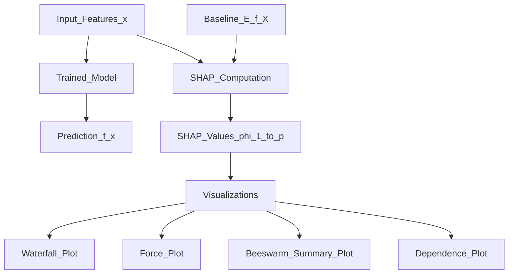

# 🔍 SHAP — SHapley Additive exPlanations

> [!abstract] TL;DR
> SHAP assigns each feature a contribution value (SHAP value) to a prediction using game-theoretic Shapley values, guaranteeing fair, consistent attribution. TreeSHAP computes exact values for tree models in polynomial time; KernelSHAP handles any model. SHAP is the industry standard for regulated ML.

## Intuition — Analogy First

Imagine three colleagues (Alice, Bob, Carol) collaborated on a project and earned a $100 bonus. How do you fairly divide it? Shapley values answer this by computing each person's **average marginal contribution** across every possible collaboration order:

- If Alice alone earns $30, Bob alone $20, Alice+Bob $60 → Alice's marginal contribution when Bob is already there is $40.
- Average these contributions over all orderings → Bob gets, say, $25, Alice $45, Carol $30.

In ML: the "colleagues" are features, the "bonus" is the model's prediction, and Shapley values tell us how much each feature contributed to the prediction — **fairly, without double-counting**.

SHAP values always sum to the model's prediction minus a baseline: $$f(x) = \phi_0 + \sum_{i=1}^p \phi_i$$

## How It Works — Mechanics



### Two Main Estimators

**TreeSHAP** (Lundberg et al. 2018):
- Exact computation for tree-based models (XGBoost, LightGBM, Random Forest, sklearn trees)
- Polynomial time O(TLD²) instead of exponential
- Uses the tree structure to efficiently marginalise out feature subsets

**KernelSHAP** (Lundberg & Lee 2017):
- Model-agnostic — works with any differentiable or black-box model
- Weighted linear regression over perturbed inputs: weight = Shapley kernel
- Approximate (sampling-based); slower than TreeSHAP

### Visualisations
- **Waterfall plot**: single prediction breakdown, from baseline to output, bar for each feature
- **Force plot**: horizontal waterfall; interactive in notebooks
- **Beeswarm/summary plot**: distribution of SHAP values for every feature across the dataset
- **Dependence plot**: SHAP value vs feature value for one feature (reveals non-linearity)

## The Math

The SHAP value for feature $i$ is the Shapley value from cooperative game theory:

$$\phi_i(f, x) = \sum_{S \subseteq F \setminus \{i\}} \frac{|S|!\,(p - |S| - 1)!}{p!} \left[f_{S \cup \{i\}}(x_{S \cup \{i\}}) - f_S(x_S)\right]$$

where:
- $F$ = full set of features, $p = |F|$
- $S$ = subset of features not including $i$
- $f_S(x_S)$ = model output with features restricted to $S$ (others marginalised out)

**Shapley axioms** (what makes this "fair"):
1. **Efficiency**: $\sum_i \phi_i = f(x) - \mathbb{E}[f(X)]$ (contributions sum to prediction - baseline)
2. **Symmetry**: equal contributions get equal credit
3. **Dummy**: a feature that never changes the output gets $\phi_i = 0$
4. **Linearity/additivity**: SHAP values of sum of models = sum of individual SHAP values

**KernelSHAP weight** (the kernel that recovers Shapley values):
$$\pi_x(z') = \frac{p - 1}{\binom{p}{|z'|} \cdot |z'| \cdot (p - |z'|)}$$

## Code Demo

```python
# pip install shap xgboost scikit-learn pandas

import shap
import xgboost as xgb
import pandas as pd
from sklearn.datasets import load_breast_cancer
from sklearn.model_selection import train_test_split

# ---------- Data and Model ----------
data = load_breast_cancer()
X = pd.DataFrame(data.data, columns=data.feature_names)
y = data.target

X_train, X_test, y_train, y_test = train_test_split(X, y, test_size=0.2, random_state=42)

model = xgb.XGBClassifier(n_estimators=100, max_depth=4, random_state=42)
model.fit(X_train, y_train)

# ---------- TreeSHAP (exact, fast) ----------
explainer = shap.TreeExplainer(model)
shap_values = explainer(X_test)     # returns Explanation object
# shap_values.values: ndarray (n_samples, n_features)
# shap_values.base_values: baseline (E[f(X)])

# --- Global summary: which features matter most? ---
shap.summary_plot(shap_values, X_test, plot_type="beeswarm")

# --- Feature importance bar chart ---
shap.summary_plot(shap_values, X_test, plot_type="bar")

# --- Single prediction explanation (waterfall) ---
shap.plots.waterfall(shap_values[0])

# --- Force plot (interactive in Jupyter) ---
shap.force_plot(
    explainer.expected_value,
    shap_values.values[0],
    X_test.iloc[0],
    matplotlib=True
)

# --- Dependence plot: SHAP value vs feature value ---
shap.plots.scatter(shap_values[:, "mean radius"], color=shap_values[:, "worst area"])

# ---------- KernelSHAP (model-agnostic) ----------
from sklearn.ensemble import RandomForestClassifier

rf_model = RandomForestClassifier(n_estimators=50, random_state=42)
rf_model.fit(X_train, y_train)

# Use background dataset (100 representative samples)
background = shap.sample(X_train, 100)
kernel_explainer = shap.KernelExplainer(rf_model.predict_proba, background)

# Explain a batch (slow for large batches)
kernel_shap_values = kernel_explainer.shap_values(X_test[:10], nsamples=200)
print(f"SHAP shape: {kernel_shap_values[0].shape}")  # (10, 30) for class 0

# ---------- Verify efficiency axiom ----------
pred = model.predict_proba(X_test.iloc[[0]])[0, 1]
shap_sum = shap_values.values[0].sum() + shap_values.base_values[0]
print(f"Prediction: {pred:.4f}, SHAP sum + base: {shap_sum:.4f}")  # Should be equal
```

## Real-World Example

**FICO Credit Scoring**: FICO uses SHAP to provide regulators and consumers with explanations for credit decisions. Financial regulators (ECOA, GDPR) require "right to explanation" for automated decisions — SHAP satisfies this with its Shapley axioms.

**Healthcare**: A sepsis prediction model at UCSF was explained to ICU physicians using SHAP waterfall plots showing which lab values (lactate, creatinine) pushed the risk score high. Physicians reported higher trust when SHAP explanations aligned with clinical knowledge.

**Kaggle**: SHAP is the dominant interpretability library in Kaggle competitions for understanding gradient boosting models. The beeswarm plot has become the standard way to communicate feature importance.

## Trade-offs

| Property | TreeSHAP | KernelSHAP | Permutation Importance |
|---|---|---|---|
| Speed | Fast (polynomial) | Slow (sampling) | Medium |
| Exactness | Exact | Approximate | Approximate |
| Model support | Trees only | Any | Any |
| Interaction detection | Yes (SHAP interactions) | Limited | No |
| Global vs local | Both | Both | Global only |
| Handles correlated features | Conditional SHAP | Marginal (problematic) | Biased |

## When to Use vs Avoid

**Use SHAP when:**
- You need auditable, regulator-presentable explanations
- Model is tree-based → TreeSHAP for exact, fast results
- You want both local (per-prediction) and global (dataset-wide) explanations
- Features interact and you need to see interaction effects

**Avoid or be careful when:**
- Features are highly correlated: SHAP distributes credit among correlated features, which can be misleading
- Model is a deep neural network: DeepSHAP/GradientSHAP are approximations and may not be stable
- You need causal attribution: SHAP measures correlation, not causation

## Common Pitfalls

1. **Marginal vs conditional SHAP**: KernelSHAP by default marginalises using the marginal distribution, which can assign positive SHAP to a feature even when it's not causal if it's correlated with important features.
2. **Interpreting SHAP as causal**: SHAP $\phi_i > 0$ means the feature pushes the prediction up relative to the baseline — it does NOT mean the feature caused the outcome.
3. **Slow KernelSHAP on large datasets**: Always use `shap.sample()` for the background dataset (100–500 samples) and a small `nsamples` budget.
4. **Multiclass SHAP**: `shap_values` returns a list of arrays (one per class); ensure you're looking at the correct class index.
5. **Base value confusion**: The baseline $\phi_0 = \mathbb{E}[f(X)]$ is not zero — always sanity check that $\phi_0 + \sum \phi_i \approx f(x)$.

## Related Concepts

- [[_MOC_Evaluation_Safety|↑ Section MOC]]

- [[LIME]] — local linear approximation alternative; faster but less theoretically grounded
- [[Responsible_AI]] — regulatory frameworks requiring ML explanations
- [[XGBoost]] — primary use case for TreeSHAP

## Review Questions

1. **SHAP values satisfy four axioms (efficiency, symmetry, dummy, linearity). Which axiom guarantees that SHAP values sum to the model output minus baseline, and why does this property matter for auditing?**
2. **KernelSHAP is model-agnostic while TreeSHAP is tree-specific. What algorithmic property of decision trees does TreeSHAP exploit to achieve polynomial instead of exponential time complexity?**
3. **A SHAP beeswarm plot shows that "age" has high positive SHAP values for predictions of loan default. A regulator flags this as age discrimination. How would you investigate whether this is correlation or causation, and what can you do if it is discriminatory?**

## Sources

- Lundberg, S. M., & Lee, S.-I. (2017). *A Unified Approach to Interpreting Model Predictions* (SHAP). NeurIPS. [https://arxiv.org/abs/1705.07874](https://arxiv.org/abs/1705.07874)
- Lundberg et al. (2018). *Consistent Individualized Feature Attribution for Tree Ensembles* (TreeSHAP). [https://arxiv.org/abs/1802.03888](https://arxiv.org/abs/1802.03888)
- SHAP documentation: [https://shap.readthedocs.io](https://shap.readthedocs.io)
- Molnar, C. (2022). *Interpretable Machine Learning*. Chapter on Shapley Values. [https://christophm.github.io/interpretable-ml-book/](https://christophm.github.io/interpretable-ml-book/)

#interpretability #xai #shap #shapley #explainability #treeshap
