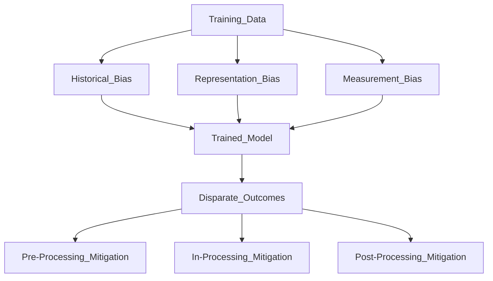

# ⚖️ AI Bias and Fairness

> [!abstract] TL;DR
> ML models can perpetuate or amplify historical biases through training data, model design, or deployment context. Fairness is formally defined by metrics like demographic parity and equalized odds, but these definitions are mutually exclusive — no model can satisfy all of them simultaneously when base rates differ across groups.

## Intuition — Analogy First

Imagine a job screening system trained on historical hiring data from a company that previously discriminated against women. The model learns that men were hired more often — not because men are more qualified, but because of past bias. Even without explicitly encoding gender as a feature, the model may learn to use proxies (postcode, university name, hobbies) that are correlated with gender.

The model is "accurate" (it predicts who was hired) but **unfair** (it reproduces discrimination). Fairness asks: should accuracy be measured differently for different demographic groups?

## How It Works — Mechanics



### Types of Bias

**Historical bias**: the world has been unfair, and the data reflects it. Even if the data collection is perfect, the labels carry past injustice.

**Representation bias**: certain groups are underrepresented in training data, causing models to perform worse for them.

**Measurement bias**: the features used to measure a concept are proxies that are noisier for some groups (e.g., credit score as proxy for financial responsibility works differently across socioeconomic groups).

**Deployment bias**: the model is used in a context different from where it was trained (a model trained on US data deployed in Europe).

### Fairness Definitions

Given protected attribute $A \in \{0, 1\}$ (e.g., gender), outcome $Y \in \{0, 1\}$, and prediction $\hat{Y} \in \{0, 1\}$:

**Demographic parity** (statistical parity): equal positive prediction rate across groups.

**Equalized odds**: equal TPR and FPR across groups (both errors equal).

**Equal opportunity**: equal TPR across groups (false negatives equal; less strict than equalized odds).

**Calibration**: $P(Y=1|\hat{p}, A=a) = \hat{p}$ for all groups — predictions are equally reliable.

**Impossibility result** (Chouldechova 2017, Kleinberg et al. 2016): When base rates differ between groups, you **cannot** simultaneously achieve demographic parity, equalized odds, and calibration. You must choose which fairness criterion to prioritise based on the context.

### Mitigation Strategies

| Stage | Method | Example |
|---|---|---|
| Pre-processing | Reweigh training examples by group | Reweighing (Kamiran & Calders) |
| Pre-processing | Modify labels to reduce bias | Disparate impact remover |
| In-processing | Constrained optimization | Fairlearn ExponentiatedGradient |
| In-processing | Adversarial debiasing | Minimax fairness training |
| Post-processing | Adjust decision thresholds per group | Threshold optimizer |

## The Math

**Demographic Parity:**
$$P(\hat{Y}=1 \mid A=0) = P(\hat{Y}=1 \mid A=1)$$

Measured as **Demographic Parity Difference (DPD)**:
$$\text{DPD} = P(\hat{Y}=1 \mid A=1) - P(\hat{Y}=1 \mid A=0)$$
Target: $\text{DPD} = 0$; acceptable: $|\text{DPD}| < 0.1$

**Equalized Odds:**
$$P(\hat{Y}=1 \mid Y=y, A=0) = P(\hat{Y}=1 \mid Y=y, A=1), \quad \forall y \in \{0,1\}$$
i.e., both True Positive Rate and False Positive Rate are equal across groups.

**Equalized Odds Difference (EOD):**
$$\text{EOD} = \max_{y} |P(\hat{Y}=1 \mid Y=y, A=1) - P(\hat{Y}=1 \mid Y=y, A=0)|$$

**Disparate Impact Ratio (4/5ths rule):**
$$\text{DI} = \frac{P(\hat{Y}=1 \mid A=\text{minority})}{P(\hat{Y}=1 \mid A=\text{majority})}$$
US EEOC guideline: $\text{DI} < 0.8$ indicates adverse impact.

## Code Demo

```python
# pip install fairlearn pandas scikit-learn

import pandas as pd
import numpy as np
from sklearn.datasets import make_classification
from sklearn.model_selection import train_test_split
from sklearn.linear_model import LogisticRegression
from sklearn.metrics import accuracy_score

from fairlearn.metrics import (
    demographic_parity_difference,
    equalized_odds_difference,
    MetricFrame,
    selection_rate,
)
from fairlearn.reductions import ExponentiatedGradient, DemographicParity, EqualizedOdds
from fairlearn.postprocessing import ThresholdOptimizer

# ===== 1. Simulate biased data =====
np.random.seed(42)
n = 2000
X, y = make_classification(n_samples=n, n_features=10, random_state=42)
# Protected attribute: group 0 = majority (70%), group 1 = minority (30%)
A = np.random.choice([0, 1], size=n, p=[0.7, 0.3])
# Inject bias: lower y for minority group
y[(A == 1) & (y == 1)] = np.random.choice([0, 1], size=((A == 1) & (y == 1)).sum(), p=[0.3, 0.7])
df = pd.DataFrame(X, columns=[f"f{i}" for i in range(10)])
df["A"] = A
df["y"] = y

X_train, X_test, A_train, A_test, y_train, y_test = train_test_split(
    df.drop(["A", "y"], axis=1), df["A"], df["y"], test_size=0.3, random_state=42
)

# ===== 2. Baseline biased model =====
lr = LogisticRegression(max_iter=1000, random_state=42)
lr.fit(X_train, y_train)
y_pred = lr.predict(X_test)

print(f"Accuracy: {accuracy_score(y_test, y_pred):.3f}")
print(f"Demographic Parity Difference: {demographic_parity_difference(y_test, y_pred, sensitive_features=A_test):.3f}")
print(f"Equalized Odds Difference:     {equalized_odds_difference(y_test, y_pred, sensitive_features=A_test):.3f}")

# ===== 3. MetricFrame — disaggregated metrics =====
mf = MetricFrame(
    metrics={"accuracy": accuracy_score, "selection_rate": selection_rate},
    y_true=y_test,
    y_pred=y_pred,
    sensitive_features=A_test,
)
print("\nDisaggregated metrics:")
print(mf.by_group)
print(f"Difference in accuracy: {mf.difference()['accuracy']:.3f}")

# ===== 4. In-processing mitigation: ExponentiatedGradient =====
constraint = EqualizedOdds(difference_bound=0.05)
mitigator = ExponentiatedGradient(
    estimator=LogisticRegression(max_iter=1000),
    constraints=constraint,
)
mitigator.fit(X_train, y_train, sensitive_features=A_train)
y_pred_fair = mitigator.predict(X_test)

print(f"\nPost-mitigation Accuracy: {accuracy_score(y_test, y_pred_fair):.3f}")
print(f"Post-mitigation EO Difference: {equalized_odds_difference(y_test, y_pred_fair, sensitive_features=A_test):.3f}")

# ===== 5. Post-processing mitigation: ThresholdOptimizer =====
postprocess = ThresholdOptimizer(
    estimator=lr,
    constraints="equalized_odds",
    predict_method="predict_proba",
    objective="balanced_accuracy_score",
)
postprocess.fit(X_train, y_train, sensitive_features=A_train)
y_pred_post = postprocess.predict(X_test, sensitive_features=A_test)
print(f"\nPost-processing Accuracy: {accuracy_score(y_test, y_pred_post):.3f}")
print(f"Post-processing EO Difference: {equalized_odds_difference(y_test, y_pred_post, sensitive_features=A_test):.3f}")
```

## Real-World Example

**COMPAS (Correctional Offender Management Profiling for Alternative Sanctions)**: A recidivism prediction tool used in US courts. ProPublica's 2016 analysis found it had **equal predictive accuracy** across racial groups but **unequal error rates** — Black defendants were twice as likely to be falsely flagged as future criminals (higher false positive rate), while white defendants were more likely to be incorrectly marked low-risk (higher false negative rate). Northpointe's rebuttal showed COMPAS satisfied calibration. This is a direct demonstration of the impossibility result: both sides were technically correct, but emphasised different fairness criteria.

**Amazon's Hiring Tool**: Amazon shut down a resume screening AI in 2018 after discovering it systematically downranked resumes mentioning women's colleges and women's organisations — it learned this pattern from 10 years of historical hiring data where the workforce was 60% male.

## Trade-offs

| Fairness Metric | Protects Against | Compatible With | Trade-off |
|---|---|---|---|
| Demographic Parity | Disparate positive rates | Anti-discrimination law | May ignore base rate differences |
| Equalized Odds | Disparate error rates | Operational fairness | Incompatible with calibration when base rates differ |
| Calibration | Unreliable predictions per group | Trust in scores | Incompatible with equalized odds |
| Equal Opportunity | Disparate false negatives | Benefit-allocation tasks | Allows disparate false positives |

## When to Use vs Avoid

**Apply demographic parity when:** hiring, lending, admission — equal selection rate matters regardless of historical differences.

**Apply equalized odds when:** criminal justice, medical risk scoring — both error types matter equally for both groups.

**Apply calibration when:** clinical decision support where score reliability must be equal across groups.

**Always use disaggregated metrics:** report accuracy/recall/precision **per group** alongside aggregate metrics.

## Common Pitfalls

1. **Removing protected attributes doesn't remove bias**: Proxy features (ZIP code, name) can encode protected attributes. Run fairness audits even without protected attributes in features.
2. **Choosing the "best" fairness metric post-hoc**: Decide which fairness constraint is appropriate before training, based on the deployment context and legal requirements.
3. **Small sample sizes per group**: Fairness metrics are unreliable for groups with < 100 samples in the test set. Resample or report confidence intervals.
4. **Intersectional bias**: A model may be fair for women and fair for Black people but unfair for Black women. Always analyse intersectional subgroups.
5. **Accuracy-fairness trade-off**: Fairness constraints typically reduce accuracy. Be explicit about this trade-off and who decides the acceptable level.

## Related Concepts

- [[_MOC_Evaluation_Safety|↑ Section MOC]]

- [[Responsible_AI]] — governance frameworks incorporating fairness requirements
- [[SHAP]] — explainability technique used to detect proxy discrimination
- [[Classification_Metrics]] — base metrics (TPR, FPR, precision) on which fairness metrics are built

## Review Questions

1. **Explain the fairness impossibility theorem in plain English: why can a model not simultaneously satisfy demographic parity, equalized odds, and calibration when base rates differ between groups?**
2. **The COMPAS controversy involved a conflict between equalized odds and calibration. Which criterion did ProPublica use, which did Northpointe use, and which should take priority in criminal justice decisions — and why?**
3. **You're building a loan approval model and discover it has a disparate impact ratio of 0.72 for a minority group. What three concrete steps would you take to investigate the source of bias and potentially mitigate it?**

## Sources

- Chouldechova, A. (2017). *Fair Prediction with Disparate Impact: A Study of Bias in Recidivism Prediction Instruments*. Big Data. [https://arxiv.org/abs/1703.00056](https://arxiv.org/abs/1703.00056)
- Kleinberg et al. (2016). *Inherent Trade-offs in the Fair Determination of Risk Scores*. [https://arxiv.org/abs/1609.05807](https://arxiv.org/abs/1609.05807)
- Angwin et al. (2016). *Machine Bias* (COMPAS analysis). ProPublica.
- Fairlearn documentation: [https://fairlearn.org/v0.10](https://fairlearn.org/v0.10)
- Bird et al. (2020). *Fairlearn: A toolkit for assessing and improving fairness in AI*. Microsoft Research. [https://arxiv.org/abs/2001.06430](https://arxiv.org/abs/2001.06430)

#safety #fairness #bias #responsible-ai #demographic-parity #equalized-odds
