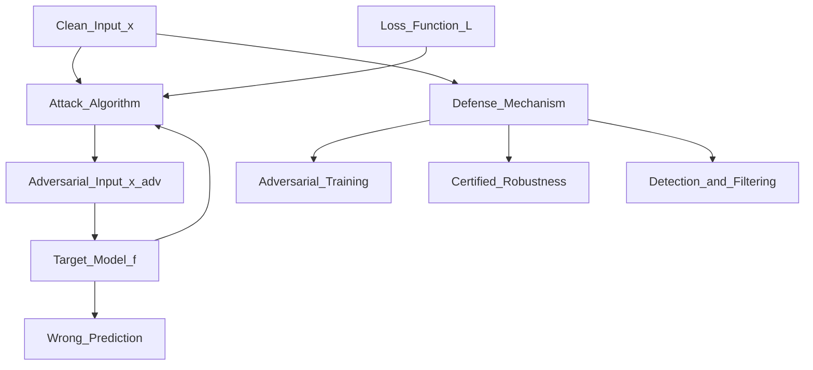

# 🛡️ Adversarial Robustness

> [!abstract] TL;DR
> Adversarial examples are inputs with imperceptible perturbations that cause ML models to make confident, wrong predictions. FGSM and PGD are the canonical attacks; adversarial training (augmenting with adversarial examples during training) is the most effective defence, though at a cost to clean accuracy. For LLMs, adversarial robustness manifests as jailbreaks and prompt injection.

## Intuition — Analogy First

Imagine a stop sign. For a human, no matter how bright the sun, how dirty the sign, or how much graffiti is on it, you still recognise it as a stop sign. Neural networks can be fooled differently: by adding a precise pattern of tiny coloured stickers to the sign, researchers caused autonomous vehicles to classify it as a speed limit sign — while it still looked perfectly normal to any human.

This is the adversarial example problem: the model has learned brittle decision boundaries that are highly sensitive to imperceptible, structured perturbations in the input space.

**Three key properties of a good adversarial attack:**
1. **Imperceptible**: a human cannot tell the original and adversarial inputs apart
2. **Targeted or untargeted**: makes the model output a specific wrong class (targeted) or any wrong class (untargeted)
3. **Transferable**: adversarial examples crafted on model A often fool model B (black-box transferability)

## How It Works — Mechanics



### Attacks

**FGSM (Fast Gradient Sign Method)** — one-step, untargeted:
Add a perturbation in the direction of the gradient of the loss (maximises loss in one step).

**PGD (Projected Gradient Descent)** — multi-step, strongest known first-order attack:
Iterate FGSM multiple times with small step size, projecting back to the $\ell_\infty$ ball after each step.

**C&W (Carlini & Wagner)** — optimisation-based, finds minimal perturbation needed to fool the model.

**AutoAttack** — parameter-free ensemble of attacks; considered the standard for evaluating robustness claims.

### Defences

| Defence | Method | Certified? | Accuracy Cost |
|---|---|---|---|
| Adversarial Training | Augment with adversarial examples | No | High (5–10%) |
| Certified Robustness (randomised smoothing) | Smooth classifier + probabilistic guarantee | Yes | Very High |
| Input preprocessing | JPEG compression, denoising | No | Low |
| Detection | Detect and reject adversarial inputs | No | Latency cost |
| Ensemble | Multiple models vote | No | Moderate |

### NLP Adversarial Attacks

- **Character-level**: typos, character swaps, invisible Unicode characters
- **Word-level**: synonym substitution (maintaining semantic similarity but flipping classification)
- **Sentence-level**: paraphrase attacks — rephrase the input so meaning is preserved but prediction changes
- **Prompt injection**: for LLMs, craft inputs that override system instructions

### Adversarial Robustness in LLMs

Traditional adversarial examples (ε-ball perturbations) are less applicable to discrete token space. Instead:
- **Jailbreaks**: prompts that bypass safety training (role-play, encoding tricks, prompt injection)
- **Prompt injection**: malicious content in retrieved documents or tool outputs that hijacks the LLM's behaviour
- **Gradient-based token attacks**: GCG (Greedy Coordinate Gradient) — finds adversarial suffixes that jailbreak LLMs

## The Math

**FGSM** (Goodfellow et al. 2014):
$$x_{\text{adv}} = x + \epsilon \cdot \text{sign}(\nabla_x \mathcal{L}(f_\theta(x), y))$$
where $\epsilon$ is the perturbation magnitude (budget), $\mathcal{L}$ is the cross-entropy loss.

**PGD** (Madry et al. 2018):
$$x^{(t+1)} = \Pi_{B_\epsilon(x)}\!\left(x^{(t)} + \alpha \cdot \text{sign}(\nabla_{x^{(t)}} \mathcal{L}(f_\theta(x^{(t)}), y))\right)$$
where $\Pi_{B_\epsilon(x)}$ projects back into the $\ell_\infty$ ball of radius $\epsilon$, and $\alpha$ is the step size.

**Adversarial Training objective** (min-max formulation):
$$\min_\theta \mathbb{E}_{(x,y)}\!\left[\max_{\delta: \|\delta\|_\infty \leq \epsilon} \mathcal{L}(f_\theta(x + \delta), y)\right]$$

**Certified robustness** (randomised smoothing): for smoothed classifier $g$ using Gaussian noise $\sigma$:
$$P(g(x + \epsilon) = c_A) \geq p_A \implies \text{certify robustness up to } \|epsilon\|_2 \leq \frac{\sigma}{2}(\Phi^{-1}(p_A) - \Phi^{-1}(p_B))$$

## Code Demo

```python
# pip install foolbox torch torchvision adversarial-robustness-toolbox

import torch
import torch.nn as nn
import torchvision
import torchvision.transforms as transforms
import numpy as np

# ===== 1. FGSM Attack from scratch =====
def fgsm_attack(model: nn.Module, images: torch.Tensor, labels: torch.Tensor,
                epsilon: float = 0.03) -> torch.Tensor:
    """Fast Gradient Sign Method attack."""
    images.requires_grad_(True)
    outputs = model(images)
    loss = nn.CrossEntropyLoss()(outputs, labels)
    model.zero_grad()
    loss.backward()
    perturbation = epsilon * images.grad.sign()
    adversarial = (images + perturbation).clamp(0, 1).detach()
    return adversarial

# ===== 2. PGD Attack =====
def pgd_attack(model: nn.Module, images: torch.Tensor, labels: torch.Tensor,
               epsilon: float = 0.03, alpha: float = 0.01, n_steps: int = 40) -> torch.Tensor:
    """Projected Gradient Descent attack (multi-step FGSM)."""
    x_adv = images.clone().detach() + 0.001 * torch.randn_like(images)
    x_adv = x_adv.clamp(0, 1)

    for _ in range(n_steps):
        x_adv.requires_grad_(True)
        outputs = model(x_adv)
        loss = nn.CrossEntropyLoss()(outputs, labels)
        model.zero_grad()
        loss.backward()
        with torch.no_grad():
            grad_sign = x_adv.grad.sign()
            x_adv = x_adv + alpha * grad_sign
            # Project back to epsilon-ball around original images
            delta = torch.clamp(x_adv - images, min=-epsilon, max=epsilon)
            x_adv = (images + delta).clamp(0, 1)
    return x_adv.detach()

# ===== 3. Evaluate clean vs adversarial accuracy =====
def evaluate(model, data_loader, attack_fn=None, device="cpu"):
    model.eval()
    correct, total = 0, 0
    for images, labels in data_loader:
        images, labels = images.to(device), labels.to(device)
        if attack_fn:
            images = attack_fn(model, images, labels)
        with torch.no_grad():
            outputs = model(images)
            _, predicted = outputs.max(1)
        correct += predicted.eq(labels).sum().item()
        total += labels.size(0)
    return correct / total

# Load a pretrained ResNet-18
model = torchvision.models.resnet18(pretrained=True).eval()
transform = transforms.Compose([
    transforms.Resize(224), transforms.ToTensor(),
    transforms.Normalize([0.485, 0.456, 0.406], [0.229, 0.224, 0.225])
])

# ===== 4. Adversarial Training (sketch) =====
def adversarial_training_step(model, optimizer, images, labels, epsilon=0.03):
    """One step of adversarial training (PGD-AT)."""
    model.train()
    x_adv = pgd_attack(model, images, labels, epsilon=epsilon, n_steps=10)
    optimizer.zero_grad()
    loss = nn.CrossEntropyLoss()(model(x_adv), labels)
    loss.backward()
    optimizer.step()
    return loss.item()

# ===== 5. Foolbox for standardised attacks =====
import foolbox as fb

# fmodel = fb.PyTorchModel(model, bounds=(0, 1))
# attack = fb.attacks.LinfPGD(steps=40)
# raw, clipped, success = attack(fmodel, images, labels, epsilons=[0.03])
# print(f"Attack success rate: {success.float().mean():.3f}")

# ===== 6. NLP adversarial example (TextFooler style) =====
# pip install textattack
from textattack.attack_recipes import TextFoolerJin2019
from textattack.models.wrappers import HuggingFaceModelWrapper
from transformers import AutoModelForSequenceClassification, AutoTokenizer

# model_wrapper = HuggingFaceModelWrapper(
#     AutoModelForSequenceClassification.from_pretrained("textattack/bert-base-uncased-imdb"),
#     AutoTokenizer.from_pretrained("textattack/bert-base-uncased-imdb")
# )
# attack = TextFoolerJin2019.build(model_wrapper)
# result = attack.attack("I loved this movie, it was fantastic!", 1)
# print(result)
```

## Real-World Example

**Adversarial Stop Signs (Brown et al. 2017)**: Researchers printed physical adversarial patches (coloured sticker designs) that, when placed on stop signs, caused an autonomous vehicle perception system to classify them as speed limit signs with 100% confidence. The patch was robust to different lighting, angles, and distances. This prompted serious safety research in automotive AI.

**GPT Jailbreaks (GCG, Zou et al. 2023)**: Researchers found that appending a specific adversarial suffix (found by gradient optimisation) to any harmful prompt would reliably bypass the safety training of GPT-3.5, Claude, and other aligned LLMs. The suffix looked like gibberish to humans but systematically exploited internal model states.

## Trade-offs

| Defence | Accuracy on Clean | Certified? | Computational Cost | Practical? |
|---|---|---|---|---|
| No defence | High | No | None | Vulnerable |
| Adversarial training (FGSM-AT) | Medium | No | 2x | Yes |
| Adversarial training (PGD-AT) | Medium | No | 10–40x | For critical systems |
| Randomised smoothing | Low | Yes | High | Research |
| Input denoising | High | No | Low | Partial |

## When to Use vs Avoid

**Apply adversarial training when:** model is deployed in security-sensitive contexts (medical imaging, autonomous vehicles, malware detection, authentication).

**Apply certified robustness when:** formal guarantees are required (safety-critical systems, high-stakes decisions).

**Monitor for adversarial attacks when:** model is exposed to potentially adversarial users (content moderation, fraud detection).

**Skip adversarial robustness when:** purely internal, non-adversarial use cases with no incentive for adversaries to manipulate inputs.

## Common Pitfalls

1. **Security through obscurity**: hiding model weights doesn't protect against adversarial attacks — GAN-based attacks can work black-box, and white-box attacks transfer.
2. **Gradient masking**: some defences work by making gradients uninformative, which fools white-box attacks but not BPDA (Backward Pass Differentiable Approximation). Always evaluate with AutoAttack.
3. **ε budget mismatch**: adversarial training with $\epsilon = 8/255$ (typical for ImageNet) offers no protection against attacks with $\epsilon = 16/255$ — use the same budget as your threat model.
4. **Forgetting clean accuracy**: adversarial training typically reduces clean accuracy by 5–15%. Always report both clean and robust accuracy.
5. **Evaluating with weak attacks**: evaluating robustness only with FGSM (not PGD) gives overly optimistic results. Use PGD or AutoAttack for final evaluation.

## Related Concepts

- [[_MOC_Evaluation_Safety|↑ Section MOC]]

- [[Red_Teaming]] — systematic adversarial testing of AI systems before deployment
- [[AI_Bias_and_Fairness]] — another safety dimension: biased predictions across demographic groups
- [[Prompt_Injection_and_Safety]] — adversarial attacks specific to LLM systems

## Review Questions

1. **FGSM uses the sign of the gradient, not the gradient itself. Why does sign(∇L) produce a more effective adversarial perturbation than the raw gradient when using an ℓ∞ constraint?**
2. **Adversarial training solves a min-max objective. What is being minimised and what is being maximised, and why does this make the model more robust?**
3. **A team claims their defence reduces attack success rate from 80% to 10% against FGSM. Should you be confident this model is robust? What experiment would you run to verify this claim?**

## Sources

- Goodfellow et al. (2014). *Explaining and Harnessing Adversarial Examples* (FGSM). ICLR. [https://arxiv.org/abs/1412.6572](https://arxiv.org/abs/1412.6572)
- Madry et al. (2018). *Towards Deep Learning Models Resistant to Adversarial Attacks* (PGD-AT). ICLR. [https://arxiv.org/abs/1706.06083](https://arxiv.org/abs/1706.06083)
- Carlini & Wagner (2017). *Evaluating the Robustness of Neural Networks: An Extreme Value Theory Approach* (C&W). IEEE S&P.
- Brown et al. (2017). *Adversarial Patch*. NeurIPS Workshop. [https://arxiv.org/abs/1712.09665](https://arxiv.org/abs/1712.09665)
- Zou et al. (2023). *Universal and Transferable Adversarial Attacks on Aligned Language Models* (GCG). [https://arxiv.org/abs/2307.15043](https://arxiv.org/abs/2307.15043)

#safety #adversarial #robustness #fgsm #pgd #adversarial-training
