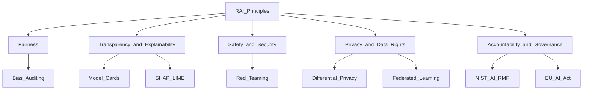

# 🤝 Responsible AI

> [!abstract] TL;DR
> Responsible AI is the practice of building and deploying AI systems that are fair, transparent, safe, accountable, and privacy-preserving. It covers technical tools (differential privacy, model cards), legal frameworks (EU AI Act, GDPR), and governance processes (NIST AI RMF, model risk management).

## Intuition — Analogy First

Just as doctors follow the Hippocratic Oath ("first, do no harm") and engineers follow safety codes, AI practitioners have an emerging body of professional ethics and regulatory requirements.

The analogy extends further:
- A doctor prescribing medication without understanding its side effects is negligent — an AI engineer deploying a model without bias testing is equivalent.
- Pharmaceutical companies must document every drug's risks and benefits before FDA approval — model cards serve a similar disclosure function.
- GDPR for ML means "if you used someone's data to train a model that affects them, they have rights" — similar to informed consent in medicine.

Responsible AI isn't just ethics — it's increasingly **law** (EU AI Act) and **business risk** (biased hiring tools, insurance pricing discrimination lawsuits).

## How It Works — Mechanics



### Key Principles

**Fairness**: model outputs should not discriminate based on protected characteristics; bias should be identified and mitigated.

**Transparency**: how the model works should be explainable to stakeholders, from engineers (SHAP) to regulators (model cards) to end users (natural language explanations).

**Privacy**: training data should be handled with consent; models should not memorise or expose personal data; differential privacy can limit memorisation.

**Safety**: models should not produce harmful outputs; red teaming and safety training reduce this risk.

**Accountability**: a clear chain of responsibility exists for model decisions; audit trails are maintained; humans remain in the loop for high-stakes decisions.

**Reliability and Robustness**: models should perform consistently across deployment conditions, including edge cases and adversarial inputs.

### EU AI Act (2024)

The EU AI Act classifies AI systems by risk level:

| Risk Level | Examples | Requirements |
|---|---|---|
| Unacceptable | Social scoring, real-time remote biometric ID in public | **Prohibited** |
| High | Hiring, credit scoring, medical devices, critical infrastructure | Conformity assessment, human oversight, documentation |
| Limited | Chatbots (must disclose AI nature), deepfakes | Transparency obligations |
| Minimal | Spam filters, AI in video games | No requirements |

**High-risk requirements**: risk management system, data governance, technical documentation, transparency to users, human oversight, accuracy/robustness/security, logging.

### NIST AI Risk Management Framework (AI RMF 1.0)

Four core functions:
- **GOVERN**: establish AI risk culture, roles, responsibilities
- **MAP**: categorise risks in context, identify stakeholders
- **MEASURE**: analyse, assess, and track risks
- **MANAGE**: prioritise and address risks; monitor and improve

### Model Cards and Datasheets

**Model Card** (Mitchell et al. 2019): a brief, structured document accompanying a model release containing:
- Model details (architecture, training procedure)
- Intended uses and out-of-scope uses
- Performance metrics (overall + disaggregated by subgroup)
- Evaluation datasets
- Ethical considerations and limitations

**Datasheet for Datasets** (Gebru et al. 2021): analogous disclosure for datasets — motivation, composition, collection process, preprocessing, uses, distribution, maintenance.

### Differential Privacy

Mathematical privacy guarantee: adding a randomised individual's data to a training set doesn't significantly change what the model reveals about them.

**Formal definition**: mechanism $\mathcal{M}$ is $(\epsilon, \delta)$-differentially private if for any two adjacent datasets $D, D'$ differing in one record:
$$P[\mathcal{M}(D) \in S] \leq e^\epsilon \cdot P[\mathcal{M}(D') \in S] + \delta$$

Lower $\epsilon$ = stronger privacy, higher accuracy cost.

### Federated Learning

Train models across distributed devices without centralising raw data. Each device trains on local data and only sends model updates (gradients) to a central server, which aggregates them (FedAvg algorithm). Protects data locality; combined with differential privacy for stronger guarantees.

## The Math

**Differential Privacy — Gaussian Mechanism:**

Add Gaussian noise to a function $f$:
$$\mathcal{M}(D) = f(D) + \mathcal{N}(0, \sigma^2 \mathbf{I})$$

where $\sigma \geq \frac{\Delta_2 f \cdot \sqrt{2 \ln(1.25/\delta)}}{\epsilon}$ (achieves $(\epsilon, \delta)$-DP), and $\Delta_2 f$ is the $\ell_2$ sensitivity.

**Privacy Budget ($\epsilon$) intuition:**
- $\epsilon = 1$: strong privacy — data barely affects what the model reveals
- $\epsilon = 10$: moderate — roughly "this person's data has limited impact"
- $\epsilon > 100$: weak — similar to no protection in practice

## Code Demo

```python
# pip install opacus torch torchvision

# ===== 1. Differential Privacy with Opacus =====
import torch
import torch.nn as nn
from torch.utils.data import DataLoader, TensorDataset
from opacus import PrivacyEngine
from opacus.utils.batch_memory_manager import BatchMemoryManager

# Toy model
class SimpleNet(nn.Module):
    def __init__(self):
        super().__init__()
        self.fc = nn.Sequential(nn.Linear(20, 64), nn.ReLU(), nn.Linear(64, 2))
    def forward(self, x):
        return self.fc(x)

# Toy dataset
X = torch.randn(1000, 20)
y = torch.randint(0, 2, (1000,))
loader = DataLoader(TensorDataset(X, y), batch_size=64)

model = SimpleNet()
optimizer = torch.optim.SGD(model.parameters(), lr=0.01)

# Attach PrivacyEngine (adds DP-SGD: per-sample gradient clipping + Gaussian noise)
privacy_engine = PrivacyEngine()
model, optimizer, loader = privacy_engine.make_private_with_epsilon(
    module=model,
    optimizer=optimizer,
    data_loader=loader,
    epochs=10,
    target_epsilon=1.0,       # target ε budget
    target_delta=1e-5,         # δ
    max_grad_norm=1.0,         # clip individual gradients to this L2 norm
)

model.train()
for epoch in range(3):
    for X_batch, y_batch in loader:
        optimizer.zero_grad()
        loss = nn.CrossEntropyLoss()(model(X_batch), y_batch)
        loss.backward()
        optimizer.step()

epsilon = privacy_engine.get_epsilon(delta=1e-5)
print(f"Trained with (ε={epsilon:.2f}, δ=1e-5)-differential privacy")
```

```python
# ===== 2. Model Card Template =====
MODEL_CARD = """
# Model Card: {model_name}

## Model Details
- **Model type**: {model_type}
- **Architecture**: {architecture}
- **Training date**: {training_date}
- **Version**: {version}
- **License**: {license}

## Intended Use
- **Primary use cases**: {primary_uses}
- **Out-of-scope uses**: {out_of_scope}
- **Users**: {intended_users}

## Training Data
- **Dataset**: {dataset_name}
- **Size**: {dataset_size}
- **Preprocessing**: {preprocessing}
- **Known limitations**: {data_limitations}

## Performance
| Metric | Overall | Group A | Group B |
|--------|---------|---------|---------|
| Accuracy | {overall_acc} | {group_a_acc} | {group_b_acc} |
| F1 Score | {overall_f1} | | |

## Ethical Considerations
- **Bias and fairness**: {bias_notes}
- **Privacy**: {privacy_notes}
- **Safety**: {safety_notes}

## Limitations and Caveats
{limitations}

## Citation
{citation}
"""

print(MODEL_CARD.format(
    model_name="Loan Default Predictor v2",
    model_type="Binary classification",
    architecture="LightGBM with 500 trees",
    training_date="2026-07",
    version="2.0",
    license="Internal use only",
    primary_uses="Loan approval decisions for personal loans < $50K",
    out_of_scope="Mortgage approval, business loans, markets outside US",
    intended_users="Loan officers, automated approval system",
    dataset_name="Internal loan history 2015–2025",
    dataset_size="2.3M records",
    preprocessing="Missing imputation (median), outlier capping at 99th percentile",
    data_limitations="Underrepresents applicants from rural areas; COVID-period data excluded",
    overall_acc="0.87", group_a_acc="0.88", group_b_acc="0.83",
    overall_f1="0.79",
    bias_notes="Demographic parity difference = 0.04; equalized odds difference = 0.07 (target < 0.1)",
    privacy_notes="No personally identifiable information in features; compliant with ECOA and GDPR",
    safety_notes="Human review required for all borderline cases (probability 0.4–0.6)",
    limitations="Performance degrades for applicants with <2 years credit history",
    citation="Internal. Contact: ml-team@example.com"
))
```

## Real-World Example

**EU AI Act in Practice**: The Act came into force in August 2024. High-risk AI systems (like HR software screening CVs or credit scoring tools) must undergo conformity assessments. Companies like SAP, Workday, and credit bureaus are currently auditing their AI systems for compliance. Non-compliance fines can reach €35M or 7% of global annual turnover.

**Google's Responsible AI Practices**: Google publishes model cards for all major AI products. Their AI Principles (2018) — Be Socially Beneficial, Avoid Harmful Applications, etc. — are backed by an internal review board (the Responsible Innovation in AI team) that vets new products.

**GDPR and ML**: Under GDPR Article 22, individuals have the right not to be subject to purely automated decisions with significant effects. This means high-stakes ML decisions (loan approval, hiring) in EU must have human review capability and provide explanations.

## Trade-offs

| Mechanism | Privacy Protection | Accuracy Cost | Complexity |
|---|---|---|---|
| Differential Privacy (ε=1) | Strong | High (5–20%) | Medium |
| Differential Privacy (ε=10) | Moderate | Low (1–5%) | Medium |
| Federated Learning alone | Data locality only | Moderate | High |
| FL + DP | Strong | High | Very High |
| Anonymisation/pseudonymisation | Limited (re-identification risk) | None | Low |

## When to Use vs Avoid

**Apply DP when:** model trained on sensitive personal data (medical, financial) that might be extracted via membership inference attacks.

**Apply federated learning when:** data is legally or contractually siloed across organisations (healthcare, banking), and centralised training is not possible.

**Complete model cards always:** before any external model release, internal deployment on sensitive data, or regulatory submission.

**Apply EU AI Act conformity assessment when:** deploying in the EU in a high-risk category (hiring, credit, healthcare, education, critical infrastructure).

## Common Pitfalls

1. **Privacy theatre**: simply removing names and IDs doesn't prevent re-identification — quasi-identifiers (age + ZIP + gender) can uniquely identify individuals. Use formal DP guarantees.
2. **DP on aggregates only**: DP during inference (adding noise to outputs) is weaker than DP during training — model weights can still memorise training data.
3. **Federated learning ≠ private**: gradient inversion attacks can reconstruct training data from gradients. Combine federated learning with DP for real privacy.
4. **Model cards as checkbox exercise**: a model card that says "we evaluated fairness" without reporting disaggregated metrics is not useful. Include actual numbers.
5. **Responsible AI as afterthought**: embedding RAI as a final review step doesn't work — it must be integrated throughout the development lifecycle (fairness constraints during training, red teaming during development).

## Related Concepts

- [[_MOC_Evaluation_Safety|↑ Section MOC]]

- [[AI_Bias_and_Fairness]] — technical fairness metrics and mitigation
- [[Red_Teaming]] — safety testing before deployment
- [[Model_Cards]] — structured disclosure documentation

## Review Questions

1. **The EU AI Act defines four risk categories. Give a concrete example of an AI application that sits at each tier, and explain what technical requirements the highest tier imposes.**
2. **Differential privacy introduces a privacy budget ε. What does ε = 1 guarantee in plain English, and why does training a deep neural network typically require ε values much higher (10–100)?**
3. **A startup wants to train a medical diagnosis model on hospital records from five hospitals, each in a different country with different data protection laws. What privacy-preserving ML architecture would you recommend, and what are its limitations?**

## Sources

- Bender et al. (2021). *On the Dangers of Stochastic Parrots*. FAccT.
- Mitchell et al. (2019). *Model Cards for Model Reporting*. FAccT. [https://arxiv.org/abs/1810.03993](https://arxiv.org/abs/1810.03993)
- Gebru et al. (2021). *Datasheets for Datasets*. CACM. [https://arxiv.org/abs/1803.09010](https://arxiv.org/abs/1803.09010)
- Dwork & Roth (2014). *The Algorithmic Foundations of Differential Privacy*. Foundations and Trends.
- EU AI Act (2024): [https://artificialintelligenceact.eu](https://artificialintelligenceact.eu)
- NIST AI RMF 1.0 (2023): [https://airc.nist.gov/RMF](https://airc.nist.gov/RMF)
- Opacus (PyTorch DP library): [https://opacus.ai](https://opacus.ai)

#responsible-ai #ethics #governance #differential-privacy #eu-ai-act #model-cards
