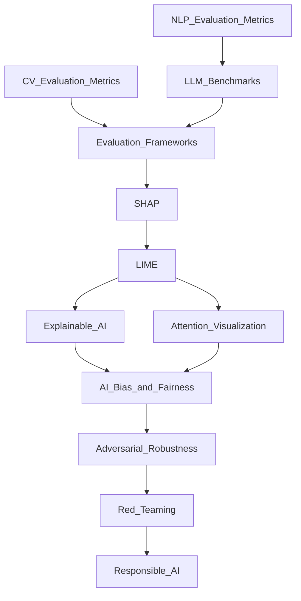

# 🗺️ Evaluation and Safety — Map of Content

> [!info] How to use this map
> Start with Fundamentals, follow the arrows, and use the Learning Path below as your guide.

---

## Concept Map

---

## Learning Path
1. [[Evaluation/NLP_Evaluation_Metrics]] — Learn BLEU, ROUGE, BERTScore, and task-specific metrics before evaluating any language model
2. [[Evaluation/LLM_Benchmarks]] — Survey standard benchmarks (MMLU, HellaSwag, HumanEval) and understand what they do and do not measure
3. [[Evaluation/CV_Evaluation_Metrics]] — Master mAP, IoU, FID, and other computer vision metrics for detection, segmentation, and generation
4. [[Evaluation/Evaluation_Frameworks]] — Implement systematic eval pipelines with harnesses, holdout sets, and confidence intervals
5. [[Interpretability/SHAP]] — Use Shapley values to attribute model predictions to individual features globally and locally
6. [[Interpretability/LIME]] — Apply local linear approximations to explain any black-box model's individual predictions
7. [[Interpretability/Explainable_AI]] — Survey XAI techniques across the full spectrum: model-agnostic vs model-specific, global vs local, post-hoc vs inherent
8. [[Interpretability/Attention_Visualization]] — Inspect transformer attention weights to gain qualitative insight into model focus
9. [[Safety/AI_Bias_and_Fairness]] — Measure and mitigate demographic disparities using group fairness definitions and debiasing techniques
10. [[Safety/Adversarial_Robustness]] — Understand adversarial attacks (FGSM, PGD) and defenses (adversarial training, certified robustness)
11. [[Safety/Red_Teaming]] — Systematically probe models for harmful outputs, jailbreaks, and capability failures before deployment
12. [[Safety/Responsible_AI]] — Apply governance frameworks, model cards, datasheets, and organizational practices for accountable AI

---

## All Notes in This Section

| Note | Core Idea | Difficulty |
|------|-----------|------------|
| [[Evaluation/NLP_Evaluation_Metrics]] | Reference-based and model-based metrics for text generation and understanding | Beginner |
| [[Evaluation/LLM_Benchmarks]] | Standardized test suites for measuring LLM reasoning, knowledge, and coding ability | Intermediate |
| [[Evaluation/CV_Evaluation_Metrics]] | mAP, IoU, FID, and precision-recall for vision tasks | Intermediate |
| [[Evaluation/Evaluation_Frameworks]] | Reproducible harnesses, statistical testing, and leakage-free eval infrastructure | Intermediate |
| [[Interpretability/SHAP]] | Game-theoretic feature importance with global and local explanations | Intermediate |
| [[Interpretability/LIME]] | Locally faithful linear surrogate models for explaining single predictions | Intermediate |
| [[Interpretability/Explainable_AI]] | XAI landscape: model-agnostic vs model-specific, global vs local, post-hoc vs inherent interpretability | Intermediate |
| [[Interpretability/Attention_Visualization]] | Heatmaps and attention rollout for qualitative transformer interpretability | Beginner |
| [[Safety/AI_Bias_and_Fairness]] | Demographic parity, equalized odds, calibration, and debiasing methods | Intermediate |
| [[Safety/Adversarial_Robustness]] | Attack methods, threat models, certified defenses, and robustness evaluation | Advanced |
| [[Safety/Red_Teaming]] | Structured adversarial probing of LLMs for harm, jailbreaks, and misuse | Advanced |
| [[Safety/Responsible_AI]] | Ethics frameworks, governance structures, model cards, and deployment guidelines | Intermediate |

---

## Key Questions This Section Answers
- Which metrics should you use to evaluate a text summarization or translation model?
- What do LLM benchmarks like MMLU actually measure, and what are their blind spots?
- How do you evaluate an object detection model beyond simple accuracy?
- How do you build a rigorous, reproducible evaluation framework for production models?
- How does SHAP differ from LIME, and when should you use each?
- Can you trust attention weights as explanations for transformer predictions?
- How do you define and measure fairness, and what are the inherent trade-offs between definitions?
- What is adversarial robustness, and how do you train a model to be more robust?
- What does red teaming an LLM involve, and how do you structure a red team exercise?
- What does responsible AI governance look like in a production organization?

---

## Connections to Other Sections
- [[AI-ML/06_MLOps/_MOC_MLOps]] — Evaluation frameworks feed directly into MLOps monitoring, model validation gates, and CI pipelines
- [[AI-ML/03_NLP/_MOC_NLP]] — NLP evaluation metrics and LLM benchmarks are essential complements to building NLP models
- [[AI-ML/04_Computer_Vision/_MOC_Computer_Vision]] — CV evaluation metrics are applied to models covered in the Computer Vision section
